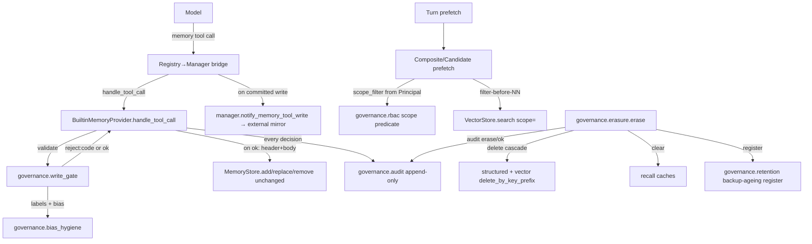

# §1.5 — HR Memory Governance — Design Spec

**Date:** 2026-06-30
**Production Plan point:** §1.5 Workstream — HR memory governance (★ compliance-critical)
**Branch:** `phase0/1.5-memory-governance` (off `phase0/vertical-slice-hiring`)
**Cycle scope (owner-approved):** one cohesive cycle, built in independently-tested layers (the §1.4 pattern).

---

## 1. Context & goal

§1.5 is the linchpin of Australian compliance and is **net-new** to the project (Hermes lacks it).
It wraps every memory entry and every write/recall in a **governance shell** —
*namespace + provenance + lawful-basis/consent labels + retention + RBAC + audit + bias hygiene* —
moving the memory subsystem from *"can remember"* to *"remembers compliantly, uses explainably, can
be erased"* (PRD §9.5; Plan §1.5).

The earlier points deliberately left **real seams** for this:

| Seam (already in code) | Where | §1.5 fills it with |
|---|---|---|
| `CandidateMemoryProvider(scope_filter=…)` | `providers/candidate.py:53,72,131` | the RBAC scope predicate built from a `Principal` |
| `CandidateMemoryProvider(write_gate=…)` | `providers/candidate.py:54,95` | the governance ingest gate (consent/provenance) |
| `VectorStore.search(scope=…)` filter-before-NN | `vector/store.py:78,222` | RBAC applied before top-k (no existence leak) |
| `delete_by_key_prefix()` (vector + structured) | `vector/store.py:64`, `structured.py:102` | the erasure cascade |
| `manager.notify_memory_tool_write` / `on_memory_write` ("wired live at §1.5") | `manager.py:561,605` | the mirror after a governed write |
| `_CORE_TOOL_NAMES` (core-tool shadow guard) | `manager.py:64` | provider tools — incl. the governed `memory` tool — register **outside** this frozenset (`{clarify, delegate_task}`), so the governed tool routes without shadowing a core tool |
| `CandidateRow.consent_status` | `structured.py:43` | the consent check on the entity path |

The work is therefore **mostly net-new governance logic + wiring into existing seams**, not surgery
on ported code.

---

## 2. Scope

### In scope (the 8 Plan §1.5 deliverables, all in one cycle)
1. `governance/namespace` — `tenant:org:entity_type:entity_id` parse/format/validate + prefix helpers.
2. `governance/labels` (`provenance` + `consent`) — the metadata dataclasses + the §1.2 in-entry
   governance header render/parse.
3. `governance/write_gate` — the governed validation: reject unlabelled / unconsented / biased writes
   with an audit code.
4. `governance/bias_hygiene` — protected-attribute / proxy-variable scanner (block or flag).
5. `governance/rbac` — `Principal` → a `memory_key` scope predicate plugged into `scope_filter`.
6. `governance/retention` — the TTL policy registry (hired/not-hired/withdrawn) + an explicit sweep +
   the backup-ageing register.
7. `governance/erasure` — the data-subject erasure/correction pipeline over the §1.4 delete-cascade.
8. `governance/audit` — the append-only local audit log (who/what/when/why).
9. The **governed `memory` write tool** (the §1.3-deferred model-facing tool) + the registry→manager
   bridge (no loop change).

### Out of scope (kept behind existing seams)
- **Real threat scan** → §1.6 (`scan_entry` stays pass-through here).
- **De-identification pipeline** → §1.11 (erasure hard-deletes the data subject's own rows/vectors +
  cache; residual de-id of other entries/backups is §1.11 — the honest boundary).
- **Full canonical data model + relational `AuditRecord`/`MemoryRecord` seam tables** → §1.8 (the §1.5
  audit log is the minimal forerunner).
- **Security-baseline RBAC/ABAC engine** → §1.9 (reuses this same scope filter — "same source", Plan
  §1.9 note).
- **Auth source / principal provenance** → PRD open-Q#8 unresolved (single-user desktop vs shared
  backend); §1.5 builds the filter abstraction with the principal **injected**, full-scope by default.

---

## 3. Architecture

A new `src/jobpin_agent/governance/` package, consumed by the existing memory paths. No new external
dependency (stdlib + the existing `sqlite3`). The **ported `MemoryStore` is not modified** — governance
sits in the write path *in front of* it (the governed tool handler is the only writer to the curated
store), preserving port fidelity (TEXTBOOK_SPEC Tenet 1).



---

## 4. Data model

### Governance labels (`governance/labels.py`) — verbatim from Plan §1.5
```
Provenance      := { memory_key, source_type, source_ref, collected_at, collected_by }
ConsentLabel    := { legal_basis ∈ {consent, legitimate_interest, contract}, purpose, consent_id, use_scope }
RetentionPolicy := { policy_key ∈ {hired_*, not_hired_*, withdrawn_*}, ttl_days, basis }
```

### The in-entry governance header (the §1.2 pre-committed format)
A machine-parseable header prefixed to a curated entry, separated from the body by a `---` line, kept
inside one `ENTRY_DELIMITER`-bounded entry:
```
key: acme:apac:org:policy
source_type: recruiter_input
source_ref: rubric#1
collected_at: 2026-06-30T...Z
collected_by: recruiter:alice
legal_basis: legitimate_interest
consent_id:
purpose: hiring_calibration
retention_ttl: not_hired_180d
---
<body: one curated fact / standard / preference>
```
`render_header(prov, consent, retention) -> str` and `parse_header(entry) -> (labels, body)`; an entry
with no `---` parses as `(None, entry)` (legacy/unlabelled — rejected on the write path).

### Audit record (`governance/audit.py`) — Plan §1.0 shared fields
```
AuditRecord := { actor, action ∈ {read, write:add, write:replace, write:remove, erase, recall, recall_denied},
                 target_key, at_monotonic, at_wall, reason, result ∈ {ok, rejected:<code>} }
```
SQLite table `audit_log`, **append-only** (no UPDATE/DELETE method on the class). Dual timestamp:
`time.monotonic()` + `time.time()` (wall, ISO-8601 UTC).

### Write-gate decision table (Plan §1.5)
| Check | On miss/hit | Audit result |
|---|---|---|
| `provenance.source_ref` missing | reject write | `rejected:no_provenance` |
| consent required (by `source_type`) but `consent_id` missing | reject write | `rejected:no_consent` |
| bias_hygiene hits a protected attribute | reject write | `rejected:bias` |
| bias_hygiene hits a proxy-as-hard-threshold | reject write | `flagged:bias` (blocked) |
| RBAC unauthorised recall | filter (do not return) | `rejected:rbac` (read path) |

`consent`-requiring `source_type`s (initial set): `{candidate_submitted, candidate_volunteered,
third_party}` require `consent_id`; `{recruiter_input, org_policy, public_jd}` use
`legitimate_interest`/`contract` (no per-subject consent_id required).

---

## 5. Component designs

### `namespace.py`
- `MemoryKey` (frozen dataclass: tenant, org, entity_type, entity_id) + `parse(key)`, `format(...)`,
  `is_valid(key)`, `prefix(level)` (`tenant` / `tenant:org` / `tenant:org:entity_type`).
- `ENTITY_TYPES = {"candidate","employee","job","org","recruiter","semantic"}`.

### `labels.py`
- `Provenance`, `ConsentLabel`, `RetentionPolicy` dataclasses.
- `render_header` / `parse_header` (above). `CONSENT_REQUIRED_SOURCE_TYPES` constant.

### `bias_hygiene.py`
- `PROTECTED_ATTRIBUTES` (age, gender, race/ethnicity, marital/family status, religion, disability/
  health, pregnancy, sexual orientation) + `PROXY_PATTERNS` (elite-school-as-hard-bar, postcode,
  graduation-year-as-age-proxy, gendered-role words) as curated regex/keyword sets.
- `scan(text) -> Optional[BiasFinding]` where `BiasFinding(code, term, reason)`,
  `code ∈ {"rejected:bias","flagged:bias"}`. **Honest boundary documented**: a heuristic starter set,
  not exhaustive; the Phase-1 bias audit extends it.

### `rbac.py`
- `Principal(user_id, role, allowed_scopes: tuple[str, ...])`.
- `scope_predicate(principal) -> Callable[[str], bool]` — True iff `memory_key` equals or is nested
  under any allowed scope prefix (namespace-prefix match). `FULL_ACCESS` default principal
  (`allowed_scopes=("",)`) keeps existing demos/tests green.

### `retention.py`
- `RETENTION_POLICIES: dict[str, RetentionPolicy]` (`hired_5y`, `not_hired_180d`, `withdrawn_30d`, …).
- `sweep(now, items: list[(memory_key, collected_at, policy_key)]) -> list[str]` — expired keys
  (explicit; a scheduler calls it later — no background timer).
- `BackupAgeingRegister` — append `(memory_key, erased_at, ages_out_at)`; `pending()` view. (The honest
  "backups age out, not cascaded" record.)

### `audit.py`
- `AuditLog(db_path=":memory:")`; `record(actor, action, target_key, *, reason="", result="ok") -> None`
  (stamps dual timestamp); `query(*, target_key=None, action=None) -> list[AuditRecord]`. No mutation API.

### `write_gate.py`
- `GovernanceGate(audit, bias_scan=bias_hygiene.scan)`.
- `validate(action, target, body, prov, consent, retention, *, actor) -> Decision` where
  `Decision(ok: bool, code: str = "", header: str = "")`. On reject: records the audit row + returns
  `ok=False, code=…`. On ok: records nothing yet (the handler audits the committed write), returns the
  rendered `header`. `remove` skips provenance/consent/bias (no new content) but is still audited.

### `erasure.py`
- `Eraser(audit, retention_register, recall_cache_clearers: list[Callable[[], None]])`.
- `erase(memory_key, *, actor, reason, deleter: Callable[[str], dict]) -> dict` — call the deleter
  (the candidate provider's `delete`, which cascades structured + vectors) → clear recall caches →
  audit `erase/ok` with counts → register backup-ageing → return the summary.
- `correct(...)` = re-ingest a corrected row through the gate (audited `write:replace`); a thin wrapper.

### The governed `memory` tool + bridge
- `BuiltinMemoryProvider` gains an optional `governance` collaborator (gate + audit + actor). When
  present: `get_tool_schemas()` returns the `memory` tool schema (action/target/content/old_text +
  label fields); `handle_tool_call("memory", args)` runs the gate, on ok renders header+body and calls
  `store.add/replace/remove`, audits the committed result, returns JSON. When absent (legacy): returns
  `[]` (unchanged §1.3 behaviour — back-compat for existing tests).
- `governance/tool_bridge.py::build_memory_tool(manager) -> ToolSpec` — a `core.tools.ToolSpec` whose
  handler calls `manager.handle_tool_call("memory", args)` then `manager.notify_memory_tool_write(...)`,
  returning the JSON string. The composition root registers it into the `ToolRegistry`. **No
  `agent_loop.py` change.**
- A recall-path audit + RBAC denial: the retrieval providers, given a `Principal`/audit, record
  `recall` / `recall_denied`. To avoid threading audit through every provider, the **bridge/composition
  root** owns the `Principal`→`scope_filter`; recall auditing is a thin optional callback on the
  composite (kept minimal; the exit criterion only needs the *filter* to work, which the existing
  `scope` already enforces).

---

## 6. Key design decisions

1. **Enforce governance in the governed tool's write path, leave `MemoryStore` unmodified.** The store's
   `write_gate` seam has *staging* semantics (non-None → `staged=True`), which is not *rejection*.
   Overloading it would muddy the ported behaviour and the port. The governed tool handler is the sole
   writer to the curated store, so gating there *is* the "pre-check of add/replace" the Plan asks for,
   and it keeps the Hermes port faithful. **Entity path (post-review):** the candidate-ingest path has
   no model tool, so its governance is enforced in `CandidateMemoryProvider.ingest` via
   `GovernanceGate.validate_entity_ingest(memory_key, consent_status, source_refs, actor=…)` — it rejects
   unprovenanced / unconsented (consent_status ≠ "granted") candidate writes with an audited
   `write:ingest` / `rejected:<code>`. Bias hygiene is deliberately **not** run on candidate content
   (rejecting a résumé for containing "female"/"age" would itself discriminate; the scanner targets
   recruiter-bar calibration). The full consent-capture + de-identification pipeline is §1.11; §1.5
   enforces the gate over the existing ingest seam.
2. **Audit log = append-only SQLite table** (matches `CandidateStructuredStore`; queryable for NDB
   forensics) over a JSONL file.
3. **Labels live in the §1.2 in-entry header** (honors the pre-committed format; no schema migration).
4. **RBAC principal is injected/deferred** (PRD open-Q#8). Filter abstraction now; full-scope default.
5. **Erasure honest boundary**: hard-delete the data subject's own structured row + derived vectors +
   recall cache + audit; backups *age out* per retention (registered, not cascaded). No GDPR-instant-
   wipe promise. De-identification of residual artifacts → §1.11.
6. **Bias hygiene is a documented heuristic starter set**, not a complete classifier (honest; Phase-1
   bias audit extends it).

---

## 7. Testing strategy → exit criteria

| Plan §1.5 exit criterion | Test(s) |
|---|---|
| Unlabelled/unconsented write rejected + trace; 100% labelled | `test_write_gate`: missing source_ref → `rejected:no_provenance` + audit row; missing consent_id (consent-required source) → `rejected:no_consent`; valid → entry stored **with** header, audit `write:add/ok`. |
| Data-subject erasure drill | `test_erasure`: ingest a candidate → recall finds them → `erase()` → structured+vector gone, recall cache cleared (re-recall empty), audit `erase/ok`, backup-ageing registered. |
| RBAC unauthorised recall blocked | `test_rbac`: two candidates in different org scopes; a principal scoped to org A recalls → only A returned; B's existence never leaks (filter-before-NN). |
| Bias hygiene flags/blocks a proxy | `test_bias_hygiene`: a calibration write "must have graduated from <elite school>" → `flagged:bias`/`rejected:bias`, write blocked, audit row. Protected attribute (e.g. age) → `rejected:bias`. |
| No loop change | `test_governed_tool_end_to_end`: a fake model emits a `memory` tool call → the bridge routes it → write committed → assert via `git`/inspection that `agent_loop.py` is unchanged; the tool is callable through the existing `ToolRegistry`. |
| Namespace / labels / retention units | `test_namespace`, `test_labels` (header round-trip), `test_retention` (sweep + register), `test_audit` (append-only, dual timestamp, query). |

Plus: the whole existing suite stays green (back-compat — governance is opt-in via the composition
root; default providers behave as before).

---

## 8. Risks

- **Scope size** (largest cycle yet). Mitigation: independently-tested layers; each lands + commits on
  its own (TDD), so a partial failure is contained.
- **Bias scanner false sense of completeness.** Mitigation: documented honest boundary + audit trail;
  Phase-1 bias audit owns the real classifier.
- **Plan says "pre-check of MemoryStore.add/replace"; we enforce in the provider write path.** If the
  triple-review judges this a real divergence, correct the Plan first (EN+中文) — the rationale (port
  fidelity + sole-writer) is recorded here.
