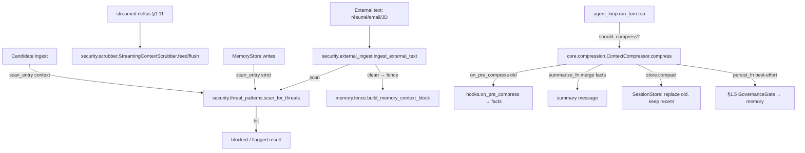

# §1.6 — Injection-defence port + pre-compression fact-injection — Design Spec

**Date:** 2026-06-30
**Production Plan point:** §1.6 Workstream — Injection-defence port + hardening (incl. pre-compression fact-injection wiring)
**Branch:** `phase0/1.6-injection-defence` (off `main`, which now holds §1.1–§1.5)
**Cycle scope (owner-approved):** one cohesive cycle, layered + independently tested.
**Compression site (owner-approved):** a minimal guarded call at `run_turn`'s top (first sanctioned `agent_loop.py` change since §1.1; the frozen system-prompt snapshot is untouched).

---

## 1. Context & goal

Fully port Hermes's context-window security to local, and wire the **two HR-critical gaps Hermes's
mainline does not wire automatically** (PRD §8.3/§9.1; Plan §1.6):
- **External-text scan + fence** — résumés/emails/JDs are untrusted input and a real prompt-injection
  surface; all external text must pass a `threat_patterns` scan and enter context only inside the
  `<memory-context>` fence.
- **Pre-compression fact-injection** — Hermes calls `on_pre_compress(messages)` but **discards the
  return value** (`conversation_compression.py:459` is a bare statement). The Manager's aggregation is
  already complete in Jobpin (§1.3); the gap is the **call site**. §1.6 captures the facts and **merges
  them into the compression summary** + best-effort persists them through the §1.5 gate.

This consumes seams left open by §1.2 (`scan_entry`), §1.3 (`on_pre_compress` aggregation, the fence),
§1.4 (candidate `scan_entry`), and §1.5 (the `GovernanceGate` for the gated persist).

---

## 2. Scope

### In scope (4 Plan deliverables, one cycle)
1. `security/threat_patterns` — port the 3-scope pattern library + `scan_for_threats` / `first_threat_message`.
2. `security/scrubber` — port `StreamingContextScrubber` (cross-chunk state machine).
3. `security/external_ingest` — a unified entry forcing scan + fence on external text.
4. `core/compression` — the pre-compression fact-injection wiring (capture → merge into summary → gated
   persist), with the "still recallable after compression" integration test.
5. Wire the real scan into the existing `scan_entry` seams (curated store = `strict`, candidate = `context`).

### Out of scope (deferred)
- **Real LLM summarisation** → config/§1.11 (the MVP summariser is a deterministic, fact-preserving seam).
- **The streaming model path (token deltas)** → §1.11; §1.6 ships + unit-tests the scrubber standalone.
- The **full** 1000-adversarial corpus → a representative corpus at thin-slice scale now (Plan §1.6).

---

## 3. Architecture

New `src/jobpin_agent/security/` package + a new `core/compression.py`, consumed by the existing paths.
Ports keep the Hermes design faithfully (TEXTBOOK_SPEC Tenet 1 + `THIRD_PARTY_NOTICES`).

---

## 4. Component designs & API

### `security/threat_patterns.py` (port)
- `scan_for_threats(content: str, scope: str = "context") -> list[str]` — matched pattern IDs (+ invisible-unicode findings).
- `first_threat_message(content: str, scope: str = "strict") -> str | None` — block message or None. **This is the `scan_entry` seam shape.**
- `INVISIBLE_CHARS: frozenset`; scopes `all` ⊂ `context` ⊂ `strict`; the `(?:\w+\s+)*` multi-word-bypass guard and C2-vocabulary anchoring are retained verbatim. **No loosening** into bossy-English false positives.

### `security/scrubber.py` (port)
- `class StreamingContextScrubber`: `feed(text) -> str` (visible portion; holds back partial tags, discards span content), `flush() -> str` (drops an unclosed span; emits a held non-tag tail), `reset()`. Block-boundary aware (open tag must start a line + be followed by a newline) to match Jobpin's §1.3 fence rendering.

### `security/external_ingest.py` (new)
- `@dataclass IngestResult(ok: bool, fenced: str = "", findings: list[str] = [], blocked: bool = False)`.
- `ingest_external_text(text, *, source: str, scope: str = "context", scan=scan_for_threats, fence=build_memory_context_block) -> IngestResult` — scan; on a hit → `blocked=True` + findings (caller decides reject/flag); else wrap clean text in the fence and return it. The single door for résumés/emails/JDs.

### `core/compression.py` (new)
- `@dataclass CompressionResult(compressed: bool, summary: str = "", facts: str = "", persisted: bool = False)`.
- `class ContextCompressor(*, max_messages=20, keep_recent=6, summarize_fn=default_summarize, persist_fn=None)`:
  - `should_compress(messages) -> bool` — True when `len(messages) > max_messages`.
  - `compress(session_id, store, hooks) -> CompressionResult` — split [old | recent(keep_recent)];
    `facts = hooks.on_pre_compress(old)`; `summary = summarize_fn(old, facts)`; `store.compact(session_id,
    Message(SYSTEM, summary), keep_recent)`; if `persist_fn`: best-effort `persisted = persist_fn(facts)`
    (exceptions swallowed → `persisted=False`, summary still written). Returns the result.
- `default_summarize(old_messages, facts) -> str` — deterministic, **fact-preserving**: a `[compressed-summary]`
  header + the captured `facts` verbatim + a one-line tail noting how many messages were folded. (Real LLM
  summary is the `summarize_fn` seam, deferred.)

### `core/session_store.py` (modify)
- `compact(session_id, summary_message: Message, keep_recent: int) -> None` — atomically replace all but
  the last `keep_recent` messages with `summary_message` prepended. (A genuine compaction, not a branch.)

### `core/agent_loop.py` (sanctioned minimal change)
- `Agent(..., compressor: ContextCompressor | None = None)`.
- At the top of `run_turn`, **after** `prefetch` and appending the user message, before the loop:
  `if self.compressor is not None and self.compressor.should_compress(self.store.get_messages(session_id)):
  self.compressor.compress(session_id, self.store, self.hooks)` — emits a `compress` trace event.
- **Default `None` → no behaviour change** (existing tests/demos/golden snapshot unaffected). Compression
  rewrites only the history; the frozen system-prompt snapshot slot is untouched.

### Seam wiring (composition)
- `build_memory_backend(..., scan_entry=lambda t: first_threat_message(t, "strict"))` for the curated store.
- The candidate provider is constructed with `scan_entry=lambda t: first_threat_message(t, "context")` where
  entity ingest happens. (The seams already exist; §1.6 supplies the real callable.)

---

## 5. Key decisions & why

1. **Scopes:** memory writes = `strict` (most aggressive; user can intervene); context/recall/external = `context`.
2. **Deterministic fact-preserving summariser** (default) so the integration test is offline + asserts the
   fact survives; real LLM summary is the injected seam → §1.11. **Conceptual purpose:** compression must
   never silently drop a key candidate fact/decision over a long hiring loop — the wiring (capture+merge)
   is the guarantee; summary *prose quality* is a later refinement.
3. **Gated persist is best-effort** (belt-and-braces): the summary (in history, sent every turn) is the
   belt; the §1.5-gated persist is the braces (durable across sessions, but may be `rejected:no_consent`
   for unlabelled extracts — which must not crash the turn).
4. **Compression opt-in via `Agent(compressor=None)`** — keeps the change minimal + back-compat; the
   composition root/tests opt in. First sanctioned `agent_loop.py` change since §1.1 (§1.1 explicitly
   deferred the wiring here); snapshot untouched.
5. **Ports stay faithful** — no scope-philosophy loosening; THIRD_PARTY_NOTICES + own security review.

**What this does NOT yet show (honest):** no fluent LLM summary (deterministic stand-in); the scrubber is
tested with simulated chunks (no real streaming model until §1.11); the adversarial corpus is
representative at thin-slice scale, not the full 1000.

---

## 6. Testing → exit criteria

| Plan §1.6 exit criterion | Test(s) |
|---|---|
| Injection adversarial — 0 instructions executed | `test_threat_patterns`: a parametrised corpus (classic injection, multi-word-bypass, role-hijack, C2, exfil, invisible-unicode) → each flagged at the right scope; `test_external_ingest`: an adversarial résumé → `blocked`/fenced, never returned raw. |
| Streaming scrubber | `test_scrubber`: cross-chunk split → 0 fenced leak; unclosed span on `flush` → discarded; multi-word bypass; non-tag tail emitted. |
| Pre-compression fact-injection | `test_compression`: long session → `compress` → summary contains the fact + old messages folded; `should_compress` threshold; gated `persist_fn` rejection (`rejected:no_consent`) does not crash; **end-to-end** through `Agent.run_turn` with a `FakeProvider` (key fact still in the composed prompt after compression). |
| Seam wiring | `test_scan_wiring`: an injection entry written to the curated store is `[BLOCKED]` in the snapshot (real scan, strict); candidate ingest of an injection chunk is skipped (context scan). |
| No behaviour change when off | full suite stays green with `compressor=None` default; golden system-prompt snapshot unchanged. |

---

## 7. Risks
- **Loop change regressions.** Mitigation: opt-in default `None`; the compression path is covered by its own
  tests; the golden snapshot + full suite must stay green.
- **Scrubber port subtlety** (block-boundary logic vs Jobpin's fence). Mitigation: port verbatim + the
  cross-chunk tests from the Hermes test as a reference.
- **Threat-pattern false positives on HR text.** Mitigation: keep the scope split + C2-anchoring; do not add
  common English tokens; memory writes use `strict`, recall/context use `context`.
