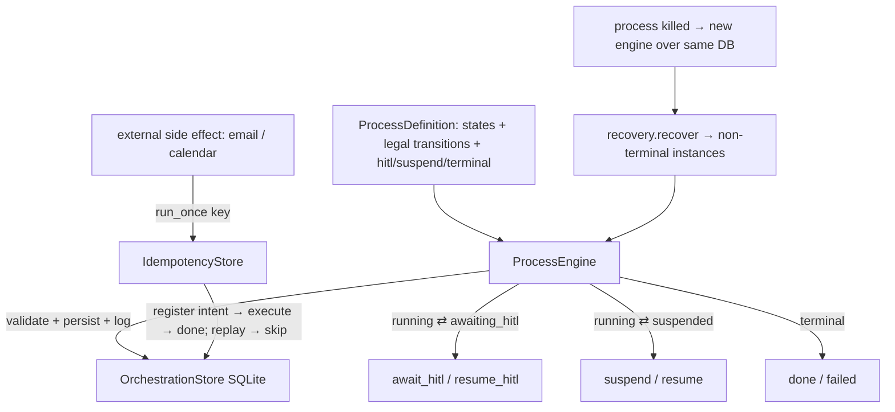

# §1.7 — Layer B Long-Running Orchestration Skeleton — Design Spec

**Date:** 2026-06-30
**Production Plan point:** §1.7 Workstream — Layer B long-running orchestration skeleton (in-house lightweight state machine)
**Branch:** `phase0/1.7-orchestration` (off `main`, which holds §1.1–§1.6)
**Cycle scope (owner-approved):** one cohesive cycle. Decisions approved: declarative engine + dedup-wins idempotency + SQLite, standalone (no `agent_loop.py` change).

---

## 1. Context & goal

A **lightweight, in-house business-process state machine** — the Layer B that Hermes lacks (Layer A =
single-shot agent inference + memory, §1.1–§1.6; Layer B = the cross-day, multi-party, **resumable**
hiring loop, PRD §2.6/§13.1). §1.7 builds **only the skeleton + primitives** for state definition /
transition / persistence / idempotency / HITL break point; the real recruitment-process states are filled
at Phase 1 M3. The skeleton must satisfy **three hard persistence contracts** — these are the exit
criteria, and "lightweight" must NOT mean "weak guarantees" (auditability depends on the persisted state
history).

Net-new code (not a Hermes port). Persisted to local SQLite, consistent with `SessionStore` (§1.1), the
§1.4 stores, and the §1.5 audit log.

---

## 2. Scope

### In scope (Plan §1.7 deliverables, one cycle)
1. `orchestration/store` — SQLite persistence (`process_instances`, append-only `transitions`, `idempotency`).
2. `orchestration/state_machine` — `Status`, `ProcessInstance`, `Transition`, `ProcessDefinition`, `ProcessEngine` (start / transition / suspend / resume / await_hitl / resume_hitl, validated + persisted + logged).
3. `orchestration/idempotency` — `IdempotencyStore` + `run_once(key, effect_fn)` (register-before-execute dedup).
4. `orchestration/recovery` — `recover(...)` crash-recovery loader (non-terminal instances).
5. A toy process + the three persistence-contract acceptance tests.

### Out of scope (deferred — YAGNI, per the Plan)
- **Temporal / LangGraph** — only if the in-house skeleton fails the persistence contract (§1.12 spike decides; PRD §2.6/§13.1). This cycle proves the skeleton meets it.
- **Real recruitment-process states** (sourcing/screening/scheduling) → Phase 1 M3.
- **Agent-turn integration + the §1.11 routing-failure suspend/fallback** → M3 / §1.11 (the skeleton reserves the `suspended`/`await_hitl` capability).
- **Canonical-audit reconciliation** — the transition log is the append-only forerunner; folding it into the §1.8 canonical audit is §1.8.

---

## 3. Architecture

A new `src/jobpin_agent/orchestration/` package. Standalone Layer B — it coordinates a process's state;
it does NOT call the agent loop in the skeleton (no `agent_loop.py` change). A `ProcessDefinition`
declares the legal states + transitions; the `ProcessEngine` enforces them, persists each instance, and
appends every transition to an auditable history; external side effects go through `run_once`.



---

## 4. Data structures & formats (verbatim from Plan §1.7)

```
ProcessInstance := { instance_id, process_type, current_state,
                     status ∈ {running, suspended, awaiting_hitl, done, failed},
                     context_ref,   # pointer to session / memory / entity (candidate/job) — opaque here
                     updated_at }   # ISO-8601 UTC wall clock
Transition       := { instance_id, from_state, to_state, trigger, at, actor }   # append-only history
idempotency_key  := "<effect>:<req_id>:<candidate_id>:<slot>"
#   interview:req_812:cand_7f3a:slot_3   |   email:req_812:cand_7f3a:offer
```

**SQLite tables:** `process_instances(instance_id PK, process_type, current_state, status, context_ref,
updated_at)`; `transitions(id PK AUTOINCREMENT, instance_id, from_state, to_state, trigger, at, actor)`
(append-only — no update/delete); `idempotency(key PK, status ∈ {pending, done}, result, at)`.

**Status semantics:** `running` (active), `suspended` (awaiting an external event — logical, no wall-clock
assumption), `awaiting_hitl` (awaiting a human decision), `done` / `failed` (terminal).

---

## 5. Component designs & API

### `orchestration/store.py`
- `class OrchestrationStore(db_path=":memory:")`: `save_instance(inst)`, `load_instance(id) -> ProcessInstance|None`,
  `append_transition(t)`, `transitions_for(id) -> list[Transition]`, `non_terminal_instances() -> list[ProcessInstance]`.
  Parameterised SQL; the `transitions` table is append-only (no update/delete method).

### `orchestration/state_machine.py`
- `class Status(str, Enum)`: `RUNNING / SUSPENDED / AWAITING_HITL / DONE / FAILED`.
- `@dataclass ProcessInstance(instance_id, process_type, current_state, status, context_ref="", updated_at="")`.
- `@dataclass Transition(instance_id, from_state, to_state, trigger, at, actor)`.
- `@dataclass ProcessDefinition(process_type, initial_state, transitions: dict[str, set[str]],
  hitl_states: set[str]=∅, suspend_states: set[str]=∅, terminal_states: set[str]=∅)` —
  `transitions[from] = {allowed to-states}`; `is_legal(from, to) -> bool`.
- `class ProcessEngine(store, definition, *, clock=utcnow)`:
  - `start(instance_id, *, context_ref="", actor="system") -> ProcessInstance` (→ `initial_state`, status `RUNNING`, logs the `start` transition).
  - `transition(instance_id, to_state, *, trigger, actor="system") -> ProcessInstance` — validates `is_legal`, updates `current_state`, sets status from the state's class (terminal/hitl/suspend → that status, else `RUNNING`), persists, appends the transition. Raises `IllegalTransition` on an undeclared transition.
  - `await_hitl(instance_id, *, trigger, actor) ` / `resume_hitl(instance_id, to_state, *, decision, actor)` — sugar over `transition` setting `AWAITING_HITL` ⇄ `RUNNING`.
  - `suspend(instance_id, *, trigger, actor)` / `resume(instance_id, to_state, *, trigger, actor)` — `SUSPENDED` ⇄ `RUNNING`.

### `orchestration/idempotency.py`
- `class IdempotencyStore(store_or_db)`; `run_once(key, effect_fn) -> tuple[result, executed: bool]` —
  if `key` already present → return its recorded result + `executed=False` (skip, no re-run); else **persist
  the key as `pending` first**, call `effect_fn()`, record `done` + result, return `(result, True)`. A
  crash after `pending` but before `done` leaves the key present → a replay **skips** (never re-sends).

### `orchestration/recovery.py`
- `recover(store) -> list[ProcessInstance]` — return the non-terminal instances (`RUNNING` / `SUSPENDED` /
  `AWAITING_HITL`) read from storage, for the caller to re-attach and resume. (The engine is reconstructed
  over the same DB; recovery does not lose or restart state.)

---

## 6. Key decisions & why

1. **Declarative engine** — `ProcessDefinition` declares legal transitions; the engine rejects illegal
   ones (`IllegalTransition`). The declared definition *is* the auditable process contract M3 populates;
   the guardrail is what compliance ("every step auditable") needs. (Alternative free-form store rejected.)
   The definition also validates **state-class disjointness** (a state can't be two of hitl/suspend/terminal),
   and the engine guards `start` (no silent re-start), `fail` (no flipping a terminal), and `await_hitl`/
   `suspend` (the to-state must be the matching class).
2. **Atomic state + audit persistence (triple-review M1)** — an instance advance and its transition record
   commit in **one SQLite transaction** (`OrchestrationStore.apply`), so a crash can never leave the
   persisted state advanced with no transition explaining it. Auditability cannot diverge from state.
3. **Idempotency = register-before-execute, dedup-wins, concurrency-safe** — claim `pending` with a plain
   `INSERT` (the `key` PRIMARY KEY makes exactly one racer win; a concurrent/replayed claim hits
   `IntegrityError` → skip — triple-review M2), then execute → `done`. Favours **never double-sending** (a
   duplicate offer email is a compliance/UX harm) over guaranteed delivery. **Honest boundary:** a crash
   between `pending` and `done` leaves the effect un-sent (at-most-once); `run_once` does not yet surface
   pending-vs-done to the caller — a "reconcile pending against the provider, retry if truly not sent" pass
   is a deferred enhancement (noted, not built), appropriate once real connectors land (§1.10/M3).
4. **SQLite persistence** — one local file, append-only transition history = the audit basis; matches the
   repo (no new dependency).
5. **Standalone Layer B, no `agent_loop.py` change** — the engine coordinates state; wiring process steps
   to agent turns + the §1.11 routing-failure suspend/fallback is M3/§1.11. A toy process proves the
   contracts.
6. **Conceptual purpose:** Layer B is *why* the product is "not a chatbot" — a hiring loop spans days and
   people, survives crashes, and never double-acts on the outside world. The three contracts are exactly
   those guarantees; the skeleton makes them real and auditable before any real process is built on it.

**What this does NOT yet show (honest):** no real recruitment process (toy process only); no agent-turn or
connector integration (the side-effect tests use a fake `effect_fn`, not a real email/calendar); the
"cross-day" contract is proven **logically** (event-not-yet-arrived → resume), with **no wall-clock
dependency** in the test; the upgrade-to-Temporal path is reserved, not taken. The **"crash" is a
simulated restart** — dropping the engine and reopening a fresh store over the same committed SQLite file
(not a mid-write `SIGKILL`); torn-write durability rests on SQLite's per-commit atomicity. **Append-only is
an API-level guarantee** (no update/delete method on `transitions`), not a DB constraint — cryptographic
tamper-evidence is the §1.8 canonical audit's concern.

---

## 7. Testing → exit criteria

| Plan §1.7 contract | Test |
|---|---|
| ① Crash recovery | `test_crash_recovery`: advance a toy instance to `awaiting_hitl`; drop the engine; build a fresh `ProcessEngine` over the **same SQLite file**; `recover()` returns the instance at `awaiting_hitl`; `resume_hitl` completes it. No state loss, no restart-from-zero. |
| ② Cross-day pause/resume | `test_suspend_resume`: `suspend` an instance (logical "event not arrived"); later `resume` → recovers from the suspension point with `context_ref` intact. No wall-clock assumption. |
| ③ Side-effect idempotency | `test_idempotency`: `run_once(key, send)` twice → `send` called once, second returns `executed=False`; a fresh `IdempotencyStore` over the same DB (simulated restart) + replay → still not re-sent. |
| Engine guardrail | `test_illegal_transition_rejected`; `test_transition_history_is_appended` (auditable). |

Plus: the full existing suite stays green (orchestration is a new standalone package; nothing else changes).

---

## 8. Risks
- **The skeleton failing a contract** → the Plan's reserved upgrade to Temporal/LangGraph (record an ADR). Mitigation: the 3 contracts each have a dedicated test; SQLite gives durable persistence + append-only history.
- **Idempotency at-most-once gap** (crash between intent and execute) → documented; the reconciliation pass is deferred to when real connectors land.
- **Over-engineering** → strictly the skeleton + a toy process; no real states, no Temporal, no agent integration (all deferred per the Plan).
