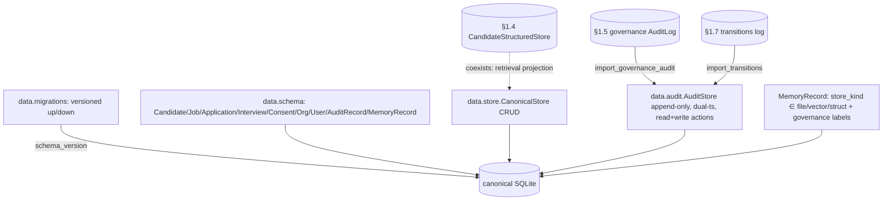

# §1.8 — Canonical Data Model + Local Audit Log — Design Spec

**Date:** 2026-06-30
**Production Plan point:** §1.8 Workstream — Canonical data model + local audit log
**Branch:** `phase0/1.8-canonical-data-audit` (off `main`, which holds §1.1–§1.7)
**Cycle scope (owner-approved):** one cohesive cycle. Decisions approved: canonical M1–M3 schema + in-house migrations + canonical audit with **non-invasive reconciliation** (import-adapter, not a rewire of §1.5/§1.7) + the entity↔memory mapping doc.

---

## 1. Context & goal

Land the **canonical relational data model** for the HR lifecycle (the M1–M3 subset) and one **local
append-only audit log** that is the authoritative who/what/when/why record (Plan §1.8). `AuditRecord` and
`MemoryRecord` are the **seam tables** that land the §1.0 shared vocabulary, the §1.4 vector record, and
the §1.5 governance schema onto the relational layer — all governance/audit queries can start from these.
`tenant_id` is retained as a **single-tenant placeholder**; **no event sourcing**, **no multi-tenant
infra** (PRD §13.1, YAGNI). Net-new (no Hermes port); standalone (no `core`/`agent_loop` change).

This reconciles three forerunners without rewiring them: the §1.5 `governance/audit.py::AuditLog`, the
§1.7 `transitions` table, and the §1.4 `CandidateStructuredStore` (the canonical `Candidate` is the source
of truth; §1.4 stays the retrieval projection).

---

## 2. Scope

### In scope (Plan §1.8 deliverables, one cycle)
1. `data/schema` — canonical entity dataclasses + SQLite DDL for the M1–M3 subset: `Candidate, Job,
   Application, Interview, Consent, Org, User, AuditRecord, MemoryRecord` (all carry `tenant_id` + `org_id`).
2. `data/migrations` — an in-house versioned migration runner (`schema_version` + ordered up/down) that
   rolls **forward and back**.
3. `data/store` — `CanonicalStore` CRUD over the entities (the relational source of truth).
4. `data/audit` — the canonical append-only `AuditStore` (§1.0 fields, dual timestamp, read + write actions,
   rich query) + reconciliation adapters that import the §1.5 governance audit + §1.7 transitions.
5. `docs/entity-memory-mapping.md` — the entity↔memory mapping doc (struct / vector / file routing).

### Out of scope (deferred — YAGNI, per the Plan)
- The **full 16-entity model** — only the M1–M3 subset now (Skill/Competency/Course/Goal/KPI/Review/Employee/
  Interaction → when M1–M3 needs them).
- **Event sourcing** → scale-up / cloud path (PRD §13.1).
- **Multi-tenant isolation / billing** → Phase 2 (the `tenant_id` field abstraction is retained).
- **Rewiring the §1.5/§1.7 emitters** to write only to the canonical store → Phase 2 / single-writer need
  (they keep emitting locally; §1.8 imports/unifies for query).
- **Rewriting the §1.4 `CandidateStructuredStore`** → it coexists as the retrieval projection.

---

## 3. Architecture

A new `src/jobpin_agent/data/` package over SQLite (consistent with `core/session_store.py`, the §1.4
stores, the §1.5/§1.7 stores). The canonical store + audit are the relational source of truth and the
unifying forensics layer; the forerunner stores remain and are imported on demand.



---

## 4. Data structures & formats (verbatim from Plan §1.8 / §1.0)

```
Candidate    := { candidate_id, tenant_id, org_id, name, skills[], years, location, work_rights, consent_status, memory_key }
Consent      := { consent_id, candidate_id, purpose, legal_basis, granted_at, ttl_policy }
Job          := { job_id, tenant_id, org_id, title, status }
Application  := { application_id, candidate_id, job_id, stage, created_at }
Interview    := { interview_id, application_id, slot, idempotency_key, status }
Org          := { org_id, tenant_id, name }
User         := { user_id, tenant_id, org_id, role }
AuditRecord  := { actor, action, target_key, at_monotonic, at_wall, reason, result }      # §1.0 dual-timestamp
MemoryRecord := { memory_key, store_kind ∈ {file, vector, struct}, provenance, consent_label, retention_policy }
```
**SQLite:** one table per entity (PK as named); `audit_log` append-only (no update/delete API); a
`schema_version(version INTEGER)` table for migrations. `tenant_id` defaults to the placeholder
`acme` (matching `governance.namespace.DEFAULT_TENANT`).

---

## 5. Component designs & API

### `data/schema.py`
- Frozen/plain dataclasses for each entity (fields above) + `CREATE TABLE` DDL constants. `ENTITIES` list
  drives migration v1. `DEFAULT_TENANT`/`DEFAULT_ORG` re-exported from `governance.namespace` (single source).

### `data/migrations.py`
- `MIGRATIONS: list[Migration]` where `Migration(version, up: str, down: str)`; v1 creates the M1–M3 subset
  + `audit_log`.
- `current_version(conn) -> int`; `migrate(conn, to_version=LATEST) -> None` — applies up/down in order,
  updates `schema_version`. Rolls **forward and back** (the exit criterion).

### `data/store.py`
- `CanonicalStore(db_path=":memory:")` — opens the connection, runs `migrate(...)` to LATEST, exposes CRUD:
  `upsert_candidate / get_candidate / upsert_job / upsert_application / upsert_interview / upsert_consent /
  upsert_org / upsert_user / upsert_memory_record / get_memory_record`, each parameterised SQL.

### `data/audit.py`
- `@dataclass AuditRecord(actor, action, target_key, at_monotonic, at_wall, reason, result)`.
- `class AuditStore(conn_or_db_path)`:
  - `record(actor, action, target_key, *, reason="", result="ok") -> None` (stamps `time.monotonic()` +
    wall ISO-8601). Actions span the §1.0 vocab incl. **`read` / `recall` / `recall_denied`** (the §1.5/§1.6
    deferral) and `write:* / erase`.
  - `query(*, target_key=None, actor=None, action=None, result_prefix=None) -> list[AuditRecord]` — forensics.
  - No update/delete (append-only).
  - `import_governance_audit(governance_audit_log) -> int` — copy the §1.5 `AuditLog` rows (same shape) in.
  - `import_transitions(orchestration_store, instance_id=None) -> int` — map §1.7 `Transition`s to
    `AuditRecord`s (`actor`, `action="transition"`, `target_key=instance_id`,
    `reason=f"{from}->{to}:{trigger}"`, `at_wall=at`, `at_monotonic=0.0` — historical rows lack monotonic;
    order via the source row order, then `at_wall`).

### `docs/entity-memory-mapping.md`
- A bilingual table: each Candidate field → which store (structured §1.4 / vector §1.4 / file §1.2 / none),
  and how `MemoryRecord` indexes `memory_key → store_kind + governance labels`. States the canonical-vs-§1.4
  source-of-truth-vs-projection relationship.

---

## 6. Key decisions & why

1. **Non-invasive reconciliation (import-adapter, not rewire)** — the §1.5/§1.7 emitters keep their local
   logs (merged, green); the canonical `AuditStore` unifies for query + is the authoritative sink for new
   individual-affecting ops + the read/recall audit, and imports the forerunners on demand. Rewiring is
   deferred (Phase 2). Delivers "all queries start from the canonical table" without re-touching merged code.
2. **In-house versioned migrations (roll forward/back)** — the Plan mandates roll-forward/back; a minimal
   stdlib runner, not Alembic (no new dep).
3. **Canonical store is the source of truth; the §1.4 store coexists as the retrieval projection** — no §1.4
   rewrite; the mapping doc makes the relationship explicit.
4. **`AuditRecord` keeps the §1.5 dual-timestamp shape + read-path actions**; append-only; independent of
   the business-table transaction so a `rejected:*` op still leaves a trace.
5. **`tenant_id` retained as a placeholder** — schema-ready for Phase 2 multi-tenancy; no isolation infra.
6. **Conceptual purpose:** this is the relational backbone every compliance/forensics query and every later
   module (M3 process data, the bias audit, APP 12/13 access/correction requests) reads from — one place
   that answers "what do we hold about this person, where, under what lawful basis, and what happened to it."

**What this does NOT yet show (honest):** only the M1–M3 entity subset (not the full 16); no event
sourcing (the audit is append-only rows, not an event-sourced rebuild); the reconciliation **imports** the
forerunner rows (the §1.5/§1.7 emitters are not rewired to the canonical store — a future consolidation);
imported §1.7 transitions have `at_monotonic=0.0` (historical rows predate the dual-timestamp; intra-source
order is preserved); the canonical `Candidate` is not yet auto-synced with the §1.4 projection (both are
written by the caller; a sync/trigger is later). No PII or real data — tests use synthetic rows.

---

## 7. Testing → exit criteria

| Plan §1.8 exit criterion | Test |
|---|---|
| M1–M3 schema landed; migrations roll forward/back | `test_migrations`: `migrate(LATEST)` → all subset tables + `audit_log` exist; `migrate(0)` → rolled back (tables gone); round-trip back to LATEST. `current_version` tracks. |
| Canonical CRUD | `test_store`: upsert/get round-trips for Candidate / Job / Application / Interview / Consent / Org / User / MemoryRecord; `tenant_id`/`org_id` carried. |
| Any individual-affecting op leaves a queryable who/what/when/why record | `test_audit`: `record` write/erase/**recall**; `query` by target/actor/action; a `rejected:*` op is recorded (trace-on-failure); dual timestamp present; append-only (no mutation API). |
| Reconciliation (queries start from the canonical table) | `test_reconcile`: `import_governance_audit` of a §1.5 `AuditLog` + `import_transitions` of a §1.7 store → the imported rows are queryable through the canonical `AuditStore`. |

Plus: the full existing suite stays green (new standalone package; nothing else changes).

---

## 8. Risks
- **Schema churn vs M3** → land only the M1–M3 subset + migrations (roll-forward/back absorbs additions). Mitigation: the migration runner.
- **Two audit stores (governance + canonical) feels redundant** → accepted for the MVP (non-invasive); the rewire-to-one consolidation is an explicit Phase-2 deferral, documented.
- **Imported transition timestamps lack monotonic** → documented; ordering preserved via source order; the canonical dual-timestamp applies to rows recorded natively by the canonical store.
