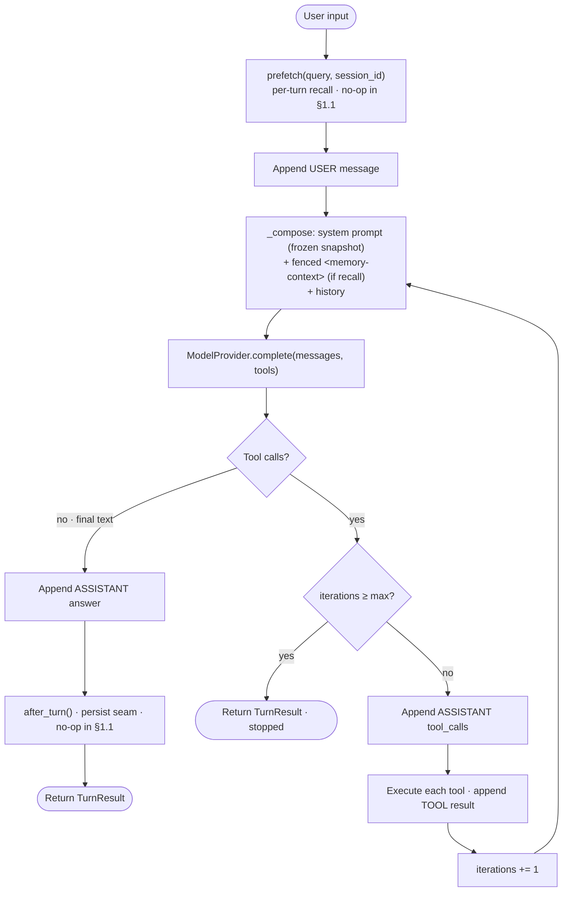
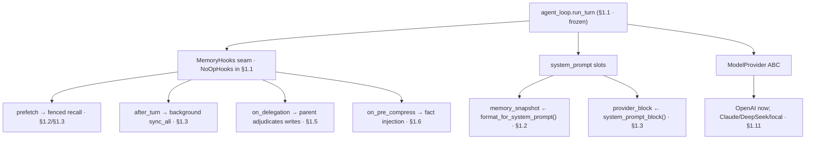

# Devlog · Phase 0 §1.1 — Agent Core (Layer A): the local, provider-agnostic turn loop

> The foundation point of the whole product: one full agent turn — **system-prompt assembly →
> tool-call loop → sub-agent delegation** — runnable locally and offline, persisted to SQLite,
> with a **no-op memory seam** every later point (§1.2–1.6) attaches to **without touching the loop**.
> A **rewrite that borrows design** from Hermes (not a code port). Spec:
> `docs/superpowers/specs/2026-06-27-p0-1.1-agent-core-design.md`; Plan: `site/plan/02-Production-Plan-EN.md` §1.1.
> Source: `agent/src/jobpin_agent/core/`.

## 1. What this delivers

A self-contained, **provider-agnostic, locally-running agent core** that completes one full turn and
exposes stable extension points for the Memory Subsystem and HR modules to attach to later, with no
loop rework. Satisfies Plan §1.1's five deliverables:

- `core/agent_loop` — a lean conversation loop with unit tests over the **four path classes** (plain
  answer / single tool call / multi-turn continuation / stop condition).
- `core/system_prompt` — a **deterministic, fixed-order** assembler locked by a golden-snapshot test
  (prefix stability — Key Invariant #1).
- `core/delegation` — the delegation primitive + the parent-observation hook wiring (`skip_memory`).
- `core/session_store` — a single-file SQLite session table with `branch`/`reset` session-switch
  semantics.
- A per-component **provenance table** (`THIRD_PARTY_NOTICES.md` §1.1) classing every core file as
  design-derived (new/rewrite), plus the MIT notice for the porting that begins at §1.2.

Everything that follows — memory, governance, orchestration, integration, the AI/eval platform —
attaches to the seams defined here. New, design-derived code; **no substantial Hermes code copied
this point** (code-porting starts at §1.2).

## 2. Files added/changed

| Path | What it contains |
|---|---|
| `core/messages.py` | `Role`, `ToolCall`, `ToolResult`, `Message`, `ModelResponse` (`is_tool_call`) — the provider-agnostic vocabulary |
| `core/tools.py` | `ToolSpec`, `ToolRegistry` (register/get/specs/execute), `echo_tool()` |
| `core/model/provider.py` | `ModelProvider` ABC (`complete(messages, tools) -> ModelResponse`) |
| `core/model/fake_provider.py` | `FakeProvider` — scripted, offline; records each call's `calls` |
| `core/model/openai_provider.py` | `OpenAIProvider` + `to_openai_messages` / `to_openai_tools` / `parse_response` — **all** OpenAI wire-mapping |
| `core/system_prompt.py` | `SystemPromptParts`, `format_tools`, `build_system_prompt` (deterministic, fixed order) |
| `core/tracing.py` | `TraceEvent`, `Tracer` (`event` / `events` / `to_jsonl` / `save`) — injected clock |
| `core/hooks.py` | `MemoryHooks` Protocol + `NoOpHooks` — the memory seam |
| `core/session_store.py` | `SessionStore` (SQLite; create/append/get/branch/reset) + JSON (de)serialisers |
| `core/agent_loop.py` | `Agent`, `TurnResult`, `run_turn` (the 4-path loop), `_compose` (frozen snapshot + fence) |
| `core/delegation.py` | `delegate()`, `DelegationResult` (skip_memory + parent observation + lineage) |
| `core/config.py` | `CoreConfig` + `_load_dotenv` (env / `.env`, never overrides exported vars) |
| `examples/demo_turn.py` | runnable offline demo — plain / tool / delegation (`run_demo()`) |
| `examples/chat.py` | interactive REPL against a real model + per-turn trace (`traces/latest.jsonl`) |
| `tests/data/system_prompt_golden.txt` | the committed golden snapshot of the assembled prompt |
| `tests/test_{agent_loop,system_prompt,session_store,delegation,hooks,tools,fake_provider,openai_provider,tracing,config,demo,smoke}.py` | the §1.1 acceptance suite (29 cases: 28 pass + 1 opt-in skip) |

## 3. The public surface (API)

```python
# messages.py
class Role(str, Enum): SYSTEM="system"; USER="user"; ASSISTANT="assistant"; TOOL="tool"
ToolCall(id: str, name: str, arguments: dict)                       # arguments are ALREADY-parsed JSON
ToolResult(tool_call_id: str, name: str, content: str)
Message(role: Role, content: str="", tool_calls: list[ToolCall]=[], tool_result: ToolResult|None=None)
ModelResponse(text: str|None=None, tool_calls: list[ToolCall]=[], usage: dict|None=None)
    .is_tool_call -> bool                                           # property == bool(self.tool_calls)

# tools.py
ToolSpec(name: str, description: str, parameters: dict, handler: Callable[[dict], str])
class ToolRegistry:
    register(spec) -> None;  get(name) -> ToolSpec                  # get raises KeyError if unknown
    specs() -> list[ToolSpec];  execute(call: ToolCall) -> ToolResult
echo_tool() -> ToolSpec                                             # name="echo"; returns its "text" arg

# model/provider.py — the seam between the loop and any LLM
class ModelProvider(ABC):
    complete(messages: list[Message], tools: list[ToolSpec]|None=None) -> ModelResponse   # one call per model turn

# model/fake_provider.py  (offline, deterministic)
FakeProvider(script: list[ModelResponse]);  .calls: list[list[Message]]   # complete() pops script; AssertionError if exhausted

# model/openai_provider.py  (the ONLY place that knows OpenAI's wire format)
to_openai_messages(messages) -> list[dict]                         # tool-result/tool-call/plain shapes
to_openai_tools(tools) -> list[dict]|None                         # None when empty -> caller omits the kwarg
parse_response(resp) -> ModelResponse                             # first choice; re-parses tool-arg JSON; attaches usage
OpenAIProvider(config: CoreConfig, client: Any=None)              # client built lazily from `openai` if None

# system_prompt.py
SystemPromptParts(org_policy="", compliance="", role_permissions="", memory_snapshot="", provider_block="", tools=[])
format_tools(tools) -> str                                        # name-sorted; "(no tools available)" if empty
build_system_prompt(parts) -> str                                # FIXED order; single trailing newline

# tracing.py
TraceEvent(seq: int, kind: str, data: dict, at: float)
Tracer(clock: Callable[[],float]|None=None)                      # default constant 0.0 clock (deterministic)
    .event(kind, **data) -> None;  .events -> list[TraceEvent];  .to_jsonl() -> str;  .save(path) -> Path

# hooks.py — the memory seam (Protocol; NoOpHooks is the §1.1 impl)
class MemoryHooks(Protocol):
    prefetch(query: str, session_id: str) -> str                  # -> fenced <memory-context> recall
    after_turn(session_id: str, messages: list[Message]) -> None
    on_delegation(task: str, result: str, child_session_id: str) -> None
    on_session_switch(new_session_id: str, parent_session_id: str|None, reset: bool, rewound: bool) -> None
    on_pre_compress(messages: list[Message]) -> str               # signature only in §1.1 (wiring is §1.6)

# session_store.py
SessionStore(db_path: str=":memory:", hooks: MemoryHooks|None=None)
    create_session(session_id=None, parent_id=None) -> str        # parent_id = delegation lineage
    append_message(session_id, message) -> None;  get_messages(session_id) -> list[Message]
    branch(session_id, new_session_id=None) -> str                # copies history; fires on_session_switch(new, src, False, False)
    reset(session_id) -> None                                     # clears messages; fires on_session_switch(sid, None, True, False)

# agent_loop.py
TurnResult(text: str|None, stopped: bool, messages: list[Message]=[])
Agent(provider, tools, session_store, tracer=None, hooks=None, parts=None, max_tool_iterations=8)
    run_turn(session_id: str, user_input: str) -> TurnResult

# delegation.py
DelegationResult(text: str|None, child_session_id: str)
delegate(parent: Agent, task: str, child_provider: ModelProvider, child_session_id=None, parent_session_id=None) -> DelegationResult

# config.py
CoreConfig(openai_api_key=None, model_id="gpt-4o-mini", db_path="jobpin_sessions.db", max_tool_iterations=8)
    .from_env() -> CoreConfig            # reads OPENAI_API_KEY / JOBPIN_MODEL_ID / JOBPIN_DB_PATH / JOBPIN_MAX_TOOL_ITERS
_load_dotenv(path=None) -> None          # setdefault from first existing of cwd/.env, agent/.env, <repo>/.env
```

## 4. Data structures & formats

- **One `Message` shape, four roles.** A plain message carries `content`; an assistant tool-call turn
  carries `tool_calls`; a `TOOL` turn carries a `tool_result`. This single shape keeps the loop and
  the session store uniform. `ModelResponse` is the dual: exactly one of `text` / `tool_calls` is
  meaningful, and `is_tool_call` decides the branch.
- **The assembled system prompt** — six sections in a FIXED order, headings + bodies joined by a blank
  line, empty slots rendered `(none)`, terminated by a single trailing newline. This is the committed
  golden snapshot (`tests/data/system_prompt_golden.txt`) verbatim:

  ```text
  ## Organisation policy

  Be helpful.

  ## Compliance constraints

  Australia only.

  ## Role permissions

  recruiter

  ## Memory

  (none)

  ## Provider context

  (none)

  ## Tools

  - echo: Echo back the provided text.
  ```

  Section order is `org_policy → compliance → role_permissions → memory_snapshot → provider_block →
  tools`. `memory_snapshot` is the **frozen-snapshot slot** (filled once per session by §1.2);
  `provider_block` is the §1.3 static block; tools render one `- name: description` line each,
  **sorted by name** so registration order never perturbs the bytes.
- **SQLite session schema** (two tables, single file or `:memory:`):
  ```sql
  CREATE TABLE IF NOT EXISTS sessions (id TEXT PRIMARY KEY, parent_id TEXT)
  CREATE TABLE IF NOT EXISTS messages (id INTEGER PRIMARY KEY AUTOINCREMENT, session_id TEXT, seq INTEGER, payload TEXT)
  ```
  `parent_id` records delegation lineage. Each message `payload` is JSON, lossless round-trip incl.
  tool calls/results:
  ```json
  {"role": "...", "content": "...",
   "tool_calls": [{"id": "...", "name": "...", "arguments": {...}}],
   "tool_result": {"tool_call_id": "...", "name": "...", "content": "..."} | null}
  ```
  `seq` is `COALESCE(MAX(seq), -1) + 1` per session (0 for an empty session).
- **Trace event** — `{seq, kind, data, at}`, one JSON object per line in `to_jsonl()`. Kinds emitted
  by a turn: `turn_start`, `model_call` (carries `request` / `response` / `usage` / `latency_ms`),
  `tool_call` (`name` / `arguments` / `result` / `latency_ms`), `delegation`, `turn_end`
  (`stopped` / `text`).
- **The recall fence** — per-turn recall is wrapped as `f"<memory-context>\n{recall}\n</memory-context>"`
  and appended as a SYSTEM **message** (never the frozen snapshot slot — see §5).
- **`on_session_switch` flag semantics** — `branch` → `(new, src, reset=False, rewound=False)`;
  `reset` → `(sid, None, reset=True, rewound=False)`. (`rewound` is reserved for `/rewind`, unused in
  §1.1.)
- **Key constants/defaults** — `max_tool_iterations=8`, `model_id="gpt-4o-mini"`,
  `db_path="jobpin_sessions.db"`, `Tracer` clock defaults to constant `0.0`.

## 5. Key mechanisms (with the actual code)

**The turn loop — four paths** (`agent_loop.py::Agent.run_turn`). Recall once, append the user
message, then loop: assemble → call the model → branch on the response.
```python
recall = self.hooks.prefetch(user_input, session_id)            # per-turn fenced recall (no-op in §1.1)
self.store.append_message(session_id, Message(Role.USER, content=user_input))
iterations = 0
while True:
    history = self.store.get_messages(session_id)
    sent = self._compose(history, recall)                       # frozen snapshot + fence + history
    response = self.provider.complete(sent, self.tools.specs())
    self.tracer.event("model_call", iteration=iterations, request=..., response=..., usage=..., latency_ms=...)
    if response.is_tool_call:
        if iterations >= self.max_tool_iterations:              # PATH 4 — stop condition
            self.tracer.event("turn_end", stopped=True, text=None)
            return TurnResult(text=None, stopped=True, messages=self.store.get_messages(session_id))
        self.store.append_message(session_id, Message(Role.ASSISTANT, tool_calls=response.tool_calls))
        for call in response.tool_calls:                        # PATHS 2 & 3 — execute, append, loop
            result = self.tools.execute(call)
            self.tracer.event("tool_call", name=call.name, arguments=call.arguments, result=result.content, latency_ms=...)
            self.store.append_message(session_id, Message(Role.TOOL, tool_result=result))
        iterations += 1
        continue
    self.store.append_message(session_id, Message(Role.ASSISTANT, content=response.text or ""))   # PATH 1 — plain answer
    final = self.store.get_messages(session_id)
    self.hooks.after_turn(session_id, final)                    # persist seam (no-op in §1.1)
    self.tracer.event("turn_end", stopped=False, text=response.text)
    return TurnResult(text=response.text, stopped=False, messages=final)
```
The four behaviours map to: **(1)** a text response returns immediately; **(2)** one tool round then a
text answer; **(3)** repeated tool rounds fed back until the model answers; **(4)** a model that never
stops calling tools is cut off **exactly at** `max_tool_iterations` rounds (the limit is checked
*before* executing the next round, so no extra tool runs).

**Frozen-snapshot assembly + fenced recall** (`agent_loop.py::Agent._compose`) — the architect's
central fix. A **turn-local** `SystemPromptParts` is built each call; `self.parts` is *never* mutated,
so the system-prompt prefix is byte-stable across the session (Key Invariant #1). Per-turn recall is a
separate fenced **message**, not the snapshot slot:
```python
parts = SystemPromptParts(                                      # turn-local copy — self.parts is NEVER mutated
    org_policy=self.parts.org_policy, compliance=self.parts.compliance,
    role_permissions=self.parts.role_permissions, memory_snapshot=self.parts.memory_snapshot,
    provider_block=self.parts.provider_block, tools=self.tools.specs(),
)
messages = [Message(Role.SYSTEM, content=build_system_prompt(parts))]
if recall:                                                      # fenced MESSAGE, not the frozen snapshot slot
    messages.append(Message(Role.SYSTEM, content=f"<memory-context>\n{recall}\n</memory-context>"))
return [*messages, *history]
```
This is what lets §1.2/§1.3 attach recall **without a loop refactor**: the stable prefix stays in the
`build_system_prompt` snapshot; volatile per-turn recall lives in the messages.

**Delegation — `skip_memory` + parent observes** (`delegation.py::delegate`). The child shares the
parent's tools / session store / tracer / prompt parts, but runs its **own** `NoOpHooks` (it writes no
sensitive memory). The child session records its `parent_id` for the §1.7 / audit causal chain, and
the parent observes the result via `on_delegation` (where it will adjudicate writes once memory
exists — Key Invariant #3):
```python
child = Agent(
    provider=child_provider, tools=parent.tools, session_store=parent.store,
    tracer=parent.tracer, hooks=NoOpHooks(),                    # skip_memory: child writes no sensitive memory
    parts=parent.parts, max_tool_iterations=parent.max_tool_iterations,
)
sid = parent.store.create_session(child_session_id, parent_id=parent_session_id)   # lineage
parent.tracer.event("delegation", task=task, child_session_id=sid)
result = child.run_turn(sid, task)
parent.hooks.on_delegation(task, result.text or "", sid)       # parent observes / will adjudicate
```

**OpenAI mapping is quarantined** (`openai_provider.py`). `to_openai_messages` handles the three
special shapes (a `TOOL` result → `role:"tool"` keyed by `tool_call_id`; an assistant tool-call turn →
an OpenAI `tool_calls` array with JSON-stringified arguments; everything else → plain
`{role, content}`); `to_openai_tools` returns `None` when empty so `complete` **omits the `tools`
kwarg** entirely; `parse_response` reads the first choice and re-parses each tool call's JSON arguments
back into a dict. The rest of the core never sees an OpenAI payload.

## 6. Design decisions & why

- **Rewrite, not port** (PRD §2.7). The turn loop is *design-borrowed* from Hermes
  (`conversation_loop.run_conversation`, `system_prompt.build_system_prompt` /
  `format_tools_for_system_message`, the `on_delegation` pattern, the
  `conversation_compression.py` hook *signature*) but rewritten lean — Hermes's loop is coupled to its
  CLI/TUI/gateway/multi-provider pipeline, and we need local-first + clean ownership. The
  `THIRD_PARTY_NOTICES.md` §1.1 provenance table classes every core file as design-derived (new); code
  *porting* (the memory subsystem) begins at §1.2.
- **Synchronous core.** A request/response loop matching Hermes's "sync core + background threads"
  shape. Memory's background sync worker arrives at §1.3 as a thread, *not* by making the loop async;
  if streaming/concurrency is ever needed it enters at the provider boundary only.
- **Provider-agnostic by construction.** The loop only ever sees the internal types + `ModelProvider`.
  OpenAI is the first adapter and the dev/pilot default (we have an account); Claude, DeepSeek and a
  local model slot in behind the same ABC at §1.11 (PRD §11.3). All OpenAI-specific mapping is
  quarantined in one file, so swapping the Chat Completions / Responses API is a one-file change.
- **Deterministic system prompt.** `build_system_prompt` is pure and order-fixed, locked by a golden
  snapshot built 100× — the prerequisite for the future frozen-snapshot prompt cache (Key Invariant
  #1). Tools sort by name so registration order can't perturb the bytes.
- **The memory seam is real but no-op.** `MemoryHooks` mirrors the Hermes `MemoryProvider` lifecycle;
  `NoOpHooks` is the §1.1 implementation. §1.2–1.6 provide real hooks **without touching the loop** —
  that clean attachment is the whole point of getting §1.1 right.
- **Delegation invariant.** Sub-agents run `skip_memory` (their own `NoOpHooks`) and never persist
  sensitive memory; the parent vets and writes after observing the child (Key Invariant #3).
- **Injected clock for tracing.** The `Tracer` takes a `clock` callable (default constant `0.0`) so
  tests are deterministic and we never call a non-deterministic time source implicitly; real runs pass
  `time.monotonic`.

## 7. Seams & deferrals

Each row is a real signature wired *now* with an inert §1.1 default, and the point that fills it.

| Seam (signature) | §1.1 default | Real impl |
|---|---|---|
| `prefetch(query, session_id) -> str` | `NoOpHooks` → `""` | **§1.2/§1.3** fenced `<memory-context>` recall |
| `memory_snapshot` slot (`SystemPromptParts`) | `""` → `(none)` | **§1.2** `MemoryStore.format_for_system_prompt()` |
| `provider_block` slot | `""` → `(none)` | **§1.3** `MemoryProvider.system_prompt_block()` |
| `after_turn(session_id, messages) -> None` | no-op | **§1.3** background `sync_all` (serial worker + `flush_pending`) |
| `on_session_switch(new, parent, reset, rewound)` | no-op | **§1.3+** per-session cache refresh |
| `on_delegation(task, result, child) -> None` | no-op | **§1.5** parent adjudicates sensitive writes |
| `on_pre_compress(messages) -> str` | `""` (**signature only**) | **§1.6** fact injection + wiring + integration test |
| `ModelProvider` ABC | OpenAI + Fake | **§1.11** Claude / DeepSeek / local adapters |
| `Tracer` (tiny, local) | in-memory + JSONL | **§1.11** Langfuse / OTel (local-first) |
| `config.db_path` / `max_tool_iterations` | defined, **not yet wired** | a composition root at the first real app entry point |

The last row is the one known, intentional gap: those knobs are read from the environment but not yet
wired into a composition root — §1.1 has no real app entry point; the wiring lands with the first one.

## 8. Tests & acceptance (28 passed, 1 skipped for §1.1; 104 passed, 1 skipped repo-wide today)

| Test file (cases) | Case → what it proves |
|---|---|
| `test_agent_loop.py` (6) | `test_plain_answer_path` (USER+ASSISTANT persisted); `test_single_tool_call_then_answer` (USER/ASSISTANT(tool)/TOOL/ASSISTANT + a `tool_call` event); `test_multi_turn_tool_continuation` (two tool rounds → answer, 2 events); `test_stop_condition_on_max_iterations` (**stopped exactly at `max_iters`**, no extra runs); `test_model_call_and_tool_call_events_capture_full_detail` (request/response/latency + tool args/result); `test_prefetch_recall_is_fenced_message_not_in_frozen_snapshot` (**recall fenced, snapshot clean, `self.parts` unmutated**) |
| `test_system_prompt.py` (2) | `test_matches_golden_snapshot` (byte-for-byte vs the committed golden); `test_is_byte_identical_across_100_builds` (100 builds → one unique output) |
| `test_session_store.py` (3) | `test_roundtrip_preserves_messages_with_tool_calls` (lossless incl. parsed args); `test_branch_forks_history_and_fires_switch` (forked history, `reset=False`); `test_reset_clears_and_fires_switch` (empty, `reset=True`) |
| `test_delegation.py` (1) | `test_delegate_runs_child_skip_memory_and_parent_observes` (child answer returned; `on_delegation` fires once; **child never calls the parent's `prefetch`**) |
| `test_hooks.py` (1) | `test_noop_hooks_defaults` (`prefetch`/`on_pre_compress` → `""`, rest → `None`, `isinstance(MemoryHooks)`) |
| `test_tools.py` (2) | `test_registry_executes_registered_tool` (correlated `ToolResult`); `test_registry_unknown_tool_raises` (`KeyError`) |
| `test_fake_provider.py` (2) | `test_fake_provider_returns_script_in_order_and_records_calls`; `test_fake_provider_raises_when_exhausted` (loud `AssertionError`) |
| `test_openai_provider.py` (6; 1 skip) | `test_to_openai_messages_maps_roles_and_tool_calls`; `test_to_openai_tools_shape`; `test_parse_response_text_and_tool_calls`; `test_complete_omits_tools_when_none_and_includes_when_present` (**`tools` kwarg omitted when empty**); `test_parse_response_captures_usage_when_present`; `test_openai_integration_real_turn` (**opt-in; skips unless `OPENAI_API_KEY` is set**) |
| `test_tracing.py` (3) | `test_events_recorded_in_order_with_kinds` (seq 0,1…); `test_to_jsonl_is_one_line_per_event`; `test_save_writes_jsonl_file_creating_parent_dirs` |
| `test_config.py` (1) | `test_load_dotenv_sets_unset_keys_and_does_not_override` (`.env` fills unset; preset env wins; comments/quotes handled) |
| `test_demo.py` (1) | `test_demo_runs_offline_and_exercises_all_paths` (plain=`hello`, tool contains `X`, delegation=`child-done`, traces > 0) |
| `test_smoke.py` (1) | `test_package_imports_and_exposes_version` |

**Maps to Plan §1.1 Exit Criteria:** (a) plain + one tool + one delegation turn, entirely local, with
step-level tracing → `test_demo` + `test_agent_loop` + `test_delegation` + `test_tracing`; (b) the
golden-snapshot test passes and 100 builds are byte-identical → `test_system_prompt`; (c) the
provenance table covers every core file and the MIT notice sits in `THIRD_PARTY_NOTICES.md` → the §1.1
provenance table (a documented artefact, not a runtime test).

## 9. How it fits together

The turn loop (top-down; the back-edge is the tool-continuation loop):



Where the later points attach — every edge below is a seam wired (inert) in §1.1:



## 10. Run it yourself

```bash
cd agent
python -m pytest -q                                   # 104 passed, 1 skipped (OpenAI integration; opt-in)
python -m pytest -q tests/test_agent_loop.py tests/test_system_prompt.py \
  tests/test_session_store.py tests/test_delegation.py tests/test_hooks.py \
  tests/test_tools.py tests/test_fake_provider.py tests/test_openai_provider.py \
  tests/test_tracing.py tests/test_config.py tests/test_demo.py tests/test_smoke.py   # 28 passed, 1 skipped (§1.1 subset)
python examples/demo_turn.py                          # {'plain': 'hello', 'tool': 'done:X', 'delegation': 'child-done', 'trace_events': ...}
```

The demo uses the offline `FakeProvider` (scripted — no key, no network). To drive a **real model**,
put your key in a gitignored `.env` (from `agent/`):

```bash
cp .env.example .env                                  # then edit .env: OPENAI_API_KEY=sk-...
python -m pytest tests/test_openai_provider.py -k integration -v   # now makes a real OpenAI call
python examples/chat.py                               # interactive REPL; /trace dumps every step, /reset starts fresh
```

`CoreConfig.from_env()` loads `agent/.env` automatically (without overriding a key already exported in
your shell). With no key the integration test simply skips, so CI needs no key or network. Every turn
the `Tracer` records each step in full — the messages sent, the model response, `latency_ms`, token
`usage`, and each tool's `arguments`/`result`; `chat.py` writes the full JSONL trace to
`agent/traces/latest.jsonl`.

## 11. What the triple-review changed

After implementation + green tests, three reviewers (senior engineer / architect / product manager)
checked the increment against the Production Plan. Their catches reshaped the final design — a good
illustration of *why* the review step exists:

1. **Frozen snapshot vs per-turn recall (architect, Critical).** The first cut fed `prefetch()` recall
   into the system-prompt `memory_snapshot` slot — conflating two distinct Hermes mechanisms: the
   **frozen snapshot** (set once per session, a stable cache prefix) and **per-turn recall** (which
   belongs in the *messages* as a `<memory-context>` fence). Left as-is it would have forced a loop
   refactor at §1.2/§1.3 — exactly what the seam is meant to prevent. Fixed: recall is a fenced
   message, the snapshot slot stays static, and `self.parts` is never mutated.
   `test_prefetch_recall_is_fenced_message_not_in_frozen_snapshot` locks it in.
2. **`prefetch(query, session_id)` (architect, Major).** Hermes passes the session id; we added it now
   so §1.3 doesn't have to change the signature.
3. **Delegation lineage + context (architect/senior, Major/Minor).** The child now inherits the
   parent's prompt parts (org/compliance/role) and the child session records its `parent_id` for the
   §1.7 / audit causal chain.
4. **Plan correctness (all three).** Plan §1.1 had listed context-compression as part of the turn, but
   its wiring belongs to §1.6. Per the "fix the Plan first" rule we corrected §1.1 (EN + 中文) to say
   it exposes only the `on_pre_compress` *seam* before touching code.
5. **Test gaps (senior).** Added assertions for the `ToolCall.arguments` round-trip, the stop-round
   count, and OpenAI `tools` omitted when there are none.

All three reviewers then confirmed the increment was in line with the Plan.

## 12. How this sets up §1.2 / §1.3

- **§1.2 (file-backed `MemoryStore`)** fills the **frozen-snapshot slot** via
  `MemoryStore.format_for_system_prompt()` and provides a real `prefetch()` returning fenced recall —
  both through the seam defined here, with **no change to `agent_loop.py`**.
- **§1.3 (`MemoryProvider` + `MemoryManager`)** wires the static `provider_block`
  (`system_prompt_block()`), turns `after_turn` into a background `sync_all` (a single-worker serial
  executor + `flush_pending` barrier — the "sync core + background thread" shape this point was built
  to accommodate), and refreshes per-session caches on `on_session_switch`.
- **§1.5 (governance)** gives `on_delegation` its teeth: the parent adjudicates which sub-agent
  outputs become labelled, lawful memory writes.
- **§1.6 (injection defence + compression)** supplies the real pre-compression fact injection behind
  the `on_pre_compress` signature shipped here.

That every one of these attaches without editing the loop is the whole return on getting §1.1 right.
