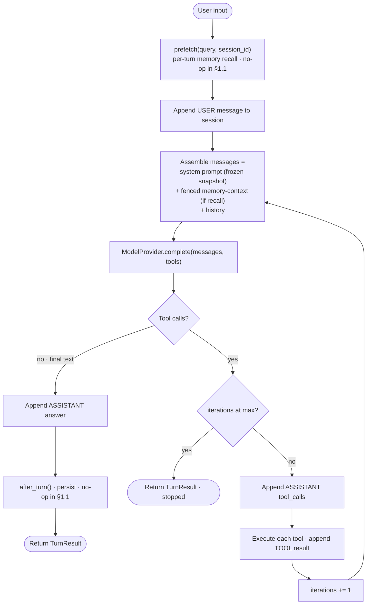

# Devlog · Phase 0 §1.1 — Agent Core (Layer A)

> A study-reference write-up of **how** we built the first product increment and **why**. Part of
> the Jobpin Agent build journal. Pairs with the spec
> (`docs/superpowers/specs/2026-06-27-p0-1.1-agent-core-design.md`) and plan
> (`docs/superpowers/plans/2026-06-27-p0-1.1-agent-core.md`). Source: `agent/src/jobpin_agent/core/`.

## What this step delivers

A self-contained, **provider-agnostic, local agent core** that completes one full turn —
**system-prompt assembly → tool-call loop → sub-agent delegation** — persisted to SQLite, runnable
against a real OpenAI model, and exposing a **no-op memory seam** that the memory subsystem
(§1.2–1.6) plugs into later without changing the loop.

This is the foundation point of Phase 0. Everything else (memory, governance, orchestration,
integration, the full AI/eval platform) attaches to the extension points defined here.

## Component map

| File | Responsibility |
|---|---|
| `core/messages.py` | Provider-agnostic types: `Role`, `Message`, `ToolCall`, `ToolResult`, `ModelResponse` |
| `core/model/provider.py` | `ModelProvider` ABC (`complete(messages, tools) -> ModelResponse`) |
| `core/model/fake_provider.py` | Deterministic scripted provider for offline tests |
| `core/model/openai_provider.py` | Minimal OpenAI adapter (Chat Completions); **all** wire-mapping lives here |
| `core/tools.py` | `ToolSpec`, `ToolRegistry`, the `echo` demo tool |
| `core/system_prompt.py` | Deterministic, order-fixed system-prompt assembler |
| `core/tracing.py` | Step-level tracer (in-memory + JSONL) |
| `core/hooks.py` | `MemoryHooks` protocol + `NoOpHooks` — the memory seam |
| `core/session_store.py` | SQLite sessions/messages with branch/reset → `on_session_switch` |
| `core/agent_loop.py` | The synchronous turn loop + `TurnResult` |
| `core/delegation.py` | `delegate()` — sub-agent with `skip_memory` + parent observation |
| `core/config.py` | Env-based config (`OPENAI_API_KEY`, model id, …) |
| `examples/demo_turn.py` | Runnable demo (plain / tool / delegation) |

## The turn loop — the four paths

`Agent.run_turn(session_id, user_input)` does:

```
prefetch(user_input, session_id)        # per-turn recall (no-op in §1.1) -> fenced message
append USER message
loop:
  build messages = [system_prompt] + [<memory-context> fence?] + history
  model_call -> ModelResponse
    • tool_calls?  -> (stop if at max_tool_iterations) else execute tools, append results, loop
    • text?        -> append ASSISTANT, after_turn(...), return
```

The same loop as a diagram (renders on GitHub; the site viewer shows it as a code block):



Four behaviours are independently tested with the `FakeProvider`: **plain answer**, **single tool
call → answer**, **multi-turn tool continuation**, and the **stop condition** (after
`max_tool_iterations` tool rounds the loop gives the model one final-answer chance and otherwise
returns `stopped=True`).

## Key decisions and why

- **Rewrite, not port.** Per PRD §2.7 the conversation loop is *design-borrowed* from Hermes
  (`conversation_loop.run_conversation`, `system_prompt.build_system_prompt`, the `on_delegation`
  pattern), but rewritten lean and ownable — Hermes's loop is coupled to its CLI/TUI/gateway. No
  substantial Hermes code is copied at §1.1; `THIRD_PARTY_NOTICES.md` records the provenance.
  Code-*porting* (the memory subsystem) starts at §1.2.
- **Synchronous core.** Matches Hermes's "sync core + background threads" shape; memory's background
  sync worker arrives at §1.3 as a thread, not by making the loop async.
- **Provider-agnostic by construction.** The loop only ever sees internal types + `ModelProvider`.
  OpenAI is the first adapter and the dev/pilot default (we have an account); Claude, DeepSeek, and a
  local model slot in behind the same ABC at §1.11 (PRD §11.3). All OpenAI-specific mapping is
  quarantined in `openai_provider.py`.
- **Deterministic system prompt.** `build_system_prompt` is pure and order-fixed, locked by a
  golden-snapshot test built 100× — the prerequisite for the future frozen-snapshot prompt cache
  (Key Invariant #1).
- **The memory seam is real but no-op.** `MemoryHooks` (prefetch / after_turn / on_delegation /
  on_session_switch / on_pre_compress) mirrors the Hermes `MemoryProvider` lifecycle; `NoOpHooks` is
  the §1.1 implementation. §1.2–1.6 provide real hooks **without touching the loop**.
- **Delegation invariant.** Sub-agents run with `skip_memory` (their own `NoOpHooks`) and never
  persist sensitive memory; the parent observes via `on_delegation` and will adjudicate writes once
  memory exists (Key Invariant #3).

## What the triple-review changed (and why it matters)

After implementation + green tests, three reviewers (senior engineer, architect, product manager)
checked the increment against the Production Plan. Their catches reshaped the final design — a good
illustration of *why* the review step exists:

1. **Frozen snapshot vs per-turn recall (architect, Critical).** The first cut fed `prefetch()`
   recall into the system-prompt `memory_snapshot` slot. That conflates two different Hermes
   mechanisms: the **frozen snapshot** (set once per session, a stable cache prefix) and **per-turn
   recall** (which belongs in the *messages* as a `<memory-context>` fence). Left as-is it would have
   forced a loop refactor at §1.2/§1.3 — exactly what the seam is meant to prevent. Fixed: recall is
   now a fenced message; the snapshot slot stays static; `self.parts` is never mutated. A test locks
   this in.
2. **`prefetch(query, session_id)` (architect, Major).** Hermes passes the session id; we added it
   now so §1.3 doesn't change the signature.
3. **Delegation lineage + context (architect/senior, Major/Minor).** The child now inherits the
   parent's prompt parts (org/compliance/role) and the child session records its parent id for the
   §1.7 / audit causal chain.
4. **Plan correctness (all three).** Plan §1.1 listed context-compression as part of the turn, but
   its wiring belongs to §1.6. Per our "fix the Plan first" rule we corrected §1.1 (EN + 中文) to say
   it exposes only the `on_pre_compress` *seam* before touching code.
5. **Test gaps (senior).** Added assertions for `ToolCall.arguments` round-trip, the stop-round
   count, and OpenAI `tools`-omitted-when-`None`.

A known, intentional gap: `config.db_path` / `max_tool_iterations` are read from env but not yet
wired into a composition root — there is no real app entry point in §1.1; that wiring lands with the
first real entry point.

## Run it yourself

```bash
cd agent
python -m pytest -q          # 25 passed, 1 skipped (OpenAI integration; opt-in)
python examples/demo_turn.py # {'plain': 'hello', 'tool': 'done:X', 'delegation': 'child-done', ...}
```

The demo above uses the offline `FakeProvider` (scripted answers — no key, no network). To use a
**real model**, put your key in a gitignored `.env` (from `agent/`):

```bash
cp .env.example .env   # then edit .env and set OPENAI_API_KEY=sk-...
python -m pytest tests/test_openai_provider.py -k integration -v   # now makes a real OpenAI call
```

`CoreConfig.from_env()` loads `agent/.env` automatically (without overriding a key already exported
in your shell). With no key the integration test simply skips, so CI needs no key or network.

## How this sets up §1.2

§1.2 ports the file-backed Hermes `MemoryStore` (Org/Recruiter memory). It will:
- fill the **frozen-snapshot slot** via `MemoryStore.format_for_system_prompt()`, and
- provide a real `prefetch()` that returns fenced recall — both through the seam defined here, with
  **no change to `agent_loop.py`**. That clean attachment is the whole point of getting §1.1 right.
