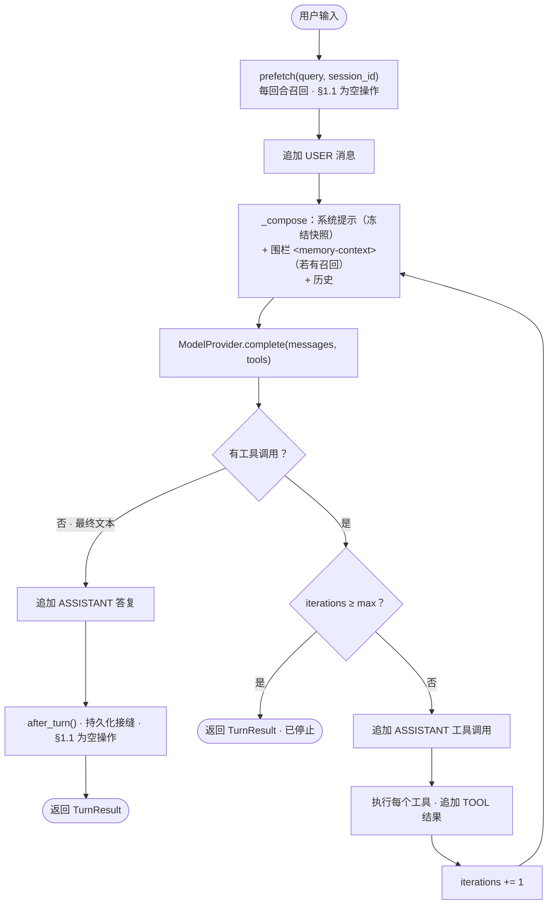
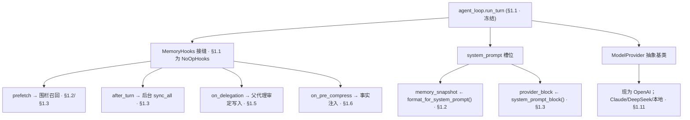

# 开发日志 · Phase 0 §1.1 — Agent 内核（Layer A）：本地、provider 无关的回合循环

> 整个产品的地基点：一个完整的 agent 回合——**系统提示装配 → 工具调用循环 → 子代理委派**——可本地、离线运行，
> 持久化到 SQLite，并暴露一个**空操作（no-op）记忆接缝**，供后续每个节点（§1.2–1.6）接入而**无需改动循环**。
> 这是一次**借鉴设计的重写**（而非代码移植）。规格：
> `docs/superpowers/specs/2026-06-27-p0-1.1-agent-core-design.md`；计划：`site/plan/02-Production-Plan-EN.md` §1.1。
> 源码：`agent/src/jobpin_agent/core/`。

## 1. 本步骤交付什么

一个自包含、**provider 无关、本地运行的 Agent 内核**，能完成一个完整回合，并为记忆子系统与 HR 模块暴露稳定的扩展点，
后续接入无需重构循环。满足计划 §1.1 的五项交付物：

- `core/agent_loop` —— 精简会话循环，单元测试覆盖**四条路径类**（纯文本回答 / 单次工具调用 / 多回合续跑 / 停止条件）。
- `core/system_prompt` —— **确定性、顺序固定**的装配器，由黄金快照测试锁定（前缀稳定——关键不变量 #1）。
- `core/delegation` —— 委派原语 + 父代理观察钩子接线（`skip_memory`）。
- `core/session_store` —— 单文件 SQLite 会话表，带 `branch`/`reset` 会话切换语义。
- 逐组件的**来源（provenance）表**（`THIRD_PARTY_NOTICES.md` §1.1），把每个核心文件归类为设计衍生（新建/重写），
  并附上 MIT 通知，以备 §1.2 起开始的代码移植。

随后的一切——记忆、治理、编排、集成、AI/Eval 平台——都挂接到这里定义的接缝上。新的、设计衍生代码；
**本步骤不拷贝任何实质性 Hermes 代码**（代码移植从 §1.2 开始）。

## 2. 新增/改动的文件

| 路径 | 内容 |
|---|---|
| `core/messages.py` | `Role`、`ToolCall`、`ToolResult`、`Message`、`ModelResponse`（`is_tool_call`）—— provider 无关词汇 |
| `core/tools.py` | `ToolSpec`、`ToolRegistry`（register/get/specs/execute）、`echo_tool()` |
| `core/model/provider.py` | `ModelProvider` 抽象基类（`complete(messages, tools) -> ModelResponse`） |
| `core/model/fake_provider.py` | `FakeProvider` —— 脚本化、离线；以 `calls` 记录每次调用 |
| `core/model/openai_provider.py` | `OpenAIProvider` + `to_openai_messages` / `to_openai_tools` / `parse_response` ——**所有** OpenAI 线格式映射 |
| `core/system_prompt.py` | `SystemPromptParts`、`format_tools`、`build_system_prompt`（确定性、顺序固定） |
| `core/tracing.py` | `TraceEvent`、`Tracer`（`event` / `events` / `to_jsonl` / `save`）—— 注入式时钟 |
| `core/hooks.py` | `MemoryHooks` 协议 + `NoOpHooks` —— 记忆接缝 |
| `core/session_store.py` | `SessionStore`（SQLite；create/append/get/branch/reset）+ JSON 序列化/反序列化 |
| `core/agent_loop.py` | `Agent`、`TurnResult`、`run_turn`（四路径循环）、`_compose`（冻结快照 + 围栏） |
| `core/delegation.py` | `delegate()`、`DelegationResult`（skip_memory + 父代理观察 + 血缘） |
| `core/config.py` | `CoreConfig` + `_load_dotenv`（环境 / `.env`，绝不覆盖已导出变量） |
| `examples/demo_turn.py` | 可运行的离线演示——纯文本 / 工具 / 委派（`run_demo()`） |
| `examples/chat.py` | 对接真实模型的交互式 REPL + 每回合追踪（`traces/latest.jsonl`） |
| `tests/data/system_prompt_golden.txt` | 已提交的装配提示黄金快照 |
| `tests/test_{agent_loop,system_prompt,session_store,delegation,hooks,tools,fake_provider,openai_provider,tracing,config,demo,smoke}.py` | §1.1 验收套件（29 个用例：28 通过 + 1 个可选跳过） |

## 3. 公开接口（API）

```python
# messages.py
class Role(str, Enum): SYSTEM="system"; USER="user"; ASSISTANT="assistant"; TOOL="tool"
ToolCall(id: str, name: str, arguments: dict)                       # arguments 为已解析的 JSON
ToolResult(tool_call_id: str, name: str, content: str)
Message(role: Role, content: str="", tool_calls: list[ToolCall]=[], tool_result: ToolResult|None=None)
ModelResponse(text: str|None=None, tool_calls: list[ToolCall]=[], usage: dict|None=None)
    .is_tool_call -> bool                                           # property == bool(self.tool_calls)

# tools.py
ToolSpec(name: str, description: str, parameters: dict, handler: Callable[[dict], str])
class ToolRegistry:
    register(spec) -> None;  get(name) -> ToolSpec                  # get 未知工具抛 KeyError
    specs() -> list[ToolSpec];  execute(call: ToolCall) -> ToolResult
echo_tool() -> ToolSpec                                             # name="echo"；原样返回其 "text" 参数

# model/provider.py —— 循环与任意 LLM 之间的接缝
class ModelProvider(ABC):
    complete(messages: list[Message], tools: list[ToolSpec]|None=None) -> ModelResponse   # 每个模型回合一次调用

# model/fake_provider.py（离线、确定性）
FakeProvider(script: list[ModelResponse]);  .calls: list[list[Message]]   # complete() 弹出脚本；耗尽抛 AssertionError

# model/openai_provider.py（唯一了解 OpenAI 线格式的地方）
to_openai_messages(messages) -> list[dict]                         # 工具结果 / 工具调用 / 普通三种形态
to_openai_tools(tools) -> list[dict]|None                         # 空时为 None —— 调用方省略该 kwarg
parse_response(resp) -> ModelResponse                             # 第一个 choice；重解析工具参数 JSON；附上 usage
OpenAIProvider(config: CoreConfig, client: Any=None)              # client 为 None 时从 `openai` 延迟构造

# system_prompt.py
SystemPromptParts(org_policy="", compliance="", role_permissions="", memory_snapshot="", provider_block="", tools=[])
format_tools(tools) -> str                                        # 按名称排序；空时 "(no tools available)"
build_system_prompt(parts) -> str                                # 固定顺序；单个结尾换行

# tracing.py
TraceEvent(seq: int, kind: str, data: dict, at: float)
Tracer(clock: Callable[[],float]|None=None)                      # 默认常量 0.0 时钟（确定性）
    .event(kind, **data) -> None;  .events -> list[TraceEvent];  .to_jsonl() -> str;  .save(path) -> Path

# hooks.py —— 记忆接缝（Protocol；NoOpHooks 为 §1.1 实现）
class MemoryHooks(Protocol):
    prefetch(query: str, session_id: str) -> str                  # -> 围栏 <memory-context> 召回
    after_turn(session_id: str, messages: list[Message]) -> None
    on_delegation(task: str, result: str, child_session_id: str) -> None
    on_session_switch(new_session_id: str, parent_session_id: str|None, reset: bool, rewound: bool) -> None
    on_pre_compress(messages: list[Message]) -> str               # §1.1 仅签名（接线在 §1.6）

# session_store.py
SessionStore(db_path: str=":memory:", hooks: MemoryHooks|None=None)
    create_session(session_id=None, parent_id=None) -> str        # parent_id = 委派血缘
    append_message(session_id, message) -> None;  get_messages(session_id) -> list[Message]
    branch(session_id, new_session_id=None) -> str                # 复制历史；触发 on_session_switch(new, src, False, False)
    reset(session_id) -> None                                     # 清空消息；触发 on_session_switch(sid, None, True, False)

# agent_loop.py
TurnResult(text: str|None, stopped: bool, messages: list[Message]=[])
Agent(provider, tools, session_store, tracer=None, hooks=None, parts=None, max_tool_iterations=8)
    run_turn(session_id: str, user_input: str) -> TurnResult

# delegation.py
DelegationResult(text: str|None, child_session_id: str)
delegate(parent: Agent, task: str, child_provider: ModelProvider, child_session_id=None, parent_session_id=None) -> DelegationResult

# config.py
CoreConfig(openai_api_key=None, model_id="gpt-4o-mini", db_path="jobpin_sessions.db", max_tool_iterations=8)
    .from_env() -> CoreConfig            # 读取 OPENAI_API_KEY / JOBPIN_MODEL_ID / JOBPIN_DB_PATH / JOBPIN_MAX_TOOL_ITERS
_load_dotenv(path=None) -> None          # 从 cwd/.env、agent/.env、<repo>/.env 中第一个存在者 setdefault
```

## 4. 数据结构与格式

- **单一 `Message` 形态，四种角色。** 纯消息携带 `content`；助手的工具调用回合携带 `tool_calls`；`TOOL` 回合携带
  `tool_result`。单一形态使循环与会话存储保持统一。`ModelResponse` 是其对偶：`text` / `tool_calls` 恰有一个有意义，
  由 `is_tool_call` 决定分支。
- **装配后的系统提示** —— 六个章节按固定顺序，标题与正文以空行连接，空槽渲染为 `(none)`，以单个结尾换行结束。这是已提交的
  黄金快照（`tests/data/system_prompt_golden.txt`）的逐字内容：

  ```text
  ## Organisation policy

  Be helpful.

  ## Compliance constraints

  Australia only.

  ## Role permissions

  recruiter

  ## Memory

  (none)

  ## Provider context

  (none)

  ## Tools

  - echo: Echo back the provided text.
  ```

  章节顺序为 `org_policy → compliance → role_permissions → memory_snapshot → provider_block → tools`。
  `memory_snapshot` 是**冻结快照槽位**（由 §1.2 每会话填充一次）；`provider_block` 是 §1.3 的静态块；工具每个渲染一行
  `- name: description`，**按名称排序**，使注册顺序绝不扰动字节。
- **SQLite 会话模式**（两张表，单文件或 `:memory:`）：
  ```sql
  CREATE TABLE IF NOT EXISTS sessions (id TEXT PRIMARY KEY, parent_id TEXT)
  CREATE TABLE IF NOT EXISTS messages (id INTEGER PRIMARY KEY AUTOINCREMENT, session_id TEXT, seq INTEGER, payload TEXT)
  ```
  `parent_id` 记录委派血缘。每条消息 `payload` 为 JSON，含工具调用/结果的无损往返：
  ```json
  {"role": "...", "content": "...",
   "tool_calls": [{"id": "...", "name": "...", "arguments": {...}}],
   "tool_result": {"tool_call_id": "...", "name": "...", "content": "..."} | null}
  ```
  `seq` 为每会话 `COALESCE(MAX(seq), -1) + 1`（空会话为 0）。
- **追踪事件** —— `{seq, kind, data, at}`，`to_jsonl()` 中每行一个 JSON 对象。一个回合发出的类型：
  `turn_start`、`model_call`（携带 `request` / `response` / `usage` / `latency_ms`）、`tool_call`
  （`name` / `arguments` / `result` / `latency_ms`）、`delegation`、`turn_end`（`stopped` / `text`）。
- **召回围栏** —— 每回合召回被包成 `f"<memory-context>\n{recall}\n</memory-context>"`，作为 SYSTEM **消息**追加
  （绝不进入冻结快照槽位——见 §5）。
- **`on_session_switch` 标志语义** —— `branch` → `(new, src, reset=False, rewound=False)`；
  `reset` → `(sid, None, reset=True, rewound=False)`。（`rewound` 为 `/rewind` 预留，§1.1 未用。）
- **关键常量/默认值** —— `max_tool_iterations=8`、`model_id="gpt-4o-mini"`、
  `db_path="jobpin_sessions.db"`、`Tracer` 时钟默认常量 `0.0`。

## 5. 关键机制（附真实代码）

**回合循环——四条路径**（`agent_loop.py::Agent.run_turn`）。先召回一次、追加用户消息，再循环：装配 → 调模型 → 按响应分支。
```python
recall = self.hooks.prefetch(user_input, session_id)            # 每回合围栏召回（§1.1 为空操作）
self.store.append_message(session_id, Message(Role.USER, content=user_input))
iterations = 0
while True:
    history = self.store.get_messages(session_id)
    sent = self._compose(history, recall)                       # 冻结快照 + 围栏 + 历史
    response = self.provider.complete(sent, self.tools.specs())
    self.tracer.event("model_call", iteration=iterations, request=..., response=..., usage=..., latency_ms=...)
    if response.is_tool_call:
        if iterations >= self.max_tool_iterations:              # 路径 4 —— 停止条件
            self.tracer.event("turn_end", stopped=True, text=None)
            return TurnResult(text=None, stopped=True, messages=self.store.get_messages(session_id))
        self.store.append_message(session_id, Message(Role.ASSISTANT, tool_calls=response.tool_calls))
        for call in response.tool_calls:                        # 路径 2 与 3 —— 执行、追加、续循环
            result = self.tools.execute(call)
            self.tracer.event("tool_call", name=call.name, arguments=call.arguments, result=result.content, latency_ms=...)
            self.store.append_message(session_id, Message(Role.TOOL, tool_result=result))
        iterations += 1
        continue
    self.store.append_message(session_id, Message(Role.ASSISTANT, content=response.text or ""))   # 路径 1 —— 纯文本回答
    final = self.store.get_messages(session_id)
    self.hooks.after_turn(session_id, final)                    # 持久化接缝（§1.1 为空操作）
    self.tracer.event("turn_end", stopped=False, text=response.text)
    return TurnResult(text=response.text, stopped=False, messages=final)
```
四种行为对应：**(1)** 文本响应立即返回；**(2)** 一个工具回合后给出文本答复；**(3)** 反复回灌工具结果直至模型作答；
**(4)** 永不停止调用工具的模型在**恰好** `max_tool_iterations` 轮处被截断（上限在执行下一轮*之前*检查，故不多跑工具）。

**冻结快照装配 + 围栏召回**（`agent_loop.py::Agent._compose`）—— 架构师的核心修复。每次调用构建一个**回合局部的**
`SystemPromptParts`；`self.parts` *绝不*被改动，故系统提示前缀在整个会话内逐字节稳定（关键不变量 #1）。每回合召回是
单独的围栏**消息**，而非快照槽位：
```python
parts = SystemPromptParts(                                      # 回合局部副本——self.parts 绝不被改动
    org_policy=self.parts.org_policy, compliance=self.parts.compliance,
    role_permissions=self.parts.role_permissions, memory_snapshot=self.parts.memory_snapshot,
    provider_block=self.parts.provider_block, tools=self.tools.specs(),
)
messages = [Message(Role.SYSTEM, content=build_system_prompt(parts))]
if recall:                                                      # 围栏消息，而非冻结快照槽位
    messages.append(Message(Role.SYSTEM, content=f"<memory-context>\n{recall}\n</memory-context>"))
return [*messages, *history]
```
正是这一点让 §1.2/§1.3 **无需重构循环**即可接入召回：稳定前缀留在 `build_system_prompt` 快照里；易变的每回合召回放进消息。

**委派——`skip_memory` + 父代理观察**（`delegation.py::delegate`）。子代理共享父代理的工具 / 会话存储 / 追踪器 /
提示 parts，但运行**各自的** `NoOpHooks`（不写入敏感记忆）。子会话记录其 `parent_id` 以用于 §1.7 / 审计因果链，
父代理经 `on_delegation` 观察结果（记忆就绪后将在此审定写入——关键不变量 #3）：
```python
child = Agent(
    provider=child_provider, tools=parent.tools, session_store=parent.store,
    tracer=parent.tracer, hooks=NoOpHooks(),                    # skip_memory：子代理不写敏感记忆
    parts=parent.parts, max_tool_iterations=parent.max_tool_iterations,
)
sid = parent.store.create_session(child_session_id, parent_id=parent_session_id)   # 血缘
parent.tracer.event("delegation", task=task, child_session_id=sid)
result = child.run_turn(sid, task)
parent.hooks.on_delegation(task, result.text or "", sid)       # 父代理观察 / 将审定
```

**OpenAI 映射被隔离**（`openai_provider.py`）。`to_openai_messages` 处理三种特殊形态（`TOOL` 结果 → 以
`tool_call_id` 为键的 `role:"tool"`；助手工具调用回合 → 参数 JSON 字符串化的 OpenAI `tool_calls` 数组；其余 →
普通 `{role, content}`）；`to_openai_tools` 在空时返回 `None`，使 `complete` 完全**省略 `tools` 参数**；
`parse_response` 读取第一个 choice 并把每个工具调用的 JSON 参数重解析回 dict。内核其余部分绝不接触 OpenAI 负载。

## 6. 设计决策与原因

- **重写，而非移植**（PRD §2.7）。回合循环*借鉴*自 Hermes（`conversation_loop.run_conversation`、
  `system_prompt.build_system_prompt` / `format_tools_for_system_message`、`on_delegation` 模式、
  `conversation_compression.py` 钩子*签名*），但重写为精简版——Hermes 的循环与其
  CLI/TUI/gateway/多 provider 流水线耦合，而我们需要本地优先 + 干净所有权。`THIRD_PARTY_NOTICES.md` §1.1 来源表把
  每个核心文件归类为设计衍生（新建）；代码*移植*（记忆子系统）从 §1.2 开始。
- **同步内核。** 契合 Hermes “同步内核 + 后台线程”的请求/响应循环。记忆的后台落库 worker 在 §1.3 以线程形式出现，
  而*非*把循环改成异步；若日后需要流式/并发，仅在 provider 边界引入。
- **构造上即 provider 无关。** 循环只接触内部类型与 `ModelProvider`。OpenAI 是首个适配器、也是开发/试点默认
  （我方已有账户）；Claude、DeepSeek 与本地模型在 §1.11 以同一抽象接入（PRD §11.3）。所有 OpenAI 特定映射隔离在
  单个文件，故切换 Chat Completions / Responses API 是单文件改动。
- **确定性系统提示。** `build_system_prompt` 是纯函数且顺序固定，由“构建 100 次”黄金快照锁定——这是未来冻结快照
  prompt 缓存的前提（关键不变量 #1）。工具按名称排序，使注册顺序无法扰动字节。
- **记忆接缝真实但空操作。** `MemoryHooks` 对应 Hermes `MemoryProvider` 生命周期；`NoOpHooks` 是 §1.1 实现。
  §1.2–1.6 提供真实钩子**而无需改动循环**——这种干净接入正是把 §1.1 做对的意义所在。
- **委派不变量。** 子代理以 `skip_memory` 运行（各自的 `NoOpHooks`），绝不持久化敏感记忆；父代理在观察子代理后再审定
  并写入（关键不变量 #3）。
- **追踪的注入式时钟。** `Tracer` 接收 `clock` 可调用对象（默认常量 `0.0`），使测试确定，并避免隐式调用非确定性时间源；
  实际运行传入 `time.monotonic`。

## 7. 接缝与推迟

每一行都是*当下*已接好、带 §1.1 惰性默认值的真实签名，以及填充它的节点。

| 接缝（签名） | §1.1 默认 | 真实实现 |
|---|---|---|
| `prefetch(query, session_id) -> str` | `NoOpHooks` → `""` | **§1.2/§1.3** 围栏 `<memory-context>` 召回 |
| `memory_snapshot` 槽位（`SystemPromptParts`） | `""` → `(none)` | **§1.2** `MemoryStore.format_for_system_prompt()` |
| `provider_block` 槽位 | `""` → `(none)` | **§1.3** `MemoryProvider.system_prompt_block()` |
| `after_turn(session_id, messages) -> None` | 空操作 | **§1.3** 后台 `sync_all`（串行 worker + `flush_pending`） |
| `on_session_switch(new, parent, reset, rewound)` | 空操作 | **§1.3+** 按会话缓存刷新 |
| `on_delegation(task, result, child) -> None` | 空操作 | **§1.5** 父代理审定敏感写入 |
| `on_pre_compress(messages) -> str` | `""`（**仅签名**） | **§1.6** 事实注入 + 接线 + 集成测试 |
| `ModelProvider` 抽象基类 | OpenAI + Fake | **§1.11** Claude / DeepSeek / 本地适配器 |
| `Tracer`（精简、本地） | 内存 + JSONL | **§1.11** Langfuse / OTel（本地优先） |
| `config.db_path` / `max_tool_iterations` | 已定义，**尚未接线** | 首个真实应用入口处的组合根 |

最后一行是唯一已知且有意的缺口：这些开关从环境读入但尚未接到组合根——§1.1 还没有真正的应用入口；该接线将随首个入口落地。

## 8. 测试与验收（§1.1 为 28 passed, 1 skipped；今日全仓 104 passed, 1 skipped）

| 测试文件（用例数） | 用例 → 证明什么 |
|---|---|
| `test_agent_loop.py`（6） | `test_plain_answer_path`（持久化 USER+ASSISTANT）；`test_single_tool_call_then_answer`（USER/ASSISTANT(工具)/TOOL/ASSISTANT + 一条 `tool_call` 事件）；`test_multi_turn_tool_continuation`（两个工具回合 → 答复，2 条事件）；`test_stop_condition_on_max_iterations`（**恰在 `max_iters` 处停止**，不多跑）；`test_model_call_and_tool_call_events_capture_full_detail`（request/response/latency + 工具 args/result）；`test_prefetch_recall_is_fenced_message_not_in_frozen_snapshot`（**召回围栏、快照干净、`self.parts` 未改动**） |
| `test_system_prompt.py`（2） | `test_matches_golden_snapshot`（与已提交黄金快照逐字节一致）；`test_is_byte_identical_across_100_builds`（100 次构建 → 唯一输出） |
| `test_session_store.py`（3） | `test_roundtrip_preserves_messages_with_tool_calls`（无损含已解析参数）；`test_branch_forks_history_and_fires_switch`（分叉历史，`reset=False`）；`test_reset_clears_and_fires_switch`（清空，`reset=True`） |
| `test_delegation.py`（1） | `test_delegate_runs_child_skip_memory_and_parent_observes`（返回子答复；`on_delegation` 触发一次；**子代理从不调用父代理 `prefetch`**） |
| `test_hooks.py`（1） | `test_noop_hooks_defaults`（`prefetch`/`on_pre_compress` → `""`，其余 → `None`，`isinstance(MemoryHooks)`） |
| `test_tools.py`（2） | `test_registry_executes_registered_tool`（关联的 `ToolResult`）；`test_registry_unknown_tool_raises`（`KeyError`） |
| `test_fake_provider.py`（2） | `test_fake_provider_returns_script_in_order_and_records_calls`；`test_fake_provider_raises_when_exhausted`（显式 `AssertionError`） |
| `test_openai_provider.py`（6；跳过 1） | `test_to_openai_messages_maps_roles_and_tool_calls`；`test_to_openai_tools_shape`；`test_parse_response_text_and_tool_calls`；`test_complete_omits_tools_when_none_and_includes_when_present`（**空工具时省略 `tools` kwarg**）；`test_parse_response_captures_usage_when_present`；`test_openai_integration_real_turn`（**可选；未设 `OPENAI_API_KEY` 时跳过**） |
| `test_tracing.py`（3） | `test_events_recorded_in_order_with_kinds`（seq 0,1…）；`test_to_jsonl_is_one_line_per_event`；`test_save_writes_jsonl_file_creating_parent_dirs` |
| `test_config.py`（1） | `test_load_dotenv_sets_unset_keys_and_does_not_override`（`.env` 填充未设；已设环境优先；注释/引号处理） |
| `test_demo.py`（1） | `test_demo_runs_offline_and_exercises_all_paths`（plain=`hello`、tool 含 `X`、delegation=`child-done`、traces > 0） |
| `test_smoke.py`（1） | `test_package_imports_and_exposes_version` |

**对应计划 §1.1 退出标准：**（a）纯文本 + 一个工具 + 一个委派回合，完全本地，带步骤级追踪 → `test_demo` +
`test_agent_loop` + `test_delegation` + `test_tracing`；（b）黄金快照测试通过且 100 次构建逐字节一致 →
`test_system_prompt`；（c）来源表覆盖每个核心文件、MIT 通知置于 `THIRD_PARTY_NOTICES.md` → §1.1 来源表
（一份文档化制品，而非运行时测试）。

## 9. 如何接线

回合循环（自上而下；回边为工具续跑循环）：



后续节点在何处接入——下图每条边都是 §1.1 中已接好（惰性）的接缝：



## 10. 自己运行

```bash
cd agent
python -m pytest -q                                   # 104 passed, 1 skipped（OpenAI 集成；可选）
python -m pytest -q tests/test_agent_loop.py tests/test_system_prompt.py \
  tests/test_session_store.py tests/test_delegation.py tests/test_hooks.py \
  tests/test_tools.py tests/test_fake_provider.py tests/test_openai_provider.py \
  tests/test_tracing.py tests/test_config.py tests/test_demo.py tests/test_smoke.py   # 28 passed, 1 skipped（§1.1 子集）
python examples/demo_turn.py                          # {'plain': 'hello', 'tool': 'done:X', 'delegation': 'child-done', 'trace_events': ...}
```

演示使用离线 `FakeProvider`（脚本化——无密钥、无网络）。要驱动**真实模型**，把密钥放进被 gitignore 的 `.env`
（在 `agent/` 下）：

```bash
cp .env.example .env                                  # 然后编辑 .env：OPENAI_API_KEY=sk-...
python -m pytest tests/test_openai_provider.py -k integration -v   # 现在会发起真实 OpenAI 调用
python examples/chat.py                               # 交互式 REPL；/trace 打印每一步，/reset 开始新会话
```

`CoreConfig.from_env()` 会自动加载 `agent/.env`（不覆盖你 shell 中已导出的密钥）。无密钥时集成测试直接跳过，因此
CI 无需密钥或网络。每个回合 `Tracer` 都以完整细节记录每一步——发送的消息、模型响应、`latency_ms`、token `usage`，
以及每个工具的 `arguments`/`result`；`chat.py` 把完整 JSONL 追踪写入 `agent/traces/latest.jsonl`。

## 11. 三方评审改了什么

实现完成、测试转绿后，三位评审（资深工程师 / 架构师 / 产品经理）对照生产计划检查本增量。他们的发现重塑了最终设计——很好地
说明了**为什么**要有评审这一步：

1. **冻结快照 vs 每回合召回（架构师，严重）。** 初版把 `prefetch()` 召回喂进了系统提示的 `memory_snapshot` 槽——
   混淆了两个不同的 Hermes 机制：**冻结快照**（每会话设一次，是稳定的缓存前缀）与**每回合召回**（应作为
   `<memory-context>` 围栏放入*消息*中）。若不改，会在 §1.2/§1.3 迫使循环重构——恰是接缝要避免的。已修复：召回为
   围栏消息，快照槽保持静态，绝不改动 `self.parts`。`test_prefetch_recall_is_fenced_message_not_in_frozen_snapshot`
   将其锁定。
2. **`prefetch(query, session_id)`（架构师，重要）。** Hermes 会传会话 id；我们现在就补上，免得 §1.3 再改签名。
3. **委派的血缘与上下文（架构师/资深工程师，重要/次要）。** 子代理现继承父代理的提示 parts（组织/合规/角色），子会话
   记录其 `parent_id`，用于 §1.7 / 审计因果链。
4. **计划正确性（三方一致）。** 计划 §1.1 曾把上下文压缩列为回合的一部分，但其接线属于 §1.6。依“先修计划”原则，我们先把
   §1.1（中英）改为仅暴露 `on_pre_compress` *接缝*，再动代码。
5. **测试缺口（资深工程师）。** 补充断言：`ToolCall.arguments` 往返、停止回合计数、以及 OpenAI 在无工具时省略 `tools`。

随后三位评审一致确认本增量与计划相符。

## 12. 这一步如何为 §1.2 / §1.3 铺路

- **§1.2（文件型 `MemoryStore`）** 经 `MemoryStore.format_for_system_prompt()` 填充**冻结快照槽位**，并提供返回围栏
  召回的真实 `prefetch()`——两者都经由此处定义的接缝，且**无需改动 `agent_loop.py`**。
- **§1.3（`MemoryProvider` + `MemoryManager`）** 接好静态 `provider_block`（`system_prompt_block()`），把
  `after_turn` 变为后台 `sync_all`（单 worker 串行执行器 + `flush_pending` 屏障——正是本步骤为之准备的“同步内核 +
  后台线程”形态），并在 `on_session_switch` 时刷新按会话缓存。
- **§1.5（治理）** 让 `on_delegation` 有牙：父代理审定哪些子代理输出成为带标注、合法的记忆写入。
- **§1.6（注入防御 + 压缩）** 在此处交付的 `on_pre_compress` 签名之后提供真实的压缩前事实注入。

以上每一项都无需编辑循环即可接入——这正是把 §1.1 做对的全部回报。
