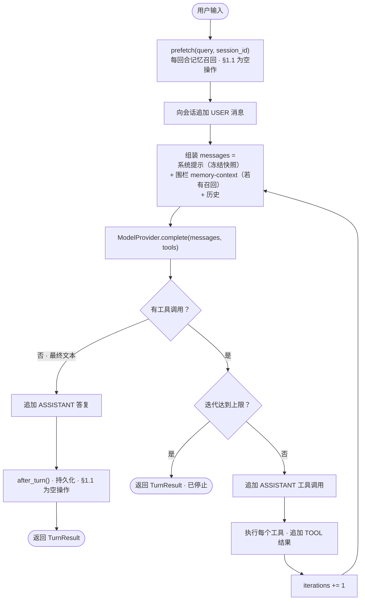

# 开发日志 · Phase 0 §1.1 — Agent 内核（Layer A）

> 一份学习参考：记录我们如何构建第一个产品增量，以及**为什么**这样做。属于 Jobpin Agent 的构建日志。
> 配套规格（`docs/superpowers/specs/2026-06-27-p0-1.1-agent-core-design.md`）与计划
> （`docs/superpowers/plans/2026-06-27-p0-1.1-agent-core.md`）。源码：`agent/src/jobpin_agent/core/`。

## 本步骤交付什么

一个自包含、**provider 无关、本地运行的 Agent 内核**，能完成一个完整回合——
**系统提示装配 → 工具调用循环 → 子代理委派**——并持久化到 SQLite、可对接真实 OpenAI 模型，同时暴露一个
**空操作（no-op）的记忆接缝**，供记忆子系统（§1.2–1.6）后续接入而**无需改动循环**。

这是 Phase 0 的地基点。其余一切（记忆、治理、编排、集成、完整的 AI/Eval 平台）都挂接到这里定义的扩展点上。

## 组件地图

| 文件 | 职责 |
|---|---|
| `core/messages.py` | provider 无关类型：`Role`、`Message`、`ToolCall`、`ToolResult`、`ModelResponse` |
| `core/model/provider.py` | `ModelProvider` 抽象基类（`complete(messages, tools) -> ModelResponse`） |
| `core/model/fake_provider.py` | 离线测试用的确定性脚本化 provider |
| `core/model/openai_provider.py` | 最小 OpenAI 适配器（Chat Completions）；**所有**线格式映射都在此 |
| `core/tools.py` | `ToolSpec`、`ToolRegistry`、`echo` 演示工具 |
| `core/system_prompt.py` | 确定性、顺序固定的系统提示装配器 |
| `core/tracing.py` | 步骤级追踪器（内存 + JSONL） |
| `core/hooks.py` | `MemoryHooks` 协议 + `NoOpHooks`——记忆接缝 |
| `core/session_store.py` | SQLite 会话/消息，支持 branch/reset → `on_session_switch` |
| `core/agent_loop.py` | 同步回合循环 + `TurnResult` |
| `core/delegation.py` | `delegate()`——`skip_memory` 子代理 + 父代理观察 |
| `core/config.py` | 基于环境变量的配置（`OPENAI_API_KEY`、模型 id 等） |
| `examples/demo_turn.py` | 可运行演示（纯文本 / 工具 / 委派） |

## 回合循环——四条路径

`Agent.run_turn(session_id, user_input)` 执行：

```
prefetch(user_input, session_id)        # 每回合召回（§1.1 为空操作）→ 围栏消息
追加 USER 消息
循环：
  组装 messages = [系统提示] + [<memory-context> 围栏?] + 历史
  调模型 -> ModelResponse
    • 有 tool_calls？ -> （达到 max_tool_iterations 则停止）否则执行工具、回灌结果、续循环
    • 有 text？       -> 追加 ASSISTANT、after_turn(...)、返回
```

同一循环的图示（在 GitHub 上渲染；站点查看器会显示为代码块）：



四种行为用 `FakeProvider` 独立测试：**纯文本回答**、**单次工具调用 → 回答**、**多回合工具续跑**、以及
**停止条件**（达到 `max_tool_iterations` 个工具回合后，循环给模型一次产出最终答复的机会，否则返回
`stopped=True`）。

## 关键决策与原因

- **重写，而非移植。** 依 PRD §2.7，会话循环*借鉴*自 Hermes（`conversation_loop.run_conversation`、
  `system_prompt.build_system_prompt`、`on_delegation` 模式），但重写为精简、可拥有的版本——Hermes 的循环与其
  CLI/TUI/gateway 耦合。§1.1 不拷贝任何实质性 Hermes 代码；`THIRD_PARTY_NOTICES.md` 记录来源。代码**移植**
  （记忆子系统）从 §1.2 开始。
- **同步内核。** 契合 Hermes “同步内核 + 后台线程”的形态；记忆的后台落库 worker 在 §1.3 以线程形式出现，而非把
  循环改成异步。
- **构造上即 provider 无关。** 循环只接触内部类型与 `ModelProvider`。OpenAI 是首个适配器、也是开发/试点的默认
  （我方已有账户）；Claude、DeepSeek 与本地模型在 §1.11 以同一抽象接入（PRD §11.3）。所有 OpenAI 特定映射被隔离
  在 `openai_provider.py`。
- **确定性系统提示。** `build_system_prompt` 是纯函数且顺序固定，由“构建 100 次字节一致”的黄金快照测试锁定——这是
  未来冻结快照 prompt 缓存的前提（关键不变量 #1）。
- **记忆接缝真实但空操作。** `MemoryHooks`（prefetch / after_turn / on_delegation / on_session_switch /
  on_pre_compress）对应 Hermes `MemoryProvider` 生命周期；`NoOpHooks` 是 §1.1 的实现。§1.2–1.6 提供真实钩子
  **而无需改动循环**。
- **委派不变量。** 子代理以 `skip_memory` 运行（各自的 `NoOpHooks`），不直接写入敏感记忆；父代理经 `on_delegation`
  观察，待记忆就绪后再审定写入（关键不变量 #3）。

## 三方评审改了什么（以及为何重要）

实现完成、测试转绿后，三位评审（资深工程师、架构师、产品经理）对照生产计划检查本增量。他们的发现重塑了最终设计——很好地
说明了**为什么**要有评审这一步：

1. **冻结快照 vs 每回合召回（架构师，严重）。** 初版把 `prefetch()` 召回喂进了系统提示的 `memory_snapshot` 槽。
   这混淆了两个不同的 Hermes 机制：**冻结快照**（每会话设一次，是稳定的缓存前缀）与**每回合召回**（应作为
   `<memory-context>` 围栏放入*消息*中）。若不改，会在 §1.2/§1.3 迫使循环重构——恰是接缝要避免的。已修复：召回现为
   围栏消息；快照槽保持静态；绝不改动 `self.parts`。并加测试锁定。
2. **`prefetch(query, session_id)`（架构师，重要）。** Hermes 会传会话 id；我们现在就补上，免得 §1.3 再改签名。
3. **委派的血缘与上下文（架构师/资深工程师，重要/次要）。** 子代理现继承父代理的提示 parts（组织/合规/角色），子会话
   记录其父 id，用于 §1.7 / 审计因果链。
4. **计划正确性（三方一致）。** 计划 §1.1 把上下文压缩列为回合的一部分，但其接线属于 §1.6。依“先修计划”原则，我们先把
   §1.1（中英）改为仅暴露 `on_pre_compress` *接缝*，再动代码。
5. **测试缺口（资深工程师）。** 补充断言：`ToolCall.arguments` 往返、停止回合计数、以及 OpenAI 在 `tools=None`
   时省略 `tools`。

一个已知且有意的缺口：`config.db_path` / `max_tool_iterations` 从环境读入但尚未接到组合根（composition root）——
§1.1 还没有真正的应用入口；该接线将随首个真实入口落地。

## 自己运行

```bash
cd agent
python -m pytest -q          # 25 passed, 1 skipped（OpenAI 集成测试；可选）
python examples/demo_turn.py # {'plain': 'hello', 'tool': 'done:X', 'delegation': 'child-done', ...}
```

上面的演示使用离线 `FakeProvider`（脚本化答复——无密钥、无网络）。要使用**真实模型**，把密钥放进被 gitignore 的
`.env`（在 `agent/` 下）：

```bash
cp .env.example .env   # 然后编辑 .env，设置 OPENAI_API_KEY=sk-...
python -m pytest tests/test_openai_provider.py -k integration -v   # 现在会发起真实 OpenAI 调用
```

`CoreConfig.from_env()` 会自动加载 `agent/.env`（不覆盖你 shell 中已导出的密钥）。无密钥时集成测试直接跳过，因此
CI 无需密钥或网络。

## 这一步如何为 §1.2 铺路

§1.2 移植文件型 Hermes `MemoryStore`（组织/招聘者记忆）。它将：
- 经 `MemoryStore.format_for_system_prompt()` 填充**冻结快照槽**，并
- 提供返回围栏召回的真实 `prefetch()`——两者都经由此处定义的接缝，且**无需改动 `agent_loop.py`**。这种干净的接入正是
  把 §1.1 做对的意义所在。
