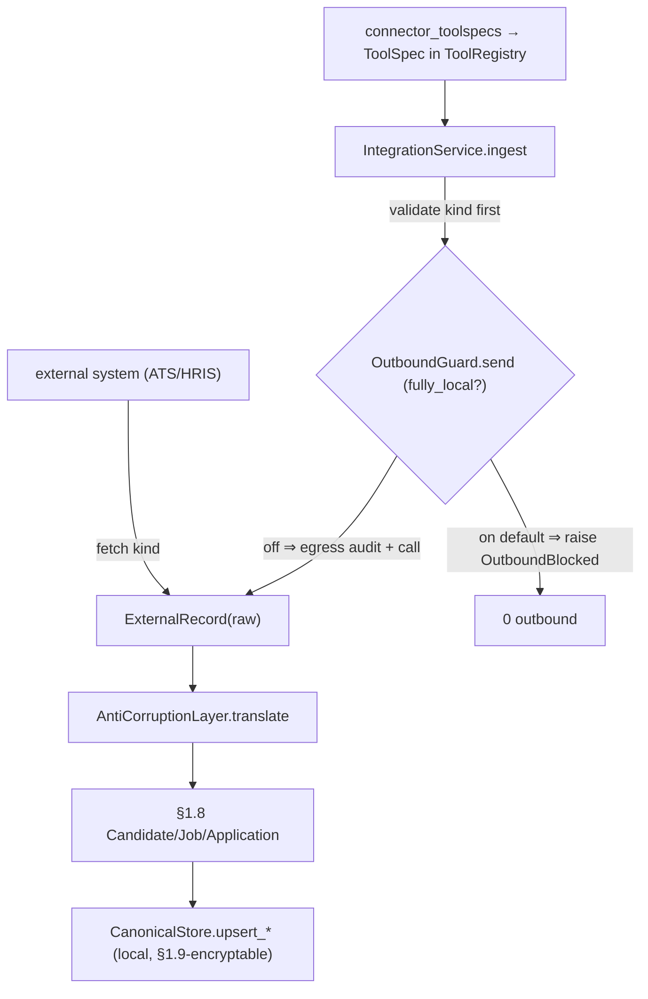

# Phase 0 §1.10 — Integration framework (connector SDK + anti-corruption + MCP skeleton + local-first switch)

> Bilingual devlog (English). 中文: `p0-1.10-integration.md`. Read this **before** the code.

## 1. What this delivers

The §1.10 integration **framework** — translate external systems (ATS/HRIS/…) into §1.8 canonical
entities, expose connector operations as MCP-shaped tools, and route every outbound call through a
default-on "fully local" switch with a per-egress audit. Phase 0 ships the framework + a **fake** read-only
ATS connector (contract-tested, no PII, no network); the **live** real-ATS connection is deferred until real
credentials **and** the §1.11 de-id pipeline exist (committed Plan §1.10 scope decision).

**Plan deliverables satisfied:** `integration/sdk` (connector + anti-corruption base), `integration/mcp`
(MCP tool-exposure skeleton), a connector + contract tests (fake), the "fully local" switch + outbound
audit. **Exit criteria met:** (1) read-only pull → anti-corruption → canonical → local store, switchable off
throughout; (2) fully-local switch on ⇒ 0 outbound (dedicated test).

## 2. Files added / changed

| Path | What it contains |
|---|---|
| `integration/sdk.py` | **NEW.** `ExternalRecord`, `Connector` (ABC, `fetch(kind)`), `AntiCorruptionLayer` (ABC, `translate` dispatch + per-kind mappers; unknown kind → `ValueError`). |
| `integration/connectors/fake_ats.py` | **NEW.** `FakeATSConnector` (fixtures, external field names ≠ canonical), `FakeATSAntiCorruption` (maps them to §1.8 entities). |
| `integration/outbound.py` | **NEW.** `OutboundGuard` (default-on `fully_local` switch; single egress chokepoint; egress audit with true outcome) + `OutboundBlocked`. |
| `integration/service.py` | **NEW.** `IntegrationService.ingest` (validate kind → guard-gated fetch → translate → §1.8 `CanonicalStore.upsert_*`) + `IngestResult`. |
| `integration/mcp.py` | **NEW.** `connector_toolspecs(...)` (connector ops → §1.1 `ToolSpec`s) + `register_connector`. |
| `agent/tests/integration/*.py` | **NEW.** 14 tests (anti-corruption, outbound guard, ingest exit-1/exit-2, MCP). |
| `site/plan/02-Production-Plan*.md` | **EDIT.** §1.10 scope decision + softened exit-1 + OAuth-deferred note (EN+中文). |

## 3. The public surface (API)

```python
# integration/sdk.py
@dataclass(frozen=True)
class ExternalRecord: source: str; kind: str; raw: dict
class Connector(ABC):            name: str;  def fetch(self, kind: str) -> list[ExternalRecord]
class AntiCorruptionLayer(ABC):  def translate(self, rec) -> Candidate|Job|Application   # dispatch by kind
                                 # subclass: _to_candidate/_to_job/_to_application(raw) -> entity

# integration/outbound.py
class OutboundBlocked(Exception): ...
class OutboundGuard:
    def __init__(self, *, fully_local: bool = True, audit: AuditStore | None = None, actor: str = "system")
    def send(self, *, target, fields: list[str], reason, deid_status="none", call: Callable[[], T]) -> T

# integration/service.py
@dataclass(frozen=True)
class IngestResult: kind: str; count: int
class IntegrationService:
    def __init__(self, store: CanonicalStore, guard: OutboundGuard)
    def ingest(self, connector: Connector, acl: AntiCorruptionLayer, kind: str) -> IngestResult

# integration/mcp.py
def connector_toolspecs(service, connector, acl, kinds: list[str]) -> list[ToolSpec]
def register_connector(registry: ToolRegistry, *toolspecs) -> None
```

## 4. Data structures & formats

- **`ExternalRecord.raw`** — an opaque external row with EXTERNAL field names; only the ACL reads it.
- **Egress audit row** (via §1.8 `AuditStore`): `actor` / `action="egress"` / `target_key=<connector>` /
  `reason="pull:<kind> fields=[<kind>] deid=none"` / `result ∈ {ok, error, rejected:fully_local}`. The field
  set + de-id status are encoded in `reason` (no `audit_log` migration this cycle).
- **Fake ATS field map** (the anti-corruption translation): `ext_id→candidate_id`, `full_name→name`,
  `skill_tags→skills`, `yrs→years`, `loc→location`; `ext_req→job_id`, `req_title→title`, `state→status`;
  `ext_app→application_id`, `ext_cand→candidate_id`, `ext_req→job_id`.

## 5. Key mechanisms / algorithms

**(a) Anti-corruption is the only translation point.** `translate` dispatches by `rec.kind`; an unknown
kind raises `ValueError` (fail closed). Consumers see only well-formed §1.8 dataclasses — an external field
rename touches only the ACL subclass.

**(b) The single outbound chokepoint + 0-outbound guarantee.** `OutboundGuard.send` is the only path an
outbound call runs; the wrapped `call` is referenced *only* at the terminal `return`, unreachable when
`fully_local`:

```python
if self.fully_local:
    if audit: audit.record(actor, "egress", target, reason=detail, result="rejected:fully_local")
    raise OutboundBlocked(...)            # call NEVER invoked → 0 outbound
try:
    result = call()
except Exception:
    if audit: audit.record(..., result="error"); raise   # true outcome on failure
if audit: audit.record(..., result="ok")
return result
```

`IntegrationService.ingest` validates `kind` **before** `guard.send`, so a bad kind never triggers an
egress; then it wraps the fetch: `guard.send(call=lambda: connector.fetch(kind))`. A tree-wide search
confirms `connector.fetch` is the only outbound site, and it sits inside that lambda.

**(c) MCP exposure via a closure factory.** `connector_toolspecs` builds one `ToolSpec` per kind with a
`make_handler(bound_kind)` factory (no Python late-binding-in-loop bug); the handler runs `ingest` and
returns a summary, catching `OutboundBlocked` → a "blocked: fully-local" string (never raises into the loop).

## 6. Design decisions & why

- **Framework + fake connector, defer the live link** — mirrors §1.1 (`ModelProvider` + `FakeProvider`
  shipped; the live `OpenAIProvider` only because an account existed). No ATS account + no §1.11 de-id ⇒ a
  live real-PII pull would violate local-first / APP 8. The fake (synthetic, network-free) proves the whole
  pipeline now; the live connector is a config/credential away later.
- **`fully_local` default True** — the safe local-first posture: 0 outbound unless an operator explicitly
  opts in. The guard, not each connector, owns the switch (single chokepoint).
- **Anti-corruption over §1.8 entities** — isolates external schema drift from the canonical model.
- **MCP-tool shape, not a transport** — connectors become `ToolSpec`s in the existing `ToolRegistry`; a live
  MCP server (JSON-RPC/stdio/SSE) is the §1.12 spike, deliberately not pre-built.
- **Egress field-set/deid in the audit `reason`** — avoids a §1.8 `audit_log` migration while there are
  zero real egresses; promote to structured columns when §1.11 wires real egress.

**Conceptual purpose in product terms:** this is the seam that lets the agent pull a candidate from a
customer's existing ATS without that ATS's schema leaking into the product (the anti-corruption layer) and
without anything leaving the machine the customer didn't approve (the fully-local switch + egress audit). It
is what makes "local-first, optional outbound, fully auditable" concrete rather than a slogan.

**What this does NOT yet show (honest):** no live external system is contacted (the connector is a fixture
fake); the egress audit logs the requested *kind*, not a per-attribute field set, and `deid_status` is a
constant `"none"` (real de-id is §1.11); `ingest` is not transactional (a mid-batch failure leaves prior
upserts — fine for synthetic fixtures, needs a batch txn for a real connector); the guard is a service-layer
convention (`Connector.fetch` is public — a real networked connector must keep its I/O reachable only via the
guard).

## 7. Seams & deferrals

- **Live real-ATS connection + OAuth** — trigger: real credentials + the §1.11 de-id pipeline.
- **Real egress de-identification** — `deid_status` is a pass-through seam (`"none"`); §1.11's `deid` sets it.
- **Live MCP server/transport** — §1.12 spike 5 (this is the transport-agnostic skeleton).
- **Bidirectional sync / multiple connectors** — Phase 1–2.
- **Structured egress audit columns + atomic batch ingest** — land with §1.11 real egress.

## 8. Tests & acceptance

14 new §1.10 tests; full suite **254 passed, 2 skipped**.

| Test | Proves | Exit |
|---|---|---|
| `test_anti_corruption` (4) | candidate/job/application external fields → §1.8 fields; unknown kind raises | — |
| `test_outbound_guard` (4) | fully-local ⇒ block + call spy 0 + `rejected:fully_local` row; switch-off ⇒ run + `ok` row; failed call ⇒ `error` row + re-raise | 2 |
| `test_ingest_pipeline` (3) | switch-off pull→translate→`CanonicalStore` (exit 1); fully-local ⇒ fetch spy 0, nothing ingested (exit 2); unknown kind raises before any egress | 1, 2 |
| `test_mcp_exposure` (3) | `ToolSpec`s register + run the ingest handler; two-kind binding; fully-local handler returns the blocked string | — |

Invariants: `agent_loop.py` git-confirmed unchanged; `core/data/governance/security/orchestration/memory`
unchanged (§1.10 is purely additive — it imports §1.8 store/audit + §1.1 tools).

## 9. Diagram



## 10. How to run / verify it yourself

```bash
cd agent
python -m pytest tests/integration -q          # 14 passed
python -m pytest -q                            # full suite: 254 passed, 2 skipped
python -c "from jobpin_agent.data.store import CanonicalStore; \
from jobpin_agent.integration.connectors.fake_ats import FakeATSConnector, FakeATSAntiCorruption; \
from jobpin_agent.integration.outbound import OutboundGuard; from jobpin_agent.integration.service import IntegrationService; \
s=CanonicalStore(':memory:'); svc=IntegrationService(s, OutboundGuard(fully_local=False, audit=s.audit)); \
print(svc.ingest(FakeATSConnector(), FakeATSAntiCorruption(), 'candidate')); print(s.get_candidate('A-1').name)"
# IngestResult(kind='candidate', count=2) ; Ada Lovelace
```

## 11. What the triple-review changed

All three reviewers (senior / architect / PM) returned **YES**, no MAJORs; the architect confirmed the Plan
is correct. Fixes applied:
- `ingest` validated `kind` **before** the egress (was a post-egress `KeyError` + a wasted outbound for a
  bad kind) → `ValueError` first, + a test.
- `OutboundGuard.send` records the **true** egress outcome (`ok`/`error` after the call) so a future
  networked failure isn't logged as `ok` + a test.
- Added an `application` fixture so the `_to_application` ACL path is exercised + a parallel 中文 docstring.
- Added a **two-kind** MCP test locking the closure factory.
- Spec example corrected (a read-only pull logs the requested kind, not a per-attribute set; structured
  columns at §1.11); Plan "(OAuth)" deliverable annotated as deferred (EN+中文).

## 12. How this sets up the next point(s)

- **§1.11 (model router / de-id / streaming)** consumes the `deid_status` seam (sets the real masking
  status before any egress) and is the trigger to (a) wire a live connector, (b) capture the real egress
  field set, and (c) consider promoting `fields`/`deid_status` to structured `audit_log` columns.
- **§1.12 spike 5** decides the live MCP server/transport on top of this transport-agnostic skeleton.
- The **app entry / composition root** wires connectors' `ToolSpec`s into the agent's `ToolRegistry` and
  sets the fully-local switch from config.
