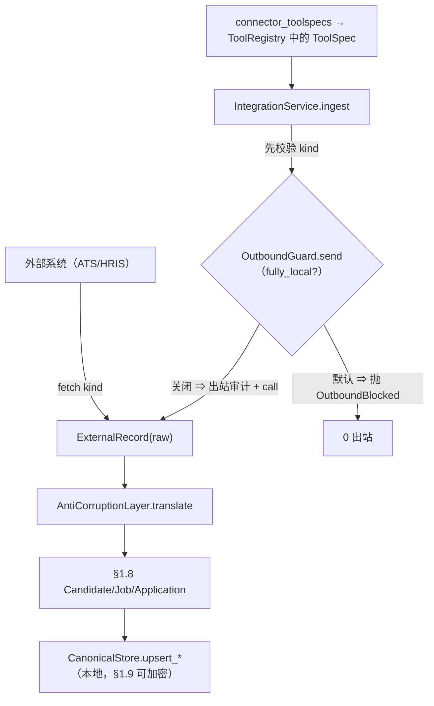

# Phase 0 §1.10 — 集成框架（连接器 SDK + 反腐层 + MCP 骨架 + 本地优先开关）

> 双语开发日志（中文）。English: `p0-1.10-integration-EN.md`。请在读代码**之前**先读本文。

## 1. 本节交付什么

§1.10 集成**框架**——把外部系统（ATS/HRIS/…）翻译为 §1.8 规范实体，将连接器操作以 MCP 形态的工具暴露，并使每次出站经过
默认开启的“完全本地”开关与逐次出站审计。Phase 0 交付框架 + 一个**伪**只读 ATS 连接器（契约测试、无 PII、无网络）；**真实**
ATS 实时连接推迟到具备真实凭据**且** §1.11 脱敏管线就绪（已提交的计划 §1.10 范围决策）。

**满足的计划交付物：** `integration/sdk`（连接器 + 反腐层基类）、`integration/mcp`（MCP 工具暴露骨架）、一个连接器 + 契约
测试（伪）、“完全本地”开关 + 出站审计。**满足的退出标准：**（1）只读拉取 → 反腐层 → 规范 → 本地库，全程可关闭；
（2）完全本地开关打开 ⇒ 0 出站（专项测试）。

## 2. 新增 / 改动的文件

| 路径 | 内容 |
|---|---|
| `integration/sdk.py` | **新增。** `ExternalRecord`、`Connector`（ABC，`fetch(kind)`）、`AntiCorruptionLayer`（ABC，`translate` 分派 + 按类映射器；未知 kind → `ValueError`）。 |
| `integration/connectors/fake_ats.py` | **新增。** `FakeATSConnector`（固定数据，外部字段名 ≠ 规范）、`FakeATSAntiCorruption`（映射到 §1.8 实体）。 |
| `integration/outbound.py` | **新增。** `OutboundGuard`（默认开启的 `fully_local` 开关；唯一出站口；按真实结果的出站审计）+ `OutboundBlocked`。 |
| `integration/service.py` | **新增。** `IntegrationService.ingest`（先校验 kind → 经守卫的 fetch → translate → §1.8 `CanonicalStore.upsert_*`）+ `IngestResult`。 |
| `integration/mcp.py` | **新增。** `connector_toolspecs(...)`（连接器操作 → §1.1 `ToolSpec`）+ `register_connector`。 |
| `agent/tests/integration/*.py` | **新增。** 14 个测试（反腐层、出站守卫、ingest 退出 1/退出 2、MCP）。 |
| `site/plan/02-Production-Plan*.md` | **改动。** §1.10 范围决策 + 软化退出 1 + OAuth 推迟注记（EN+中文）。 |

## 3. 公共接口（API）

```python
# integration/sdk.py
@dataclass(frozen=True)
class ExternalRecord: source: str; kind: str; raw: dict
class Connector(ABC):            name: str;  def fetch(self, kind: str) -> list[ExternalRecord]
class AntiCorruptionLayer(ABC):  def translate(self, rec) -> Candidate|Job|Application   # 按 kind 分派
                                 # 子类：_to_candidate/_to_job/_to_application(raw) -> 实体

# integration/outbound.py
class OutboundBlocked(Exception): ...
class OutboundGuard:
    def __init__(self, *, fully_local: bool = True, audit: AuditStore | None = None, actor: str = "system")
    def send(self, *, target, fields: list[str], reason, deid_status="none", call: Callable[[], T]) -> T

# integration/service.py
@dataclass(frozen=True)
class IngestResult: kind: str; count: int
class IntegrationService:
    def __init__(self, store: CanonicalStore, guard: OutboundGuard)
    def ingest(self, connector: Connector, acl: AntiCorruptionLayer, kind: str) -> IngestResult

# integration/mcp.py
def connector_toolspecs(service, connector, acl, kinds: list[str]) -> list[ToolSpec]
def register_connector(registry: ToolRegistry, *toolspecs) -> None
```

## 4. 数据结构与格式

- **`ExternalRecord.raw`** —— 带外部字段名的不透明外部行；仅 ACL 读取。
- **出站审计行**（经 §1.8 `AuditStore`）：`actor` / `action="egress"` / `target_key=<连接器>` /
  `reason="pull:<kind> fields=[<kind>] deid=none"` / `result ∈ {ok, error, rejected:fully_local}`。字段集 +
  脱敏状态编码进 `reason`（本周期不迁移 `audit_log`）。
- **伪 ATS 字段映射**（反腐层翻译）：`ext_id→candidate_id`、`full_name→name`、`skill_tags→skills`、`yrs→years`、
  `loc→location`；`ext_req→job_id`、`req_title→title`、`state→status`；`ext_app→application_id`、
  `ext_cand→candidate_id`、`ext_req→job_id`。

## 5. 关键机制 / 算法

**(a) 反腐层是唯一翻译点。** `translate` 按 `rec.kind` 分派；未知 kind 抛 `ValueError`（失败即关闭）。消费方只见良构的
§1.8 数据类——外部字段改名只触及 ACL 子类。

**(b) 唯一出站口 + 0 出站保证。** `OutboundGuard.send` 是出站调用运行的唯一路径；被包裹的 `call` 仅在末尾 `return`
处引用，`fully_local` 时不可达：

```python
if self.fully_local:
    if audit: audit.record(actor, "egress", target, reason=detail, result="rejected:fully_local")
    raise OutboundBlocked(...)            # call 绝不被调用 → 0 出站
try:
    result = call()
except Exception:
    if audit: audit.record(..., result="error"); raise   # 失败时记真实结果
if audit: audit.record(..., result="ok")
return result
```

`IntegrationService.ingest` 在 `guard.send` **之前**校验 `kind`，故坏 kind 绝不触发出站；随后包裹 fetch：
`guard.send(call=lambda: connector.fetch(kind))`。全树搜索确认 `connector.fetch` 是唯一出站点，且位于该 lambda 内。

**(c) 经闭包工厂的 MCP 暴露。** `connector_toolspecs` 以 `make_handler(bound_kind)` 工厂为每类构建一个 `ToolSpec`（无
Python 循环内延迟绑定 bug）；处理函数运行 `ingest` 并返回摘要，捕获 `OutboundBlocked` → “已阻断：完全本地”字符串（绝不向
循环抛错）。

## 6. 设计决策与理由

- **框架 + 伪连接器，推迟实时链路** —— 对齐 §1.1（已交付 `ModelProvider` + `FakeProvider`；仅因账号存在才有实时
  `OpenAIProvider`）。无 ATS 账号 + 无 §1.11 脱敏 ⇒ 实时真实 PII 拉取会违反本地优先 / APP 8。伪连接器（合成、无网络）现在即
  证明整条管线；实时连接日后只差配置/凭据。
- **`fully_local` 默认 True** —— 安全的本地优先姿态：除非运维显式选择启用，否则 0 出站。开关由守卫（而非每个连接器）持有
  （唯一出站口）。
- **基于 §1.8 实体的反腐层** —— 把外部 schema 漂移与规范模型隔离。
- **MCP 工具形态而非传输** —— 连接器成为既有 `ToolRegistry` 中的 `ToolSpec`；真实 MCP 服务端（JSON-RPC/stdio/SSE）是
  §1.12 spike，刻意不预建。
- **出站字段集/脱敏编码进审计 `reason`** —— 在尚无真实出站时避免 §1.8 `audit_log` 迁移；§1.11 接入真实出站时再升列。

**产品意义上的概念目的：** 这是让 agent 能从客户既有 ATS 拉取候选人、而该 ATS 的 schema 不泄漏进产品（反腐层）、且未经客户
批准的任何东西都不离开本机（完全本地开关 + 出站审计）的接缝。它使“本地优先、可选出站、全程可审计”从口号变为具体。

**本节尚未展示什么（诚实）：** 未联系任何真实外部系统（连接器是固定数据的伪实现）；出站审计记的是请求的*类型*而非逐属性字段集，
且 `deid_status` 恒为 `"none"`（真实脱敏是 §1.11）；`ingest` 非事务性（批中失败会留下先前的 upsert——对合成固定数据无碍，真实
连接器需批事务）；守卫是服务层约定（`Connector.fetch` 为公开——真实联网连接器须确保其 I/O 仅经守卫可达）。

## 7. 接缝与推迟

- **真实 ATS 实时连接 + OAuth** —— 触发：真实凭据 + §1.11 脱敏管线。
- **真实出站脱敏** —— `deid_status` 是透传接缝（`"none"`）；§1.11 的 `deid` 设置它。
- **真实 MCP 服务端/传输** —— §1.12 spike 5（本节为与传输无关的骨架）。
- **双向同步 / 多连接器** —— Phase 1–2。
- **结构化出站审计列 + 原子批量 ingest** —— 随 §1.11 真实出站落地。

## 8. 测试与验收

14 个新 §1.10 测试；全套 **254 通过，2 跳过**。

| 测试 | 证明 | 退出 |
|---|---|---|
| `test_anti_corruption`（4） | 候选人/职位/申请外部字段 → §1.8 字段；未知 kind 抛错 | — |
| `test_outbound_guard`（4） | 完全本地 ⇒ 阻断 + call spy 0 + `rejected:fully_local` 行；关闭 ⇒ 运行 + `ok` 行；失败调用 ⇒ `error` 行 + 重抛 | 2 |
| `test_ingest_pipeline`（3） | 关闭时拉取→翻译→`CanonicalStore`（退出 1）；完全本地 ⇒ fetch spy 0、无入库（退出 2）；未知 kind 在任何出站前抛错 | 1, 2 |
| `test_mcp_exposure`（3） | `ToolSpec` 注册 + 运行 ingest 处理函数；两类绑定；完全本地处理函数返回阻断字符串 | — |

不变量：`agent_loop.py` 经 git 确认未改；`core/data/governance/security/orchestration/memory` 未改（§1.10 纯增量——
仅导入 §1.8 store/audit + §1.1 tools）。

## 9. 图示



## 10. 如何自行运行 / 验证

```bash
cd agent
python -m pytest tests/integration -q          # 14 通过
python -m pytest -q                            # 全套：254 通过，2 跳过
python -c "from jobpin_agent.data.store import CanonicalStore; \
from jobpin_agent.integration.connectors.fake_ats import FakeATSConnector, FakeATSAntiCorruption; \
from jobpin_agent.integration.outbound import OutboundGuard; from jobpin_agent.integration.service import IntegrationService; \
s=CanonicalStore(':memory:'); svc=IntegrationService(s, OutboundGuard(fully_local=False, audit=s.audit)); \
print(svc.ingest(FakeATSConnector(), FakeATSAntiCorruption(), 'candidate')); print(s.get_candidate('A-1').name)"
# IngestResult(kind='candidate', count=2) ; Ada Lovelace
```

## 11. 三方评审改动了什么

三位评审者（高级 / 架构师 / PM）均返回 **YES**、无 MAJOR；架构师确认计划正确。应用的修复：
- `ingest` 在出站**之前**校验 `kind`（原为出站后的 `KeyError` + 坏 kind 的无谓出站）→ 先抛 `ValueError`，+ 一个测试。
- `OutboundGuard.send` 记录**真实**出站结果（调用后 `ok`/`error`），使未来联网失败不被记为 `ok`，+ 一个测试。
- 新增 `application` 固定数据使 `_to_application` ACL 路径被演练 + 一段并行中文 docstring。
- 新增**两类** MCP 测试锁定闭包工厂。
- 更正规范示例（只读拉取记请求类型而非逐属性集；结构化列于 §1.11）；计划 “(OAuth)” 交付物标注为推迟（EN+中文）。

## 12. 如何为后续节点铺路

- **§1.11（模型路由 / 脱敏 / 流式）** 消费 `deid_status` 接缝（在任何出站前设置真实脱敏状态），并是触发条件以
  （a）接入实时连接器、（b）捕获真实出站字段集、（c）考虑把 `fields`/`deid_status` 升为结构化 `audit_log` 列。
- **§1.12 spike 5** 在此与传输无关的骨架之上决定真实 MCP 服务端/传输。
- **应用入口 / 组合根** 把连接器的 `ToolSpec` 接入 agent 的 `ToolRegistry`，并据配置设置完全本地开关。
