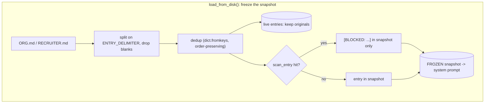
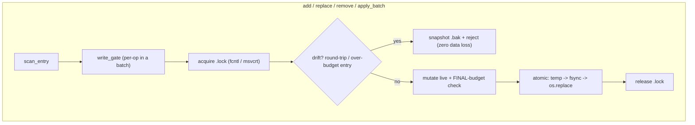

# Devlog · Phase 0 §1.2 — file-backed `MemoryStore` (the first real code port)

> How we ported Hermes's curated memory store, and why. Part of the build journal. Pairs with the
> spec (`docs/superpowers/specs/2026-06-27-p0-1.2-memory-store-design.md`) and plan
> (`docs/superpowers/plans/2026-06-28-p0-1.2-memory-store.md`). Source: `agent/src/jobpin_agent/memory/`.

## What this step delivers

A **standalone, bounded, file-backed curated memory store** — the low-volume, hand-curated,
strongly-consistent layer of the Memory Subsystem (PRD §9.3). It carries two targets:
- **`org`** (`ORG.md`) — hiring standards, rubrics, policy (the moat).
- **`recruiter`** (`RECRUITER.md`) — a recruiter's preferences / a manager's "bar".

This is the **first real code port** from Hermes (§1.1 was a rewrite). We ported
`tools/memory_tool.py::MemoryStore` and kept its algorithms **byte-for-byte faithful**; the only
changes are HR-domain naming and an injected threat-scan seam. After §1.2 the chat agent still won't
visibly "remember" — wiring memory into the loop is §1.3.

## The two-state model (the heart of it)

Each target holds two parallel states:
- a **FROZEN snapshot** — built once at `load_from_disk()`, injected into the system prompt, and
  **never changed mid-session** (so the prompt prefix stays cacheable — Key Invariant #1);
- a **LIVE entry list** — mutated by `add`/`replace`/`remove`/`apply_batch` and persisted atomically.

*Load path — freeze the snapshot (runs once, at `load_from_disk()`):*



*Write path — mutate the live list, then persist atomically (every `add`/`replace`/`remove`/`apply_batch`):*



## Ported mechanisms (unchanged from Hermes)

- **`ENTRY_DELIMITER = "\n§\n"`** + a **fixed char budget** per target (forces a high signal-to-noise
  ratio; unbounded growth would kill the snapshot's prefix-cache benefit).
- **Dedup** on load (`dict.fromkeys`, order-preserving).
- **Atomic write**: temp file → `fsync` → `os.replace`, under an exclusive lock on a **separate
  `.lock`** file — a reader never sees a half-written file.
- **Unique-substring** add/replace/remove; a substring matching ≥2 *distinct* entries errors ("be
  more specific") rather than guessing.
- **`apply_batch`** all-or-nothing, validated against the **final** budget (frees space + adds in one
  call; transient mid-step overflow is fine).
- **Drift detection**: if the on-disk file won't round-trip, or holds a single entry over the whole
  budget (a manual edit / shell append / concurrent write), snapshot a `.bak` and **reject** the
  write — never silently lose data.
- **Lean success response**: success does NOT echo all entries (an empirical anti-churn design).

## What changed vs Hermes (and why)

| Change | Why |
|---|---|
| targets `memory→org` / `user→recruiter`; files `ORG.md` / `RECRUITER.md` | HR domain |
| scan is an injected `scan_entry: str→str|None` (default pass-through) | the real `threat_patterns` is a **§1.6** dependency; the `[BLOCKED:]` *mechanism* is proven now with a stand-in scanner |
| `memory_dir` is a constructor arg (no global) | testable, local-first |
| `os.replace` instead of Hermes's `atomic_replace` | the temp file is in the target's own dir, so the EXDEV/symlink fallbacks don't apply — atomicity preserved |
| budgets recalibrated (org 6000 / recruiter 2000) | Org carries more; still bounded |
| governance header (provenance/consent/retention) | deferred to **§1.5**; entries stay opaque so a header can be prefixed later without breaking the delimiter |

The port is recorded in `agent/THIRD_PARTY_NOTICES.md` as **"Port"** (the first one), with the MIT
copyright retained, and reviewed in `docs/security/p0-1.2-memory-store-port-review.md`.

## What the triple-review changed

Three reviewers (senior engineer / architect / PM) checked it against the Plan. The senior engineer's
method-by-method diff confirmed the port is **faithful** (no re-implementation drift). Changes made:
1. **Per-op write gate (architect Major / senior Minor).** My `apply_batch` called the optional
   write-gate once with `content=None`, so §1.5's consent gate couldn't inspect each op. Fixed to fire
   **per add/replace op** inside the batch (mirroring the per-op scan), so consent is enforceable on
   the batch path.
2. **Plan wording (all three).** Per "fix the Plan first": "two named *instances*" → "two targets in
   one store"; "Load scans `threat_patterns`" → "via the scan seam (real patterns §1.6)"; governance
   header "this phase" → "deferred to §1.5"; and the lock exit-criterion now states the path is
   exercised per-OS (true two-process / cross-OS = CI).
3. **Coverage (senior Minor).** Added tests: a recruiter-target mirror, snapshot stability across a
   mid-session write, round-trip-mismatch drift (signal #1), and the per-op batch gate.

**Honest coverage caveat:** the unit suite exercises the lock *path* on the host OS (msvcrt on
Windows here) and "no truncation" via the atomic round-trip; true two-process concurrency and the
POSIX `fcntl` path are CI/integration concerns, not unit tests.

## Run it yourself

```bash
cd agent
python -m pytest -q                  # 47 passed, 1 skipped (OpenAI integration; opt-in)
python examples/memory_inspect.py    # add Org/Recruiter entries -> show the frozen snapshot; drift rejected
```

## How this sets up §1.3

§1.3 ports the `MemoryProvider` + `MemoryManager` orchestration. It wires this store into the agent
loop **through the §1.1 seam, with no change to `agent_loop.py`**: `format_for_system_prompt()` fills
the frozen `memory_snapshot` slot, and a real `prefetch()` returns fenced recall. The architect
confirmed the real §1.6 scanner (`first_threat_message(t, scope="strict")`) matches our
`scan_entry` seam exactly — so §1.6 plugs in unchanged too.
