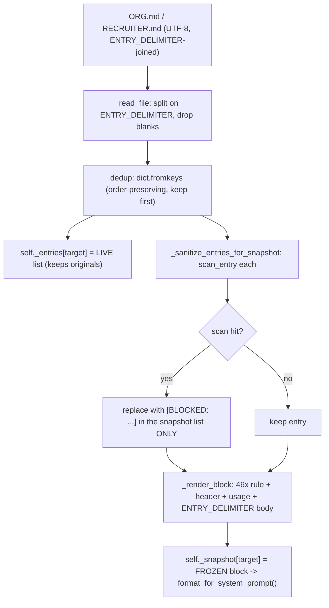
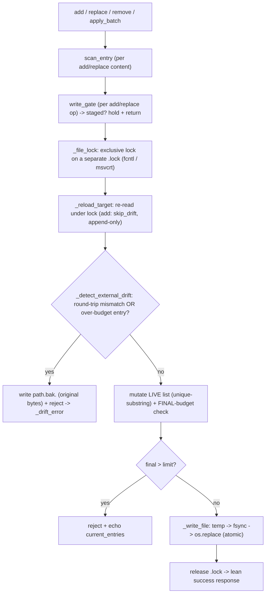

# Devlog · Phase 0 §1.2 — the file-backed `MemoryStore` (the first real code port from Hermes)

> The curated, small-volume, strongly-consistent memory layer (PRD §9.3) — **ported byte-for-byte**
> from Hermes, standalone, stdlib-only, offline, with the agent loop untouched (wiring is §1.3).
> Spec: `docs/superpowers/specs/2026-06-27-p0-1.2-memory-store-design.md`; plan:
> `…/plans/2026-06-28-p0-1.2-memory-store.md`. Source: `agent/src/jobpin_agent/memory/store.py`.

## 1. What this delivers

The Memory Subsystem's **first layer** and the project's **first real code port** (§1.1 was a
design-derived rewrite). §1.2 ports Hermes `tools/memory_tool.py::MemoryStore` as a **bounded,
file-persisted, cross-session-stable curated store** carrying two targets:

- **`org`** (`ORG.md`) — organisational hiring standards, rubrics, policy (the moat; ≈ Hermes `MEMORY.md`).
- **`recruiter`** (`RECRUITER.md`) — a recruiter's preferences / a hiring manager's "bar" (≈ Hermes `USER.md`).

It maintains **two parallel states per target**: a **FROZEN snapshot** that enters the system prompt
and never changes mid-session (so the prompt prefix stays cacheable — Plan §1.0 Key Invariant #1), and
a **LIVE entry list** mutated by `add`/`replace`/`remove`/`apply_batch` and persisted atomically.
Satisfies Plan §1.2 deliverables: **`memory/store`** (two states, fixed length, atomic write, file
lock, drift detection, batch atomicity, write gate — per-method docstrings noting the port origin);
**two targets in one store** (`org`/`recruiter` with budget config); the **acceptance-matrix unit
suite**; and a **security-review record** (MIT code is "as-is", so a ported file gets its own review).
After §1.2 the chat agent still won't visibly "remember" — attaching memory to the loop is §1.3.

## 2. Files added/changed

| Path | What it contains |
|---|---|
| `memory/__init__.py` | package marker + bilingual module doc |
| `memory/store.py` | **`MemoryStore`** + `ENTRY_DELIMITER` + `ScanEntry`/`WriteGate` types + `_FILENAMES` + `_no_scan` + `_drift_error` + helpers (`_file_lock`, `_read_file`, `_write_file`, `_detect_external_drift`, `_render_block`, `_sanitize_entries_for_snapshot`, `_reload_target`, `_char_count`, `_char_limit`, `_gate`, `_success_response`, `_batch_error`) + `load_org_recruiter_store` factory |
| `memory/README.md` | bilingual folder guide |
| `tests/test_memory_store.py` | the acceptance suite (**18 tests**) |
| `examples/memory_inspect.py` | offline inspect demo (`run_inspect()`) |
| `THIRD_PARTY_NOTICES.md` | adds the §1.2 **Port** provenance row (MIT copyright retained) |
| `docs/security/p0-1.2-memory-store-port-review.md` (+ `docs/security/README.md`) | the port security review |

## 3. The public surface (API)

```python
# store.py — module constants / seam types
ENTRY_DELIMITER = "\n§\n"                                   # the only permitted use of § (entry separator)
ScanEntry = Callable[[str], Optional[str]]                  # threat scan: a description if dangerous, else None
WriteGate = Callable[[str, str, Optional[str]], Optional[str]]  # (action, target, content) -> held message or None
_FILENAMES = {"org": "ORG.md", "recruiter": "RECRUITER.md"}    # target -> on-disk filename

class MemoryStore:
    def __init__(self, memory_dir, org_char_limit: int = 6000, recruiter_char_limit: int = 2000,
                 scan_entry: Optional[ScanEntry] = None, write_gate: Optional[WriteGate] = None) -> None
    def load_from_disk(self) -> None                        # read -> split -> dedup -> scan -> FREEZE snapshot
    def add(self, target, content) -> Dict[str, Any]        # append (scan -> gate -> dedup -> budget)
    def replace(self, target, old_text, new_content) -> Dict[str, Any]   # unique-substring replace
    def remove(self, target, old_text) -> Dict[str, Any]    # unique-substring remove
    def apply_batch(self, target, operations: List[Dict]) -> Dict[str, Any]   # all-or-nothing, FINAL budget
    def format_for_system_prompt(self, target) -> Optional[str]   # the FROZEN snapshot block, or None if empty
    def save_to_disk(self, target) -> None                  # atomic temp -> fsync -> os.replace

# factory
load_org_recruiter_store(memory_dir, scan_entry=None, write_gate=None) -> MemoryStore   # constructs + load_from_disk()
# target ∈ {"org", "recruiter"}
```

## 4. Data structures & formats

- **Two-state model** (per target, both dict-keyed by target):
  - `self._entries: Dict[str, List[str]]` — the **LIVE** entry list; what `add`/`replace`/`remove`/`apply_batch` mutate and `save_to_disk` persists; tool responses reflect it.
  - `self._snapshot: Dict[str, str]` — the **FROZEN** rendered block, set once at `load_from_disk()` and never mutated mid-session; `format_for_system_prompt()` returns it (Key Invariant #1).
  - `self._limits: Dict[str, int]` — the per-target char budget.
- **`ENTRY_DELIMITER = "\n§\n"`** — a section-sign on its own line separates entries on disk and when measuring budget (`len(ENTRY_DELIMITER.join(entries))`).
- **Char budgets** — defaults **org 6000 / recruiter 2000** (recalibrated up from Hermes 2200/1375; still bounded — the fixed-length / high-SNR principle is preserved). Tests run a small 200/120 to exercise overflow cheaply.
- **On-disk file format** (`ORG.md` / `RECRUITER.md`) — plain UTF-8; the live entries joined by `ENTRY_DELIMITER`, **no header on disk** (the header lives only in the rendered snapshot, so entries stay opaque text and a §1.5 governance header can be prefixed later without breaking the split). An absent/blank file parses to `[]`.
- **Rendered snapshot block** (`_render_block`, what enters the system prompt) — a 46-char `═` rule, a header with live usage, another rule, then the `§`-joined body:
  ```
  ══════════════════════════════════════════════
  ORG MEMORY (hiring standards, rubrics, policy) [42% — 2,520/6,000 chars]
  ══════════════════════════════════════════════
  <entry 1>
  §
  <entry 2>
  ```
  The recruiter header is `RECRUITER PROFILE (preferences, the hiring bar) [..% — current/limit chars]`. Empty entries → `""` → `format_for_system_prompt` returns `None`.
- **Success response** (`_success_response`, lean — terminal):
  ```python
  {"success": True, "done": True, "target": target,
   "usage": f"{pct}% — {current:,}/{limit:,} chars", "entry_count": len(entries),
   "message": <optional>, "note": "Write saved. This update is complete — do not repeat it."}
  ```
  Deliberately **no `current_entries`** echo (anti-churn — see §5).
- **Error responses** (verbatim shapes) — `{"success": False, "error": …}` plus, by path:
  - over-budget (add/replace/batch): `+ "current_entries": list(entries), "usage": f"{current:,}/{limit:,}"`;
  - ambiguous match: `+ "matches": [<=80-char previews]`;
  - gate-held: `{"success": False, "staged": True, "message": held}`;
  - drift: `{"success": False, "error": …, "drift_backup": bak_path, "remediation": …}`.

## 5. Key mechanisms (with the actual code)

**Load = split → dedup → scan → freeze** (`load_from_disk`) — deterministic from disk bytes, so the snapshot is identical for the whole session:
```python
for target in ("org", "recruiter"):
    entries = list(dict.fromkeys(self._read_file(self._path_for(target))))  # split on ENTRY_DELIMITER + dedup (keep first)
    self._entries[target] = entries                                          # LIVE keeps originals
    sanitized = self._sanitize_entries_for_snapshot(entries, _FILENAMES[target])
    self._snapshot[target] = self._render_block(target, sanitized)           # FROZEN block -> system prompt
```

**Atomic write under a separate `.lock`** (`_write_file` + `_file_lock`) — a reader sees the complete old or new file, never a truncated one; locking a *separate* `.lock` keeps the data file itself replaceable:
```python
# _write_file
content = ENTRY_DELIMITER.join(entries) if entries else ""
fd, tmp_path = tempfile.mkstemp(dir=str(path.parent), suffix=".tmp", prefix=".mem_")
with os.fdopen(fd, "w", encoding="utf-8") as f:
    f.write(content); f.flush(); os.fsync(f.fileno())
os.replace(tmp_path, path)                       # atomic on one filesystem
# _file_lock (cross-platform)
lock_path = path.with_suffix(path.suffix + ".lock")
fd = open(lock_path, "a+", encoding="utf-8")
if fcntl:  fcntl.flock(fd, fcntl.LOCK_EX)        # POSIX
else:      fd.seek(0); msvcrt.locking(fd.fileno(), msvcrt.LK_LOCK, 1)   # Windows
yield                                             # ... unlock + close in finally
```

**Unique-substring add / replace / remove** — match by short substring (not full text, not ID); ≥2 *distinct* matches errors rather than guessing; identical duplicates operate on the first:
```python
matches = [(i, e) for i, e in enumerate(entries) if old_text in e]
if not matches:
    return {"success": False, "error": f"No entry matched '{old_text}'."}
if len(matches) > 1 and len({e for _, e in matches}) > 1:                 # ≥2 DISTINCT entries
    previews = [e[:80] + ("..." if len(e) > 80 else "") for _, e in matches]
    return {"success": False, "error": f"Multiple entries matched '{old_text}'. Be more specific.", "matches": previews}
idx = matches[0][0]                                                       # identical dups -> first
```

**`apply_batch` all-or-nothing against the FINAL budget** — validate every op on a working copy; intermediate overflow is fine (free space then add in one call); duplicate adds are idempotently skipped; commit only if all pass:
```python
working = list(self._entries[target])
for i, op in enumerate(operations):
    ...                                          # add: dup -> `continue`; replace/remove: unique-substring on `working`
new_total = len(ENTRY_DELIMITER.join(working)) if working else 0
if new_total > limit:                            # ONLY the final size is budget-checked
    return {"success": False, "error": "After applying all … operations …over the limit…",
            "current_entries": list(self._entries[target]), "usage": f"{current:,}/{limit:,}"}   # nothing written
self._entries[target] = working
self.save_to_disk(target)                        # commit
```

**Drift detection → `.bak` + reject** (`_detect_external_drift`) — two signals catch a manual edit / shell append / concurrent write; on either, snapshot the original bytes and refuse, so no data is silently lost:
```python
parsed = [e.strip() for e in raw.split(ENTRY_DELIMITER) if e.strip()]
roundtrip = ENTRY_DELIMITER.join(parsed)
max_entry_len = max((len(e) for e in parsed), default=0)
if (raw.strip() != roundtrip) or (max_entry_len > limit):                # (1) won't round-trip  (2) over-budget giant entry
    bak_path = path.with_suffix(path.suffix + f".bak.{ts}")
    bak_path.write_text(raw, encoding="utf-8")                           # snapshot ORIGINAL on-disk bytes
    return str(bak_path)                                                 # -> _drift_error -> caller refuses the write
```
`replace`/`remove`/`apply_batch` run this on reload; **`add` passes `skip_drift=True`** because an append never clobbers existing content.

**Lean success response (anti-churn)** — success does **not** echo the entries; echoing invites the model to "find more to fix" and re-issue ops, so entries appear only on error paths:
```python
resp = {"success": True, "done": True, "target": target,
        "usage": f"{pct}% — {current:,}/{limit:,} chars", "entry_count": len(entries)}
resp["note"] = "Write saved. This update is complete — do not repeat it."   # NO current_entries here
```

**Injected `scan_entry` → `[BLOCKED:]` in the snapshot only** (`_sanitize_entries_for_snapshot`) — a poisoned on-disk entry is removed from the system prompt while the live state keeps the original for human review/removal:
```python
desc = self._scan(entry)
if desc:
    sanitized.append(f"[BLOCKED: {filename} entry contained threat pattern(s): {desc}. "
                     f"Removed from system prompt; use remove() to delete the original.]")
else:
    sanitized.append(entry)
# only the snapshot list is sanitised; self._entries[target] retains the original entry
```

## 6. Design decisions & why

- **Port faithfully, adapt minimally.** Dedup, fixed-length budget, atomic write, `.lock`, drift detection, and `apply_batch` are the parts most expensive to build in-house and easiest to get subtly wrong — so they are copied **verbatim** from the reviewed Hermes source and owned thereafter (PRD §2.7). A method-by-method port (not a re-implementation) is the explicit risk control in spec §9.
- **Injected dir, no global.** Hermes reads `HERMES_HOME`; we take `memory_dir` as a constructor arg — testable (tmp dirs), local-first, no hidden global state.
- **The scan is a seam, not a no-op pretending to be a control.** §1.2 proves the `[BLOCKED:]` *mechanism* with a stand-in scanner; the default `scan_entry` is documented safe-by-omission (does not block), and the security review tracks "real blocking depends on §1.6" as an open-by-design item.
- **Entries stay opaque text.** The §1.5 governance header (provenance/consent/retention) is deferred; keeping entries header-free now means a header can be prefixed *inside* an entry later without breaking `ENTRY_DELIMITER` splitting.
- **Budgets recalibrated, still bounded.** Org carries more (standards/rubrics) so its budget is raised to 6000, but the bound is kept — unbounded growth would destroy the frozen snapshot's prefix-cache benefit.

**What changed vs Hermes** (port grounded in real symbols — `tools/memory_tool.py`: `ENTRY_DELIMITER` line 59, `_system_prompt_snapshot` lines 130/166, `apply_batch` from 449, `_detect_external_drift` from 647):

| Aspect | Hermes (`tools/memory_tool.py::MemoryStore`) | Jobpin `memory/store.py` | Kept / adapted |
|---|---|---|---|
| dedup / delimiter / fixed-length budget | `dict.fromkeys`, `ENTRY_DELIMITER = "\n§\n"`, final-size check | identical | **kept byte-for-byte** |
| atomic write + lock | temp → `fsync` → atomic replace, exclusive `.lock` (fcntl/msvcrt) | identical algorithm | **kept byte-for-byte** |
| unique-substring match; `apply_batch` all-or-nothing; drift `.bak`+reject; lean success; `[BLOCKED:]` mechanism | as upstream | as upstream | **kept byte-for-byte** |
| targets / files | `memory`/`user`; `MEMORY.md`/`USER.md` | `org`/`recruiter`; `ORG.md`/`RECRUITER.md` | adapted (HR domain) |
| memory dir | `get_memory_dir()` (`HERMES_HOME` global) | `memory_dir` constructor arg | adapted (no global) |
| threat scan | `_scan_memory_content` / `scan_for_threats` (`threat_patterns`) | injected `scan_entry` (default `_no_scan`); real patterns → §1.6 | adapted (seam) |
| atomic primitive | `atomic_replace(tmp, path)` (EXDEV/symlink fallbacks) | `os.replace(tmp, path)` — temp in the target's own dir, fallbacks N/A | adapted (inline stdlib) |
| render headers | "MEMORY" / "USER PROFILE" | "ORG MEMORY" / "RECRUITER PROFILE" | adapted (HR labels) |
| budgets | 2200 / 1375 | 6000 / 2000 (still bounded) | adapted (recalibrated) |
| entrypoint | `load_on_disk_store()` / `memory_tool()` | `load_org_recruiter_store()` factory | adapted (no tool entrypoint yet) |
| governance header | — | deferred → §1.5 (entries stay opaque) | adapted (deferral) |
| write gate | — | optional `write_gate` seam (default pass-through) | **new (§1.2 seam)** |

The port is recorded in `agent/THIRD_PARTY_NOTICES.md` as the first **Port** row (MIT copyright + licence retained) and cleared in `docs/security/p0-1.2-memory-store-port-review.md`.

## 7. Seams & deferrals

| Seam (signature) | §1.2 default | Real impl |
|---|---|---|
| `scan_entry(text) -> str?` | `_no_scan` (pass-through; `[BLOCKED:]` mechanism proven with a stand-in) | **§1.6** `threat_patterns` (`first_threat_message(t, scope="strict")`) |
| `write_gate(action, target, content) -> str?` | `None` (pass-through) | **§1.5** consent / approval gate (fires per add/replace op) |
| in-entry governance header (provenance/consent/retention) | none — entries stay opaque text | **§1.5** machine-parseable header prefixed inside the entry |
| agent-loop wiring (`format_for_system_prompt` → snapshot slot; `prefetch()` → fenced recall) | not wired — standalone store | **§1.3** `MemoryProvider` + `MemoryManager`, no `agent_loop.py` change |
| large-volume retrieval (candidates / KB) | out of scope (curated layer only) | **§1.4** vector store + entity providers |

## 8. Tests & acceptance (18 passed in `test_memory_store.py`; 47 passed, 1 skipped across `agent/` when §1.2 landed)

| Test | What it proves |
|---|---|
| `test_add_then_format_reflects_after_reload` | a persisted add appears in the FROZEN snapshot only **after reload**; an empty recruiter target → `format_for_system_prompt` returns `None` |
| `test_add_rejects_empty_and_dedupes` | blank content → error; an exact-duplicate add is skipped ("Entry already exists") |
| `test_lean_success_response_does_not_echo_entries` | a successful add omits `current_entries`; `entry_count` reflects the add (anti-churn) |
| `test_fixed_length_overflow_rejects_and_echoes_entries` | a second 150-char add over org's 200 budget → reject **and** echo `current_entries` |
| `test_replace_ambiguous_distinct_matches_errors` | a substring matching ≥2 **distinct** entries → ambiguous error with `matches`, **no deletion** |
| `test_replace_single_match_succeeds` | a file with an identical duplicate dedupes on load; a unique substring replaces in place |
| `test_remove_matches_and_missing` | remove a matching entry → success; a non-matching substring → error |
| `test_apply_batch_all_or_nothing_final_budget` | a batch whose **final** result is over budget writes **nothing** (disk unchanged) |
| `test_apply_batch_transient_overbudget_ok_and_idempotent_add` | transient mid-step overflow is fine if the final state fits; a duplicate add is idempotently skipped |
| `test_drift_detection_backs_up_and_rejects` | drift signal #2 (a 500-char single entry over the 200 limit) → reject + `.bak` holding the original bytes |
| `test_injected_entry_blocked_in_snapshot_only` | a scanner-flagged entry → `[BLOCKED:]` in the snapshot, **original retained in live** state |
| `test_scanned_content_rejected_on_add` | an add whose content the scanner flags is rejected on the write path |
| `test_write_gate_holds_write_when_it_returns_message` | a write gate returning a message → `staged` response, nothing persisted |
| `test_lock_path_executes_on_this_platform` | `_file_lock` runs on the host OS (msvcrt on Windows here); two sequential adds both land in order |
| `test_recruiter_target_add_budget_and_header` | the recruiter target works end-to-end with its own budget + `RECRUITER PROFILE` header; over-budget rejected |
| `test_live_snapshot_stable_across_midsession_write` | a mid-session add does **not** change the FROZEN snapshot (Key Invariant #1) |
| `test_drift_roundtrip_mismatch_signal_one` | drift signal #1: a file that won't round-trip (`a §§ b`, empty middle entry) → reject + `.bak` |
| `test_apply_batch_write_gate_holds_per_op` | the write gate fires **per add/replace op** inside a batch (for §1.5 consent); batch staged, nothing written |

**Maps to the Plan §1.2 acceptance matrix:** atomic write / no truncation → the `os.replace` round-trip exercised by every reload-based test; file-lock (Windows `msvcrt` / POSIX `fcntl`) → `test_lock_path_executes_on_this_platform` (the *path* on the host OS; true two-process/cross-OS = CI); drift → `.bak` + reject → `test_drift_detection_…` (signal #2) + `test_drift_roundtrip_mismatch_signal_one` (signal #1); `apply_batch` all-or-nothing → `test_apply_batch_all_or_nothing_final_budget` (+ transient-OK/idempotent); replace ambiguous-match → `test_replace_ambiguous_distinct_matches_errors` (+ identical-dup-first `test_replace_single_match_succeeds`); fixed-length overflow echo → `test_fixed_length_overflow_…` (+ recruiter budget); injected entry → `[BLOCKED:]` on load → `test_injected_entry_blocked_in_snapshot_only` (+ add-path `test_scanned_content_rejected_on_add`); add idempotency → `test_apply_batch_transient_…`; lean success → `test_lean_success_response_…`. The frozen-snapshot Exit Criterion is held by `test_live_snapshot_stable_across_midsession_write` + `test_add_then_format_reflects_after_reload`.

## 9. How it wires together

*Load path — runs once at `load_from_disk()`; freezes the snapshot:*



*Write path — every `add` / `replace` / `remove` / `apply_batch`; mutate the live list, persist atomically:*



## 10. Run it yourself

```bash
cd agent
python -m pytest -q tests/test_memory_store.py   # 18 passed
python -m pytest -q                              # 47 passed, 1 skipped (OpenAI integration; opt-in) when §1.2 landed
python examples/memory_inspect.py                # add Org/Recruiter entries -> show the frozen snapshot; drift rejected
```
`memory_inspect.py` returns `{"org_entries", "org_snapshot", "recruiter_present": true, "drift_rejected": true}` — it adds two Org standards + one Recruiter preference, reloads to print the frozen `ORG MEMORY` block, then appends over-budget bytes straight to `ORG.md` and shows the next `replace` is refused with a `.bak`.

## 11. What the triple-review changed

Three reviewers (senior engineer / architect / PM) checked it against the Plan. The senior engineer's method-by-method diff confirmed the port is **faithful** (no re-implementation drift). Changes made:

1. **Per-op write gate (architect Major / senior Minor).** `apply_batch` had called the optional write gate once with `content=None`, so §1.5's consent gate could not inspect each entry. Fixed to fire **per add/replace op** inside the batch (mirroring the per-op scan) — otherwise consent is unenforceable on the batch write path. Covered by `test_apply_batch_write_gate_holds_per_op`.
2. **Plan wording fixed first (all three; per "fix the Plan before diverging").** "two named *instances*" → "two targets in **one** store"; "Load scans `threat_patterns`" → "via the injected scan seam (real patterns §1.6)"; the governance header "this phase" → "deferred to §1.5"; and the lock Exit Criterion reworded to "the lock *path* is exercised on the host OS … true two-process / cross-OS = CI".
3. **Coverage (senior Minor).** Added tests: a recruiter-target mirror (`test_recruiter_target_add_budget_and_header`), snapshot stability across a mid-session write (`test_live_snapshot_stable_across_midsession_write`), round-trip-mismatch drift signal #1 (`test_drift_roundtrip_mismatch_signal_one`), and the per-op batch gate.

**Honest coverage caveat (recorded in the security review):** the unit suite exercises the lock *path* on the host OS (msvcrt on Windows here) and "no truncation" via the atomic round-trip; true two-process concurrency and the POSIX `fcntl` branch are CI/integration concerns, not unit tests. The single open-by-design item is that real injection blocking depends on the §1.6 scanner.

## 12. How this sets up §1.3

§1.3 ports `MemoryProvider` + `MemoryManager` and attaches this store to the agent loop **through the §1.1 seam, with no change to `agent_loop.py`**: `format_for_system_prompt()` fills the frozen `memory_snapshot` slot, and a real `prefetch()` returns fenced `<memory-context>` recall. The two seams left open here plug in unchanged later — the architect confirmed the real §1.6 scanner (`first_threat_message(t, scope="strict")`) matches the `scan_entry` signature exactly, and §1.5's consent gate matches the now-per-op `write_gate`.
