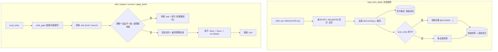

# 开发日志 · Phase 0 §1.2 — 文件型 `MemoryStore`（首个真实代码移植）

> 我们如何移植 Hermes 的策展记忆存储，以及为什么。属于构建日志。配套规格
> （`docs/superpowers/specs/2026-06-27-p0-1.2-memory-store-design.md`）与计划
> （`docs/superpowers/plans/2026-06-28-p0-1.2-memory-store.md`）。源码：`agent/src/jobpin_agent/memory/`。

## 本步骤交付什么

一个**独立、有界、文件型的策展记忆存储**——记忆子系统（PRD §9.3）中低频、人工精编、强一致的层。它承载两个目标：
- **`org`**（`ORG.md`）——招聘标准、评分细则、政策（护城河）。
- **`recruiter`**（`RECRUITER.md`）——招聘官偏好 / 用人经理的“标尺”。

这是来自 Hermes 的**首个真实代码移植**（§1.1 是重写）。我们移植了 `tools/memory_tool.py::MemoryStore`，并保持其
算法**逐字节忠实**；唯一改动是 HR 领域命名与一个注入式威胁扫描接缝。§1.2 之后聊天 agent 仍不会可见地“记住”——把
记忆接入循环是 §1.3。

## 两态模型（核心所在）

每个目标维护两个并行状态：
- **冻结快照**——在 `load_from_disk()` 时构建一次、注入系统提示，且**会话中不变**（使提示前缀可缓存——关键不变量 #1）；
- **实时条目列表**——由 `add`/`replace`/`remove`/`apply_batch` 改动并原子落盘。



## 移植的机制（与 Hermes 一致）

- **`ENTRY_DELIMITER = "\n§\n"`** + 每目标**定长字符预算**（强制高信噪比；无界增长会毁掉快照的前缀缓存收益）。
- 加载时**去重**（`dict.fromkeys`，保序）。
- **原子写**：临时文件 → `fsync` → `os.replace`，在**独立 `.lock`** 文件的排他锁下进行——读者绝不见半截文件。
- **唯一子串** add/replace/remove；子串匹配 ≥2 个*不同*条目则报错（“be more specific”）而非臆测。
- **`apply_batch`** 全有或全无，对**最终**预算校验（一次调用内先腾挪再新增；中间瞬时超额无妨）。
- **漂移检测**：若磁盘文件无法往返，或含超过整库预算的单条（手改 / shell 追加 / 并发写）→ 快照 `.bak` 并**拒写**——
  绝不静默丢数据。
- **精简成功响应**：成功不回显全部条目（经验性反抖动设计）。

## 相对 Hermes 的改动（及原因）

| 改动 | 原因 |
|---|---|
| 目标 `memory→org` / `user→recruiter`；文件 `ORG.md` / `RECRUITER.md` | HR 领域 |
| 扫描改为注入式 `scan_entry: str→str|None`（默认放行） | 真实 `threat_patterns` 是 **§1.6** 依赖；`[BLOCKED:]` *机制*现以替身扫描器证明 |
| `memory_dir` 为构造参数（无全局） | 可测、本地优先 |
| 用 `os.replace` 替代 Hermes 的 `atomic_replace` | 临时文件在目标自身目录，EXDEV/符号链接回退不适用——原子性保留 |
| 预算重标定（org 6000 / recruiter 2000） | Org 承载更多；仍有界 |
| 治理头（来源/同意/留存） | 推迟到 **§1.5**；条目保持不透明，以便日后前缀该头而不破坏分隔符 |

移植在 `agent/THIRD_PARTY_NOTICES.md` 记为 **“Port”**（首个），保留 MIT 版权，并在
`docs/security/p0-1.2-memory-store-port-review.md` 评审。

## 三方评审改了什么

三位评审（资深工程师 / 架构师 / 产品经理）对照计划检查。资深工程师的逐方法 diff 确认移植**忠实**（无重写漂移）。所做改动：
1. **逐操作写门控（架构师 严重 / 资深 次要）。** 我的 `apply_batch` 把可选写门控以 `content=None` 调用一次，使
   §1.5 的同意门控无法检视每个操作。已修复为在批量内**逐 add/replace 操作**触发（与逐操作扫描一致），使同意在批量路径可执行。
2. **计划措辞（三方一致）。** 依“先修计划”：把“两个具名*实例*”→“同一存储中的两个目标”；“Load 扫描 `threat_patterns`”
   →“经扫描接缝（真实模式 §1.6）”；治理头“本阶段”→“推迟到 §1.5”；锁退出标准改为按 OS 演练路径（真正两进程 / 跨 OS = CI）。
3. **覆盖（资深 次要）。** 新增测试：recruiter 目标镜像、会话中写入后快照稳定、往返不一致漂移（信号 #1）、逐操作批量门控。

**诚实的覆盖说明：** 单元套件在宿主 OS（此处 Windows 的 msvcrt）演练锁*路径*，并经原子往返验证“无截断”；真正的两进程
并发与 POSIX `fcntl` 路径属 CI / 集成范畴，非单元测试。

## 自己运行

```bash
cd agent
python -m pytest -q                  # 47 passed, 1 skipped（OpenAI 集成测试；可选）
python examples/memory_inspect.py    # 添加 Org/Recruiter 条目 -> 展示冻结快照；漂移被拒
```

## 这一步如何为 §1.3 铺路

§1.3 移植 `MemoryProvider` + `MemoryManager` 编排。它经 §1.1 接缝把本存储接入 agent 循环、**无需改动
`agent_loop.py`**：`format_for_system_prompt()` 填充冻结的 `memory_snapshot` 槽，真实 `prefetch()` 返回围栏召回。
架构师确认真实 §1.6 扫描器（`first_threat_message(t, scope="strict")`）与我们的 `scan_entry` 接缝完全吻合——故 §1.6
亦原样接入。
