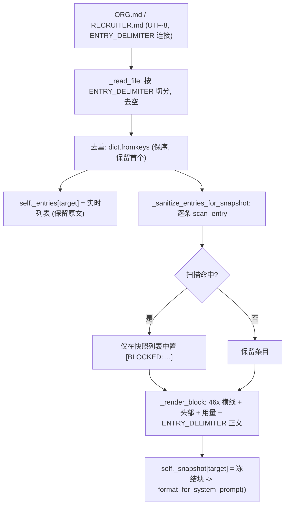
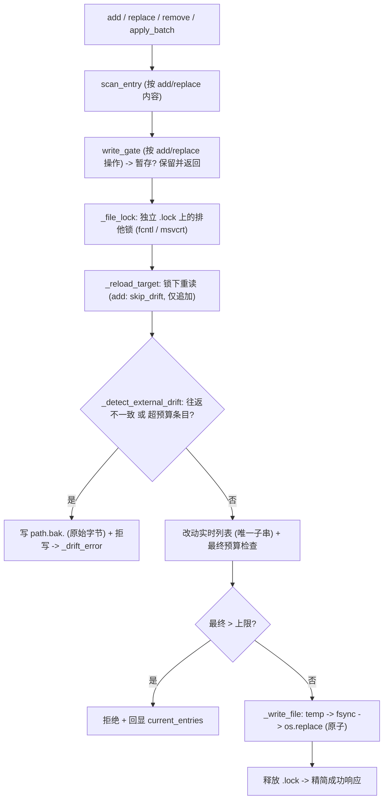

# 开发日志 · Phase 0 §1.2 — 文件型 `MemoryStore`（来自 Hermes 的首个真实代码移植）

> 经策展、小体量、强一致的记忆层（PRD §9.3）——从 Hermes **逐字节移植**，独立、仅标准库、离线，且不改动 agent 循环
> （接线在 §1.3）。规格：`docs/superpowers/specs/2026-06-27-p0-1.2-memory-store-design.md`；计划：
> `…/plans/2026-06-28-p0-1.2-memory-store.md`。源码：`agent/src/jobpin_agent/memory/store.py`。

## 1. 本步骤交付什么

记忆子系统的**第一层**，也是项目的**首个真实代码移植**（§1.1 是设计衍生的重写）。§1.2 把 Hermes
`tools/memory_tool.py::MemoryStore` 移植为一个**有界、文件持久化、跨会话稳定的策展存储**，承载两个目标：

- **`org`**（`ORG.md`）——组织招聘标准、评分细则、政策（护城河；≈ Hermes `MEMORY.md`）。
- **`recruiter`**（`RECRUITER.md`）——招聘官偏好 / 用人经理的“标尺”（≈ Hermes `USER.md`）。

它为**每个目标维护两个并行状态**：进入系统提示、会话中绝不改变的**冻结快照**（使提示前缀可缓存——计划 §1.0 关键不变量 #1），
以及由 `add`/`replace`/`remove`/`apply_batch` 改动并原子落盘的**实时条目列表**。满足计划 §1.2 交付物：**`memory/store`**
（两态、定长、原子写、文件锁、漂移检测、批量原子性、写门控——保留逐方法文档串并注明移植来源）；**同一存储中的两个目标**
（`org`/`recruiter` 及其预算配置）；**验收矩阵单元套件**；以及一份**安全评审记录**（MIT 代码“按现状”提供，故移植文件须各自评审）。
§1.2 之后聊天 agent 仍不会可见地“记住”——把记忆接入循环是 §1.3。

## 2. 新增/改动的文件

| 路径 | 内容 |
|---|---|
| `memory/__init__.py` | 包标记 + 双语模块文档 |
| `memory/store.py` | **`MemoryStore`** + `ENTRY_DELIMITER` + `ScanEntry`/`WriteGate` 类型 + `_FILENAMES` + `_no_scan` + `_drift_error` + 辅助函数（`_file_lock`、`_read_file`、`_write_file`、`_detect_external_drift`、`_render_block`、`_sanitize_entries_for_snapshot`、`_reload_target`、`_char_count`、`_char_limit`、`_gate`、`_success_response`、`_batch_error`）+ `load_org_recruiter_store` 工厂 |
| `memory/README.md` | 双语文件夹指南 |
| `tests/test_memory_store.py` | 验收套件（**18 个测试**） |
| `examples/memory_inspect.py` | 离线 inspect 演示（`run_inspect()`） |
| `THIRD_PARTY_NOTICES.md` | 新增 §1.2 **Port** 出处行（保留 MIT 版权） |
| `docs/security/p0-1.2-memory-store-port-review.md`（+ `docs/security/README.md`） | 移植安全评审 |

## 3. 公开接口（API）

```python
# store.py — 模块常量 / 接缝类型
ENTRY_DELIMITER = "\n§\n"                                   # § 的唯一许可用法（条目分隔符）
ScanEntry = Callable[[str], Optional[str]]                  # 威胁扫描：危险则返回描述，否则 None
WriteGate = Callable[[str, str, Optional[str]], Optional[str]]  # (action, target, content) -> 保留消息或 None
_FILENAMES = {"org": "ORG.md", "recruiter": "RECRUITER.md"}    # 目标 -> 磁盘文件名

class MemoryStore:
    def __init__(self, memory_dir, org_char_limit: int = 6000, recruiter_char_limit: int = 2000,
                 scan_entry: Optional[ScanEntry] = None, write_gate: Optional[WriteGate] = None) -> None
    def load_from_disk(self) -> None                        # 读取 -> 切分 -> 去重 -> 扫描 -> 冻结快照
    def add(self, target, content) -> Dict[str, Any]        # 追加（扫描 -> 门控 -> 去重 -> 预算）
    def replace(self, target, old_text, new_content) -> Dict[str, Any]   # 唯一子串替换
    def remove(self, target, old_text) -> Dict[str, Any]    # 唯一子串删除
    def apply_batch(self, target, operations: List[Dict]) -> Dict[str, Any]   # 全有或全无，最终预算
    def format_for_system_prompt(self, target) -> Optional[str]   # 冻结快照块；空则 None
    def save_to_disk(self, target) -> None                  # 原子 temp -> fsync -> os.replace

# 工厂
load_org_recruiter_store(memory_dir, scan_entry=None, write_gate=None) -> MemoryStore   # 构造 + load_from_disk()
# target ∈ {"org", "recruiter"}
```

## 4. 数据结构与格式

- **两态模型**（每个目标，均以目标为键的字典）：
  - `self._entries: Dict[str, List[str]]` —— **实时**条目列表；`add`/`replace`/`remove`/`apply_batch` 改动它、`save_to_disk` 落盘它；工具响应反映它。
  - `self._snapshot: Dict[str, str]` —— **冻结**的渲染块，在 `load_from_disk()` 时设定一次、会话中不变；`format_for_system_prompt()` 返回它（关键不变量 #1）。
  - `self._limits: Dict[str, int]` —— 每目标字符预算。
- **`ENTRY_DELIMITER = "\n§\n"`** —— 单独成行的章节号在磁盘上、以及计量预算时（`len(ENTRY_DELIMITER.join(entries))`）分隔条目。
- **字符预算** —— 默认 **org 6000 / recruiter 2000**（从 Hermes 的 2200/1375 上调；仍有界——保留定长 / 高信噪比原则）。测试用小预算 200/120 以低成本触发溢出。
- **磁盘文件格式**（`ORG.md` / `RECRUITER.md`）—— 纯 UTF-8；实时条目以 `ENTRY_DELIMITER` 连接，**磁盘上无头部**（头部只存在于渲染快照，故条目保持不透明文本，日后 §1.5 治理头可前缀而不破坏切分）。缺失/空白文件解析为 `[]`。
- **渲染快照块**（`_render_block`，进入系统提示）—— 46 个 `═` 横线、带实时用量的头部、再一条横线，然后 `§`-连接的正文：
  ```
  ══════════════════════════════════════════════
  ORG MEMORY (hiring standards, rubrics, policy) [42% — 2,520/6,000 chars]
  ══════════════════════════════════════════════
  <条目 1>
  §
  <条目 2>
  ```
  recruiter 头部为 `RECRUITER PROFILE (preferences, the hiring bar) [..% — current/limit chars]`。条目为空 → `""` → `format_for_system_prompt` 返回 `None`。
- **成功响应**（`_success_response`，精简——终态）：
  ```python
  {"success": True, "done": True, "target": target,
   "usage": f"{pct}% — {current:,}/{limit:,} chars", "entry_count": len(entries),
   "message": <可选>, "note": "Write saved. This update is complete — do not repeat it."}
  ```
  刻意**不回显 `current_entries`**（反抖动——见 §5）。
- **错误响应**（逐字形状）—— `{"success": False, "error": …}` 并按路径附加：
  - 超预算（add/replace/batch）：`+ "current_entries": list(entries), "usage": f"{current:,}/{limit:,}"`；
  - 歧义匹配：`+ "matches": [<=80 字符预览]`；
  - 门控保留：`{"success": False, "staged": True, "message": held}`；
  - 漂移：`{"success": False, "error": …, "drift_backup": bak_path, "remediation": …}`。

## 5. 关键机制（附真实代码）

**加载 = 切分 → 去重 → 扫描 → 冻结**（`load_from_disk`）—— 由磁盘字节确定，故快照整会话一致：
```python
for target in ("org", "recruiter"):
    entries = list(dict.fromkeys(self._read_file(self._path_for(target))))  # 按 ENTRY_DELIMITER 切分 + 去重（保留首个）
    self._entries[target] = entries                                          # 实时保留原文
    sanitized = self._sanitize_entries_for_snapshot(entries, _FILENAMES[target])
    self._snapshot[target] = self._render_block(target, sanitized)           # 冻结块 -> 系统提示
```

**独立 `.lock` 下的原子写**（`_write_file` + `_file_lock`）—— 读者只见完整的旧或新文件，绝不见截断；锁*独立*的 `.lock` 使数据文件本身仍可替换：
```python
# _write_file
content = ENTRY_DELIMITER.join(entries) if entries else ""
fd, tmp_path = tempfile.mkstemp(dir=str(path.parent), suffix=".tmp", prefix=".mem_")
with os.fdopen(fd, "w", encoding="utf-8") as f:
    f.write(content); f.flush(); os.fsync(f.fileno())
os.replace(tmp_path, path)                       # 单文件系统上原子
# _file_lock（跨平台）
lock_path = path.with_suffix(path.suffix + ".lock")
fd = open(lock_path, "a+", encoding="utf-8")
if fcntl:  fcntl.flock(fd, fcntl.LOCK_EX)        # POSIX
else:      fd.seek(0); msvcrt.locking(fd.fileno(), msvcrt.LK_LOCK, 1)   # Windows
yield                                             # ... 在 finally 中解锁 + 关闭
```

**唯一子串 add / replace / remove** —— 按短子串匹配（非全文、非 ID）；命中 ≥2 个*不同*条目则报错而非臆测；完全相同的重复则操作首个：
```python
matches = [(i, e) for i, e in enumerate(entries) if old_text in e]
if not matches:
    return {"success": False, "error": f"No entry matched '{old_text}'."}
if len(matches) > 1 and len({e for _, e in matches}) > 1:                 # ≥2 个不同条目
    previews = [e[:80] + ("..." if len(e) > 80 else "") for _, e in matches]
    return {"success": False, "error": f"Multiple entries matched '{old_text}'. Be more specific.", "matches": previews}
idx = matches[0][0]                                                       # 完全相同的重复 -> 首个
```

**`apply_batch` 对最终预算全有或全无** —— 在工作副本上校验每个操作；允许中间超额（一次调用内先腾挪再新增）；重复 add 幂等跳过；全部通过才提交：
```python
working = list(self._entries[target])
for i, op in enumerate(operations):
    ...                                          # add：重复 -> `continue`；replace/remove：在 `working` 上唯一子串
new_total = len(ENTRY_DELIMITER.join(working)) if working else 0
if new_total > limit:                            # 仅对最终大小做预算检查
    return {"success": False, "error": "After applying all … operations …over the limit…",
            "current_entries": list(self._entries[target]), "usage": f"{current:,}/{limit:,}"}   # 不写入
self._entries[target] = working
self.save_to_disk(target)                        # 提交
```

**漂移检测 → `.bak` + 拒写**（`_detect_external_drift`）—— 两个信号捕获手改 / shell 追加 / 并发写；任一命中即快照原始字节并拒绝，绝不静默丢数据：
```python
parsed = [e.strip() for e in raw.split(ENTRY_DELIMITER) if e.strip()]
roundtrip = ENTRY_DELIMITER.join(parsed)
max_entry_len = max((len(e) for e in parsed), default=0)
if (raw.strip() != roundtrip) or (max_entry_len > limit):                # (1) 无法往返  (2) 超预算巨型条目
    bak_path = path.with_suffix(path.suffix + f".bak.{ts}")
    bak_path.write_text(raw, encoding="utf-8")                           # 快照磁盘上的原始字节
    return str(bak_path)                                                 # -> _drift_error -> 调用方拒写
```
`replace`/`remove`/`apply_batch` 在重载时运行它；**`add` 传 `skip_drift=True`**，因为追加从不覆盖既有内容。

**精简成功响应（反抖动）** —— 成功**不**回显条目；回显会诱使模型“再找点改”并重复操作，故条目仅在错误路径出现：
```python
resp = {"success": True, "done": True, "target": target,
        "usage": f"{pct}% — {current:,}/{limit:,} chars", "entry_count": len(entries)}
resp["note"] = "Write saved. This update is complete — do not repeat it."   # 此处无 current_entries
```

**注入式 `scan_entry` → 仅快照中置 `[BLOCKED:]`**（`_sanitize_entries_for_snapshot`）—— 被投毒的磁盘条目从系统提示移除，而实时状态保留原文供人工查看/删除：
```python
desc = self._scan(entry)
if desc:
    sanitized.append(f"[BLOCKED: {filename} entry contained threat pattern(s): {desc}. "
                     f"Removed from system prompt; use remove() to delete the original.]")
else:
    sanitized.append(entry)
# 仅净化快照列表；self._entries[target] 保留原始条目
```

## 6. 设计决策与原因

- **忠实移植，最小适配。** 去重、定长预算、原子写、`.lock`、漂移检测、`apply_batch` 是自建最贵、最易出微妙错误的部分——故从已评审的 Hermes 源**逐字节**复制并自此自有（PRD §2.7）。逐方法移植（而非重写）是规格 §9 明确的风险控制。
- **注入目录，无全局。** Hermes 读 `HERMES_HOME`；我们将 `memory_dir` 作为构造参数——可测（临时目录）、本地优先、无隐藏全局状态。
- **扫描是接缝，而非伪装成控制的空操作。** §1.2 用替身扫描器证明 `[BLOCKED:]` *机制*；默认 `scan_entry` 被记录为安全省略（不拦截），安全评审将“真实拦截依赖 §1.6”作为按设计开放项追踪。
- **条目保持不透明文本。** §1.5 治理头（来源/同意/留存）推迟；现在保持条目无头，意味着日后可在条目*内部*前缀头部而不破坏 `ENTRY_DELIMITER` 切分。
- **预算重标定，仍有界。** Org 承载更多（标准/细则）故预算上调至 6000，但保留上界——无界增长会毁掉冻结快照的前缀缓存收益。

**相对 Hermes 的改动**（移植锚定于真实符号——`tools/memory_tool.py`：`ENTRY_DELIMITER` 第 59 行、`_system_prompt_snapshot` 第 130/166 行、`apply_batch` 自 449、`_detect_external_drift` 自 647）：

| 方面 | Hermes（`tools/memory_tool.py::MemoryStore`） | Jobpin `memory/store.py` | 保留 / 适配 |
|---|---|---|---|
| 去重 / 分隔符 / 定长预算 | `dict.fromkeys`、`ENTRY_DELIMITER = "\n§\n"`、最终大小检查 | 一致 | **逐字节保留** |
| 原子写 + 锁 | temp → `fsync` → 原子替换、排他 `.lock`（fcntl/msvcrt） | 算法一致 | **逐字节保留** |
| 唯一子串匹配；`apply_batch` 全有或全无；漂移 `.bak`+拒写；精简成功；`[BLOCKED:]` 机制 | 同上游 | 同上游 | **逐字节保留** |
| 目标 / 文件 | `memory`/`user`；`MEMORY.md`/`USER.md` | `org`/`recruiter`；`ORG.md`/`RECRUITER.md` | 适配（HR 领域） |
| 记忆目录 | `get_memory_dir()`（`HERMES_HOME` 全局） | `memory_dir` 构造参数 | 适配（无全局） |
| 威胁扫描 | `_scan_memory_content` / `scan_for_threats`（`threat_patterns`） | 注入式 `scan_entry`（默认 `_no_scan`）；真实模式 → §1.6 | 适配（接缝） |
| 原子原语 | `atomic_replace(tmp, path)`（EXDEV/符号链接回退） | `os.replace(tmp, path)`——临时文件在目标自身目录，回退不适用 | 适配（内联标准库） |
| 渲染头部 | "MEMORY" / "USER PROFILE" | "ORG MEMORY" / "RECRUITER PROFILE" | 适配（HR 标签） |
| 预算 | 2200 / 1375 | 6000 / 2000（仍有界） | 适配（重标定） |
| 入口 | `load_on_disk_store()` / `memory_tool()` | `load_org_recruiter_store()` 工厂 | 适配（暂无工具入口） |
| 治理头 | — | 推迟 → §1.5（条目保持不透明） | 适配（推迟） |
| 写门控 | — | 可选 `write_gate` 接缝（默认放行） | **新增（§1.2 接缝）** |

移植在 `agent/THIRD_PARTY_NOTICES.md` 记为首个 **Port** 行（保留 MIT 版权 + 许可），并在 `docs/security/p0-1.2-memory-store-port-review.md` 通过评审。

## 7. 接缝与推迟

| 接缝（签名） | §1.2 默认 | 真实实现 |
|---|---|---|
| `scan_entry(text) -> str?` | `_no_scan`（直通；以替身证明 `[BLOCKED:]` 机制） | **§1.6** `threat_patterns`（`first_threat_message(t, scope="strict")`） |
| `write_gate(action, target, content) -> str?` | `None`（直通） | **§1.5** 同意 / 审批门控（按 add/replace 操作触发） |
| 条目内治理头（来源/同意/留存） | 无——条目保持不透明文本 | **§1.5** 在条目内前缀的机器可解析头部 |
| agent 循环接线（`format_for_system_prompt` → 快照槽；`prefetch()` → 围栏召回） | 未接线——独立存储 | **§1.3** `MemoryProvider` + `MemoryManager`，不改 `agent_loop.py` |
| 大体量检索（候选人 / 知识库） | 不在范围（仅策展层） | **§1.4** 向量库 + 实体 provider |

## 8. 测试与验收（`test_memory_store.py` 18 passed；§1.2 落地时整个 `agent/` 为 47 passed, 1 skipped）

| 测试 | 证明什么 |
|---|---|
| `test_add_then_format_reflects_after_reload` | 已落盘的 add **重载后**才出现在冻结快照中；空的 recruiter 目标 → `format_for_system_prompt` 返回 `None` |
| `test_add_rejects_empty_and_dedupes` | 空白内容 → 错误；完全相同的重复 add 被跳过（“Entry already exists”） |
| `test_lean_success_response_does_not_echo_entries` | 成功 add 不含 `current_entries`；`entry_count` 反映新增（反抖动） |
| `test_fixed_length_overflow_rejects_and_echoes_entries` | 第二个 150 字符 add 超过 org 的 200 预算 → 拒绝**并**回显 `current_entries` |
| `test_replace_ambiguous_distinct_matches_errors` | 子串命中 ≥2 个**不同**条目 → 歧义错误并附 `matches`，**不删除** |
| `test_replace_single_match_succeeds` | 含相同重复的文件在加载时去重；唯一子串就地替换 |
| `test_remove_matches_and_missing` | 删除匹配条目 → 成功；不匹配子串 → 错误 |
| `test_apply_batch_all_or_nothing_final_budget` | **最终**结果超预算的批量**不写入**任何内容（磁盘不变） |
| `test_apply_batch_transient_overbudget_ok_and_idempotent_add` | 若最终状态合规，中间瞬时超额无妨；重复 add 幂等跳过 |
| `test_drift_detection_backs_up_and_rejects` | 漂移信号 #2（500 字符单条超过 200 上限）→ 拒写 + `.bak` 保留原始字节 |
| `test_injected_entry_blocked_in_snapshot_only` | 被扫描器标记的条目 → 快照中置 `[BLOCKED:]`，**实时状态保留原文** |
| `test_scanned_content_rejected_on_add` | 内容被扫描器标记的 add 在写入路径被拒 |
| `test_write_gate_holds_write_when_it_returns_message` | 返回消息的写门控 → `staged` 响应，不落盘 |
| `test_lock_path_executes_on_this_platform` | `_file_lock` 在宿主 OS 运行（此处 Windows 的 msvcrt）；两次顺序 add 均按序落库 |
| `test_recruiter_target_add_budget_and_header` | recruiter 目标端到端工作，含自身预算 + `RECRUITER PROFILE` 头部；超预算被拒 |
| `test_live_snapshot_stable_across_midsession_write` | 会话中的 add **不**改变冻结快照（关键不变量 #1） |
| `test_drift_roundtrip_mismatch_signal_one` | 漂移信号 #1：无法往返的文件（`a §§ b`，空中间条目）→ 拒写 + `.bak` |
| `test_apply_batch_write_gate_holds_per_op` | 写门控在批量内**按 add/replace 操作**触发（供 §1.5 同意）；批量暂存，不写入 |

**对应计划 §1.2 验收矩阵：** 原子写 / 无截断 → 每个基于重载的测试演练的 `os.replace` 往返；文件锁（Windows `msvcrt` / POSIX `fcntl`）→ `test_lock_path_executes_on_this_platform`（宿主 OS 上的*路径*；真正两进程/跨 OS = CI）；漂移 → `.bak` + 拒写 → `test_drift_detection_…`（信号 #2）+ `test_drift_roundtrip_mismatch_signal_one`（信号 #1）；`apply_batch` 全有或全无 → `test_apply_batch_all_or_nothing_final_budget`（+ 瞬时超额 OK/幂等）；replace 歧义匹配 → `test_replace_ambiguous_distinct_matches_errors`（+ 相同重复操作首个 `test_replace_single_match_succeeds`）；定长溢出回显 → `test_fixed_length_overflow_…`（+ recruiter 预算）；注入条目 → 加载时 `[BLOCKED:]` → `test_injected_entry_blocked_in_snapshot_only`（+ add 路径 `test_scanned_content_rejected_on_add`）；add 幂等 → `test_apply_batch_transient_…`；精简成功 → `test_lean_success_response_…`。冻结快照退出标准由 `test_live_snapshot_stable_across_midsession_write` + `test_add_then_format_reflects_after_reload` 把守。

## 9. 如何接线

*加载路径 —— 在 `load_from_disk()` 时运行一次；冻结快照：*



*写入路径 —— 每次 `add` / `replace` / `remove` / `apply_batch`；改动实时列表，原子落盘：*



## 10. 自己运行

```bash
cd agent
python -m pytest -q tests/test_memory_store.py   # 18 passed
python -m pytest -q                              # §1.2 落地时 47 passed, 1 skipped（OpenAI 集成；可选）
python examples/memory_inspect.py                # 添加 Org/Recruiter 条目 -> 展示冻结快照；漂移被拒
```
`memory_inspect.py` 返回 `{"org_entries", "org_snapshot", "recruiter_present": true, "drift_rejected": true}` —— 它添加两条 Org 标准 + 一条 Recruiter 偏好，重载以打印冻结的 `ORG MEMORY` 块，然后直接向 `ORG.md` 追加超预算字节，展示下一次 `replace` 被拒并生成 `.bak`。

## 11. 三方评审改了什么

三位评审（资深工程师 / 架构师 / 产品经理）对照计划检查。资深工程师的逐方法 diff 确认移植**忠实**（无重写漂移）。所做改动：

1. **逐操作写门控（架构师 严重 / 资深 次要）。** `apply_batch` 曾以 `content=None` 调用可选写门控一次，使 §1.5 的同意门控无法检视每个条目。已修复为在批量内**按 add/replace 操作**触发（与逐操作扫描一致）——否则同意在批量写路径不可执行。由 `test_apply_batch_write_gate_holds_per_op` 覆盖。
2. **先修计划措辞（三方一致；依“先修计划再偏离”）。** “两个具名*实例*”→“**同一**存储中的两个目标”；“Load 扫描 `threat_patterns`”→“经注入扫描接缝（真实模式 §1.6）”；治理头“本阶段”→“推迟到 §1.5”；锁退出标准改写为“锁*路径*在宿主 OS 演练……真正两进程 / 跨 OS = CI”。
3. **覆盖（资深 次要）。** 新增测试：recruiter 目标镜像（`test_recruiter_target_add_budget_and_header`）、会话中写入后快照稳定（`test_live_snapshot_stable_across_midsession_write`）、往返不一致漂移信号 #1（`test_drift_roundtrip_mismatch_signal_one`）、逐操作批量门控。

**诚实的覆盖说明（记录于安全评审）：** 单元套件在宿主 OS（此处 Windows 的 msvcrt）演练锁*路径*，并经原子往返验证“无截断”；真正的两进程并发与 POSIX `fcntl` 分支属 CI/集成范畴，非单元测试。唯一按设计开放项是真实注入拦截依赖 §1.6 扫描器。

## 12. 这一步如何为 §1.3 铺路

§1.3 移植 `MemoryProvider` + `MemoryManager`，并经 §1.1 接缝把本存储接入 agent 循环、**不改动 `agent_loop.py`**：`format_for_system_prompt()` 填充冻结的 `memory_snapshot` 槽，真实 `prefetch()` 返回围栏 `<memory-context>` 召回。此处留下的两个接缝日后原样接入——架构师确认真实 §1.6 扫描器（`first_threat_message(t, scope="strict")`）与 `scan_entry` 签名完全吻合，而 §1.5 同意门控与现已逐操作的 `write_gate` 吻合。
