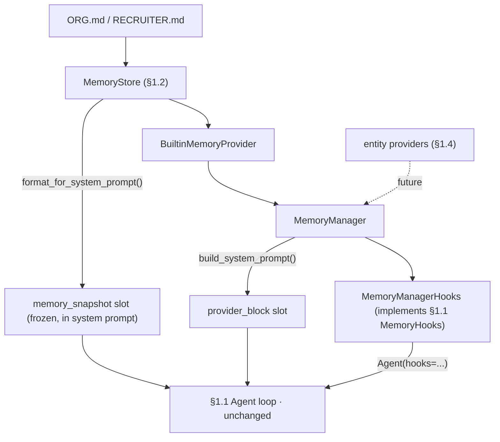
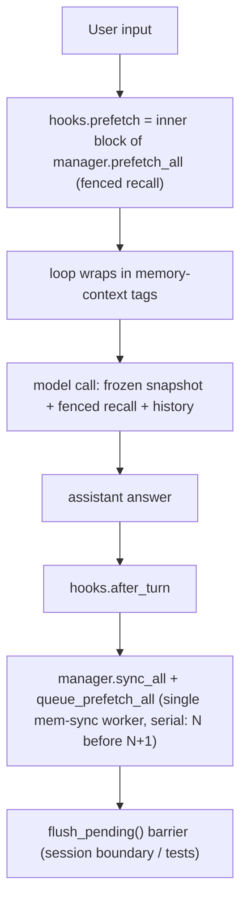

# Devlog · Phase 0 §1.3 — `MemoryProvider` + `MemoryManager` (the memory seam)

> How we ported Hermes's memory orchestration and attached it to the agent loop **without touching
> `agent_loop.py`**, and why the agent's *write* tool waits for §1.5. Part of the build journal. Pairs
> with the spec (`docs/superpowers/specs/2026-06-28-p0-1.3-memory-provider-manager-design.md`) and plan
> (`docs/superpowers/plans/2026-06-28-p0-1.3-memory-provider-manager.md`). Source:
> `agent/src/jobpin_agent/memory/`.

## What this step delivers

The **contract layer** of the Memory Subsystem: a uniform `MemoryProvider` interface and a
`MemoryManager` that drives every provider through its lifecycle — so the small-volume curated store
(§1.2) and the future large-volume retrieval stores (§1.4) look identical to the conversation loop. The
payoff you can see today: **the agent's system prompt now contains your Org/Recruiter standards**, and
the recall/sync lifecycle is in place for entity providers and governance to plug into.

This is the **second real code port** from Hermes — `agent/memory_provider.py` + `agent/memory_manager.py`,
ported method-by-method, plus the `<memory-context>` fence.

## The seam — how it attaches with no loop change

§1.1 deliberately left a `MemoryHooks` Protocol seam in the loop. §1.3's linchpin is a tiny adapter,
`MemoryManagerHooks`, that **implements that Protocol by delegating to a `MemoryManager`**. So the whole
backend bolts on via `Agent(..., hooks=...)` — `agent_loop.py` is untouched (git-verified by the
architect review).



Note the **two distinct system-prompt slots** (Plan §1.1 assembly order): the curated **frozen snapshot**
reaches the prompt *directly from the store* via the `memory_snapshot` slot; the providers' **static
blocks** go to the `provider_block` slot via `manager.build_system_prompt()`. The built-in provider
therefore returns `""` from `system_prompt_block()` — returning the snapshot there would duplicate it.

## The per-turn lifecycle



## Fence ownership (loop owns the outer tags)

The §1.1 loop already wraps recall as `<memory-context>\n{recall}\n</memory-context>`. So the adapter's
`prefetch` returns the **inner** block — the system note + sanitized recall, no outer tags — and the
loop's wrapping reproduces Hermes's full block **byte-for-byte**. `sanitize_context` strips any fence a
provider smuggles, so recalled resume text can't forge "authoritative" framing or break out of the
fence. (The *real* content scan — `threat_patterns` — and the streaming scrubber are §1.6; §1.3's fence
is structural containment.)

## Serial background persistence (a compliance dependency)

`sync_all` / `queue_prefetch_all` run on a **single-worker** `ThreadPoolExecutor(max_workers=1,
thread_name_prefix="mem-sync")`. One worker guarantees **turn N persists before N+1** — the ordering the
later "every step is auditable" causal chain depends on — and never blocks the turn. `flush_pending`
submits a sentinel and waits (a deterministic barrier for session boundaries and tests). `shutdown_all`
drains with a bounded, daemon **watcher** thread.

**Honest caveat (a Hermes comment we corrected):** Hermes says the worker "is a daemon, so it dies with
the interpreter." On Python 3.9+ the pool worker is **non-daemon** (registered for an `atexit` join), so
only `shutdown_all` is bounded — a *forever*-wedged task can still be joined at interpreter exit. The
wedged-provider test reflects this: it blocks on a `threading.Event` it **releases at the end**, rather
than sleeping, so it proves the bound without hanging teardown.

## Why the agent can't *write* memory yet (the key decision)

§1.3 ports the tool-routing **mechanism** (`get_tool_schemas` / `handle_tool_call` / the core-tool
shadow guard / the single-external rule), and a fake provider exercises it — but the built-in provider
exposes **no `memory` write tool**. That is deliberate and is the decision this point turned on:

> The governed write-gate — the one that **rejects writes lacking provenance / consent labels** (Key
> Invariant #4; PRD §9.6) — is the *very next* point, **§1.5**. Shipping a live write tool in §1.3, before
> that gate exists, would open an *ungoverned* write path. So the model-facing `memory` tool is born at
> §1.5, behind the gate. The §1.2 store's `write_gate` seam already waits for it.

This scope flipped only after reading the **whole** PRD + Plan (now a standing rule — `CLAUDE.md` §5
"Context-first"): read in isolation, §1.3 looks like it should ship the write tool; read against the
dependency order, the governed tool clearly belongs to §1.5.

So the curated built-in provider is intentionally **lean** in §1.3: `prefetch`→`""` (per-query recall is
§1.4's vector providers), `sync_turn`→no-op (curated memory is hand-edited), `get_tool_schemas`→`[]`
(write tool §1.5). Its value here is making the file store a *Provider* — the lifecycle participant and
the `on_pre_compress` seam §1.6 needs — plus proving the loop closes through the Manager.

## What changed vs Hermes (and why)

| Change | Why |
|---|---|
| `_strip_skill_scaffolding` is a pass-through | Jobpin has no `/skill` layer; the seam is kept for a future one |
| local `tool_error` / `_CORE_TOOL_NAMES` | replace Hermes's `tools.registry` / `toolsets._HERMES_CORE_TOOLS` imports |
| `initialize_all` injects no `hermes_home` | Hermes-specific path; Jobpin uses `memory_dir` / config |
| added `build_memory_context_inner` | the §1.1 loop owns the outer fence tags; the seam returns the inner block |
| `StreamingContextScrubber` NOT ported | streaming isn't built — lands at §1.6 (`security/scrubber`) |
| `inject_memory_provider_tools` NOT ported | the model-facing tool surface is §1.5 |

The port is recorded in `agent/THIRD_PARTY_NOTICES.md` as **"Port"**, with the MIT copyright retained,
and reviewed in `docs/security/p0-1.3-memory-provider-manager-review.md`.

## What the triple-review changed

Three reviewers (senior engineer / architect / PM) checked it against the Plan — all three returned
**YES** (port faithful method-by-method; boundaries sound; matches Plan/PRD intent). Changes made:
1. **Plan fixes first** (per the "fix the Plan first" rule, EN+中文): §1.3 no longer claims the Manager
   reserves an `entity_type` routing table (entity routing lives in `CompositeMemoryProvider` §3.2 — the
   Manager just reserves the single-external slot + tool-routing seam); the inaccurate "(worker is a
   daemon)" claim is corrected; the exit wording now states the curated builtin is inert per-turn by
   design; and a forward note flags that §1.4's two external providers need the Phase-2 Composite.
2. **Stronger failure-isolation test** (senior engineer): the old test let a healthy provider get
   silently rejected by the single-external rule (dead code) — it now co-registers a *raising* provider
   and a *healthy* one in one manager and asserts the healthy recall **survives** the exception.
3. **Tool-interleaved `after_turn` test** added (proving `_last_text` picks the final assistant answer
   across intermediate tool-call turns); the daemon-worker code comments corrected; a note that the
   composition helper leaves per-session lifecycle to the caller (matters at §1.4).

## Run it yourself

```bash
cd agent
python -m pytest -q                  # 70 passed, 1 skipped (OpenAI integration; opt-in)
python examples/memory_agent_demo.py # one real §1.1 turn: Org snapshot in the prompt + fenced recall + sync
```

## How this sets up §1.4 / §1.5 / §1.6

- **§1.4** adds entity providers (candidate / semantic) behind this same `MemoryProvider` interface;
  their `prefetch` returns real per-query recall through the seam already wired here. (Reconcile the
  single-external rule then — see the forward note.)
- **§1.5** adds the governance write-gate and the model-facing `memory` tool — born governed, routed
  through the `handle_tool_call` mechanism ported (and fake-tested) here.
- **§1.6** captures `on_pre_compress` into the compression summary (the built-in provider already exposes
  the seam) and ports the real `threat_patterns` scan + `StreamingContextScrubber`.
