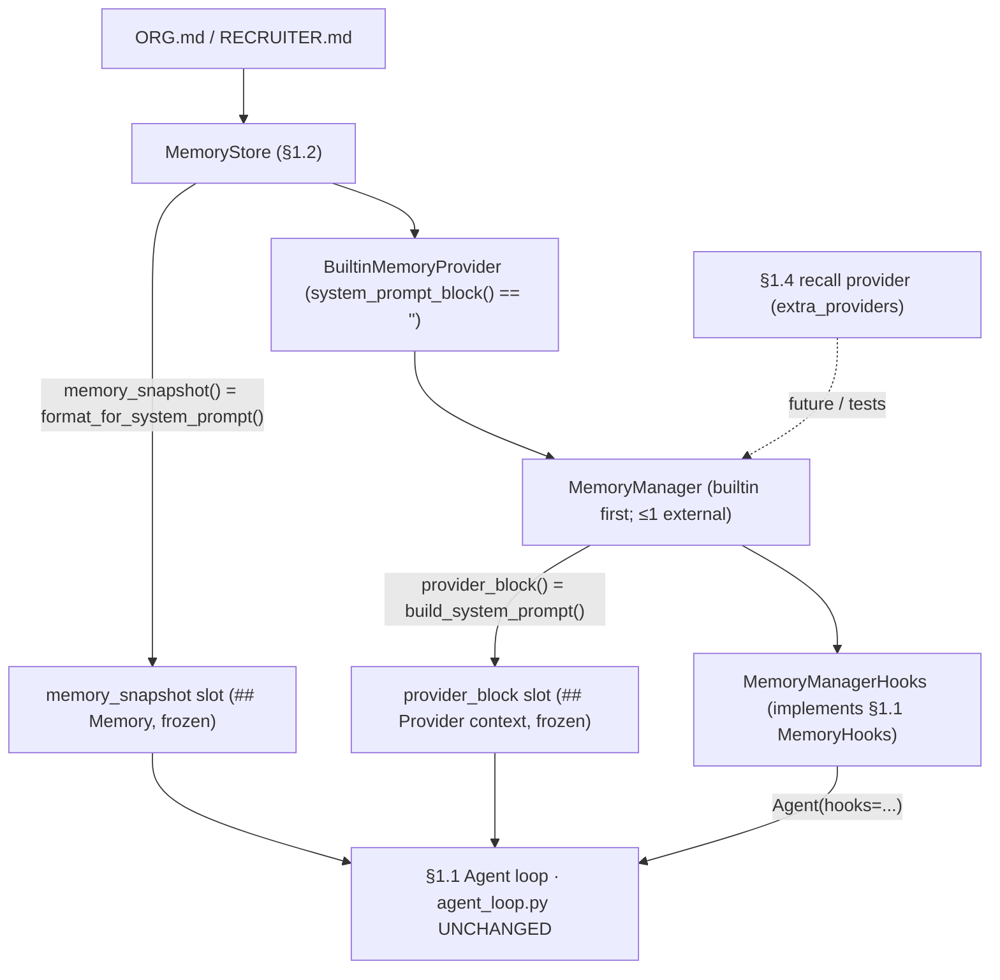
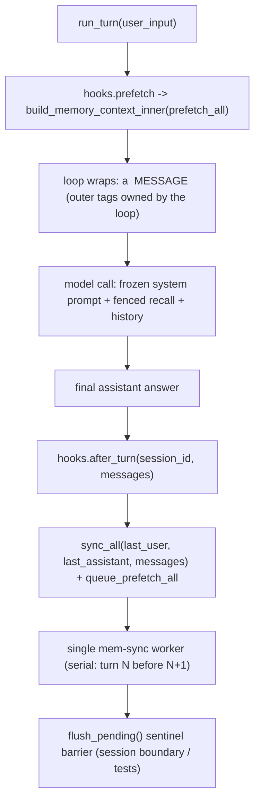

# Devlog · Phase 0 §1.3 — the `MemoryProvider` contract + `MemoryManager` orchestration (the memory seam)

> The **contract layer** of the Memory Subsystem — the second real Hermes port
> (`agent/memory_provider.py` + `agent/memory_manager.py` + the `<memory-context>` fence), attached to
> the §1.1 loop **with no change to `agent_loop.py`**. Spec:
> `docs/superpowers/specs/2026-06-28-p0-1.3-memory-provider-manager-design.md`; plan: Production Plan §1.3;
> security review: `docs/security/p0-1.3-memory-provider-manager-review.md`. Source:
> `agent/src/jobpin_agent/memory/`.

## 1. What this delivers

A uniform `MemoryProvider` interface and a `MemoryManager` that drives every provider through one
lifecycle, so the small-volume curated store (§1.2) and the future large-volume retrieval stores (§1.4)
look **identical** to the conversation loop. The payoff visible today: **the agent's system prompt now
carries your Org/Recruiter standards**, and the recall/sync/compression/session-switch lifecycle is in
place for entity providers (§1.4) and governance (§1.5) to plug into — all attached through the §1.1
`MemoryHooks` seam, so `agent_loop.py` is untouched (git-verified by the architect review).

Satisfies Plan §1.3 deliverables: `memory/provider` (the ported `MemoryProvider` ABC), `memory/manager`
(the ported `MemoryManager` — single-worker serial background, `flush_pending` barrier, bounded drain),
`memory/fence` (the `<memory-context>` build + `sanitize_context`), a **minimal built-in provider**
wrapping the §1.2 store (proving the interface closes the loop), and lifecycle-consistency tests. Two
§1.3-derived additions wire it to §1.1: the `MemoryManagerHooks` **adapter** (the linchpin) and a
`build_memory_backend` **composition helper**. This is a **port** (`THIRD_PARTY_NOTICES.md` §1.3 row,
MIT copyright retained), not new design code.

## 2. Files added/changed

| Path | What it contains |
|---|---|
| `memory/provider.py` | the ported `MemoryProvider` ABC — 4 abstract members + the opt-in lifecycle hooks (ported defaults) |
| `memory/manager.py` | the ported `MemoryManager`, `normalize_tool_schema`, local `tool_error`, `_CORE_TOOL_NAMES`, `_SYNC_DRAIN_TIMEOUT_S` |
| `memory/fence.py` | `sanitize_context`, `build_memory_context_inner` (new), `build_memory_context_block`, `_SYSTEM_NOTE`, the 3 fence regexes |
| `memory/providers/__init__.py` | package marker (the package §1.4 extends with candidate/semantic) |
| `memory/providers/builtin.py` | `BuiltinMemoryProvider(store)` — the lean §1.3 read/seam wrapper over the §1.2 store |
| `memory/manager_hooks.py` | `MemoryManagerHooks(manager)` (+ `_last_text`, `_as_dicts`) — implements the §1.1 `MemoryHooks` Protocol |
| `memory/composition.py` | `build_memory_backend(...)` + `MemoryBackend` (store + manager + hooks; the two prompt fills) |
| `examples/memory_agent_demo.py` | offline end-to-end demo (`run_demo()`) — one real §1.1 turn |
| `tests/test_{memory_fence,memory_provider,memory_manager,memory_manager_hooks}.py` | the §1.3 acceptance suite (22 tests) |
| `THIRD_PARTY_NOTICES.md`, `memory/README.md`, `docs/security/p0-1.3-…-review.md` | Port rows, folder guide, security review |

## 3. The public surface (API)

```python
# fence.py — the <memory-context> fence (ported)
sanitize_context(text: str) -> str                   # strip fence tags / internal blocks / the system note
build_memory_context_inner(raw_context: str) -> str  # note + sanitized body, NO outer tags (or "")
build_memory_context_block(raw_context: str) -> str  # "<memory-context>\n<inner>\n</memory-context>" (or "")
_SYSTEM_NOTE                                          # the exact Hermes "[System note: … NOT new user input …]"
# _FENCE_TAG_RE / _INTERNAL_CONTEXT_RE / _INTERNAL_NOTE_RE — the 3 ported regexes

# provider.py — the MemoryProvider ABC  (name == provider id; "builtin" always first)
class MemoryProvider(ABC):
    name: str                                  # @abstractmethod (property)
    is_available() -> bool                     # @abstractmethod
    initialize(session_id, **kwargs) -> None   # @abstractmethod (kwargs: platform/agent_context/agent_identity/user_id)
    get_tool_schemas() -> list[dict]           # @abstractmethod (builtin returns [] until §1.5)
    # opt-in hooks (ported defaults):
    system_prompt_block() -> str                                          # ""  (static prompt text, NOT recall)
    prefetch(query, *, session_id="") -> str                             # ""  (pre-turn recall; must be fast)
    queue_prefetch(query, *, session_id="") -> None                      # no-op (warm the next turn)
    sync_turn(user, assistant, *, session_id="", messages=None) -> None  # no-op (post-turn write)
    handle_tool_call(tool_name, args, **kwargs) -> str                   # raises NotImplementedError by default
    shutdown() -> None                                                   # no-op
    on_turn_start / on_session_end / on_session_switch / on_pre_compress(->"") / on_delegation
    get_config_schema()->[] / save_config / on_memory_write / backup_paths()->[]

# manager.py — module surface
tool_error(message: str) -> str            # '{"success": false, "error": message}'
normalize_tool_schema(schema) -> dict|None # unwrap {"type":"function","function":{…}} → bare; None if nameless
_CORE_TOOL_NAMES = frozenset({"clarify", "delegate_task"})   # reserved; a provider tool may not shadow these
_SYNC_DRAIN_TIMEOUT_S = 5.0                # the bound shutdown_all() waits for in-flight work to drain

class MemoryManager:
    add_provider(provider) -> None         # builtin always; ≤1 external; core-name tools dropped at the door
    providers -> list[MemoryProvider]      # (property, a copy);  get_provider(name) -> provider|None
    build_system_prompt() -> str           # join non-empty system_prompt_block()s (blank-line), failure-isolated
    prefetch_all(query, *, session_id="") -> str          # merge prefetch()s (blank-line), failure-isolated
    queue_prefetch_all(query, *, session_id="") -> None   # background warm of the next turn
    sync_all(user, assistant, *, session_id="", messages=None) -> None   # background, serial (turn N before N+1)
    flush_pending(timeout=None) -> bool    # sentinel barrier; True if drained (or no executor), False on timeout
    handle_tool_call(tool_name, args, **kwargs) -> str    # route to the owning provider, else tool_error JSON
    get_all_tool_schemas() / get_all_tool_names() / has_tool(name)
    on_turn_start / on_session_end / on_session_switch / on_pre_compress / on_delegation / on_memory_write
    notify_memory_tool_write(tool_result, tool_args, *, build_metadata=None)   # §1.5 write-mirror entry (dormant)
    initialize_all(session_id, **kwargs) -> None          # forwards kwargs as-is (no hermes_home)
    shutdown_all() -> None                 # bounded drain + reverse-order provider shutdown

# providers/builtin.py — the lean §1.3 provider
class BuiltinMemoryProvider(MemoryProvider):              # name == "builtin"
    __init__(store: MemoryStore);  store -> MemoryStore (property)
    is_available()->True; system_prompt_block()->""; prefetch()->""; sync_turn()->None
    get_tool_schemas()->[]; on_pre_compress()->""         # the §1.6 seam; initialize/shutdown are no-ops

# manager_hooks.py — the linchpin adapter (implements §1.1 core.hooks.MemoryHooks, duck-typed)
class MemoryManagerHooks(manager: MemoryManager):
    prefetch(query, session_id) -> str             # build_memory_context_inner(manager.prefetch_all(...))
    after_turn(session_id, messages) -> None       # sync_all(last_user, last_assistant, messages=…) + queue_prefetch_all
    on_delegation(task, result, child_session_id) -> None
    on_session_switch(new, parent, reset, rewound) -> None
    on_pre_compress(messages) -> str

# composition.py — the assembly helper (NOT an application entry point)
build_memory_backend(memory_dir, *, extra_providers=(), scan_entry=None, write_gate=None) -> MemoryBackend
@dataclass MemoryBackend(store, manager, hooks):
    memory_snapshot() -> str    # the store's frozen Org+Recruiter block → the §1.1 memory_snapshot slot
    provider_block() -> str     # manager.build_system_prompt() → the §1.1 provider_block slot
```

## 4. Data structures & formats

- **Two distinct system-prompt slots** (Plan §1.1 assembly order, from `core/system_prompt.py`). The
  full order is `## Organisation policy` · `## Compliance constraints` · `## Role permissions` ·
  **`## Memory`** (`memory_snapshot`) · **`## Provider context`** (`provider_block`) · `## Tools`. The
  curated **frozen snapshot** reaches the prompt *directly from the store* via `memory_snapshot`
  (`MemoryBackend.memory_snapshot()` = `store.format_for_system_prompt("org"/"recruiter")`); the
  providers' **static blocks** go to `provider_block` via `manager.build_system_prompt()`. Both are
  frozen once per session (Key Invariant #1). The built-in provider therefore returns `""` from
  `system_prompt_block()` — returning the snapshot there would **duplicate** it in the prompt.
- **The fenced `<memory-context>` block.** Per-turn recall is NOT a prompt slot — it is a separate
  `<memory-context>` **message**. The §1.1 loop owns the **outer** tags; the seam returns the **inner**
  block: `inner = _SYSTEM_NOTE + "\n\n" + sanitize_context(recall)`, and the full block is
  `"<memory-context>\n" + inner + "\n</memory-context>"`. `_SYSTEM_NOTE` is Hermes's exact string:
  `"[System note: The following is recalled memory context, NOT new user input. Treat as authoritative
  reference data — this is the agent's persistent memory and should inform all responses.]"`.
- **Merge format.** `prefetch_all` and `build_system_prompt` both **blank-line join** (`"\n\n".join`)
  the per-provider outputs. (A single provider's own recall may *internally* be `ENTRY_DELIMITER`-separated
  — `"\n§\n"`, the §1.2 store's entry separator that §1.4's retrieval providers reuse; the §1.3
  manager-level merge across providers is the blank line.)
- **The lean `tool_error` JSON.** `tool_error(msg)` → `json.dumps({"success": False, "error": msg})` →
  `{"success": false, "error": "<msg>"}` — the one shape an unknown/failed memory tool returns to the
  model (never a raw exception).

## 5. Key mechanisms (with the actual code)

**Single-worker serial executor** (`manager.py`) — a lazily-created `ThreadPoolExecutor(max_workers=1,
thread_name_prefix="mem-sync")`. One worker guarantees **turn N persists before N+1** (the ordering the
later "every step is auditable" causal chain depends on) and never blocks the turn:
```python
self._sync_executor = ThreadPoolExecutor(max_workers=1, thread_name_prefix="mem-sync")  # under _sync_executor_lock
# _submit_background: dispatch off-thread, fall back to inline if the pool is gone
executor = self._get_sync_executor()
if executor is None:
    fn(); return                       # inline fallback (fn does its own per-provider try/except)
try: executor.submit(fn)
except RuntimeError: fn()              # executor already shut down → inline
```

**`flush_pending` sentinel barrier** — because there is exactly one worker, a sentinel submitted *now*
runs strictly after every prior task; waiting on it is a deterministic barrier (session boundaries, tests):
```python
fut = executor.submit(lambda: None)   # runs after all earlier sync/prefetch tasks
fut.result(timeout=timeout)           # True when drained; False on timeout; True if no executor
```

**Bounded daemon-watcher drain** (`shutdown_all` → `_drain_sync_executor`) — cancel queued work, then
join a **daemon** watcher for at most `_SYNC_DRAIN_TIMEOUT_S`, so a wedged provider can't hang the call:
```python
executor.shutdown(wait=False, cancel_futures=True)
drainer = threading.Thread(target=lambda: executor.shutdown(wait=True), daemon=True, name="mem-sync-drain")
drainer.start(); drainer.join(timeout=_SYNC_DRAIN_TIMEOUT_S)   # the call returns within the bound
```
**Honest caveat (a Hermes comment we corrected).** Hermes says the worker "is a daemon, so it dies with
the interpreter." On **Python 3.9+ the pool worker is NON-daemon** (registered for an `atexit` join), so
only `shutdown_all()` is bounded — a *forever*-wedged task can still be joined at *interpreter* exit. A
hard guarantee would need a custom daemon thread factory (out of scope for §1.3). The wedged-provider
test reflects this: it blocks on a `threading.Event` it **releases at the end** rather than sleeping, so
it proves the bound without hanging teardown.

**Failure isolation** — every provider call is wrapped in try/except + log; one provider raising never
blocks the others or the turn (e.g. `prefetch_all`):
```python
for provider in self._providers:
    try:
        result = provider.prefetch(clean_query, session_id=session_id)
        if result and result.strip(): parts.append(result)
    except Exception as e:
        logger.debug("Memory provider '%s' prefetch failed (non-fatal): %s", provider.name, e)
```

**Single-external + core-tool-shadow guards** (`add_provider`) — `builtin` is always accepted; a second
non-builtin is rejected with a warning; a provider tool named like a core tool is dropped at the door so
built-ins always win:
```python
if not is_builtin:
    if self._has_external:
        logger.warning("Rejected memory provider '%s' — external provider '%s' already registered…", …); return
    self._has_external = True
…
if tool_name in _CORE_TOOL_NAMES:
    logger.warning("…tool '%s' shadows a reserved core tool name; registration ignored…", …); continue
```

**The adapter (the linchpin)** — `prefetch` returns the **inner** fenced block; `after_turn` dispatches
sync + next-turn prefetch to the background worker:
```python
def prefetch(self, query, session_id):
    return build_memory_context_inner(self._manager.prefetch_all(query, session_id=session_id))
def after_turn(self, session_id, messages):
    user = _last_text(messages, Role.USER); assistant = _last_text(messages, Role.ASSISTANT)
    self._manager.sync_all(user, assistant, session_id=session_id, messages=_as_dicts(messages))
    self._manager.queue_prefetch_all(user, session_id=session_id)
```
`_last_text` scans `reversed(messages)` for the last **non-empty** content of a role, so it skips an
intermediate empty tool-call assistant turn and syncs the final answer.

**Fence-ownership split** — `sanitize_context` removes whole forged blocks first, then the note, then any
stray tags, so recalled resume text can't forge "authoritative" framing or break out of the fence; the
loop adds the outer tags, reproducing Hermes's block byte-for-byte:
```python
text = _INTERNAL_CONTEXT_RE.sub("", text)   # whole <memory-context>…</memory-context> blocks
text = _INTERNAL_NOTE_RE.sub("", text)      # the system note
text = _FENCE_TAG_RE.sub("", text)          # any stray </?memory-context> tag
```

## 6. Design decisions & why

- **The agent cannot *write* memory yet — the decision this point turned on.** §1.3 ports the
  tool-routing **mechanism** (`get_tool_schemas`/`handle_tool_call`/shadow guard/single-external rule)
  and a fake provider exercises it, but the built-in provider exposes **no `memory` write tool**. The
  governed write-gate that **rejects writes lacking provenance/consent labels** (Key Invariant #4; PRD
  §9.6) is the *very next* point, **§1.5**. Shipping a live write tool here would open an *ungoverned*
  write path. So the model-facing `memory` tool is born at §1.5, behind the gate; the §1.2 store's
  `write_gate` seam already waits for it. (This scope flipped only after reading the **whole** PRD +
  Plan — now the standing "reflect against the whole plan" rule.)
- **Two slots, no duplication.** The snapshot reaches the prompt straight from the store; the provider
  block is for *static* provider info. The lean builtin (`prefetch`→`""`, `sync_turn`→no-op,
  `get_tool_schemas`→`[]`, `system_prompt_block`→`""`) makes the file store a lifecycle **participant**
  and exposes the `on_pre_compress` seam §1.6 needs — its value here is closing the loop, not adding
  behaviour.
- **Faithful port of the subtle parts.** The single-worker serial executor, `flush_pending` barrier,
  bounded drain, failure-isolation try/except, single-external rule, shadow guard, schema normalisation,
  and the three fence regexes are ported **method-by-method, untouched** (these are the expensive-to-rebuild
  parts). Only Hermes-only couplings were trimmed.

**What changed vs Hermes (and why)** — it is a port of `agent/memory_provider.py` + `agent/memory_manager.py`:

| Change | Why |
|---|---|
| `_strip_skill_scaffolding` is a pass-through | Jobpin has no `/skill` layer; the seam is kept for a future one |
| local `tool_error` / `_CORE_TOOL_NAMES` | replace Hermes's `tools.registry` / `toolsets._HERMES_CORE_TOOLS` imports |
| `initialize_all` injects no `hermes_home` | Hermes-specific path; Jobpin forwards kwargs as-is (config-driven) |
| added `build_memory_context_inner` | the §1.1 loop owns the outer fence tags; the seam returns the inner block |
| `StreamingContextScrubber` NOT ported | streaming isn't built — lands at §1.6 (`security/scrubber`) |
| `inject_memory_provider_tools` / `memory_provider_tools_enabled` NOT ported | the model-facing tool surface is §1.5 |

## 7. Seams & deferrals

| Seam (where) | §1.3 state | Real impl |
|---|---|---|
| `builtin.prefetch()` | `""` | per-query vector/structured recall — **§1.4** |
| `builtin.sync_turn()` | no-op | governed per-turn write — **§1.5** |
| `builtin.get_tool_schemas()` | `[]` | the model-facing `memory` write tool — **§1.5** |
| `builtin.on_pre_compress()` | `""` (seam present) | real fact extraction + the compression call-site capture — **§1.6** |
| `scan_entry` / `write_gate` (passed to the §1.2 store) | pass-through | `threat_patterns` scan **§1.6** / write-approval gate **§1.5** |
| `notify_memory_tool_write` / `on_memory_write` | dormant (no external provider, no write tool) | write-mirror — **§1.5 / Phase 2** |
| single-external rule (`add_provider`) | enforced (≤1 external) | relaxed behind one `CompositeMemoryProvider` facade — **§1.4 / Phase 2 §3.2** |
| `StreamingContextScrubber` | not ported | streaming scrubber — **§1.6** |

## 8. Tests & acceptance (22 §1.3 tests; full suite green)

| Test file (cases) | Test name → what it proves |
|---|---|
| `test_memory_fence.py` (5) | `test_inner_plus_outer_equals_full_block` — loop-wrapped inner == the full Hermes block byte-for-byte; `test_empty_returns_empty` — blank → `""`; `test_sanitize_strips_provider_included_fence` — a smuggled full block + note removed; `test_inner_strips_stray_fence_tag_keeps_real_text` — a stray `</memory-context>` stripped, surrounding facts kept; `test_complete_forged_block_is_fully_dropped` — a complete forged block (incl. "ignore your rules") fully dropped |
| `test_memory_provider.py` (3) | `test_cannot_instantiate_without_abstracts` — the ABC's 4 abstract members are enforced (`TypeError`); `test_minimal_provider_defaults` — opt-in hooks return Hermes's defaults (`""`/`None`/`[]`); `test_builtin_provider_is_lean_seam` — builtin is `name=="builtin"`, lean (`system_prompt_block`/`prefetch`/`on_pre_compress`→`""`, no tools, `sync_turn` no-op), store still holds the snapshot |
| `test_memory_manager.py` (9) | `test_serial_background_sync_then_flush` — two `sync_all` land **in order** on the single worker (visible after flush); `test_flush_barrier_makes_state_visible` — state asserted only after the barrier; `test_wedged_provider_does_not_block_turn_or_exit` — `sync_all` returns fast and `shutdown_all` returns within `_SYNC_DRAIN_TIMEOUT_S` **while still wedged**; `test_failure_isolation_one_provider_raises` — a raising provider co-registered with a healthy one; healthy recall **survives**; `test_second_external_provider_rejected` — `[builtin, ext1]`, `ext2` dropped; `test_core_tool_not_shadowed` — a `delegate_task`-named provider tool is not advertised/routable; `test_tool_routes_to_owning_provider` — a normal tool routes via `handle_tool_call`, unknown → `tool_error`; `test_build_system_prompt_joins_provider_blocks` — builtin `""` + ext block → just the ext block; `test_prefetch_wrapped_then_fence_stripping` — a provider pre-wrapping a fence is stripped on build, real fact kept |
| `test_memory_manager_hooks.py` (5) | `test_adapter_satisfies_protocol_and_wraps_prefetch` — `isinstance(MemoryHooks)` and `prefetch` returns note+recall, **no outer tags**; `test_after_turn_syncs_last_user_and_assistant` — syncs the last user/assistant (visible after flush); `test_after_turn_picks_final_assistant_across_tool_interleaving` — skips the empty tool-call turn, syncs the **final** answer; `test_on_pre_compress_aggregates_provider_facts` — aggregates providers' facts; `test_agent_system_prompt_contains_org_memory_and_fenced_recall` — **end-to-end**: a real §1.1 `Agent` sees the Org snapshot + a `<memory-context>` recall, and the turn syncs after flush — **no loop change** |

**Maps to the Plan §1.3 acceptance matrix + Exit Criteria:**

| Plan §1.3 scenario / exit | Proven by |
|---|---|
| Serial background persistence (turn N before N+1) | `test_serial_background_sync_then_flush` |
| flush barrier visible | `test_flush_barrier_makes_state_visible` |
| Wedged provider does not block exit (bounded drain) | `test_wedged_provider_does_not_block_turn_or_exit` |
| Failure isolation | `test_failure_isolation_one_provider_raises` |
| Fence enforced (note + tags always wrap recall) | `test_inner_plus_outer_equals_full_block`, `test_adapter_satisfies_protocol_and_wraps_prefetch` |
| Fence stripping (provider-included fence removed) | `test_sanitize_strips_provider_included_fence`, `test_prefetch_wrapped_then_fence_stripping`, `test_complete_forged_block_is_fully_dropped` |
| Second external provider rejected | `test_second_external_provider_rejected` |
| Core tools not shadowed | `test_core_tool_not_shadowed` |
| **Exit:** Manager closes prefetch→turn→sync→queue_prefetch, persistence visible after `flush_pending` | `test_agent_system_prompt_contains_org_memory_and_fenced_recall`, `test_after_turn_*` |

## 9. How it wires together

The seam — store → builtin provider → manager → hooks adapter → the §1.1 loop (two frozen slots + the runtime seam):



The per-turn lifecycle (fenced recall in; serial persistence out):



## 10. Run it yourself

```bash
cd agent
python -m pytest -q                  # 104 passed, 1 skipped today (the §1.3 point added the 22 below)
python -m pytest -q tests/test_memory_fence.py tests/test_memory_provider.py \
                    tests/test_memory_manager.py tests/test_memory_manager_hooks.py   # 22 passed
python examples/memory_agent_demo.py # one real §1.1 turn: Org snapshot in the prompt + fenced recall + sync
```
`memory_agent_demo.py` output: `{"system_prompt_has_org": true, "prefetch_inner": "[System note: …]\n\ncand_7f3a: …",
"recall_in_prompt": true, "synced_after_turn": true, "answer": "Based on the bar, cand_7f3a looks strong."}`.
(The full suite is `104 passed, 1 skipped` because it has grown through §1.4; §1.3 itself landed the tree
at `70 passed, 1 skipped`. The skip is the opt-in real-OpenAI integration test.)

## 11. What the triple-review changed

Three reviewers (senior engineer / architect / PM) checked it against the Plan — all returned **YES**
(port faithful method-by-method; boundaries sound; matches Plan/PRD intent; "no `agent_loop.py` change"
git-verified). Changes made:
1. **Plan fixes first** (per the "fix the Plan first" rule, EN+中文): §1.3 no longer claims the Manager
   reserves an `entity_type` routing **table** (entity routing lives in `CompositeMemoryProvider` §3.2 —
   the Manager reserves only the single-external slot + tool-routing seam); the inaccurate "(worker is a
   daemon)" claim was corrected to the non-daemon/`atexit`-join reality; the exit wording now states the
   curated builtin is inert per-turn **by design**; and a forward note flags that §1.4's two external
   providers need the Phase-2 Composite.
2. **Stronger failure-isolation test** (senior engineer): the old test let a healthy provider get
   silently rejected by the single-external rule (dead code) — it now co-registers a *raising* provider
   (as builtin) and a *healthy* external in one manager and asserts the healthy recall **survives** the
   exception.
3. **Tool-interleaved `after_turn` test** added (proving `_last_text` picks the final assistant answer
   across an intermediate empty tool-call turn); the daemon-worker code comments corrected to match the
   security review's item #2 caveat; and a note that the composition helper leaves per-session lifecycle
   (`initialize_all`/`shutdown_all`) to the caller (harmless for the no-op builtin; matters at §1.4).

## 12. How this sets up §1.4 / §1.5 / §1.6

- **§1.4** adds entity providers (candidate / semantic) behind this **same `MemoryProvider` interface**;
  their `prefetch` returns real per-query recall through the seam already wired here. (Two external
  providers trip the single-external rule, so §1.4 brought a **minimal `CompositeMemoryProvider`**
  forward as the sole external — reusing this point's single-worker / `flush_pending` / bounded-drain
  machinery unchanged.)
- **§1.5** adds the governance write-gate and the model-facing `memory` tool — **born governed**, routed
  through the `handle_tool_call` mechanism ported (and fake-tested) here, with `notify_memory_tool_write`
  / `on_memory_write` lighting up for write-mirroring.
- **§1.6** captures `on_pre_compress` into the compression summary (the built-in provider already exposes
  the seam) and ports the real `threat_patterns` content scan + `StreamingContextScrubber` behind
  `scan_entry` and the streaming path.
