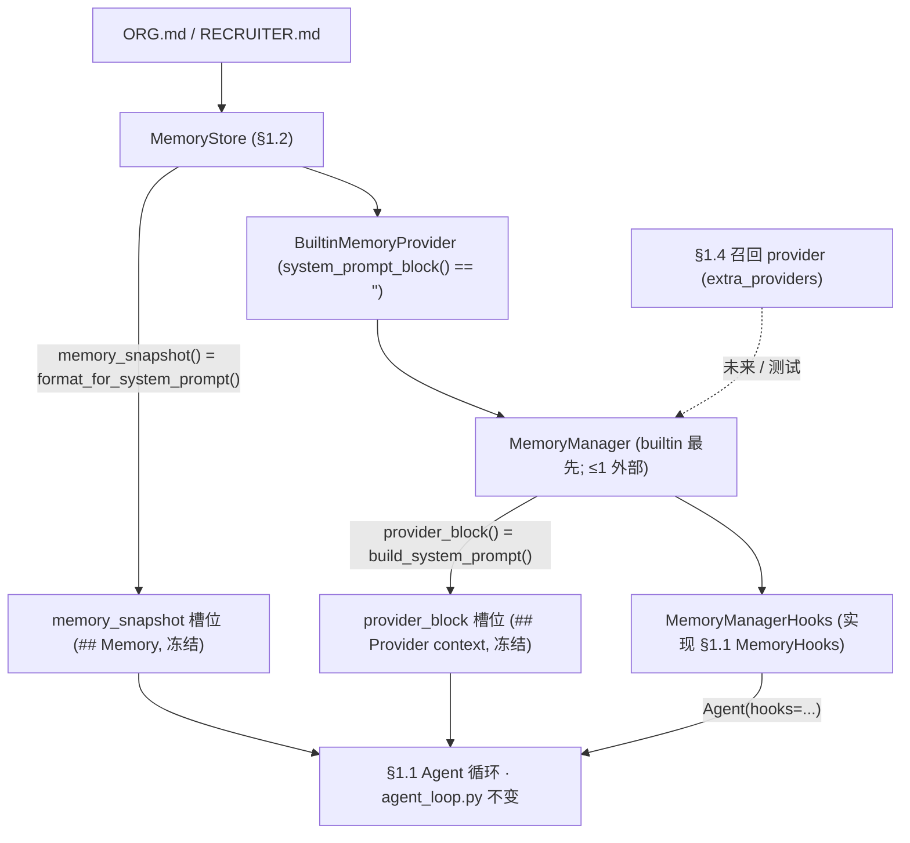
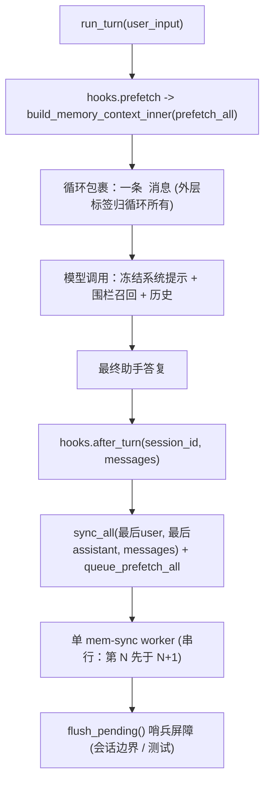

# 开发日志 · Phase 0 §1.3 — `MemoryProvider` 契约 + `MemoryManager` 编排（记忆接缝）

> 记忆子系统的**契约层**——来自 Hermes 的第二次真实移植（`agent/memory_provider.py` + `agent/memory_manager.py`
> + `<memory-context>` 围栏），在**不改动 `agent_loop.py`** 的前提下接入 §1.1 循环。规格：
> `docs/superpowers/specs/2026-06-28-p0-1.3-memory-provider-manager-design.md`；计划：生产计划 §1.3；
> 安全评审：`docs/security/p0-1.3-memory-provider-manager-review.md`。源码：`agent/src/jobpin_agent/memory/`。

## 1. 本步骤交付什么

统一的 `MemoryProvider` 接口，以及驱动每个 provider 走完单一生命周期的 `MemoryManager`，使小体量的策展存储
（§1.2）与未来大体量的检索存储（§1.4）对会话循环看起来**一致**。今天能看到的成果：**agent 的系统提示现在
携带你的 Org/Recruiter 标准**，且召回/同步/压缩/会话切换生命周期已就位，供实体 provider（§1.4）与治理（§1.5）
接入——全部经 §1.1 `MemoryHooks` 接缝接上，故 `agent_loop.py` 毫发无损（架构师评审以 git 验证）。

满足计划 §1.3 交付物：`memory/provider`（移植的 `MemoryProvider` ABC）、`memory/manager`（移植的
`MemoryManager`——单工作线程串行后台、`flush_pending` 屏障、有界排空）、`memory/fence`（`<memory-context>`
构建 + `sanitize_context`）、一个包裹 §1.2 存储的**最小内置 provider**（证明接口闭合循环）、以及生命周期一致性
测试。两项 §1.3 衍生的新增把它接到 §1.1：`MemoryManagerHooks` **适配器**（关键）与 `build_memory_backend`
**组合助手**。这是一次**移植**（`THIRD_PARTY_NOTICES.md` §1.3 行，保留 MIT 版权），而非新设计代码。

## 2. 新增/改动的文件

| 路径 | 内容 |
|---|---|
| `memory/provider.py` | 移植的 `MemoryProvider` ABC——4 个抽象成员 + 可选生命周期钩子（移植的默认实现） |
| `memory/manager.py` | 移植的 `MemoryManager`、`normalize_tool_schema`、本地 `tool_error`、`_CORE_TOOL_NAMES`、`_SYNC_DRAIN_TIMEOUT_S` |
| `memory/fence.py` | `sanitize_context`、`build_memory_context_inner`（新增）、`build_memory_context_block`、`_SYSTEM_NOTE`、3 个围栏正则 |
| `memory/providers/__init__.py` | 包标记（§1.4 以 candidate/semantic 扩展该包） |
| `memory/providers/builtin.py` | `BuiltinMemoryProvider(store)`——§1.3 精简的读/接缝包装，覆盖 §1.2 存储 |
| `memory/manager_hooks.py` | `MemoryManagerHooks(manager)`（+ `_last_text`、`_as_dicts`）——实现 §1.1 `MemoryHooks` 协议 |
| `memory/composition.py` | `build_memory_backend(...)` + `MemoryBackend`（store + manager + hooks；两处提示填充） |
| `examples/memory_agent_demo.py` | 离线端到端演示（`run_demo()`）——一个真实 §1.1 回合 |
| `tests/test_{memory_fence,memory_provider,memory_manager,memory_manager_hooks}.py` | §1.3 验收套件（22 个测试） |
| `THIRD_PARTY_NOTICES.md`、`memory/README.md`、`docs/security/p0-1.3-…-review.md` | Port 行、文件夹指南、安全评审 |

## 3. 公开接口（API）

```python
# fence.py — <memory-context> 围栏（移植）
sanitize_context(text: str) -> str                   # 剥离围栏标签 / 内部块 / 系统注记
build_memory_context_inner(raw_context: str) -> str  # 注记 + 净化正文，无外层标签（或 ""）
build_memory_context_block(raw_context: str) -> str  # "<memory-context>\n<inner>\n</memory-context>"（或 ""）
_SYSTEM_NOTE                                          # Hermes 原样的 "[System note: … NOT new user input …]"
# _FENCE_TAG_RE / _INTERNAL_CONTEXT_RE / _INTERNAL_NOTE_RE — 3 个移植正则

# provider.py — MemoryProvider ABC（name == provider 标识；"builtin" 始终最先）
class MemoryProvider(ABC):
    name: str                                  # @abstractmethod（property）
    is_available() -> bool                     # @abstractmethod
    initialize(session_id, **kwargs) -> None   # @abstractmethod（kwargs：platform/agent_context/agent_identity/user_id）
    get_tool_schemas() -> list[dict]           # @abstractmethod（builtin 在 §1.5 前返回 []）
    # 可选钩子（移植的默认实现）：
    system_prompt_block() -> str                                          # ""  （静态提示文本，非召回）
    prefetch(query, *, session_id="") -> str                             # ""  （回合前召回；必须快）
    queue_prefetch(query, *, session_id="") -> None                      # 空操作（预热下一回合）
    sync_turn(user, assistant, *, session_id="", messages=None) -> None  # 空操作（回合后写入）
    handle_tool_call(tool_name, args, **kwargs) -> str                   # 默认抛 NotImplementedError
    shutdown() -> None                                                   # 空操作
    on_turn_start / on_session_end / on_session_switch / on_pre_compress(->"") / on_delegation
    get_config_schema()->[] / save_config / on_memory_write / backup_paths()->[]

# manager.py — 模块接口
tool_error(message: str) -> str            # '{"success": false, "error": message}'
normalize_tool_schema(schema) -> dict|None # 解包 {"type":"function","function":{…}} → 裸；无名则 None
_CORE_TOOL_NAMES = frozenset({"clarify", "delegate_task"})   # 保留；provider 工具不得遮蔽
_SYNC_DRAIN_TIMEOUT_S = 5.0                # shutdown_all() 等待在飞工作排空的界

class MemoryManager:
    add_provider(provider) -> None         # builtin 始终；≤1 外部；核心名工具在门口丢弃
    providers -> list[MemoryProvider]      # （property，副本）；get_provider(name) -> provider|None
    build_system_prompt() -> str           # 连接非空 system_prompt_block()（空行），失败隔离
    prefetch_all(query, *, session_id="") -> str          # 合并 prefetch()（空行），失败隔离
    queue_prefetch_all(query, *, session_id="") -> None   # 后台预热下一回合
    sync_all(user, assistant, *, session_id="", messages=None) -> None   # 后台、串行（第 N 先于 N+1）
    flush_pending(timeout=None) -> bool    # 哨兵屏障；已排空（或无执行器）则 True，超时则 False
    handle_tool_call(tool_name, args, **kwargs) -> str    # 路由到拥有者 provider，否则 tool_error JSON
    get_all_tool_schemas() / get_all_tool_names() / has_tool(name)
    on_turn_start / on_session_end / on_session_switch / on_pre_compress / on_delegation / on_memory_write
    notify_memory_tool_write(tool_result, tool_args, *, build_metadata=None)   # §1.5 写镜像入口（休眠）
    initialize_all(session_id, **kwargs) -> None          # 原样转发 kwargs（无 hermes_home）
    shutdown_all() -> None                 # 有界排空 + 逆序 provider shutdown

# providers/builtin.py — §1.3 精简 provider
class BuiltinMemoryProvider(MemoryProvider):              # name == "builtin"
    __init__(store: MemoryStore);  store -> MemoryStore (property)
    is_available()->True; system_prompt_block()->""; prefetch()->""; sync_turn()->None
    get_tool_schemas()->[]; on_pre_compress()->""         # §1.6 接缝；initialize/shutdown 空操作

# manager_hooks.py — 关键适配器（实现 §1.1 core.hooks.MemoryHooks，鸭子类型）
class MemoryManagerHooks(manager: MemoryManager):
    prefetch(query, session_id) -> str             # build_memory_context_inner(manager.prefetch_all(...))
    after_turn(session_id, messages) -> None       # sync_all(最后user, 最后assistant, messages=…) + queue_prefetch_all
    on_delegation(task, result, child_session_id) -> None
    on_session_switch(new, parent, reset, rewound) -> None
    on_pre_compress(messages) -> str

# composition.py — 装配助手（并非应用入口）
build_memory_backend(memory_dir, *, extra_providers=(), scan_entry=None, write_gate=None) -> MemoryBackend
@dataclass MemoryBackend(store, manager, hooks):
    memory_snapshot() -> str    # 存储的冻结 Org+Recruiter 块 → §1.1 memory_snapshot 槽位
    provider_block() -> str     # manager.build_system_prompt() → §1.1 provider_block 槽位
```

## 4. 数据结构与格式

- **两个不同的系统提示槽位**（计划 §1.1 装配顺序，源自 `core/system_prompt.py`）。完整顺序为
  `## Organisation policy` · `## Compliance constraints` · `## Role permissions` ·
  **`## Memory`**（`memory_snapshot`）· **`## Provider context`**（`provider_block`）· `## Tools`。策展的
  **冻结快照**经 `memory_snapshot` 槽位*直接由存储*进入提示（`MemoryBackend.memory_snapshot()` =
  `store.format_for_system_prompt("org"/"recruiter")`）；各 provider 的**静态块**经
  `manager.build_system_prompt()` 进入 `provider_block` 槽位。两者每会话冻结一次（关键不变量 #1）。故内置
  provider 的 `system_prompt_block()` 返回 `""`——在那里返回快照会在提示中**重复**它。
- **围栏 `<memory-context>` 块。** 每回合召回不是提示槽位——它是单独的 `<memory-context>` **消息**。§1.1 循环
  拥有**外层**标签；接缝返回**内层**块：`inner = _SYSTEM_NOTE + "\n\n" + sanitize_context(recall)`，完整块为
  `"<memory-context>\n" + inner + "\n</memory-context>"`。`_SYSTEM_NOTE` 是 Hermes 的原样字符串：
  `"[System note: The following is recalled memory context, NOT new user input. Treat as authoritative
  reference data — this is the agent's persistent memory and should inform all responses.]"`。
- **合并格式。** `prefetch_all` 与 `build_system_prompt` 均以**空行连接**（`"\n\n".join`）各 provider 的输出。
  （单个 provider 自身的召回可能*内部*以 `ENTRY_DELIMITER` 分隔——`"\n§\n"`，§1.2 存储的条目分隔符，§1.4 的
  检索 provider 复用之；§1.3 跨 provider 的管理器级合并用空行。）
- **精简 `tool_error` JSON。** `tool_error(msg)` → `json.dumps({"success": False, "error": msg})` →
  `{"success": false, "error": "<msg>"}`——未知/失败的记忆工具向模型返回的唯一形态（绝不抛裸异常）。

## 5. 关键机制（附真实代码）

**单工作线程串行执行器**（`manager.py`）——惰性创建的 `ThreadPoolExecutor(max_workers=1,
thread_name_prefix="mem-sync")`。单 worker 保证**第 N 回合先于 N+1 落库**（后续“每步可审计”因果链所依赖的
顺序），且绝不阻塞回合：
```python
self._sync_executor = ThreadPoolExecutor(max_workers=1, thread_name_prefix="mem-sync")  # 在 _sync_executor_lock 下
# _submit_background：派发到后台线程，若线程池已无则回退到内联
executor = self._get_sync_executor()
if executor is None:
    fn(); return                       # 内联回退（fn 自行处理各 provider try/except）
try: executor.submit(fn)
except RuntimeError: fn()              # 执行器已关闭 → 内联
```

**`flush_pending` 哨兵屏障**——因恰有一个 worker，此刻提交的哨兵会严格在所有先前任务之后运行；等待它即是
确定性屏障（会话边界、测试）：
```python
fut = executor.submit(lambda: None)   # 在所有更早的 sync/prefetch 任务之后运行
fut.result(timeout=timeout)           # 排空则 True；超时则 False；无执行器则 True
```

**有界 daemon 监视排空**（`shutdown_all` → `_drain_sync_executor`）——取消排队工作，再以一个 **daemon** 监视
线程 join 至多 `_SYNC_DRAIN_TIMEOUT_S`，使被卡住的 provider 无法拖住此调用：
```python
executor.shutdown(wait=False, cancel_futures=True)
drainer = threading.Thread(target=lambda: executor.shutdown(wait=True), daemon=True, name="mem-sync-drain")
drainer.start(); drainer.join(timeout=_SYNC_DRAIN_TIMEOUT_S)   # 调用在该界内返回
```
**诚实的说明（我们更正了一处 Hermes 注释）。** Hermes 说 worker “是 daemon，会随解释器消亡”。在
**Python 3.9+ 线程池 worker 为非 daemon**（注册了 `atexit` join），故仅 `shutdown_all()` 有界——*永久*卡死的
任务仍可能在*解释器*退出时被 join。硬保证需要自定义 daemon 线程工厂（§1.3 范围外）。wedged-provider 测试据此
设计：它阻塞在一个**末尾释放**的 `threading.Event` 上，而非睡眠，从而在不拖挂拆解的前提下证明该界。

**失败隔离**——每次 provider 调用都包在 try/except + 记录中；某个 provider 抛错绝不阻塞其他 provider 或回合
（如 `prefetch_all`）：
```python
for provider in self._providers:
    try:
        result = provider.prefetch(clean_query, session_id=session_id)
        if result and result.strip(): parts.append(result)
    except Exception as e:
        logger.debug("Memory provider '%s' prefetch failed (non-fatal): %s", provider.name, e)
```

**单外部 + 核心工具影子守卫**（`add_provider`）——`builtin` 始终接受；第二个非 builtin 被告警拒绝；名称像
核心工具的 provider 工具在门口即被丢弃，使内置始终胜出：
```python
if not is_builtin:
    if self._has_external:
        logger.warning("Rejected memory provider '%s' — external provider '%s' already registered…", …); return
    self._has_external = True
…
if tool_name in _CORE_TOOL_NAMES:
    logger.warning("…tool '%s' shadows a reserved core tool name; registration ignored…", …); continue
```

**适配器（关键）**——`prefetch` 返回**内层**围栏块；`after_turn` 把 sync 与下一回合 prefetch 派发给后台 worker：
```python
def prefetch(self, query, session_id):
    return build_memory_context_inner(self._manager.prefetch_all(query, session_id=session_id))
def after_turn(self, session_id, messages):
    user = _last_text(messages, Role.USER); assistant = _last_text(messages, Role.ASSISTANT)
    self._manager.sync_all(user, assistant, session_id=session_id, messages=_as_dicts(messages))
    self._manager.queue_prefetch_all(user, session_id=session_id)
```
`_last_text` 在 `reversed(messages)` 中查找某角色最后一条**非空**内容，故跳过中间空的工具调用 assistant 回合、
同步最终答复。

**围栏归属拆分**——`sanitize_context` 先移除整段伪造块、再移除注记、最后清除任何残留标签，使召回的简历文本
无法伪造“权威”框定或越出围栏；循环添加外层标签，逐字节复现 Hermes 的块：
```python
text = _INTERNAL_CONTEXT_RE.sub("", text)   # 整段 <memory-context>…</memory-context> 块
text = _INTERNAL_NOTE_RE.sub("", text)      # 系统注记
text = _FENCE_TAG_RE.sub("", text)          # 任何残留的 </?memory-context> 标签
```

## 6. 设计决策与原因

- **agent 还不能*写*记忆——本节点所系的决策。** §1.3 移植了工具路由**机制**
  （`get_tool_schemas`/`handle_tool_call`/影子守卫/单外部规则），并以 fake provider 演练，但内置 provider
  **不暴露 `memory` 写工具**。**拒绝缺少来源/同意标签写入**的受治理写门控（关键不变量 #4；PRD §9.6）是*紧接着的
  下一个*节点 **§1.5**。在此交付实际写工具会打开*未受治理*的写路径。故面向模型的 `memory` 工具诞生于 §1.5、
  位于门控之后；§1.2 存储的 `write_gate` 接缝已为它就位。（此范围只有在通读**整个** PRD + 计划后才翻转——现已
  成为“对照整个计划反思”的常规。）
- **两个槽位，不重复。** 快照直接由存储进入提示；provider 块用于*静态* provider 信息。精简的 builtin
  （`prefetch`→`""`、`sync_turn`→空操作、`get_tool_schemas`→`[]`、`system_prompt_block`→`""`）把文件存储变成
  生命周期**参与者**，并暴露 §1.6 所需的 `on_pre_compress` 接缝——它在此的价值是闭合循环，而非新增行为。
- **忠实移植微妙部分。** 单工作线程串行执行器、`flush_pending` 屏障、有界排空、失败隔离 try/except、单外部
  规则、影子守卫、schema 归一化与三个围栏正则**逐方法、原样移植**（这些是重建成本高昂的部分）。仅裁剪
  Hermes 特有的耦合。

**相对 Hermes 的改动（及原因）**——它是 `agent/memory_provider.py` + `agent/memory_manager.py` 的移植：

| 改动 | 原因 |
|---|---|
| `_strip_skill_scaffolding` 改为直通 | Jobpin 无 `/skill` 层；接缝为未来保留 |
| 本地 `tool_error` / `_CORE_TOOL_NAMES` | 替换 Hermes 的 `tools.registry` / `toolsets._HERMES_CORE_TOOLS` 导入 |
| `initialize_all` 不注入 `hermes_home` | Hermes 特有路径；Jobpin 原样转发 kwargs（配置驱动） |
| 新增 `build_memory_context_inner` | §1.1 循环拥有外层围栏标签；接缝返回内层块 |
| `StreamingContextScrubber` 不移植 | 流式未构建——落地 §1.6（`security/scrubber`） |
| `inject_memory_provider_tools` / `memory_provider_tools_enabled` 不移植 | 面向模型的工具表面是 §1.5 |

## 7. 接缝与推迟

| 接缝（位置） | §1.3 状态 | 真实实现 |
|---|---|---|
| `builtin.prefetch()` | `""` | 按查询的向量/结构化召回——**§1.4** |
| `builtin.sync_turn()` | 空操作 | 受治理的每回合写入——**§1.5** |
| `builtin.get_tool_schemas()` | `[]` | 面向模型的 `memory` 写工具——**§1.5** |
| `builtin.on_pre_compress()` | `""`（接缝就位） | 真实事实抽取 + 压缩调用点捕获——**§1.6** |
| `scan_entry` / `write_gate`（透传给 §1.2 存储） | 直通 | `threat_patterns` 扫描 **§1.6** / 写审批门控 **§1.5** |
| `notify_memory_tool_write` / `on_memory_write` | 休眠（无外部 provider、无写工具） | 写镜像——**§1.5 / Phase 2** |
| 单外部规则（`add_provider`） | 强制（≤1 外部） | 经一个 `CompositeMemoryProvider` 门面放宽——**§1.4 / Phase 2 §3.2** |
| `StreamingContextScrubber` | 不移植 | 流式擦除器——**§1.6** |

## 8. 测试与验收（§1.3 共 22 个测试；整套绿色）

| 测试文件（用例数） | 测试名 → 证明什么 |
|---|---|
| `test_memory_fence.py`（5） | `test_inner_plus_outer_equals_full_block`——循环包裹的内层 == Hermes 完整块且逐字节一致；`test_empty_returns_empty`——空白 → `""`；`test_sanitize_strips_provider_included_fence`——夹带的完整块 + 注记被移除；`test_inner_strips_stray_fence_tag_keeps_real_text`——孤立的 `</memory-context>` 被剥除、周围事实保留；`test_complete_forged_block_is_fully_dropped`——完整伪造块（含“ignore your rules”）被整段移除 |
| `test_memory_provider.py`（3） | `test_cannot_instantiate_without_abstracts`——ABC 的 4 个抽象成员被强制（`TypeError`）；`test_minimal_provider_defaults`——可选钩子返回 Hermes 默认（`""`/`None`/`[]`）；`test_builtin_provider_is_lean_seam`——builtin 为 `name=="builtin"`、精简（`system_prompt_block`/`prefetch`/`on_pre_compress`→`""`、无工具、`sync_turn` 空操作），存储仍持有快照 |
| `test_memory_manager.py`（9） | `test_serial_background_sync_then_flush`——两次 `sync_all` 在单 worker 上**按序**落地（flush 后可见）；`test_flush_barrier_makes_state_visible`——仅在屏障后断言状态；`test_wedged_provider_does_not_block_turn_or_exit`——`sync_all` 快速返回、`shutdown_all` 在 `_SYNC_DRAIN_TIMEOUT_S` 内返回（**仍卡死时**）；`test_failure_isolation_one_provider_raises`——抛错 provider 与健康 provider 同注册；健康召回**存活**；`test_second_external_provider_rejected`——`[builtin, ext1]`，`ext2` 被丢弃；`test_core_tool_not_shadowed`——`delegate_task` 名的 provider 工具不被告知/不可路由；`test_tool_routes_to_owning_provider`——普通工具经 `handle_tool_call` 路由，未知 → `tool_error`；`test_build_system_prompt_joins_provider_blocks`——builtin `""` + ext 块 → 仅 ext 块；`test_prefetch_wrapped_then_fence_stripping`——预包围栏的 provider 在 build 时被剥除、真实事实保留 |
| `test_memory_manager_hooks.py`（5） | `test_adapter_satisfies_protocol_and_wraps_prefetch`——`isinstance(MemoryHooks)` 且 `prefetch` 返回注记+召回、**无外层标签**；`test_after_turn_syncs_last_user_and_assistant`——同步最后的用户/助手（flush 后可见）；`test_after_turn_picks_final_assistant_across_tool_interleaving`——跳过空工具调用回合、同步**最终**答复；`test_on_pre_compress_aggregates_provider_facts`——聚合各 provider 事实；`test_agent_system_prompt_contains_org_memory_and_fenced_recall`——**端到端**：真实 §1.1 `Agent` 看到 Org 快照 + `<memory-context>` 召回，回合在 flush 后完成同步——**不改循环** |

**对应计划 §1.3 验收矩阵 + 退出标准：**

| 计划 §1.3 场景 / 退出 | 由谁证明 |
|---|---|
| 串行后台落库（第 N 先于 N+1） | `test_serial_background_sync_then_flush` |
| flush 屏障可见 | `test_flush_barrier_makes_state_visible` |
| 卡死 provider 不阻塞退出（有界排空） | `test_wedged_provider_does_not_block_turn_or_exit` |
| 失败隔离 | `test_failure_isolation_one_provider_raises` |
| 围栏强制（注记 + 标签始终包裹召回） | `test_inner_plus_outer_equals_full_block`、`test_adapter_satisfies_protocol_and_wraps_prefetch` |
| 围栏剥离（移除 provider 自带围栏） | `test_sanitize_strips_provider_included_fence`、`test_prefetch_wrapped_then_fence_stripping`、`test_complete_forged_block_is_fully_dropped` |
| 第二外部 provider 被拒 | `test_second_external_provider_rejected` |
| 核心工具不被遮蔽 | `test_core_tool_not_shadowed` |
| **退出：** Manager 闭合 prefetch→turn→sync→queue_prefetch，flush_pending 后持久化可见 | `test_agent_system_prompt_contains_org_memory_and_fenced_recall`、`test_after_turn_*` |

## 9. 如何接线

接缝——store → 内置 provider → manager → hooks 适配器 → §1.1 循环（两个冻结槽位 + 运行时接缝）：



每回合生命周期（围栏召回入；串行落库出）：



## 10. 自己运行

```bash
cd agent
python -m pytest -q                  # 今天 104 passed, 1 skipped（§1.3 节点新增下列 22 个）
python -m pytest -q tests/test_memory_fence.py tests/test_memory_provider.py \
                    tests/test_memory_manager.py tests/test_memory_manager_hooks.py   # 22 passed
python examples/memory_agent_demo.py # 一个真实 §1.1 回合：Org 快照入提示 + 围栏召回 + 同步
```
`memory_agent_demo.py` 输出：`{"system_prompt_has_org": true, "prefetch_inner": "[System note: …]\n\ncand_7f3a: …",
"recall_in_prompt": true, "synced_after_turn": true, "answer": "Based on the bar, cand_7f3a looks strong."}`。
（整套为 `104 passed, 1 skipped`，因其随 §1.4 增长；§1.3 本身把树落在 `70 passed, 1 skipped`。skip 为可选的
真实 OpenAI 集成测试。）

## 11. 三方评审改了什么

三位评审（资深工程师 / 架构师 / 产品经理）对照计划检查——均返回 **YES**（移植逐方法忠实；边界稳健；符合
计划/PRD 意图；“不改 `agent_loop.py`”经 git 验证）。所做改动：
1. **先修计划**（依“先修计划”规则，EN+中文）：§1.3 不再声称 Manager 预留 `entity_type` 路由**表**（实体路由
   位于 `CompositeMemoryProvider` §3.2——Manager 仅预留单外部槽位 + 工具路由接缝）；把不准确的“（worker 为
   daemon）”更正为非 daemon/`atexit`-join 的实情；退出措辞现说明策展内置每回合按设计为惰性；并加前瞻提示标注
   §1.4 的两个外部 provider 需 Phase-2 的 Composite。
2. **更强的失败隔离测试**（资深工程师）：旧测试让健康 provider 被单外部规则静默拒绝（死代码）——现在在同一
   manager 中同时注册一个*抛错* provider（作 builtin）与一个*健康*外部 provider，断言健康召回在异常中**存活**。
3. 新增**工具交错的 `after_turn` 测试**（证明 `_last_text` 在中间空工具调用回合之间选中最终助手答复）；更正
   daemon-worker 代码注释以匹配安全评审第 #2 条说明；并注明组合助手把按会话生命周期
   （`initialize_all`/`shutdown_all`）留给调用方（对空操作 builtin 无害；在 §1.4 才重要）。

## 12. 这一步如何为 §1.4 / §1.5 / §1.6 铺路

- **§1.4** 在**同一 `MemoryProvider` 接口**背后加入实体 provider（候选 / 语义）；其 `prefetch` 经此处已接好的
  接缝返回真实按查询召回。（两个外部 provider 会触发单外部规则，故 §1.4 把一个**最小 `CompositeMemoryProvider`**
  提前引入作唯一外部——原样复用本节点的单 worker / `flush_pending` / 有界排空机制。）
- **§1.5** 加入治理写门控与面向模型的 `memory` 工具——**诞生即受治理**，经此处移植（并 fake 测试）的
  `handle_tool_call` 机制路由，`notify_memory_tool_write` / `on_memory_write` 为写镜像启用。
- **§1.6** 把 `on_pre_compress` 捕获进压缩摘要（内置 provider 已暴露该接缝），并在 `scan_entry` 与流式路径之后
  移植真实 `threat_patterns` 内容扫描 + `StreamingContextScrubber`。
