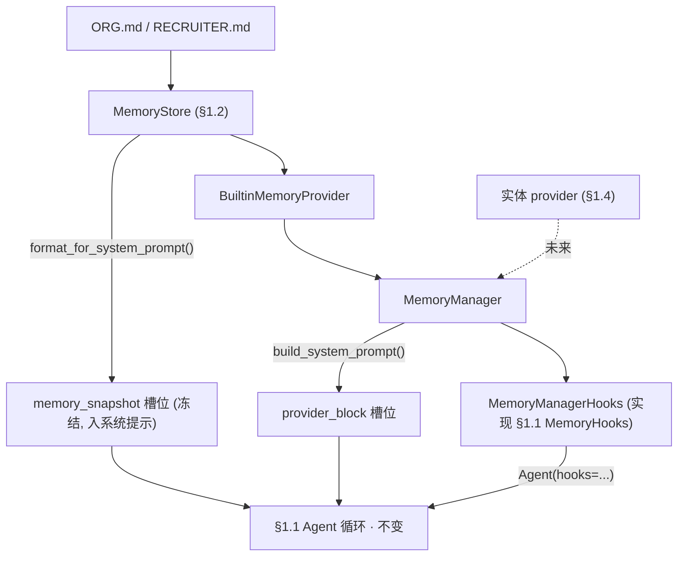
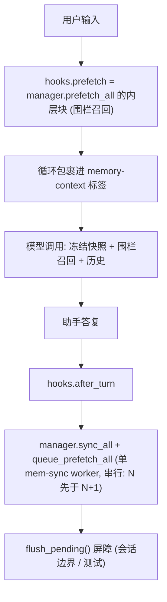

# 开发日志 · Phase 0 §1.3 — `MemoryProvider` + `MemoryManager`（记忆接缝）

> 我们如何移植 Hermes 的记忆编排，并在**不改动 `agent_loop.py`** 的前提下接入 agent 循环，以及为什么 agent 的
> *写*工具要等到 §1.5。属于构建日志。配套规格
> （`docs/superpowers/specs/2026-06-28-p0-1.3-memory-provider-manager-design.md`）与计划
> （`docs/superpowers/plans/2026-06-28-p0-1.3-memory-provider-manager.md`）。源码：`agent/src/jobpin_agent/memory/`。

## 本步骤交付什么

记忆子系统的**契约层**：统一的 `MemoryProvider` 接口，以及驱动每个 provider 走完生命周期的 `MemoryManager`——
使小体量的策展存储（§1.2）与未来大体量的检索存储（§1.4）对会话循环看起来一致。今天能看到的成果：**agent 的系统
提示现在包含你的 Org/Recruiter 标准**，且召回/同步生命周期已就位，供实体 provider 与治理接入。

这是来自 Hermes 的**第二次真实代码移植**——`agent/memory_provider.py` + `agent/memory_manager.py`，逐方法移植，
外加 `<memory-context>` 围栏。

## 接缝——如何在不改循环的前提下接入

§1.1 刻意在循环里留了一个 `MemoryHooks` 协议接缝。§1.3 的关键是一个小适配器 `MemoryManagerHooks`，它**通过委派给
`MemoryManager` 来实现该协议**。于是整个后端经 `Agent(..., hooks=...)` 接上——`agent_loop.py` 毫发无损（架构师评审
以 git 验证）。



注意**两个不同的系统提示槽位**（计划 §1.1 装配顺序）：策展的**冻结快照**经 `memory_snapshot` 槽位*直接由存储*进入
提示；各 provider 的**静态块**经 `manager.build_system_prompt()` 进入 `provider_block` 槽位。故内置 provider 的
`system_prompt_block()` 返回 `""`——在那里返回快照会造成重复。

## 每回合生命周期



## 围栏归属（循环拥有外层标签）

§1.1 循环已把召回包成 `<memory-context>\n{recall}\n</memory-context>`。故适配器的 `prefetch` 返回**内层**块——系统
注记 + 净化后的召回、不含外层标签——循环的包裹逐字节复现 Hermes 完整块。`sanitize_context` 剥离 provider 夹带的任何
围栏，使召回的简历文本无法伪造“权威”框定或越出围栏。（*真实*内容扫描——`threat_patterns`——与流式擦除器属 §1.6；
§1.3 的围栏是结构性容纳。）

## 后台串行落库（一个合规依赖）

`sync_all` / `queue_prefetch_all` 在**单工作线程** `ThreadPoolExecutor(max_workers=1,
thread_name_prefix="mem-sync")` 上运行。单 worker 保证**第 N 回合先于 N+1 落库**——后续“每步可审计”因果链所依赖的
顺序——且绝不阻塞回合。`flush_pending` 提交哨兵并等待（会话边界与测试的确定性屏障）。`shutdown_all` 经有界的 daemon
**监视**线程排空。

**诚实的说明（我们更正了一处 Hermes 注释）：** Hermes 说 worker “是 daemon，会随解释器消亡”。在 Python 3.9+ 线程池
worker 为**非 daemon**（注册了 `atexit` join），故仅 `shutdown_all` 有界——*永久*卡死的任务仍可能在解释器退出时被
join。wedged-provider 测试据此设计：它阻塞在一个**末尾释放**的 `threading.Event` 上，而非睡眠，从而在不拖挂拆解的
前提下证明该界。

## 为什么 agent 还不能*写*记忆（关键决策）

§1.3 移植了工具路由**机制**（`get_tool_schemas` / `handle_tool_call` / 核心工具影子守卫 / 单外部规则），并以 fake
provider 演练——但内置 provider **不暴露 `memory` 写工具**。这是刻意的，也是本节点所系的决策：

> 受治理的写门控——**拒绝缺少来源/同意标签的写入**（关键不变量 #4；PRD §9.6）——是*紧接着的下一个*节点 **§1.5**。
> 在该门控存在之前于 §1.3 交付一个实际的写工具，会打开*未受治理*的写路径。故面向模型的 `memory` 工具诞生于 §1.5、
> 位于门控之后。§1.2 存储的 `write_gate` 接缝已为它就位。

这一范围只有在通读**整个** PRD + 计划后才翻转（现已成为常规——`CLAUDE.md` §5“Context-first”）：孤立地读，§1.3
看似应交付写工具；对照依赖顺序读，受治理的工具显然属于 §1.5。

故策展内置 provider 在 §1.3 刻意**精简**：`prefetch`→`""`（按查询召回是 §1.4 的向量 provider）、`sync_turn`→空操作
（策展记忆为人工编辑）、`get_tool_schemas`→`[]`（写工具 §1.5）。它在此的价值是把文件存储变成一个 *Provider*——生命周期
参与者与 §1.6 所需的 `on_pre_compress` 接缝——并证明循环经 Manager 闭合。

## 相对 Hermes 的改动（及原因）

| 改动 | 原因 |
|---|---|
| `_strip_skill_scaffolding` 改为直通 | Jobpin 无 `/skill` 层；接缝为未来保留 |
| 本地 `tool_error` / `_CORE_TOOL_NAMES` | 替换 Hermes 的 `tools.registry` / `toolsets._HERMES_CORE_TOOLS` 导入 |
| `initialize_all` 不注入 `hermes_home` | Hermes 特有路径；Jobpin 用 `memory_dir` / 配置 |
| 新增 `build_memory_context_inner` | §1.1 循环拥有外层围栏标签；接缝返回内层块 |
| `StreamingContextScrubber` 不移植 | 流式未构建——落地 §1.6（`security/scrubber`） |
| `inject_memory_provider_tools` 不移植 | 面向模型的工具表面是 §1.5 |

移植在 `agent/THIRD_PARTY_NOTICES.md` 记为 **“Port”**，保留 MIT 版权，并在
`docs/security/p0-1.3-memory-provider-manager-review.md` 评审。

## 三方评审改了什么

三位评审（资深工程师 / 架构师 / 产品经理）对照计划检查——三方均返回 **YES**（移植逐方法忠实；边界稳健；符合
计划/PRD 意图）。所做改动：
1. **先修计划**（依“先修计划”规则，EN+中文）：§1.3 不再声称 Manager 预留 `entity_type` 路由表（实体路由位于
   `CompositeMemoryProvider` §3.2——Manager 仅预留单外部槽位 + 工具路由接缝）；更正不准确的“（worker 为 daemon）”；
   退出措辞现说明策展内置每回合按设计为惰性；并加前瞻提示标注 §1.4 的两个外部 provider 需 Phase-2 的 Composite。
2. **更强的失败隔离测试**（资深工程师）：旧测试让健康 provider 被单外部规则静默拒绝（死代码）——现在在同一 manager
   中同时注册一个*抛错*与一个*健康* provider，断言健康召回在异常中**存活**。
3. 新增**工具交错的 `after_turn` 测试**（证明 `_last_text` 在中间工具调用回合之间选中最终助手答复）；更正 manager.py
   的 daemon-worker 注释；并注明组合助手把按会话生命周期留给调用方（在 §1.4 才重要）。

## 自己运行

```bash
cd agent
python -m pytest -q                  # 70 passed, 1 skipped（OpenAI 集成测试；可选）
python examples/memory_agent_demo.py # 一个真实 §1.1 回合：Org 快照入提示 + 围栏召回 + 同步
```

## 这一步如何为 §1.4 / §1.5 / §1.6 铺路

- **§1.4** 在同一 `MemoryProvider` 接口背后加入实体 provider（候选 / 语义）；其 `prefetch` 经此处已接好的接缝返回真实
  按查询召回。（届时需协调单外部规则——见前瞻提示。）
- **§1.5** 加入治理写门控与面向模型的 `memory` 工具——诞生即受治理，经此处移植（并 fake 测试）的 `handle_tool_call`
  机制路由。
- **§1.6** 把 `on_pre_compress` 捕获进压缩摘要（内置 provider 已暴露该接缝），并移植真实 `threat_patterns` 扫描 +
  `StreamingContextScrubber`。
