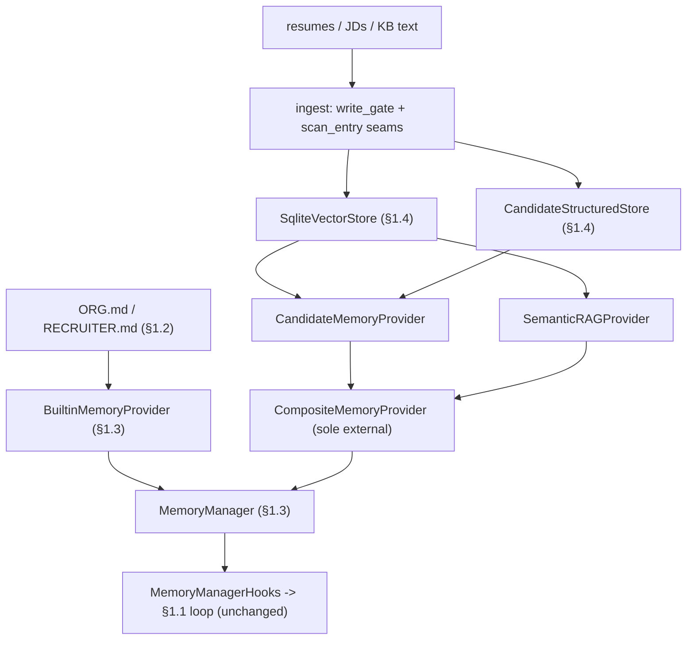
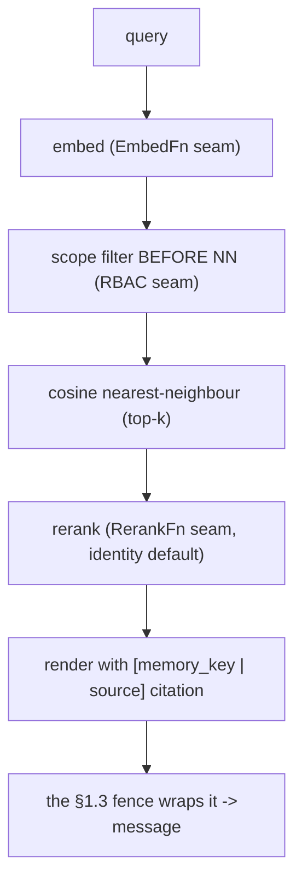

# Devlog · Phase 0 §1.4 — embedded vector store + Candidate/Semantic providers (+ minimal Composite)

> How we built the large-volume **retrieval** memory layer behind the §1.3 `MemoryProvider` contract —
> dependency-light, offline, and with `agent_loop.py` still untouched — and why two providers forced a
> minimal Composite. Part of the build journal. Pairs with the spec
> (`docs/superpowers/specs/2026-06-28-p0-1.4-vector-entity-providers-design.md`) and plan
> (`…/plans/2026-06-28-p0-1.4-vector-entity-providers.md`). Source: `agent/src/jobpin_agent/memory/`.

## What this step delivers

The Memory Subsystem's **second layer**. §1.2/§1.3 gave the small-volume, hand-curated store (Org /
Recruiter standards). §1.4 adds the **large-volume, retrieval** layer (PRD §9.3): vectorise candidates
and knowledge-base text, store + retrieve **locally**, and present it upward through the **same §1.3
`MemoryProvider` interface** — so the loop can't tell a file store from a vector store. You can see it
work: `python examples/recall_demo.py` ingests résumés and an NL query recalls the right candidate
**with a back-to-source citation**, reaching a real §1.1 Agent as a `<memory-context>` message — **no
loop change**.

This is **new, design-derived code** (not a Hermes file port); it implements the ported §1.3 contract
and reuses the §1.3 `MemoryManager` / fence. It was built — and committed — in independently-tested
layers: embedding → vector store → structured store → providers → Composite → re-embed → benchmark → e2e.

## How it wires together (two layers, one interface)



## Why a minimal Composite (the decision this point forced)

§1.3's Manager allows **one** external provider (the builtin curated store is always first). §1.4 lands
**two** retrieval providers — Candidate + Semantic — so they'd trip that rule. The Plan parked the
relaxation (`CompositeMemoryProvider`) in Phase 2 §3.2, but the trigger ("≥2 coexisting providers")
actually fires **here**. So rather than relax the rule, we brought a **minimal** Composite forward: it
registers as the **sole** external provider and holds the two internally —

- `prefetch` **broadcasts** to the sub-providers, then **merges** (split on `ENTRY_DELIMITER` →
  order-preserving `dict.fromkeys` dedup → truncate to a char budget);
- `sync` **unicasts** by `entity_type` (else fans out); hooks fan out; `shutdown` runs in reverse.

It runs entirely **inside** the §1.3 single-worker / `flush_pending` / bounded-drain machinery and adds
no threads, so those invariants hold. The **full** Composite (Employee sub-provider, the
`entity_type`+intent routing table, the merge-consistency matrix, backup aggregation) stays Phase 2
§3.2 — and we corrected the Plan (EN+中文) to say so.

## The retrieval path (`prefetch` = retrieval, fast, cited)



**Filter before nearest-neighbour (a compliance property, not an afterthought).** RBAC scoping is
applied to `VectorStore.search` **before** the top-k truncation (`search(scope=…)`), so an unauthorised
record can never be scored, returned, or *displace an authorised one out of the top-k*. The Candidate
provider narrows to the allowed `memory_key` set (from the structured store) and searches with that
scope; the Semantic provider passes its scope straight through. This closes the "retrieve first, filter
later" leak of an unauthorised candidate's very existence (Plan §1.4 / §1.5). The real RBAC policy lands
at §1.5; §1.4 ships the **seam** (default open) wired on the correct side of NN.

## Dependency-light, everything heavy behind a seam

Per the brainstorm, §1.4 commits **no new dependency** and parks every heavy/governed piece behind an
injected, default-safe seam — the same discipline as §1.2's `scan_entry` and §1.3's write-tool deferral:

| Seam | §1.4 default | Real impl |
|---|---|---|
| `VectorStore` backend | stdlib `SqliteVectorStore` (brute-force cosine) | sqlite-vec / LanceDB — **§1.12** spike |
| `EmbedFn` | hashing bag-of-words (lexical overlap) | BGE-local / OpenAI — **config** |
| `RerankFn` | `identity_rerank` (keep cosine order) | hybrid (BM25+dense) / cross-encoder — **§1.12/Phase 1** |
| `write_gate` | pass-through | the **§1.5** governance gate (reject unlabelled) |
| `scan_entry` | pass-through | the **§1.6** `threat_patterns` scan |
| `scope_filter` (RBAC) | open | **§1.5** RBAC |

The fake embedder deserves a note: it's a deterministic **lexical** vectoriser (hash tokens → count →
normalise), enough to prove the *pipeline* offline — "Python engineer" ~ "python developer" share a
dimension. It is **not** a semantic model and **not** a security control; real semantic recall is a
config swap, validated by the §1.12 benchmark.

## Two more mechanisms worth calling out

- **Vector-space integrity (drift guard).** The store pins **one** `embed_version` and rejects a record
  from a different vector space — no silent mixing. Switching embedders is therefore an explicit
  **re-embed migration** (`vector/reembed.py`): re-embed every record's text into a fresh store,
  validate (every `vector_id` present, one pinned version), then the caller switches. It is **resumable**
  — the destination store *is* the checkpoint, so an interrupted run finishes where it left off, and the
  source stays queryable until the switch (retrieval never mixes versions).
- **Erasure cascade (the §1.5 mechanism, built here).** `delete(memory_key)` removes a subject's
  structured row **and** derived vectors (`delete_by_key_prefix` on both, exact-or-nested match). The
  §1.5 erasure *pipeline* will call this; §1.4 builds the mechanism, not the policy.

## What the triple-review changed

All three reviewers (senior engineer / architect / PM) returned **YES** (port-style faithful, boundaries
sound, "no `agent_loop.py` change" git-verified). Two **MAJOR**s and several MINORs were fixed:
1. **Semantic filtered *after* NN** (SE + architect, reproduced) — a retrieve-then-filter leak that
   contradicted the point's headline property. Fixed by adding a `scope` predicate to `VectorStore.search`
   applied **before** the top-k; both providers now filter-before-NN (and Candidate's per-key loop
   collapsed into one scoped search).
2. **Missing rerank interface** (PM) — Plan §1.4 / PRD §11.3 call for a rerank seam, and the spec
   over-claimed it. Added `RerankFn` + an identity default; real hybrid/cross-encoder rerank → §1.12.
3. MINORs: `reembed` typed to the `VectorStore` ABC (added `all_records()` to it) so it's backend-agnostic;
   `_validate` by `vector_id` existence (a cosine self-match false-negatives on a zero-vector sample);
   `cosine` asserts equal length (no silent dim drift); `scan_entry` seam added to both providers' ingest
   and `write_gate` to Semantic too (symmetry); the brittle hash-collision-dependent test assertions were
   made deterministic; and the Plan's Phase-0 "Out of Scope" line gained the minimal-Composite caveat (EN+中文).

A couple of items are **forward-flagged** (not §1.4 bugs): the Composite's unicast/non-primary-skip
branches aren't reached through `MemoryManager.sync_all` yet (which doesn't pass `entity_type`/`agent_context`)
— they wire up when the real write/feedback loop lands (§1.5/Phase 1/§3.2); and the per-`(query,session)`
recall cache must become principal-scoped when §1.5 injects per-user RBAC.

## Run it yourself

```bash
cd agent
python -m pytest -q                  # 104 passed, 1 skipped (OpenAI integration; opt-in)
python examples/recall_demo.py       # resume -> vectorize -> the right candidate + citation, fenced, no loop change
```

## How this sets up §1.5 / §1.6 / §1.12

- **§1.5 (governance)** plugs real impls into the seams already wired here: the `write_gate` (reject
  writes lacking provenance/consent labels), the `scope_filter` (RBAC, already on the correct side of NN),
  and the erasure *pipeline* over the cascade mechanism built here.
- **§1.6 (injection defence)** supplies the real `threat_patterns` scanner behind the `scan_entry` seam.
- **§1.12 (spike)** chooses the production vector backend (sqlite-vec / LanceDB) — a swap behind the
  `VectorStore` ABC — and the benchmark scaffold here provides its recall/P95 data.
