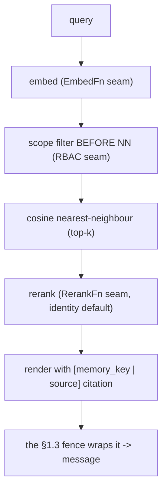

# Devlog · Phase 0 §1.4 — embedded vector store + Candidate/Semantic providers (+ minimal Composite)

> The large-volume **retrieval** memory layer, behind the §1.3 `MemoryProvider` contract — stdlib-only,
> offline, `agent_loop.py` untouched. Spec: `docs/superpowers/specs/2026-06-28-p0-1.4-vector-entity-providers-design.md`;
> plan: `…/plans/2026-06-28-p0-1.4-vector-entity-providers.md`. Source: `agent/src/jobpin_agent/memory/`.

## 1. What this delivers

The Memory Subsystem's **second layer**. §1.2/§1.3 gave the small-volume curated store (Org/Recruiter).
§1.4 adds the **large-volume retrieval layer** (PRD §9.3): vectorise candidates + knowledge-base text,
store + retrieve **locally**, presented upward through the **same §1.3 `MemoryProvider` interface**.
Satisfies Plan §1.4 deliverables: `memory/vector` (add/delete/NN/**rerank** interface), `memory/providers/{candidate,semantic}`,
a **re-embed migration tool** (resumable), and a **recall+P95 benchmark scaffold** — plus a **minimal
`CompositeMemoryProvider`** brought forward from Phase 2 §3.2 (two retrieval providers = the ≥2 trigger).
New, design-derived code (not a Hermes file port); built + committed in independently-tested layers.

## 2. Files added/changed

| Path | What it contains |
|---|---|
| `memory/embedding.py` | `EmbedFn` type, `hashing_embedder(dim)`, `cosine(a,b)`, `embed_version(name,dim)` |
| `memory/vector/record.py` | `VectorRecord` dataclass, `new_id()` |
| `memory/vector/store.py` | `VectorStore` ABC, `SqliteVectorStore`, `Hit` type, `_escape_like`, `_row_to_record` |
| `memory/vector/rerank.py` | `RerankFn` type, `identity_rerank` |
| `memory/vector/reembed.py` | `reembed(...)`, `ReembedResult`, `_validate` |
| `memory/structured.py` | `CandidateRow`, `CandidateStructuredStore` |
| `memory/providers/retrieval_base.py` | `RetrievalProvider` (cache + rerank + citation render) |
| `memory/providers/semantic.py` | `SemanticRAGProvider` |
| `memory/providers/candidate.py` | `CandidateMemoryProvider` |
| `memory/providers/composite.py` | `CompositeMemoryProvider` (minimal) |
| `memory/benchmark.py` | `run_recall_benchmark(...)` |
| `examples/recall_demo.py` | end-to-end recall demo (`run_demo()`) |
| `tests/test_{embedding,vector_store,structured_store,semantic_provider,candidate_provider,composite_provider,reembed,benchmark,recall_demo}.py` | the acceptance suite (26 new tests) |

## 3. The public surface (API)

```python
# embedding.py
EmbedFn = Callable[[str], list[float]]
hashing_embedder(dim: int = 256) -> EmbedFn          # deterministic lexical vectoriser (the §1.4 default)
cosine(a: list[float], b: list[float]) -> float      # raises ValueError on length mismatch; 0.0 if a zero vector
embed_version(name: str, dim: int) -> str            # "name@dim", e.g. "hash@256"

# vector/record.py  — Hit = tuple[VectorRecord, float]
VectorRecord(memory_key, embed_model, embed_version, struct_ref, source_ref, text, embedding, vector_id=new_id())

# vector/store.py
class VectorStore(ABC):
    add(records: list[VectorRecord]) -> None                       # drift-guarded (single embed_version)
    delete(vector_ids: list[str]) -> int
    delete_by_key_prefix(prefix: str) -> int                       # erasure cascade (exact-or-nested)
    search(query, k, *, key_prefix=None, scope: Callable[[str],bool]|None=None) -> list[Hit]  # filter BEFORE top-k
    current_version() -> set[str]                                  # distinct embed_versions on disk
    all_records() -> list[VectorRecord]
SqliteVectorStore(db_path: str = ":memory:")

# vector/rerank.py
RerankFn = Callable[[str, list[Hit]], list[Hit]]
identity_rerank(query, hits) -> hits                 # the §1.4 default (keep cosine order)

# vector/reembed.py
reembed(src_store, dst_store, new_embed_fn, new_version, *, new_embed_model="hash", limit=None) -> ReembedResult
ReembedResult(total, migrated, done, complete, validated, new_version)

# structured.py
CandidateRow(memory_key, name="", skills=[], years=0, location="", work_rights=False, consent_status="unknown")
class CandidateStructuredStore(db_path=":memory:"):
    upsert(row) -> None;  get(memory_key) -> CandidateRow|None;  filter(pred) -> list[CandidateRow];  delete_by_key_prefix(prefix) -> int

# providers/semantic.py  (name == "semantic", entity_type == "semantic")
SemanticRAGProvider(vector_store, embed_fn, *, embed_model="hash", embed_version="hash@256",
                    scope_filter=None, write_gate=None, scan_entry=None, rerank=None, k=4)
    .ingest(doc_id, text, *, memory_key, source_ref) -> dict      # {success, ingested} | {blocked} | {staged}
    .prefetch(query, *, session_id="") -> str                    # fenced-ready recall with citations

# providers/candidate.py  (name == "candidate", entity_type == "candidate")
CandidateMemoryProvider(vector_store, structured_store, embed_fn, *, embed_model="hash", embed_version="hash@256",
                        scope_filter=None, write_gate=None, scan_entry=None, rerank=None, k=4)
    .ingest(candidate: CandidateRow, chunks: list[tuple[str,str]]) -> dict   # {success, ingested, skipped} | {staged}
    .delete(memory_key) -> {"structured": n, "vectors": m}       # erasure cascade
    .prefetch(query, *, session_id="") -> str

# providers/composite.py  (name == "composite")
CompositeMemoryProvider(sub_providers: list[MemoryProvider], *, char_budget=4000)

# benchmark.py
run_recall_benchmark(provider, queries: list[tuple[str,str]], *, k=4) -> {"n","recall_at_k","p95_ms","mean_ms"}
```

## 4. Data structures & formats

- **`VectorRecord`** fields: `vector_id:str` (uuid), `memory_key:str` (`tenant:org:entity_type:entity_id` — RBAC + erasure anchor), `embed_model:str`, `embed_version:str`, `struct_ref:str` (→ structured row), `source_ref:str` (→ original chunk; the citation), `text:str` (kept inline), `embedding:list[float]`.
- **Vector SQL schema**: `vectors(vector_id TEXT PK, memory_key TEXT, embed_model TEXT, embed_version TEXT, struct_ref TEXT, source_ref TEXT, text TEXT, embedding TEXT)` — `embedding` is `json.dumps(list[float])`.
- **Structured SQL schema**: `candidates(memory_key TEXT PK, name TEXT, skills TEXT, years INTEGER, location TEXT, work_rights INTEGER, consent_status TEXT)` — `skills` is JSON.
- **`embed_version` format**: `"<name>@<dim>"` (e.g. `"hash@256"`). A record whose version ≠ the store's pinned version is rejected.
- **Recall entry / citation format** (what reaches the prompt): each hit renders as
  `"<text>\n[memory_key: <key> | source: <source_ref>]"`, entries joined by `ENTRY_DELIMITER` (`"\n§\n"`, reused from §1.2). The §1.3 fence then wraps the whole thing in `<memory-context>…</memory-context>`.

## 5. Key mechanisms (with the actual code)

**Hashing embedder** (`embedding.py`) — deterministic lexical vector; tokens → hashed buckets → L2-normalise:
```python
for tok in re.findall(r"[a-z0-9]+", text.lower()):
    h = int(hashlib.blake2b(tok.encode(), digest_size=8).hexdigest(), 16)
    vec[h % dim] += 1.0
norm = math.sqrt(sum(x*x for x in vec)); return [x/norm for x in vec] if norm else vec
```

**Filter-before-NN** (`vector/store.py::SqliteVectorStore.search`) — the scope predicate runs *before* scoring/truncation, so an out-of-scope record can't be scored, returned, or displace an in-scope hit:
```python
for row in rows:                      # rows optionally pre-filtered by key_prefix in SQL
    rec = _row_to_record(row)
    if scope is not None and not scope(rec.memory_key):
        continue                      # <-- filter BEFORE cosine + before [:k]
    score = cosine(query, rec.embedding)
    if score > 0.0: scored.append((rec, score))
scored.sort(key=lambda h: h[1], reverse=True); return scored[:k]
```

**Drift guard** (`store.add`) — pin one `embed_version`, reject foreign vectors (no silent mixing):
```python
pinned = self.current_version() or {single version of the batch}   # first add pins
for r in records:
    if r.embed_version not in pinned: raise ValueError("embed_version drift …")
```

**Candidate `_retrieve`** — RBAC filter (structured) FIRST, then one scoped vector search:
```python
allowed = {r.memory_key for r in self._struct.filter(lambda r: self._scope(r.memory_key))}
if not allowed: return []
return self._vec.search(self._embed(query), self._k, scope=lambda mk: mk in allowed)
```

**Composite `prefetch`** — broadcast → split on `ENTRY_DELIMITER` → order-preserving dedup → budget-truncate:
```python
entries = [e.strip() for e in ENTRY_DELIMITER.join(parts).split(ENTRY_DELIMITER) if e.strip()]
kept, total = [], 0
for e in dict.fromkeys(entries):                        # dedup, order-preserving
    add = len(e) + (len(ENTRY_DELIMITER) if kept else 0)
    if total + add > self._budget: break                # truncate by relevance order
    kept.append(e); total += add
return ENTRY_DELIMITER.join(kept)
```

**Re-embed migration** (`vector/reembed.py`) — destination store *is* the checkpoint (resume skips done ids); validate by id-set equality, not a cosine self-match:
```python
done_ids = {r.vector_id for r in dst_store.all_records()}
for rec in src_store.all_records():
    if rec.vector_id in done_ids: continue              # resume
    if limit is not None and migrated >= limit: break   # simulate interrupt
    dst_store.add([VectorRecord(..., embed_version=new_version, embedding=new_embed_fn(rec.text), vector_id=rec.vector_id)])
# _validate: dst.current_version()=={new_version} AND {src ids} == {dst ids}
```

## 6. Design decisions & why

- **Dependency-light backend.** A stdlib `SqliteVectorStore` (brute-force cosine) instead of a real vector DB — O(n) is well under the P95 target at the stated hundreds–thousands scale, and the production backend (sqlite-vec/LanceDB, **§1.12**) is a swap behind the `VectorStore` ABC. No new dependency.
- **Embedding is an injected seam.** The hashing embedder gives real *lexical* overlap offline (so tests + the demo recall correctly) but is **not** semantic and **not** a security control; real BGE/OpenAI is a config swap behind `EmbedFn` — and a model swap triggers the re-embed migration.
- **Governance behind seams, not built ahead.** Ingest goes through a pass-through `write_gate` + `scan_entry`; recall RBAC is a pass-through `scope_filter` wired *before* NN. The real impls are §1.5/§1.6 — same discipline as §1.3's deferred write tool, so no ungoverned/unscanned/unfiltered path is opened early.
- **Minimal Composite, brought forward.** Two retrieval providers would trip §1.3's single-external rule. Rather than relax it, a *minimal* Composite is the **sole** external provider holding both; it runs inside the §1.3 single-worker/flush/drain machinery and adds no threads. The full Composite (Employee, routing table, merge-consistency) stays Phase 2 §3.2. The Plan was corrected (EN+中文) to record this.

## 7. Seams & deferrals

| Seam (signature) | §1.4 default | Real impl |
|---|---|---|
| `VectorStore` backend | `SqliteVectorStore` | sqlite-vec / LanceDB — **§1.12** |
| `EmbedFn = (str)->list[float]` | `hashing_embedder` | BGE-local / OpenAI — **config** |
| `RerankFn = (str, hits)->hits` | `identity_rerank` | hybrid (BM25+dense) / cross-encoder — **§1.12/Phase 1** |
| `write_gate(action, target, content)->str?` | pass-through | **§1.5** governance gate |
| `scan_entry(text)->str?` | pass-through | **§1.6** `threat_patterns` |
| `scope_filter(memory_key)->bool` | open | **§1.5** RBAC (already wired before NN) |

## 8. Tests & acceptance (104 passed, 1 skipped overall; 26 new for §1.4)

| Test file | Cases → what each proves |
|---|---|
| `test_embedding.py` | lexical overlap > disjoint cosine; deterministic + L2-normalised; `embed_version` signature |
| `test_vector_store.py` | cosine ranking; `key_prefix` pre-filter; `delete_by_key_prefix` cascade (count); drift guard rejects foreign version; empty-store mixed-version pin rejected; zero-score query → `[]`, `k>corpus` |
| `test_structured_store.py` | upsert/get round-trip (skills list); predicate `filter`; key-prefix delete |
| `test_semantic_provider.py` | ingest→recall **with `[source: …]` citation**; sync no-op; queue→prefetch cache; **scope filters before top-k** (in-scope lower hit survives an out-of-scope higher hit); **rerank reorders**; `scan_entry` blocks ingest |
| `test_candidate_provider.py` | ingest→recall with citation; **scope_filter excludes → `""`**; `delete` cascades structured+vectors (counts); `write_gate` holds ingest; zero-chunk ingest; `scan_entry` skips a flagged chunk |
| `test_composite_provider.py` | prefetch merge + dedup; budget truncation; **sole-external on a real `MemoryManager`** (2nd external rejected); unicast vs fan-out sync (+ non-primary skip); **prefetch failure-isolation**; reverse-order shutdown; block concat |
| `test_reembed.py` | full re-embed + validate; **resume-after-interrupt** skips done records, finishes |
| `test_benchmark.py` | `recall_at_k∈[0,1]`, `p95_ms` float, `n` |
| `test_recall_demo.py` | **end-to-end**: résumé→ingest→NL recall + citation reaches a real §1.1 `Agent`'s model as a `<memory-context>` message; turn answers |

**Maps to Plan §1.4 Exit Criteria:** (a) recall with back-to-source provenance → `test_candidate/semantic_provider` + `test_recall_demo`; (b) re-embed after a version switch, resumable → `test_reembed`; (c) recall P95 at scale → `benchmark` scaffold (thresholds deferred to §1.15/Phase 1).

## 9. How it wires together

```mermaid
flowchart TD
    ORG["ORG.md / RECRUITER.md (§1.2)"] --> BUILTIN["BuiltinMemoryProvider (§1.3)"]
    RES["resumes / JDs / KB text"] --> ING["ingest: write_gate + scan_entry seams"]
    ING --> VEC["SqliteVectorStore (§1.4)"]
    ING --> STR["CandidateStructuredStore (§1.4)"]
    VEC --> CAND["CandidateMemoryProvider"]
    STR --> CAND
    VEC --> SEM["SemanticRAGProvider"]
    CAND --> COMP["CompositeMemoryProvider (sole external)"]
    SEM --> COMP
    BUILTIN --> MGR["MemoryManager (§1.3)"]
    COMP --> MGR
    MGR --> HOOKS["MemoryManagerHooks -> §1.1 loop (unchanged)"]
```





## 10. Run it yourself

```bash
cd agent
python -m pytest -q                  # 104 passed, 1 skipped (OpenAI integration; opt-in)
python examples/recall_demo.py       # resume -> vectorize -> the right candidate + citation, fenced, no loop change
```
`recall_demo.py` output: `{"recall_in_prompt": true, "has_citation": true, "fenced": true, "answer": "Ada Lovelace is the strongest match."}`.

## 11. What the triple-review changed

All three reviewers (senior engineer / architect / PM) returned **YES** ("no `agent_loop.py` change" git-verified). Two **MAJOR**s + MINORs fixed:
1. **Semantic filtered *after* NN** (SE + architect, reproduced) — a retrieve-then-filter leak. Fixed by the `scope` predicate on `search` (filter before top-k); both providers now filter-before-NN; Candidate's per-key loop collapsed to one scoped search.
2. **Missing rerank interface** (PM) — Plan §1.4/PRD §11.3 require it and the spec over-claimed it. Added `RerankFn` + `identity_rerank`; real hybrid/cross-encoder → §1.12.
3. MINORs: `reembed` typed to the `VectorStore` ABC (added `all_records()`); `_validate` by `vector_id` (a cosine self-match false-negatives on zero vectors); `cosine` length guard; `scan_entry` seam on both ingests + `write_gate` on Semantic too; 8 added edge tests; brittle hash-collision assertions made deterministic; Plan Phase-0 Out-of-Scope caveat (EN+中文).

**Forward-flagged (not §1.4 bugs):** the Composite's unicast/non-primary-skip branches aren't reached through `MemoryManager.sync_all` yet (it doesn't pass `entity_type`/`agent_context`) — wired when the real write/feedback loop lands (§1.5/Phase 1/§3.2); and the per-`(query,session)` recall cache must become principal-scoped when §1.5 injects per-user RBAC.

## 12. How this sets up §1.5 / §1.6 / §1.12

- **§1.5 (governance)** plugs real impls into the seams already wired here: `write_gate` (reject unlabelled writes), `scope_filter` (RBAC, already before NN), and the erasure *pipeline* over the `delete_by_key_prefix` cascade mechanism. The model-facing `memory` **write tool** is born governed here too.
- **§1.6 (injection defence)** supplies the real `threat_patterns` scanner behind `scan_entry`.
- **§1.12 (spike)** chooses the production vector backend (swap behind `VectorStore`); the benchmark scaffold here feeds its recall/P95 numbers.
