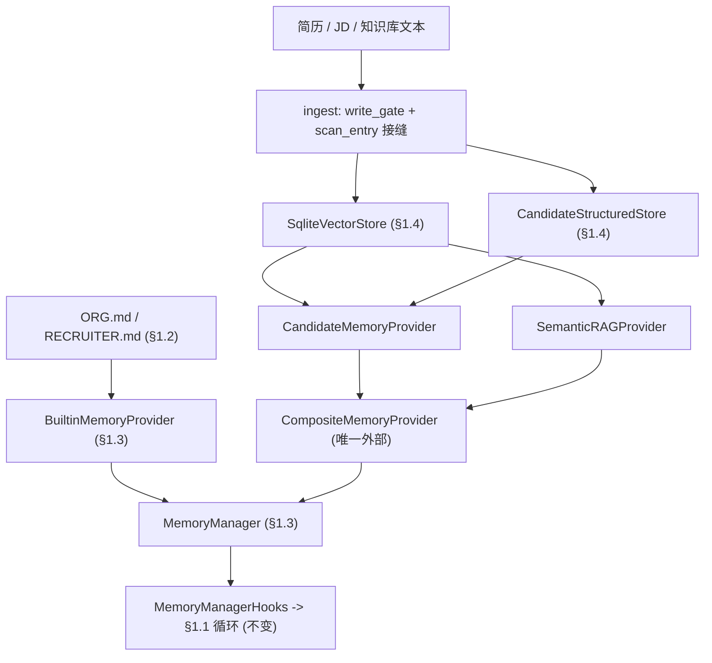
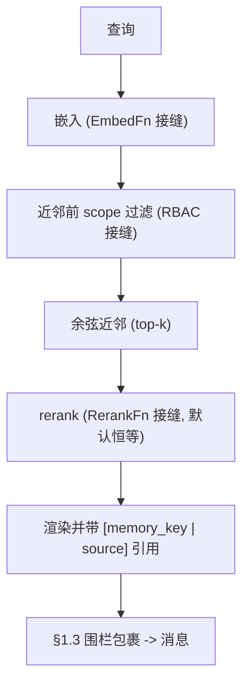

# 开发日志 · Phase 0 §1.4 — 嵌入式向量库 + Candidate/Semantic provider（+ 最小 Composite）

> 我们如何在 §1.3 `MemoryProvider` 契约背后构建大体量**检索**记忆层——无依赖、离线、且 `agent_loop.py` 仍未改动——
> 以及为什么两个 provider 逼出了一个最小 Composite。属于构建日志。配套规格
> （`docs/superpowers/specs/2026-06-28-p0-1.4-vector-entity-providers-design.md`）与计划
> （`…/plans/2026-06-28-p0-1.4-vector-entity-providers.md`）。源码：`agent/src/jobpin_agent/memory/`。

## 本步骤交付什么

记忆子系统的**第二层**。§1.2/§1.3 给出小体量、人工策展的存储（Org / Recruiter 标准）。§1.4 加入**大体量、检索**层
（PRD §9.3）：把候选人与知识库文本向量化、**本地**存储与检索，并经**同一 §1.3 `MemoryProvider` 接口**向上呈现——使
循环分不清文件存储与向量存储。你能看到它工作：`python examples/recall_demo.py` ingest 简历后，一个 NL 查询召回正确
候选人**并带回到来源的引用**，以 `<memory-context>` 消息到达真实 §1.1 Agent——**不改动循环**。

这是**新的、设计衍生的代码**（非 Hermes 文件移植）；它实现已移植的 §1.3 契约并复用 §1.3 `MemoryManager` / 围栏。它以
独立测试的分层构建并提交：嵌入 → 向量库 → 结构化库 → provider → Composite → 重嵌入 → 基准 → 端到端。

## 如何接线（两层，一个接口）



## 为什么要一个最小 Composite（本节点逼出的决策）

§1.3 的 Manager 仅允许**一个**外部 provider（内置策展存储始终最先）。§1.4 落地**两个**检索 provider——Candidate +
Semantic——会触发该规则。计划把放宽（`CompositeMemoryProvider`）停在 Phase 2 §3.2，但触发信号（“并存 provider ≥ 2”）
其实在**此处**已触发。故我们不放宽规则，而是把一个**最小** Composite 提前：它注册为**唯一**外部 provider，内部容纳两者——

- `prefetch` 向子 provider **广播**，再**归并**（按 `ENTRY_DELIMITER` 切分 → 保序 `dict.fromkeys` 去重 → 按字符预算截断）；
- `sync` 按 `entity_type` **单播**（否则扇出）；钩子扇出；`shutdown` 逆序运行。

它完全在 §1.3 单 worker / `flush_pending` / 有界排空机制**内部**运行且不增线程，故这些不变量保持。**完整** Composite
（Employee 子 provider、`entity_type`+意图路由表、归并一致性矩阵、备份聚合）仍留 Phase 2 §3.2——我们已据此更正计划（EN+中文）。

## 检索路径（`prefetch` = 检索，快、带引用）



**先过滤再近邻（一个合规性质，而非事后补丁）。** RBAC 范围限定在 `VectorStore.search` 的 top-k 截断**之前**应用
（`search(scope=…)`），使未授权记录绝不会被打分、返回，或*把已授权记录挤出 top-k*。Candidate provider 收窄到允许的
`memory_key` 集合（来自结构化库）并以该范围搜索；Semantic provider 直接透传其范围。这堵住了“先检索后过滤”泄漏未授权
候选人存在性（计划 §1.4 / §1.5）。真实 RBAC 策略在 §1.5 落地；§1.4 交付**接缝**（默认放行），并接在近邻的正确一侧。

## 无依赖，所有重活在接缝之后

依照头脑风暴，§1.4 **不引入新依赖**，并把每个重/受治理的部分停在注入式、默认安全的接缝之后——与 §1.2 的 `scan_entry`、
§1.3 的写工具推迟同一纪律：

| 接缝 | §1.4 默认 | 真实实现 |
|---|---|---|
| `VectorStore` 后端 | 标准库 `SqliteVectorStore`（暴力余弦） | sqlite-vec / LanceDB —— **§1.12** spike |
| `EmbedFn` | 哈希词袋（词面重叠） | BGE-local / OpenAI —— **配置** |
| `RerankFn` | `identity_rerank`（保持余弦顺序） | 混合（BM25+dense）/ 交叉编码器 —— **§1.12/Phase 1** |
| `write_gate` | 直通 | **§1.5** 治理门控（拒绝未标注） |
| `scan_entry` | 直通 | **§1.6** `threat_patterns` 扫描 |
| `scope_filter`（RBAC） | 放行 | **§1.5** RBAC |

fake 嵌入器值得一提：它是确定性的**词面**向量化器（哈希 token → 计数 → 归一化），足以离线证明*流水线*——"Python
engineer" 与 "python developer" 共享一个维度。它**不是**语义模型、**不是**安全控制；真实语义召回是配置切换，由 §1.12
基准验证。

## 另外两个值得点名的机制

- **向量空间完整性（漂移守卫）。** 存储固定**一个** `embed_version` 并拒绝来自不同向量空间的记录——不静默混用。故切换
  嵌入器是显式**重嵌入迁移**（`vector/reembed.py`）：把每条记录的文本重嵌入到新存储、校验（每个 `vector_id` 在位、单一
  固定版本），再由调用方切换。它**可恢复**——目标存储即检查点，故被中断的运行可续，且源在切换前仍可查（检索绝不混版本）。
- **擦除级联（§1.5 机制，在此构建）。** `delete(memory_key)` 删除主体的结构化行**与**派生向量（两者 `delete_by_key_prefix`，
  精确或嵌套匹配）。§1.5 擦除*流水线*将调用它；§1.4 构建机制，而非策略。

## 三方评审改了什么

三位评审（资深工程师 / 架构师 / 产品经理）均返回 **YES**（移植级忠实、边界稳健、“不改 `agent_loop.py`”经 git 验证）。
修复了两个 **MAJOR** 与若干 MINOR：
1. **Semantic 在近邻*之后*过滤**（资深 + 架构师，已复现）——一个先检索后过滤的泄漏，违背本节点的标志性质。修复：给
   `VectorStore.search` 加 `scope` 谓词、在 top-k **之前**应用；两个 provider 现均先过滤再近邻（Candidate 的逐键循环并为
   一次带范围搜索）。
2. **缺失 rerank 接口**（产品）——计划 §1.4 / PRD §11.3 要求 rerank 接缝，而规格过度声称。新增 `RerankFn` + 恒等默认；
   真实混合/交叉编码器 rerank → §1.12。
3. MINOR：`reembed` 类型改为 `VectorStore` ABC（为其加 `all_records()`）以后端无关；`_validate` 改按 `vector_id` 存在性
   （余弦自匹配在零向量样本上会误报缺失）；`cosine` 断言等长（无静默维度漂移）；两个 provider 的 ingest 加 `scan_entry` 接缝、
   Semantic 也加 `write_gate`（对称）；把依赖哈希碰撞的脆弱断言改为确定性；计划 Phase-0 “Out of Scope” 行补上最小 Composite
   说明（EN+中文）。

有两项**前瞻标注**（非 §1.4 缺陷）：Composite 的单播/非 primary 跳过分支目前未经 `MemoryManager.sync_all` 触达（它不传
`entity_type`/`agent_context`）——待真实写/反馈循环落地时接好（§1.5/Phase 1/§3.2）；按 `(query,session)` 的召回缓存在
§1.5 注入按用户 RBAC 时须改为按主体隔离。

## 自己运行

```bash
cd agent
python -m pytest -q                  # 104 passed, 1 skipped（OpenAI 集成测试；可选）
python examples/recall_demo.py       # 简历 -> 向量化 -> 正确候选人 + 引用，围栏，不改循环
```

## 这一步如何为 §1.5 / §1.6 / §1.12 铺路

- **§1.5（治理）** 把真实实现插入此处已接好的接缝：`write_gate`（拒绝缺来源/同意标签的写入）、`scope_filter`（RBAC，已在
  近邻正确一侧）、以及基于此处级联机制的擦除*流水线*。
- **§1.6（注入防御）** 在 `scan_entry` 接缝后提供真实 `threat_patterns` 扫描器。
- **§1.12（spike）** 选定生产向量后端（sqlite-vec / LanceDB）——在 `VectorStore` ABC 背后替换——而此处的基准脚手架为其提供
  召回/P95 数据。
