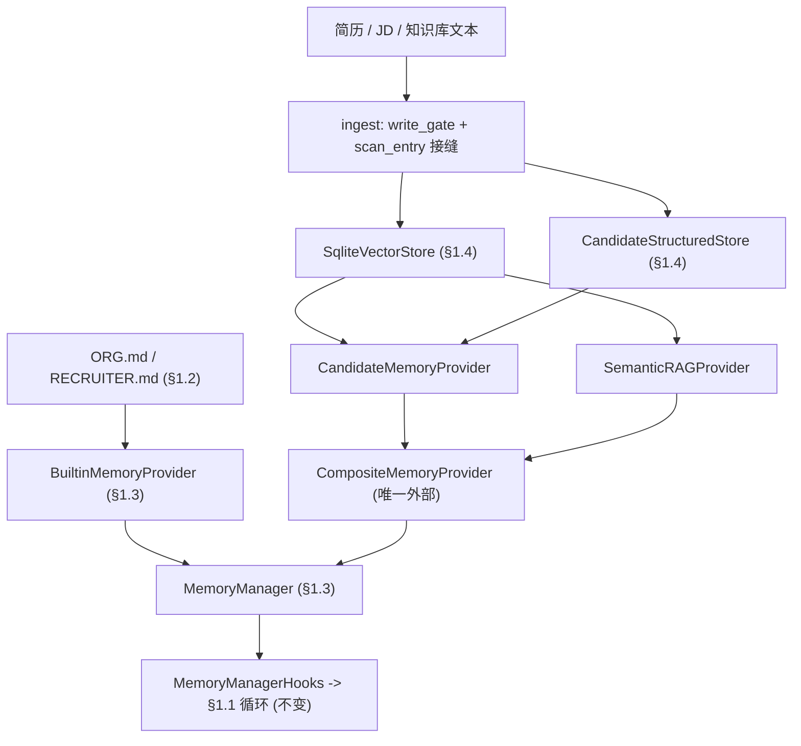
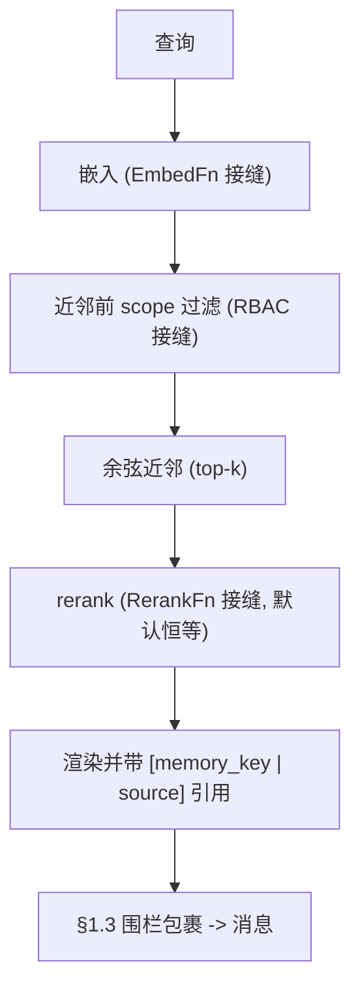

# 开发日志 · Phase 0 §1.4 — 嵌入式向量库 + Candidate/Semantic provider（+ 最小 Composite）

> 大体量**检索**记忆层，位于 §1.3 `MemoryProvider` 契约之后——仅标准库、离线、`agent_loop.py` 未改动。规格：
> `docs/superpowers/specs/2026-06-28-p0-1.4-vector-entity-providers-design.md`；计划：
> `…/plans/2026-06-28-p0-1.4-vector-entity-providers.md`。源码：`agent/src/jobpin_agent/memory/`。

## 1. 本步骤交付什么

记忆子系统的**第二层**。§1.2/§1.3 给出小体量策展存储（Org/Recruiter）。§1.4 加入**大体量检索层**（PRD §9.3）：把
候选人 + 知识库文本向量化、**本地**存储与检索，经**同一 §1.3 `MemoryProvider` 接口**向上呈现。满足计划 §1.4 交付物：
`memory/vector`（add/delete/NN/**rerank** 接口）、`memory/providers/{candidate,semantic}`、一个**重嵌入迁移工具**（可恢复）、
一个**召回+P95 基准脚手架**——外加从 Phase 2 §3.2 提前的**最小 `CompositeMemoryProvider`**（两个检索 provider = ≥2 触发）。
新的、设计衍生代码（非 Hermes 文件移植）；以独立测试的分层构建并提交。

## 2. 新增/改动的文件

| 路径 | 内容 |
|---|---|
| `memory/embedding.py` | `EmbedFn` 类型、`hashing_embedder(dim)`、`cosine(a,b)`、`embed_version(name,dim)` |
| `memory/vector/record.py` | `VectorRecord` dataclass、`new_id()` |
| `memory/vector/store.py` | `VectorStore` ABC、`SqliteVectorStore`、`Hit` 类型、`_escape_like`、`_row_to_record` |
| `memory/vector/rerank.py` | `RerankFn` 类型、`identity_rerank` |
| `memory/vector/reembed.py` | `reembed(...)`、`ReembedResult`、`_validate` |
| `memory/structured.py` | `CandidateRow`、`CandidateStructuredStore` |
| `memory/providers/retrieval_base.py` | `RetrievalProvider`（缓存 + rerank + 引用渲染） |
| `memory/providers/semantic.py` | `SemanticRAGProvider` |
| `memory/providers/candidate.py` | `CandidateMemoryProvider` |
| `memory/providers/composite.py` | `CompositeMemoryProvider`（最小） |
| `memory/benchmark.py` | `run_recall_benchmark(...)` |
| `examples/recall_demo.py` | 端到端召回演示（`run_demo()`） |
| `tests/test_{embedding,vector_store,structured_store,semantic_provider,candidate_provider,composite_provider,reembed,benchmark,recall_demo}.py` | 验收套件（新增 26 个测试） |

## 3. 公开接口（API）

```python
# embedding.py
EmbedFn = Callable[[str], list[float]]
hashing_embedder(dim: int = 256) -> EmbedFn          # 确定性词面向量化器（§1.4 默认）
cosine(a: list[float], b: list[float]) -> float      # 长度不一致抛 ValueError；任一零向量返回 0.0
embed_version(name: str, dim: int) -> str            # "name@dim"，如 "hash@256"

# vector/record.py  — Hit = tuple[VectorRecord, float]
VectorRecord(memory_key, embed_model, embed_version, struct_ref, source_ref, text, embedding, vector_id=new_id())

# vector/store.py
class VectorStore(ABC):
    add(records: list[VectorRecord]) -> None                       # 漂移守卫（单 embed_version）
    delete(vector_ids: list[str]) -> int
    delete_by_key_prefix(prefix: str) -> int                       # 擦除级联（精确或嵌套）
    search(query, k, *, key_prefix=None, scope: Callable[[str],bool]|None=None) -> list[Hit]  # 在 top-k 之前过滤
    current_version() -> set[str]                                  # 磁盘上的不同 embed_version
    all_records() -> list[VectorRecord]
SqliteVectorStore(db_path: str = ":memory:")

# vector/rerank.py
RerankFn = Callable[[str, list[Hit]], list[Hit]]
identity_rerank(query, hits) -> hits                 # §1.4 默认（保持余弦顺序）

# vector/reembed.py
reembed(src_store, dst_store, new_embed_fn, new_version, *, new_embed_model="hash", limit=None) -> ReembedResult
ReembedResult(total, migrated, done, complete, validated, new_version)

# structured.py
CandidateRow(memory_key, name="", skills=[], years=0, location="", work_rights=False, consent_status="unknown")
class CandidateStructuredStore(db_path=":memory:"):
    upsert(row) -> None;  get(memory_key) -> CandidateRow|None;  filter(pred) -> list[CandidateRow];  delete_by_key_prefix(prefix) -> int

# providers/semantic.py  (name == "semantic", entity_type == "semantic")
SemanticRAGProvider(vector_store, embed_fn, *, embed_model="hash", embed_version="hash@256",
                    scope_filter=None, write_gate=None, scan_entry=None, rerank=None, k=4)
    .ingest(doc_id, text, *, memory_key, source_ref) -> dict      # {success, ingested} | {blocked} | {staged}
    .prefetch(query, *, session_id="") -> str                    # 可围栏的、带引用的召回

# providers/candidate.py  (name == "candidate", entity_type == "candidate")
CandidateMemoryProvider(vector_store, structured_store, embed_fn, *, embed_model="hash", embed_version="hash@256",
                        scope_filter=None, write_gate=None, scan_entry=None, rerank=None, k=4)
    .ingest(candidate: CandidateRow, chunks: list[tuple[str,str]]) -> dict   # {success, ingested, skipped} | {staged}
    .delete(memory_key) -> {"structured": n, "vectors": m}       # 擦除级联
    .prefetch(query, *, session_id="") -> str

# providers/composite.py  (name == "composite")
CompositeMemoryProvider(sub_providers: list[MemoryProvider], *, char_budget=4000)

# benchmark.py
run_recall_benchmark(provider, queries: list[tuple[str,str]], *, k=4) -> {"n","recall_at_k","p95_ms","mean_ms"}
```

## 4. 数据结构与格式

- **`VectorRecord`** 字段：`vector_id:str`（uuid）、`memory_key:str`（`tenant:org:entity_type:entity_id`——RBAC + 擦除锚点）、`embed_model:str`、`embed_version:str`、`struct_ref:str`（→ 结构化行）、`source_ref:str`（→ 原片段；引用）、`text:str`（内联保留）、`embedding:list[float]`。
- **向量 SQL 模式**：`vectors(vector_id TEXT PK, memory_key TEXT, embed_model TEXT, embed_version TEXT, struct_ref TEXT, source_ref TEXT, text TEXT, embedding TEXT)`——`embedding` 为 `json.dumps(list[float])`。
- **结构化 SQL 模式**：`candidates(memory_key TEXT PK, name TEXT, skills TEXT, years INTEGER, location TEXT, work_rights INTEGER, consent_status TEXT)`——`skills` 为 JSON。
- **`embed_version` 格式**：`"<name>@<dim>"`（如 `"hash@256"`）。版本 ≠ 存储固定版本的记录被拒绝。
- **召回条目 / 引用格式**（到达提示的内容）：每个命中渲染为
  `"<text>\n[memory_key: <key> | source: <source_ref>]"`，条目以 `ENTRY_DELIMITER`（`"\n§\n"`，复用自 §1.2）连接。其后 §1.3 围栏将整体包进 `<memory-context>…</memory-context>`。

## 5. 关键机制（附真实代码）

**哈希嵌入器**（`embedding.py`）——确定性词面向量；token → 哈希桶 → L2 归一化：
```python
for tok in re.findall(r"[a-z0-9]+", text.lower()):
    h = int(hashlib.blake2b(tok.encode(), digest_size=8).hexdigest(), 16)
    vec[h % dim] += 1.0
norm = math.sqrt(sum(x*x for x in vec)); return [x/norm for x in vec] if norm else vec
```

**先过滤再近邻**（`vector/store.py::SqliteVectorStore.search`）——scope 谓词在打分/截断*之前*运行，使范围外记录无法被打分、返回，或把范围内命中挤出：
```python
for row in rows:                      # rows 可能已由 key_prefix 在 SQL 中预过滤
    rec = _row_to_record(row)
    if scope is not None and not scope(rec.memory_key):
        continue                      # <-- 在余弦之前、在 [:k] 之前过滤
    score = cosine(query, rec.embedding)
    if score > 0.0: scored.append((rec, score))
scored.sort(key=lambda h: h[1], reverse=True); return scored[:k]
```

**漂移守卫**（`store.add`）——固定一个 `embed_version`、拒绝异空间向量（不静默混用）：
```python
pinned = self.current_version() or {该批的单一版本}   # 首次 add 固定
for r in records:
    if r.embed_version not in pinned: raise ValueError("embed_version drift …")
```

**Candidate `_retrieve`**——先做 RBAC 过滤（结构化），再一次带范围的向量搜索：
```python
allowed = {r.memory_key for r in self._struct.filter(lambda r: self._scope(r.memory_key))}
if not allowed: return []
return self._vec.search(self._embed(query), self._k, scope=lambda mk: mk in allowed)
```

**Composite `prefetch`**——广播 → 按 `ENTRY_DELIMITER` 切分 → 保序去重 → 按预算截断：
```python
entries = [e.strip() for e in ENTRY_DELIMITER.join(parts).split(ENTRY_DELIMITER) if e.strip()]
kept, total = [], 0
for e in dict.fromkeys(entries):                        # 保序去重
    add = len(e) + (len(ENTRY_DELIMITER) if kept else 0)
    if total + add > self._budget: break                # 按相关性顺序截断
    kept.append(e); total += add
return ENTRY_DELIMITER.join(kept)
```

**重嵌入迁移**（`vector/reembed.py`）——目标存储*即*检查点（续传跳过已完成 id）；按 id 集合相等校验，而非余弦自匹配：
```python
done_ids = {r.vector_id for r in dst_store.all_records()}
for rec in src_store.all_records():
    if rec.vector_id in done_ids: continue              # 续传
    if limit is not None and migrated >= limit: break   # 模拟中断
    dst_store.add([VectorRecord(..., embed_version=new_version, embedding=new_embed_fn(rec.text), vector_id=rec.vector_id)])
# _validate: dst.current_version()=={new_version} 且 {src ids} == {dst ids}
```

## 6. 设计决策与原因

**为什么有两个存储——结构化（关系型） vs 语义（向量）。** 这是整层存在所要回答的问题，故置于最前。关系型
`candidates` 存储承载**离散、可枚举的字段**（`skills[]`、`years`、`location`、`work_rights`、`consent`），用 SQL
`WHERE`/`=`/`IN` 精确过滤/排序/匹配。向量存储承载**装不进列的自由文本**（简历段落、面试反馈、JD、交互历史）**+ 其
嵌入**，用**语义近邻**回答。两者互补：关系型 = 硬性必备 + RBAC；向量 = 在允许集合*内*的语义排序（先过滤再近邻路径）。
向量记录存储片段 **`text`**（用于渲染引用）+ `struct_ref`/`memory_key`（用于回连结构化行）——**不存任何列已有的内容**。

*向量存储为何不可或缺*（PRD M1 / F1.3——“漏掉改述的能力”）：一份简历写道*“架构了一个全球分布、最终一致、处理
每秒 200 万笔交易的账本；指导了四名工程师”*，其关系型存储里只有 `skills=["go","kafka"]`。搜索*“规模化分布式系统
与团队指导”*会在列/关键词上**漏掉**该候选人，却能按*含义***找到**他——“一个人可能具备的每种能力”没有有限的模式，
故该信号只存在于简历正文及其向量中。

*诚实的说明——§1.4 尚未演示什么：* 在**fake `hashing_embedder`（仅词面重叠、非语义）**与简短演示片段下，向量存储
尚未发挥关系型存储做不到的作用——它匹配 `ledger`↔`ledger`，**但不**匹配 `"distributed systems"`↔`"globally-distributed
ledger"`。故 `examples/recall_demo.py` 的查询刻意与简历正文**共享词**（且这些词在正文、而非列里——她的技能是
`go`/`kafka`）；真正的**语义**匹配需要真实嵌入器（`EmbedFn` 背后的 BGE/OpenAI，**配置/§1.12**）与把简历**解析**为
丰富片段（**§1.11/§1.15**）。§1.4 交付了*能力 + 管路*，而非语义收益。

- **无依赖后端。** 用标准库 `SqliteVectorStore`（暴力余弦）而非真实向量库——在所述数百–数千规模下 O(n) 远低于 P95 目标，生产后端（sqlite-vec/LanceDB，**§1.12**）在 `VectorStore` ABC 背后替换。无新依赖。
- **嵌入是注入式接缝。** 哈希嵌入器离线给出真实*词面*重叠（故测试 + 演示能正确召回），但**非**语义、**非**安全控制；真实 BGE/OpenAI 经 `EmbedFn` 配置替换——模型切换触发重嵌入迁移。
- **治理在接缝之后，不提前构建。** ingest 经直通 `write_gate` + `scan_entry`；召回 RBAC 为直通 `scope_filter`、接在近邻*之前*。真实实现是 §1.5/§1.6——与 §1.3 推迟写工具同一纪律，故不提前开启未治理/未扫描/未过滤的路径。
- **最小 Composite，提前引入。** 两个检索 provider 会触发 §1.3 单外部规则。本实现不放宽，而以一个*最小* Composite 作**唯一**外部 provider 容纳两者；它在 §1.3 单 worker/flush/排空机制内运行且不增线程。完整 Composite（Employee、路由表、归并一致性）留 Phase 2 §3.2。已据此更正计划（EN+中文）。

## 7. 接缝与推迟

| 接缝（签名） | §1.4 默认 | 真实实现 |
|---|---|---|
| `VectorStore` 后端 | `SqliteVectorStore` | sqlite-vec / LanceDB —— **§1.12** |
| `EmbedFn = (str)->list[float]` | `hashing_embedder` | BGE-local / OpenAI —— **配置** |
| `RerankFn = (str, hits)->hits` | `identity_rerank` | 混合（BM25+dense）/ 交叉编码器 —— **§1.12/Phase 1** |
| `write_gate(action, target, content)->str?` | 直通 | **§1.5** 治理门控 |
| `scan_entry(text)->str?` | 直通 | **§1.6** `threat_patterns` |
| `scope_filter(memory_key)->bool` | 放行 | **§1.5** RBAC（已接在近邻之前） |

## 8. 测试与验收（整体 104 passed, 1 skipped；§1.4 新增 26）

| 测试文件 | 用例 → 各自证明什么 |
|---|---|
| `test_embedding.py` | 词面重叠 > 不相交余弦；确定性 + L2 归一化；`embed_version` 签名 |
| `test_vector_store.py` | 余弦排序；`key_prefix` 预过滤；`delete_by_key_prefix` 级联（计数）；漂移守卫拒绝异版本；空存储混版本固定被拒；零分查询 → `[]`、`k>语料` |
| `test_structured_store.py` | upsert/get 往返（skills 列表）；谓词 `filter`；按键前缀删除 |
| `test_semantic_provider.py` | ingest→召回**带 `[source: …]` 引用**；sync 空操作；queue→prefetch 缓存；**scope 在 top-k 之前过滤**（范围内较低命中在范围外较高命中前存活）；**rerank 重排**；`scan_entry` 拦截 ingest |
| `test_candidate_provider.py` | ingest→带引用召回；**scope_filter 排除 → `""`**；`delete` 级联结构化+向量（计数）；`write_gate` 保留 ingest；零片段 ingest；`scan_entry` 跳过被标记片段 |
| `test_composite_provider.py` | prefetch 归并 + 去重；预算截断；**真实 `MemoryManager` 上为唯一外部**（第二外部被拒）；单播 vs 扇出 sync（+ 非 primary 跳过）；**prefetch 失败隔离**；逆序 shutdown；块拼接 |
| `test_reembed.py` | 完整重嵌入 + 校验；**中断后续传**跳过已完成记录、完成 |
| `test_benchmark.py` | `recall_at_k∈[0,1]`、`p95_ms` 浮点、`n` |
| `test_recall_demo.py` | **端到端**：简历→ingest→NL 召回 + 引用以 `<memory-context>` 消息到达真实 §1.1 `Agent` 的模型；回合作答 |

**对应计划 §1.4 退出标准：**（a）带回到来源出处的召回 → `test_candidate/semantic_provider` + `test_recall_demo`；（b）版本切换后可恢复重嵌入 → `test_reembed`；（c）规模化召回 P95 → `benchmark` 脚手架（阈值留到 §1.15/Phase 1）。

## 9. 如何接线





## 10. 自己运行

```bash
cd agent
python -m pytest -q                  # 104 passed, 1 skipped（OpenAI 集成；可选）
python examples/recall_demo.py       # 简历 -> 向量化 -> 正确候选人 + 引用，围栏，不改循环
```
`recall_demo.py` 输出：`{"recall_in_prompt": true, "has_citation": true, "fenced": true, "answer": "Ada Lovelace — globally-distributed ledger + mentoring — is the strongest match."}`——查询（`"who built a globally-distributed ledger and mentored engineers?"`）命中她简历**正文**（向量存储），而其结构化列（`skills=["go","kafka"]`）从未持有这些内容。

## 11. 三方评审改了什么

三位评审（资深工程师 / 架构师 / 产品经理）均返回 **YES**（“不改 `agent_loop.py`”经 git 验证）。修复两个 **MAJOR** + 若干 MINOR：
1. **Semantic 在近邻*之后*过滤**（资深 + 架构师，已复现）——先检索后过滤的泄漏。修复：给 `search` 加 `scope` 谓词（在 top-k 之前过滤）；两个 provider 现均先过滤再近邻；Candidate 的逐键循环并为一次带范围搜索。
2. **缺失 rerank 接口**（产品）——计划 §1.4/PRD §11.3 要求且规格过度声称。新增 `RerankFn` + `identity_rerank`；真实混合/交叉编码器 → §1.12。
3. MINOR：`reembed` 类型改为 `VectorStore` ABC（加 `all_records()`）；`_validate` 改按 `vector_id`（余弦自匹配在零向量上误报）；`cosine` 长度守卫；两个 ingest 加 `scan_entry` 接缝、Semantic 也加 `write_gate`；新增 8 个边界测试；把依赖哈希碰撞的脆弱断言改为确定性；计划 Phase-0 Out-of-Scope 补充说明（EN+中文）。

**前瞻标注（非 §1.4 缺陷）：** Composite 的单播/非 primary 跳过分支目前未经 `MemoryManager.sync_all` 触达（它不传 `entity_type`/`agent_context`）——待真实写/反馈循环落地时接好（§1.5/Phase 1/§3.2）；按 `(query,session)` 的召回缓存在 §1.5 注入按用户 RBAC 时须改为按主体隔离。

## 12. 这一步如何为 §1.5 / §1.6 / §1.12 铺路

- **§1.5（治理）** 把真实实现插入此处已接好的接缝：`write_gate`（拒绝未标注写入）、`scope_filter`（RBAC，已在近邻之前）、以及基于 `delete_by_key_prefix` 级联机制的擦除*流水线*。面向模型的 `memory` **写工具**也在此诞生即受治理。
- **§1.6（注入防御）** 在 `scan_entry` 之后提供真实 `threat_patterns` 扫描器。
- **§1.12（spike）** 选定生产向量后端（在 `VectorStore` 背后替换）；此处的基准脚手架为其提供召回/P95 数据。
