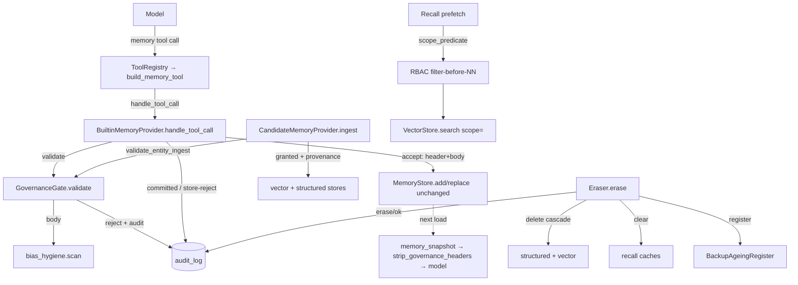

# Phase 0 · §1.5 — HR Memory Governance

> Developer source-of-truth for §1.5. Read this **before** the code: it carries the interfaces, data
> formats, key algorithms, and the test/acceptance matrix so you can judge the work without opening the
> source. Bilingual sibling: `p0-1.5-hr-memory-governance.md` (中文).

---

## 1. What this delivers

§1.5 wraps every memory **write** and **recall** in a governance shell — *namespace + provenance +
lawful-basis/consent labels + retention + RBAC + audit + bias hygiene* — taking the memory subsystem
from "can remember" to **"remembers compliantly, uses explainably, and can be erased"** (PRD §9.5;
Plan §1.5, ★ compliance-critical). It is **net-new** (Hermes has no governance) and is wired into the
seams §1.2/§1.3/§1.4 deliberately left open, so **`core/agent_loop.py` and the ported `MemoryStore` are
byte-unchanged** (git-verified).

It also lands the **governed model-facing `memory` write tool** that §1.3 deferred here: a tool the
model calls to add/replace/remove curated org/recruiter memory, *born governed* — it cannot write
without provenance + a lawful-basis label, and it rejects biased content.

**Plan deliverables satisfied (Plan §1.5):** `governance/namespace`, `governance/provenance` +
`governance/consent` (labels), `governance/retention`, `governance/erasure`, `governance/rbac`,
`governance/audit`, `governance/bias_hygiene`, plus the governed `memory` write tool. **All four exit
criteria met** (see §8).

---

## 2. Files added / changed

| Path | What it contains |
|---|---|
| `governance/__init__.py` | Package doc + the honest-boundary statement (erasure / bias / read-audit / RBAC auth). |
| `governance/namespace.py` | `MemoryKey` (frozen) + `parse`/`is_valid`/`prefix(level)`; `ENTITY_TYPES`; `DEFAULT_TENANT`/`DEFAULT_ORG`. |
| `governance/labels.py` | `Provenance`/`ConsentLabel`/`RetentionPolicy` dataclasses; `render_header`/`parse_header`; **`strip_governance_headers`**; `CONSENT_REQUIRED_SOURCE_TYPES`, `LEGAL_BASES`. |
| `governance/audit.py` | `AuditRecord` + `AuditLog` (append-only SQLite, dual timestamp, thread-safe). |
| `governance/bias_hygiene.py` | `BiasFinding` + `scan`; `PROTECTED_ATTRIBUTES` (word-boundary regexes) + `PROXY_PATTERNS`. |
| `governance/rbac.py` | `Principal` + `scope_predicate` + `FULL_ACCESS`. |
| `governance/retention.py` | `RETENTION_POLICIES` + `sweep` + `BackupAgeingRegister`. |
| `governance/write_gate.py` | `Decision` + `GovernanceGate.validate` (curated write) + `GovernanceGate.validate_entity_ingest` (candidate). |
| `governance/erasure.py` | `Eraser.erase` — the data-subject erasure pipeline. |
| `governance/tool_bridge.py` | `build_memory_tool(manager)` — the `ToolRegistry`→`manager` bridge (no loop change). |
| `governance/README.md` | Bilingual folder manifest. |
| `memory/providers/builtin.py` *(modified)* | `MEMORY_TOOL_SCHEMA`; `BuiltinMemoryProvider(store, *, gate=None, actor="system")`; governed `get_tool_schemas`/`handle_tool_call`; `initialize` captures `agent_identity`. |
| `memory/providers/candidate.py` *(modified)* | `governance=`/`actor=` params; `ingest` enforces `validate_entity_ingest`. |
| `memory/providers/retrieval_base.py` *(modified)* | `clear_recall_cache()`. |
| `memory/providers/composite.py` *(modified)* | `clear_recall_cache()` fan-out. |
| `memory/composition.py` *(modified)* | `build_memory_backend(..., gate=None, actor="system")`; `memory_snapshot()` strips governance headers. |
| `tests/governance/*` | 10 test modules, **38 tests** (see §8). |

---

## 3. The public surface (API)

```python
# governance/namespace.py
ENTITY_TYPES: frozenset[str]; DEFAULT_TENANT = "acme"; DEFAULT_ORG = "apac"
@dataclass(frozen=True)
class MemoryKey: tenant: str; org: str; entity_type: str; entity_id: str
    def format(self) -> str            # "tenant:org:entity_type:entity_id"
    def prefix(self, level) -> str     # level ∈ {"tenant","org","entity_type"}
def parse(key: str) -> MemoryKey       # raises ValueError on malformed / unknown entity_type
def is_valid(key: str) -> bool

# governance/labels.py
@dataclass class Provenance:      memory_key; source_type; source_ref=""; collected_at=""; collected_by=""
@dataclass class ConsentLabel:    legal_basis; purpose=""; consent_id=""; use_scope=""
@dataclass class RetentionPolicy: policy_key; ttl_days; basis=""
CONSENT_REQUIRED_SOURCE_TYPES: frozenset; LEGAL_BASES: frozenset
def render_header(prov, consent, retention_key: str) -> str    # header text ending "---\n"
def parse_header(entry: str) -> tuple[dict | None, str]         # (labels, body); no "---" → (None, entry)
def strip_governance_headers(text: str) -> str                  # remove header blocks, keep bodies

# governance/audit.py
@dataclass class AuditRecord: actor; action; target_key; at_monotonic; at_wall; reason; result
class AuditLog(db_path=":memory:"):
    def record(self, actor, action, target_key, *, reason="", result="ok") -> None
    def query(self, *, target_key=None, action=None) -> list[AuditRecord]   # no mutation API

# governance/bias_hygiene.py
@dataclass class BiasFinding: code; term; reason     # code ∈ {"rejected:bias","flagged:bias"}
def scan(text: str) -> BiasFinding | None

# governance/rbac.py
@dataclass(frozen=True) class Principal: user_id; role; allowed_scopes: tuple[str, ...]
FULL_ACCESS: Principal
def scope_predicate(principal) -> Callable[[str], bool]

# governance/retention.py
RETENTION_POLICIES: dict[str, RetentionPolicy]
def sweep(now_days, items: list[tuple[str, float, str]]) -> list[str]    # expired keys
class BackupAgeingRegister: register(memory_key, erased_at_days, ages_out_at_days); pending(now_days) -> list[str]

# governance/write_gate.py
@dataclass class Decision: ok: bool; code: str = ""; header: str = ""
class GovernanceGate(audit: AuditLog, bias_scan=bias_hygiene.scan):
    audit                                  # exposed so the caller can record committed writes
    def validate(self, action, target_key, body, prov, consent, retention_key, *, actor) -> Decision
    def validate_entity_ingest(self, memory_key, consent_status, source_refs, *, actor) -> Decision

# governance/erasure.py
class Eraser(audit, register, cache_clearers: list[Callable[[], None]]):
    def erase(self, memory_key, *, actor, reason="", deleter, now_days=0.0, ages_out_at_days=180.0) -> dict

# governance/tool_bridge.py
def build_memory_tool(manager) -> core.tools.ToolSpec    # name="memory"
```

---

## 4. Data structures & formats (verbatim)

**Namespace key** — `tenant:org:entity_type:entity_id` (Plan §1.0). MVP placeholders `acme:apac`;
curated keys use named constants: org → `acme:apac:org:policy`, recruiter → `acme:apac:recruiter:prefs`.

**In-entry governance header** (rendered by `render_header`, stripped from model renders by
`strip_governance_headers`, kept on disk):
```
key: acme:apac:org:policy
source_type: recruiter_input
source_ref: rubric#1
collected_at:
collected_by: recruiter:alice
legal_basis: legitimate_interest
consent_id:
purpose: hiring_calibration
retention_ttl: not_hired_180d
---
<body: one curated fact / standard / preference>
```

**Audit row** (`audit_log` SQLite table): `id, actor, action, target_key, at_monotonic (REAL),
at_wall (ISO-8601 UTC), reason, result`. **Actions emitted in §1.5:** `write:add`, `write:replace`,
`write:remove`, `write:ingest`, `erase`. **Results:** `ok`, `ok:cache_warn`, `rejected:no_provenance`,
`rejected:no_consent`, `rejected:bias`, `flagged:bias`, `rejected:drift`, `rejected:store`,
`rejected:error`. (`recall` / `rejected:rbac` are the §1.0 vocabulary but land at §1.8 — see §6.)

**Retention policies:** `hired_5y` (1825d), `not_hired_180d` (180d), `withdrawn_30d` (30d).

**Consent-required source types:** `{candidate_submitted, candidate_volunteered, third_party}`.

---

## 5. Key mechanisms / algorithms

### 5.1 The governed write (curated store)
`BuiltinMemoryProvider.handle_tool_call("memory", args)`:
1. Reject unknown `action` / `target` (no silent fall-through to `add`).
2. Build `Provenance(key, source_type, source_ref, collected_by=actor)` + `ConsentLabel` from args.
3. `decision = gate.validate(action, key, body, prov, consent, retention_key, actor=actor)`.
4. On reject → `{"success": False, "rejected": <code>, "code": "rejected:<code>"}` (gate already audited).
5. On accept → prepend `decision.header` to the body and call the **unchanged** `store.add/replace/remove`.
6. Audit the outcome: committed → `write:<action>`/`ok`; store rejected (drift/budget/ambiguous) →
   `rejected:drift`|`rejected:store` (forensic completeness).

`GovernanceGate.validate` (the pre-check):
```python
if action == "remove": return Decision(ok=True)
if not prov.source_ref or not prov.source_type:
    self.audit.record(actor, f"write:{action}", target_key, result="rejected:no_provenance")
    return Decision(False, "rejected:no_provenance")
if prov.source_type in CONSENT_REQUIRED_SOURCE_TYPES and not consent.consent_id:
    self.audit.record(actor, f"write:{action}", target_key, result="rejected:no_consent")
    return Decision(False, "rejected:no_consent")
finding = self._bias_scan(body)
if finding is not None:
    self.audit.record(actor, f"write:{action}", target_key, reason=finding.reason, result=finding.code)
    return Decision(False, finding.code)
return Decision(True, header=render_header(prov, consent, retention_key))
```

### 5.2 Bias hygiene — **word-boundary** matching (the triple-review fix)
Substring matching is wrong: `"age" in "management"`, `"race" in "embrace"`. Protected attributes are
compiled word-boundary regexes; proxies are bounded patterns:
```python
PROTECTED_ATTRIBUTES = (("age", r"\bage\b|\byears old\b|\bdate of birth\b"),
                        ("gender", r"\bgender\b|\b(?:fe)?male\b"), …)
# protected → rejected:bias ; proxy (e.g. elite-school hard bar) → flagged:bias (blocked)
```
Bias hygiene runs on **recruiter/org calibration** writes, **never** on candidate résumé content
(rejecting a CV for naming a protected attribute would itself discriminate).

### 5.3 RBAC recall — filter-before-NN (no existence leak)
`scope_predicate(principal)` returns `allow(memory_key)` → True iff the key equals an allowed scope or
is nested under `scope + ":"` (so `acme:apac` does **not** authorise `acme:apacX`). It is injected as the
provider `scope_filter` and applied **before** vector scoring/truncation (`VectorStore.search(scope=)`),
so an out-of-scope subject can never be scored, returned, or even revealed to exist.

### 5.4 Erasure pipeline (APP 11.2)
`Eraser.erase`: `deleter(memory_key)` (the §1.4 `candidate.delete` → cascade structured + vectors by
prefix) → clear recall caches → audit `erase` → register backup-ageing. A failed delete is audited
(`rejected:error`) and re-raised; a cache-clear failure downgrades to `ok:cache_warn` (so the trail never
reports a clean erase while recall could still surface the subject).

### 5.5 Header strip on model render (the triple-review M1 fix)
The header is metadata, not model content. `strip_governance_headers` removes each header block via a
multiline regex (`^key:.*\n(?:<field>:.*\n)*---\n`) wherever it appears, leaving render chrome + bodies.
Wired in `MemoryBackend.memory_snapshot()`, so `consent_id`/`collected_by` never re-enter the frozen
system prompt; the header stays on disk for validation/back-link.

### 5.6 The bridge (no loop change)
`build_memory_tool(manager)` returns a `ToolSpec` whose handler calls `manager.handle_tool_call("memory",
args)` then `manager.notify_memory_tool_write(result, args)`. The composition root registers it in the
`ToolRegistry`; the §1.1 loop dispatches it like any tool. `agent_loop.py` is untouched.

---

## 6. Design decisions & why

- **Enforce in the provider write path, leave `MemoryStore` unchanged.** The store's own `write_gate`
  seam has *staging* semantics (non-`None` → `staged=True`), which is not *rejection*; overloading it
  would corrupt the faithful Hermes port. The governed tool handler (curated) and `ingest` (candidate)
  are the **sole writers**, so gating there *is* the "pre-check of add/replace" the Plan wants, with the
  port byte-unchanged. (Plan §1.5 wording corrected to match.) **Conceptual purpose:** governance is a
  cross-cutting policy layer that sits *in front of* storage, not inside it — storage stays a dumb,
  faithful, ownable primitive; policy is swappable and auditable on its own.
- **Labels live in the §1.2 in-entry header** (no schema migration), stripped on model render.
- **Audit = append-only SQLite, thread-safe** (forerunner of the §1.8 canonical `AuditRecord` table).
- **RBAC auth source injected/deferred** (PRD open-Q#8: single-user desktop vs shared backend); the
  filter abstraction ships now, `FULL_ACCESS` default keeps demos/tests green; §1.9 reuses this engine.
- **Honest boundaries (stated, not overclaimed):** erasure = live-store delete + cache + backup-ageing
  register (NOT GDPR-instant wipe; residual de-id of *other* entries → §1.11). Bias scanner is a
  **heuristic**, not a complete classifier. Read/recall audit → §1.8.

**What this does NOT yet show (honest):** the curated-write demo uses synthetic content; real candidate
PII to a cloud model still requires the §1.11 de-identification pipeline (not built). The RBAC principal
is injected by the composition root (no auth source yet). The audit log is tamper-*evidence-light* (a
local SQLite file); cryptographic chaining/WORM is a §1.8 concern. Retention `sweep` is a pure function
with **no scheduler** wired yet (a deliberate YAGNI primitive).

---

## 7. Seams & deferrals

| Seam (default) | Real implementation |
|---|---|
| `scan_entry` (pass-through) — content threat scan | §1.6 `threat_patterns` |
| read/recall audit (`recall` / `rejected:rbac`) — not emitted | §1.8 canonical `AuditRecord` (thread-safe; recall runs on the background worker) |
| RBAC `Principal` auth source (injected; `FULL_ACCESS` default) | §1.9 security RBAC/ABAC engine (same source) |
| residual de-identification on erasure | §1.11 de-identification pipeline |
| `retention.sweep` (no scheduler) | a scheduler caller, later |
| real embedder / vector backend | config / §1.12 |

---

## 8. Tests & acceptance

**38 governance tests**; full suite **145 passed, 2 skipped** (the 2 skips are the money-safe opt-in
real-OpenAI tests). `core/` byte-identical to `main`.

| Test (file) | Proves |
|---|---|
| `test_namespace` ×5 | parse/format round-trip, prefix levels, validation, frozen-hashable. |
| `test_labels` ×4 | header round-trip, unlabelled parse, consent-required set, **`strip_governance_headers`** keeps bodies/chrome, drops `key:`/`consent_id`/`collected_by`. |
| `test_audit` ×2 | append-only (no `delete`/`update`), dual timestamp, filtered query. |
| `test_bias_hygiene` ×4 | protected attr → `rejected:bias`; proxy → flagged; clean passes; **benign words ("management"/"language"/"grace") do NOT false-positive** (regression for the substring bug). |
| `test_rbac` ×2 | prefix-match (`acme:apac` ≠ `acme:apacX`); `FULL_ACCESS`. |
| `test_retention` ×4 | policy registry/TTLs; sweep returns only expired; unknown policy never expires; backup register ages out. |
| `test_write_gate` ×7 | reject no_provenance / no_consent / bias; accept returns header; remove skips; **blank source_type rejected**; **`validate_entity_ingest`** (no_provenance/no_consent/ok + audit). |
| `test_governed_tool` ×5 | unlabelled rejected+audited; labelled commits WITH header + `write:add/ok`; biased blocked (nothing stored); **unknown action rejected (not defaulted to add)**; no-gate → `[]`. |
| `test_erasure` ×1 | erase → structured+vector gone, recall cache cleared (re-recall ""), `erase/ok`, backup registered. |
| `test_governance_end_to_end` ×4 | RBAC recall isolation (emea never leaks); governed write through `Agent.run_turn`; **candidate ingest governed** (withdrawn rejected, granted ok); **governance header stripped from the snapshot**. |

**Exit-criteria mapping (Plan §1.5):** (1) unlabelled/unconsented rejected + 100% labelled →
`test_write_gate` + `test_governed_tool` + `test_candidate_ingest_is_governed`; (2) erasure drill →
`test_erasure`; (3) RBAC isolation → `test_rbac` + `test_rbac_recall_isolation`; (4) bias hygiene →
`test_bias_hygiene` + `test_blocks_biased_content` + `test_biased_write_is_blocked`.

---

## 9. Diagram



---

## 10. How to run / verify it yourself

```bash
cd agent
python -m pytest tests/governance -q          # 38 passed
python -m pytest -q                            # 145 passed, 2 skipped
# no loop / store change:
git diff --stat main -- src/jobpin_agent/core/                       # empty
git diff --stat main -- src/jobpin_agent/memory/store.py             # empty
```

---

## 11. What the triple-review changed

Three independent reviews ran (senior engineer / architect / PM); the architect returned YES (conditional),
the senior and PM returned NO with must-fixes. All were addressed before sign-off:

- **Senior MAJOR — bias scanner false positives.** Substring matching rejected "management"/"language"/
  "grace". → Switched to **word-boundary regexes**; added a benign-word regression test.
- **Architect M1 — governance header leaked into the frozen snapshot** (and curated budget). → Added
  `strip_governance_headers`, wired into `memory_snapshot`; header stays on disk only. Test added.
- **PM MAJOR — candidate PII ingest was ungoverned** while the spec claimed it wasn't. → Wired
  `GovernanceGate.validate_entity_ingest` into `CandidateMemoryProvider.ingest` (reject unprovenanced/
  unconsented); corrected the spec; test added. Now "100% of written memory" holds for both paths.
- **PM MAJOR / Architect — "read & write" audit was write-only.** → Decided (and documented) to **defer**
  read/recall audit to §1.8 (recall runs on the background worker; the thread-safe canonical table is its
  proper home). Corrected the audit docstring + Plan; made `AuditLog` thread-safe now.
- **Architect M2 / Senior — Plan wording "pre-check of `MemoryStore.add/replace`".** → Corrected the Plan
  (EN+中文) to "enforced in the governed provider write path in front of the unchanged ported store".
- **MINORs fixed:** validate `action` (no silent `add`); audit store-level rejections (`rejected:drift`);
  require non-empty `source_type`; thread-safe `AuditLog`; robust erasure audit on failure; synced the
  stale 中文 docstring in `builtin.py`; corrected the spec's `_CORE_TOOL_NAMES` mischaracterisation.

---

## 12. How this sets up the next point(s)

- **§1.6 (injection defence + pre-compression)** consumes: `GovernanceGate.validate` is ready for the
  pre-compression persist path (extracted facts must carry provenance or be rejected — Plan §1.6); the
  `scan_entry` pass-through seam awaits the real `threat_patterns`; the header-strip must also be applied
  to any headered entry §1.6's persist writes.
- **§1.8 (canonical data model + audit)** consumes: the `audit_log` schema + actions are the forerunner
  of the canonical `AuditRecord` table; read/recall audit lands there (the `AuditLog` is already
  thread-safe for the background worker).
- **§1.9 (security baseline)** reuses `rbac.scope_predicate` as the same-source RBAC/ABAC engine.
- **§1.11 (router + de-identification + résumé parsing)** consumes the entity-ingest gate: real consent
  capture + de-identification feed `validate_entity_ingest`, upgrading the candidate write path to the
  full §1.15 pipeline.
