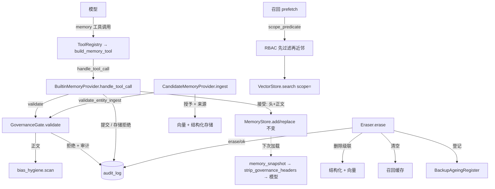

# Phase 0 · §1.5 — HR 记忆治理

> §1.5 的开发者事实来源。请在读代码**之前**先读本文：它承载接口、数据格式、关键算法与测试/验收矩阵，使你无需打开
> 源码即可判断工作。英文同胞：`p0-1.5-hr-memory-governance-EN.md`。

---

## 1. 本节交付什么

§1.5 把每次记忆**写入**与**召回**包裹进治理外壳——*命名空间 + 来源 + 合法依据/同意标签 + 留存 + RBAC + 审计 +
偏见卫生*——使记忆子系统从"能记住"升级为**"合规地记住、可解释地使用、可被擦除"**（PRD §9.5；计划 §1.5，★合规关键）。
它是**全新**的（Hermes 无治理），接入 §1.2/§1.3/§1.4 刻意预留的接缝，故 **`core/agent_loop.py` 与移植的
`MemoryStore` 逐字节不变**（git 验证）。

它还落地了 §1.3 推迟至此的**受治理的面向模型 `memory` 写工具**：模型调用它来 add/replace/remove 策展的组织/招聘官
记忆，*生而受治理*——没有来源 + 合法依据标签就不能写，且拒绝偏见内容。

**满足的计划交付物（计划 §1.5）：** `governance/namespace`、`governance/provenance` + `governance/consent`
（标签）、`governance/retention`、`governance/erasure`、`governance/rbac`、`governance/audit`、
`governance/bias_hygiene`，外加受治理的 `memory` 写工具。**四条退出标准全部达成**（见 §8）。

---

## 2. 新增 / 改动的文件

| 路径 | 内容 |
|---|---|
| `governance/__init__.py` | 包文档 + 诚实边界声明（擦除 / 偏见 / 读审计 / RBAC 鉴权）。 |
| `governance/namespace.py` | `MemoryKey`（frozen）+ `parse`/`is_valid`/`prefix(level)`；`ENTITY_TYPES`；`DEFAULT_TENANT`/`DEFAULT_ORG`。 |
| `governance/labels.py` | `Provenance`/`ConsentLabel`/`RetentionPolicy` 数据类；`render_header`/`parse_header`；**`strip_governance_headers`**；`CONSENT_REQUIRED_SOURCE_TYPES`、`LEGAL_BASES`。 |
| `governance/audit.py` | `AuditRecord` + `AuditLog`（仅追加 SQLite、双时间戳、线程安全）。 |
| `governance/bias_hygiene.py` | `BiasFinding` + `scan`；`PROTECTED_ATTRIBUTES`（词边界正则）+ `PROXY_PATTERNS`。 |
| `governance/rbac.py` | `Principal` + `scope_predicate` + `FULL_ACCESS`。 |
| `governance/retention.py` | `RETENTION_POLICIES` + `sweep` + `BackupAgeingRegister`。 |
| `governance/write_gate.py` | `Decision` + `GovernanceGate.validate`（策展写）+ `GovernanceGate.validate_entity_ingest`（候选人）。 |
| `governance/erasure.py` | `Eraser.erase`——数据主体擦除流水线。 |
| `governance/tool_bridge.py` | `build_memory_tool(manager)`——`ToolRegistry`→`manager` 桥（不改循环）。 |
| `governance/README.md` | 双语文件夹清单。 |
| `memory/providers/builtin.py`（改） | `MEMORY_TOOL_SCHEMA`；`BuiltinMemoryProvider(store, *, gate=None, actor="system")`；受治理的 `get_tool_schemas`/`handle_tool_call`；`initialize` 捕获 `agent_identity`。 |
| `memory/providers/candidate.py`（改） | `governance=`/`actor=` 参数；`ingest` 强制 `validate_entity_ingest`。 |
| `memory/providers/retrieval_base.py`（改） | `clear_recall_cache()`。 |
| `memory/providers/composite.py`（改） | `clear_recall_cache()` 扇出。 |
| `memory/composition.py`（改） | `build_memory_backend(..., gate=None, actor="system")`；`memory_snapshot()` 剥除治理头。 |
| `tests/governance/*` | 10 个测试模块，**38 个测试**（见 §8）。 |

---

## 3. 公共接口（API）

（签名与英文版一致；代码语言中立——见英文 §3 的同一代码块。）核心：`MemoryKey`/`parse`/`is_valid`；
`Provenance`/`ConsentLabel`/`RetentionPolicy` + `render_header`/`parse_header`/`strip_governance_headers`；
`AuditLog.record/query`（无修改 API）；`bias_hygiene.scan`；`Principal`/`scope_predicate`/`FULL_ACCESS`；
`RETENTION_POLICIES`/`sweep`/`BackupAgeingRegister`；`GovernanceGate.validate` + `validate_entity_ingest`；
`Eraser.erase`；`build_memory_tool(manager)`。

```python
class GovernanceGate(audit: AuditLog, bias_scan=bias_hygiene.scan):
    audit
    def validate(self, action, target_key, body, prov, consent, retention_key, *, actor) -> Decision
    def validate_entity_ingest(self, memory_key, consent_status, source_refs, *, actor) -> Decision
class Eraser(audit, register, cache_clearers):
    def erase(self, memory_key, *, actor, reason="", deleter, now_days=0.0, ages_out_at_days=180.0) -> dict
```

---

## 4. 数据结构与格式（原样）

**命名空间键**——`tenant:org:entity_type:entity_id`（计划 §1.0）。MVP 占位符 `acme:apac`；策展键用具名常量：
org → `acme:apac:org:policy`，recruiter → `acme:apac:recruiter:prefs`。

**条目内治理头**（由 `render_header` 渲染，模型渲染时由 `strip_governance_headers` 剥除，磁盘上保留）：
```
key: acme:apac:org:policy
source_type: recruiter_input
source_ref: rubric#1
collected_at:
collected_by: recruiter:alice
legal_basis: legitimate_interest
consent_id:
purpose: hiring_calibration
retention_ttl: not_hired_180d
---
<正文：一条策展事实 / 标准 / 偏好>
```

**审计行**（`audit_log` SQLite 表）：`id, actor, action, target_key, at_monotonic (REAL), at_wall
(ISO-8601 UTC), reason, result`。**§1.5 发出的 action：** `write:add`、`write:replace`、`write:remove`、
`write:ingest`、`erase`。**result：** `ok`、`ok:cache_warn`、`rejected:no_provenance`、`rejected:no_consent`、
`rejected:bias`、`flagged:bias`、`rejected:drift`、`rejected:store`、`rejected:error`。（`recall` /
`rejected:rbac` 属 §1.0 词汇但落在 §1.8——见 §6。）

**留存策略：** `hired_5y`（1825 天）、`not_hired_180d`（180 天）、`withdrawn_30d`（30 天）。

**需要同意的来源类型：** `{candidate_submitted, candidate_volunteered, third_party}`。

---

## 5. 关键机制 / 算法

### 5.1 受治理写入（策展存储）
`BuiltinMemoryProvider.handle_tool_call("memory", args)`：
1. 拒绝未知 `action` / `target`（不静默落到 `add`）。
2. 从 args 构建 `Provenance(key, source_type, source_ref, collected_by=actor)` + `ConsentLabel`。
3. `decision = gate.validate(action, key, body, prov, consent, retention_key, actor=actor)`。
4. 拒绝 → `{"success": False, "rejected": <码>, "code": "rejected:<码>"}`（门控已审计）。
5. 接受 → 将 `decision.header` 前缀到正文，调用**不变的** `store.add/replace/remove`。
6. 审计结果：已提交 → `write:<action>`/`ok`；存储拒绝（漂移/预算/歧义）→ `rejected:drift`|`rejected:store`（取证完整）。

`GovernanceGate.validate`（预检）：见英文 §5.1 的同一代码块——`remove` 直通；缺 `source_ref`/`source_type` →
`rejected:no_provenance`；需同意而缺 `consent_id` → `rejected:no_consent`；偏见命中 → `finding.code`；
否则返回带 `render_header(...)` 的 `Decision(True)`。

### 5.2 偏见卫生——**词边界**匹配（三方评审修复）
子串匹配错误：`"age" 在 "management" 中`、`"race" 在 "embrace" 中`。受保护属性改为编译的词边界正则；代理为有界模式：
```python
PROTECTED_ATTRIBUTES = (("age", r"\bage\b|\byears old\b|\bdate of birth\b"),
                        ("gender", r"\bgender\b|\b(?:fe)?male\b"), …)
# 受保护 → rejected:bias ；代理（如名校硬阈值）→ flagged:bias（阻断）
```
偏见卫生作用于**招聘官/组织校准**写入，**绝不**作用于候选人简历内容（因简历提及受保护属性而拒绝本身即构成歧视）。

### 5.3 RBAC 召回——先过滤再近邻（无存在性泄漏）
`scope_predicate(principal)` 返回 `allow(memory_key)` → 当且仅当键等于某许可范围或嵌套于 `scope + ":"` 之下时为 True
（故 `acme:apac` **不**授权 `acme:apacX`）。它作为 provider `scope_filter` 注入，并在向量打分/截断**之前**应用
（`VectorStore.search(scope=)`），使范围外主体绝不会被打分、返回，甚至其存在也不被揭示。

### 5.4 擦除流水线（APP 11.2）
`Eraser.erase`：`deleter(memory_key)`（§1.4 `candidate.delete` → 按前缀级联结构化 + 向量）→ 清空召回缓存 →
审计 `erase` → 登记备份老化。删除失败被审计（`rejected:error`）并重抛；缓存清理失败降级为 `ok:cache_warn`
（使痕迹绝不在召回仍可能浮现主体时报告干净擦除）。

### 5.5 模型渲染时剥除头（三方评审 M1 修复）
头是元数据，非模型内容。`strip_governance_headers` 用多行正则（`^key:.*\n(?:<field>:.*\n)*---\n`）移除每个头块，
保留渲染外框 + 正文。接在 `MemoryBackend.memory_snapshot()`，使 `consent_id`/`collected_by` 绝不重新进入冻结系统提示；
头仅留在磁盘供校验/回链。

### 5.6 桥（不改循环）
`build_memory_tool(manager)` 返回一个 `ToolSpec`，其处理函数调用 `manager.handle_tool_call("memory", args)` 再
`manager.notify_memory_tool_write(result, args)`。组合根将其注册进 `ToolRegistry`；§1.1 循环像任何工具一样派发它。
`agent_loop.py` 未动。

---

## 6. 设计决策与理由

- **在 provider 写路径强制，`MemoryStore` 不变。** 存储自身的 `write_gate` 接缝是*暂存*语义（非 `None` →
  `staged=True`），并非*拒绝*；重载它会破坏忠实的 Hermes 移植。受治理工具处理函数（策展）与 `ingest`（候选人）是
  **唯一写入者**，故在此门控*即*计划所求的"add/replace 预检"，且移植逐字节不变。（计划 §1.5 措辞已对应修正。）
  **概念目的：** 治理是横切的策略层，位于存储*之前*而非其内——存储保持为可拥有的、忠实的笨原语；策略可单独替换与审计。
- **标签置于 §1.2 条目内头**（无 schema 迁移），模型渲染时剥除。
- **审计 = 仅追加 SQLite、线程安全**（§1.8 规范 `AuditRecord` 表的先行者）。
- **RBAC 鉴权来源注入/推迟**（PRD 开放问题 #8：单机 vs 共享后端）；过滤抽象现已交付，`FULL_ACCESS` 默认保持演示/测试
  绿；§1.9 复用此引擎。
- **诚实边界（陈述而不夸大）：** 擦除 = 实时存储删除 + 缓存 + 备份老化登记（非 GDPR 即时清除；对*其他*条目的残留
  去标识化 → §1.11）。偏见扫描器是**启发式**，并非完整分类器。读/召回审计 → §1.8。

**本节尚未展示什么（诚实）：** 策展写演示用合成内容；真实候选人 PII 发往云模型仍需 §1.11 去标识化流水线（未建）。
RBAC principal 由组合根注入（尚无鉴权来源）。审计日志为**轻防篡改**（本地 SQLite 文件）；加密链/WORM 属 §1.8。
留存 `sweep` 是纯函数，**尚无调度器**接线（刻意的 YAGNI 原语）。

---

## 7. 接缝与推迟

| 接缝（默认） | 真实实现 |
|---|---|
| `scan_entry`（直通）——内容威胁扫描 | §1.6 `threat_patterns` |
| 读/召回审计（`recall` / `rejected:rbac`）——不发出 | §1.8 规范 `AuditRecord`（线程安全；召回运行于后台工作线程） |
| RBAC `Principal` 鉴权来源（注入；`FULL_ACCESS` 默认） | §1.9 安全 RBAC/ABAC 引擎（同源） |
| 擦除时残留去标识化 | §1.11 去标识化流水线 |
| `retention.sweep`（无调度器） | 之后的调度器调用方 |
| 真实嵌入器 / 向量后端 | 配置 / §1.12 |

---

## 8. 测试与验收

**38 个治理测试**；全套 **145 通过，2 跳过**（2 个跳过为省钱的可选真实 OpenAI 测试）。`core/` 与 `main` 逐字节一致。

| 测试（文件） | 证明 |
|---|---|
| `test_namespace` ×5 | parse/format 往返、前缀级别、校验、frozen 可哈希。 |
| `test_labels` ×4 | 头往返、未标注解析、需同意集合、**`strip_governance_headers`** 保留正文/外框、丢弃 `key:`/`consent_id`/`collected_by`。 |
| `test_audit` ×2 | 仅追加（无 `delete`/`update`）、双时间戳、过滤查询。 |
| `test_bias_hygiene` ×4 | 受保护属性 → `rejected:bias`；代理 → flagged；干净通过；**良性词（"management"/"language"/"grace"）不误报**（子串缺陷回归）。 |
| `test_rbac` ×2 | 前缀匹配（`acme:apac` ≠ `acme:apacX`）；`FULL_ACCESS`。 |
| `test_retention` ×4 | 策略注册表/TTL；sweep 仅返回到期；未知策略不过期；备份注册表老化。 |
| `test_write_gate` ×7 | 拒绝 no_provenance / no_consent / bias；接受返回头；remove 跳过；**空 source_type 拒绝**；**`validate_entity_ingest`**（no_provenance/no_consent/ok + 审计）。 |
| `test_governed_tool` ×5 | 未标注被拒并审计；标注完整提交且带头 + `write:add/ok`；偏见被阻（不存储）；**未知 action 被拒（不落到 add）**；无门控 → `[]`。 |
| `test_erasure` ×1 | 擦除 → 结构化+向量消失、召回缓存清空（再召回 ""）、`erase/ok`、备份已登记。 |
| `test_governance_end_to_end` ×4 | RBAC 召回隔离（emea 绝不泄漏）；经 `Agent.run_turn` 受治理写入；**候选人 ingest 受治理**（撤回被拒、授予 ok）；**治理头从快照剥除**。 |

**退出标准映射（计划 §1.5）：**（1）未标注/未同意被拒 + 100% 标注 → `test_write_gate` + `test_governed_tool` +
`test_candidate_ingest_is_governed`；（2）擦除演练 → `test_erasure`；（3）RBAC 隔离 → `test_rbac` +
`test_rbac_recall_isolation`；（4）偏见卫生 → `test_bias_hygiene` + `test_blocks_biased_content` +
`test_biased_write_is_blocked`。

---

## 9. 图



---

## 10. 如何自行运行 / 验证

```bash
cd agent
python -m pytest tests/governance -q          # 38 passed
python -m pytest -q                            # 145 passed, 2 skipped
# 无循环 / 存储改动：
git diff --stat main -- src/jobpin_agent/core/                       # 空
git diff --stat main -- src/jobpin_agent/memory/store.py             # 空
```

---

## 11. 三方评审改变了什么

三个独立评审运行（高级工程师 / 架构师 / PM）；架构师返回 YES（有条件），高级工程师与 PM 返回 NO 并附必修项。
全部在签署前处理：

- **高级工程师 MAJOR——偏见扫描器误报。** 子串匹配拒绝了 "management"/"language"/"grace"。→ 改为**词边界正则**；
  增良性词回归测试。
- **架构师 M1——治理头渗入冻结快照**（及策展预算）。→ 增 `strip_governance_headers`，接入 `memory_snapshot`；头仅留磁盘。增测试。
- **PM MAJOR——候选人 PII ingest 未受治理**，而 spec 声称已治理。→ 将 `GovernanceGate.validate_entity_ingest` 接入
  `CandidateMemoryProvider.ingest`（拒绝无来源/未同意）；修正 spec；增测试。现"100% 写入"对两条路径都成立。
- **PM MAJOR / 架构师——"读 & 写"审计为只写。** → 决定（并记录）将读/召回审计**推迟**到 §1.8（召回运行于后台工作线程；
  线程安全的规范表是其正确归宿）。修正审计文档串 + 计划；现已使 `AuditLog` 线程安全。
- **架构师 M2 / 高级工程师——计划措辞"`MemoryStore.add/replace` 预检"。** → 修正计划（EN+中文）为"在不变的已移植存储
  之前、于受治理 provider 写路径强制"。
- **MINOR 修复：** 校验 `action`（不静默 `add`）；审计存储级拒绝（`rejected:drift`）；要求非空 `source_type`；
  `AuditLog` 线程安全；擦除失败时稳健审计；同步 `builtin.py` 滞后的中文文档串；修正 spec 对 `_CORE_TOOL_NAMES` 的误述。

---

## 12. 为后续节点铺垫

- **§1.6（注入防御 + 压缩前）** 消费：`GovernanceGate.validate` 已就绪用于压缩前持久化路径（抽取的事实须带来源否则被拒
  ——计划 §1.6）；`scan_entry` 直通接缝等待真实 `threat_patterns`；剥头也须应用于 §1.6 持久化写入的带头条目。
- **§1.8（规范数据模型 + 审计）** 消费：`audit_log` schema + action 是规范 `AuditRecord` 表的先行者；读/召回审计落于此
  （`AuditLog` 已对后台工作线程线程安全）。
- **§1.9（安全基线）** 复用 `rbac.scope_predicate` 作为同源 RBAC/ABAC 引擎。
- **§1.11（路由 + 去标识化 + 简历解析）** 消费实体 ingest 门控：真实同意采集 + 去标识化馈入 `validate_entity_ingest`，
  将候选人写路径升级为完整 §1.15 流水线。
