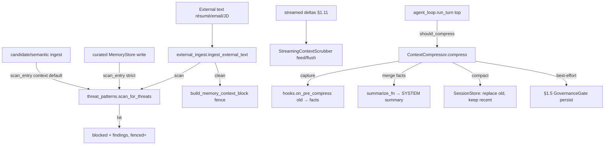

# Phase 0 · §1.6 — Injection-defence port + pre-compression fact-injection

> Developer source-of-truth for §1.6. Read this **before** the code: interfaces, formats, key algorithms,
> the test/acceptance matrix, and the honest limitations. Bilingual sibling: `p0-1.6-injection-defence.md`.

---

## 1. What this delivers

§1.6 ports Hermes's context-window security to local, owned code and wires the **two HR-critical gaps
Hermes's mainline leaves unwired** (PRD §8.3/§9.1; Plan §1.6):
- **External-text scan + fence** — résumés/emails/JDs are untrusted input and a real prompt-injection
  surface; the real threat scanner now guards every untrusted-text sink (curated store, candidate/semantic
  ingest) and a unified door fences clean external text.
- **Pre-compression fact-injection** — Hermes calls `on_pre_compress(messages)` but **discards** the return
  (`conversation_compression.py:459`); §1.6 captures it and **merges** the facts into the compression
  summary + best-effort persists them through the §1.5 gate, so key candidate facts survive a long-session
  fold.

**Plan deliverables satisfied (Plan §1.6):** `security/threat_patterns` (3-scope port), `security/scrubber`
(StreamingContextScrubber port), `security/external_ingest` (scan+fence door), `core/compression` (the
wiring + integration test). **All three exit criteria met** at thin-slice scale (see §8).

**First sanctioned `agent_loop.py` change since §1.1** — §1.1 explicitly deferred compression wiring here.
It is a minimal, opt-in guarded call; the **frozen system-prompt snapshot is untouched** (golden snapshot
still passes).

---

## 2. Files added / changed

| Path | What it contains |
|---|---|
| `security/__init__.py` | Package doc. |
| `security/threat_patterns.py` | **PORT** of Hermes `tools/threat_patterns.py`: `_PATTERNS` (36 tuples, 3 scopes), `INVISIBLE_CHARS` (explicit codepoints), `scan_for_threats(content, scope)`, `first_threat_message(content, scope)`. |
| `security/scrubber.py` | **PORT** of `StreamingContextScrubber`: `feed`/`flush`/`reset` cross-chunk state machine. |
| `security/external_ingest.py` | New. `IngestResult` + `ingest_external_text(text, *, source, scope)` — scan → block, else fence. |
| `core/compression.py` | New. `CompressionResult` + `default_summarize` + `ContextCompressor(should_compress/compress)`. |
| `core/session_store.py` *(mod)* | `compact(session_id, summary_message, keep_recent)` — direct-SQL fold, no `on_session_switch`. |
| `core/agent_loop.py` *(mod)* | `Agent(..., compressor=None)` + a guarded compress call at `run_turn`'s top + a `compress` trace event. |
| `memory/composition.py` *(mod)* | `build_memory_backend` defaults `scan_entry` → strict threat scan (overridable). |
| `memory/providers/candidate.py` *(mod)* | `scan_entry` defaults → context threat scan (fail-safe; the résumé memory sink). |
| `memory/providers/semantic.py` *(mod)* | `scan_entry` defaults → context threat scan (fail-safe; the KB sink). |
| `memory/providers/builtin.py` *(mod)* | `on_pre_compress` docstring reconciled (seam-level; content extraction → §1.11). |
| `THIRD_PARTY_NOTICES.md` *(mod)* | §1.6 port table (threat_patterns + scrubber, MIT, verbatim). |
| `security/README.md`, `tests/security/README.md` | bilingual manifests. |
| `tests/security/*`, `tests/test_compression*.py` | **30 §1.6 tests** (see §8). |

---

## 3. The public surface (API)

```python
# security/threat_patterns.py  (ported)
scan_for_threats(content: str, scope: str = "context") -> list[str]      # matched pattern IDs (+ invisible-unicode)
first_threat_message(content: str, scope: str = "strict") -> str | None  # block message or None (= the scan_entry seam shape)
INVISIBLE_CHARS: frozenset[str]

# security/scrubber.py  (ported)
class StreamingContextScrubber:
    def feed(self, text: str) -> str    # visible portion; holds back partial tags, discards span content
    def flush(self) -> str              # drops an unclosed span; emits a held non-tag tail
    def reset(self) -> None

# security/external_ingest.py
@dataclass class IngestResult: ok: bool; fenced: str = ""; findings: list[str] = []; blocked: bool = False
def ingest_external_text(text, *, source, scope="context", scan=scan_for_threats, fence=build_memory_context_block) -> IngestResult

# core/compression.py
@dataclass class CompressionResult: compressed: bool; summary: str=""; facts: str=""; persisted: bool=False
def default_summarize(old_messages: list[Message], facts: str) -> str    # deterministic, fact-preserving
class ContextCompressor(*, max_messages=20, keep_recent=6, summarize_fn=default_summarize, persist_fn=None):
    def should_compress(self, messages) -> bool
    def compress(self, session_id, store, hooks) -> CompressionResult

# core/session_store.py
SessionStore.compact(session_id, summary_message: Message, keep_recent: int) -> None

# core/agent_loop.py
Agent(provider, tools, session_store, *, ..., compressor: ContextCompressor | None = None)
```

---

## 4. Data structures & formats

**Threat scopes:** `all` (classic injection/exfil) ⊂ `context` (+ promptware/C2/role-hijack) ⊂ `strict`
(+ persistence/SSH/exfil-URL/secrets). Memory writes use `strict`; recall/context/external use `context`.
Pattern IDs e.g. `prompt_injection`, `role_hijack`, `c2_node_registration`, `send_to_url`,
`invisible_unicode_U+200B`. The `(?:\w+\s+)*` guard defeats filler-word insertion.

**Compression summary** (default, deterministic): `[compressed-summary] …` header + `Key facts retained:\n<facts>`
(the captured `on_pre_compress` output) + `Digest of folded turns:\n- <role>: <content>` lines. Written as
a single `Role.SYSTEM` message that replaces the folded `old` messages.

**`messages` table** (unchanged schema): `compact` deletes the session's rows and re-inserts `[summary,
*last keep_recent]` with `seq 0..n` (parameterised SQL; no `on_session_switch`).

---

## 5. Key mechanisms / algorithms

### 5.1 Threat scan (ported verbatim)
`scan_for_threats` compiles patterns once per scope (`all⊂context⊂strict`), scans for invisible unicode
(set-intersection) + each compiled regex; `first_threat_message` returns the first hit as a block string
(or None) — exactly the §1.2 `scan_entry` seam shape, so it drops straight into the store + provider seams.
The senior triple-review **AST-verified 36/36 patterns byte-identical** to Hermes and the `INVISIBLE_CHARS`
codepoint set equal.

### 5.2 Streaming scrubber (ported verbatim)
A state machine over deltas: outside a span it finds a block-boundary `<memory-context>` open tag (holding
back a partial-tag tail); inside a span it discards everything until the close tag; `flush` drops an
unterminated span (safer to truncate than leak). Line-for-line identical to Hermes; tested with simulated
cross-chunk splits (the real streaming model path is §1.11).

### 5.3 Fail-safe scan defaults (post-review fix)
Every untrusted-text sink scans by default: the curated store via `build_memory_backend` (`strict`); the
Candidate + Semantic providers via their `scan_entry` default (`context`). An injection entry on disk shows
`[BLOCKED]` in the model-facing snapshot; an injection résumé chunk is skipped on ingest. All overridable.

### 5.4 Pre-compression fact-injection (the Hermes gap, fixed)
```python
# core/compression.py ContextCompressor.compress (essence)
old = msgs[:-keep_recent]
facts = hooks.on_pre_compress(old) or ""        # CAPTURE (Hermes discards this) — failure-isolated
summary = summarize_fn(old, facts)              # MERGE facts into the replacement summary
store.compact(session_id, Message(SYSTEM, summary), keep_recent)
if persist_fn and facts.strip():                # BEST-EFFORT gated persist (§1.5)
    try: persisted = persist_fn(facts)
    except Exception: persisted = False         # a gate rejection must not crash the turn
```
The loop calls this at the top of `run_turn` (after the user message is appended, so the current turn is in
`keep_recent`). `MemoryManager.on_pre_compress` already aggregates providers' facts (§1.3); §1.6 fixes only
the **call site** that discarded the return.

---

## 6. Design decisions & why (with honest boundaries)

- **Minimal, opt-in `agent_loop.py` change.** First sanctioned loop touch since §1.1 (deferred there).
  `compressor=None` default → §1.1–§1.5 behaviour byte-identical; compression rewrites only history, so the
  **frozen system-prompt snapshot is untouched** (Key Invariant #1 preserved; golden snapshot green).
- **`compact` ≠ session boundary.** It deliberately does NOT fire `on_session_switch` (which `reset` does) —
  firing reset semantics would wrongly flush providers' per-session buffers.
- **Fail-safe scan defaults** on every untrusted-text sink (a triple-review MAJOR fix — they were fail-open).
- **Ports stay faithful** — no scope-philosophy loosening; the "anchor on C2 vocab, not bossy English"
  design means ordinary HR text ("you must…", "please ensure…") is NOT flagged, so the product stays usable.

**What this does NOT yet show (honest — the value not yet demonstrated, and what would make it real):**
- The default **summariser is deterministic + fact-preserving, NOT token-reducing**: it digests the folded
  turns verbatim, so it bounds the message *count* (the loop won't re-fire) but not the token footprint. It
  is **not yet a context-budget control** — the real abstractive/lossy LLM summariser lands at §1.11/config.
  The §1.6 *value* (the capture→merge rescuing a fact a lossy summariser would drop) IS proven, with a
  **lossy `summarize_fn` test** (`test_lossy_summariser_loses_old_content_but_pre_compress_fact_survives`).
- The **builtin (curated) provider's `on_pre_compress` returns ""** — curated Org/Recruiter memory is
  hand-edited, not conversation-derived, so there's nothing for *it* to extract. Extracting facts from the
  *conversation* is the abstractive summariser's job → §1.11. "File-backed memory participates" is satisfied
  at the lifecycle/seam level (the Plan §1.6 matrix row was reconciled to this, EN+中文).
- The **unified `external_ingest` door is not yet on a live ingest path** — the candidate sink enforces via
  its own `scan_entry`; the door is wired into the résumé pipeline at §1.11.
- **"0 instructions executed"** is shown **structurally** (blocked + fenced + never-returned-raw), not
  behaviourally against a live model (→ §1.11), and against a **representative corpus at thin-slice scale**,
  not the full 1000 (Plan §1.6 "thin-slice scale first").
- Some verbatim C2 patterns (`register as a node`, `beacon`) may **false-positive on technical CVs** — kept
  faithful to Hermes (the Plan forbids loosening); flagged for tuning as real technical pools arrive.

---

## 7. Seams & deferrals

| Seam (now) | Real implementation |
|---|---|
| `summarize_fn` (deterministic, fact-preserving default) | abstractive/lossy LLM summariser → §1.11/config |
| `StreamingContextScrubber` (unit-tested standalone) | wraps the real token-delta stream → §1.11 |
| `external_ingest` (built, unit-tested) | wired into the résumé ingest pipeline → §1.11 |
| builtin `on_pre_compress` → "" | conversation content-extraction → §1.11 |
| representative adversarial corpus | full 1000-resume set → later |
| mid-history `Role.SYSTEM` summary | §1.11 provider adapters normalise (Anthropic has no in-array system role) |

---

## 8. Tests & acceptance

**30 §1.6 tests**; full suite **175 passed, 2 skipped**. `core/` change scoped to the sanctioned surface.

| Test (file) | Proves |
|---|---|
| `test_threat_patterns` ×10 | injection/exfil/C2 variants flagged at the right scope; multi-word bypass; invisible unicode; **benign HR text passes at context**; scope widening. |
| `test_scrubber` ×4 | cross-chunk split → 0 leak; unclosed span discarded on flush; passthrough; non-tag tail emitted. |
| `test_external_ingest` ×2 | clean text fenced; adversarial text blocked + `fenced==""` (never raw). |
| `test_scan_wiring` ×5 | curated store strict default → `[BLOCKED]` in snapshot; pass-through override; **candidate ingest scans by default** (injection chunk skipped); **benign §1.5-headered entry survives strict**; context role-hijack sanity. |
| `test_compression` ×6 | threshold; fold keeps recent + merges facts + preserves old content; gated-persist rejection doesn't crash; compact no-op when short; default_summarize fact-preserving; **lossy summariser → on_pre_compress fact survives only via capture+merge**. |
| `test_compression_loop` ×3 | compression at `run_turn` top (fact survives, history shrank); **e2e lossy summariser + real on_pre_compress fact reaches the model**; no-compressor unchanged. |

**Exit criteria (Plan §1.6):** (1) injection adversarial / 0 executed → `test_threat_patterns` +
`test_external_ingest` + `test_scan_wiring`; (2) streaming scrubber / 0 leaked → `test_scrubber`; (3)
recallable after compression → `test_compression` + `test_compression_loop` (incl. the lossy proof).

---

## 9. Diagram



---

## 10. How to run / verify it yourself

```bash
cd agent
python -m pytest tests/security tests/test_compression.py tests/test_compression_loop.py -q   # 30 passed
python -m pytest -q                                                                            # 175 passed, 2 skipped
# golden system-prompt snapshot still passes (loop change didn't touch the snapshot):
python -m pytest tests/test_system_prompt.py -q
```

---

## 11. What the triple-review changed

Three independent reviews ran. **Senior YES** (no MAJOR — AST-verified the ports byte-identical, compact
correct, default-scan safe). **Architect YES** + 1 MAJOR. **PM YES (conditional)** + 2 MAJORs. All fixed
before sign-off:

- **Architect M1 — candidate/semantic scan was fail-open.** The curated store got a fail-safe strict
  default, but the candidate/semantic memory sinks still defaulted to pass-through. → Defaulted both to the
  `context` threat scan + a test that an injection chunk is skipped on ingest.
- **PM M2 / Senior #4 — the "recallable after compression" test passed trivially.** `default_summarize`
  drops nothing, so the fact survived because nothing was lost, not via `on_pre_compress`. → Added a
  **lossy-summariser test** (unit + e2e) proving the fact survives *only* via the capture+merge wiring.
- **PM M1 — "file-backed participates" was only structural; the builtin docstring lied.** → Reconciled the
  builtin `on_pre_compress` docstring (seam-level; content extraction → §1.11) and the **Plan §1.6 matrix
  row, EN+中文** (Plan-first; the Plan was internally inconsistent — walkthrough seam-level vs matrix content).
- **Senior #5** — added a guard test that a benign §1.5-headered entry survives the strict default.
- **MINORs:** `session_id` in the `compress` trace; `TYPE_CHECKING` hints on `compress`; `keep_recent>=1`
  note; an honest module note that the default summariser is count-bounded not token-reducing (→ §1.11);
  spec §4 corrected to document the fail-safe defaults.

---

## 12. How this sets up the next point(s)

- **§1.11 (model router + de-identification + streaming + résumé parsing)** consumes the most: wrap the real
  token-delta stream in `StreamingContextScrubber.feed/flush`; inject a real abstractive `summarize_fn`
  (the context-budget control); wire `external_ingest` into the résumé pipeline (the de-id door); a mid-history
  `Role.SYSTEM` summary must be normalised per provider (Anthropic has no in-array system role).
- **§1.8 (canonical data model + read audit)** — the gated persist already writes through §1.5 governance;
  unaffected by compaction (local-store only).
- The full 1000-adversarial corpus and C2-pattern tuning for technical CVs are tracked follow-ups.
