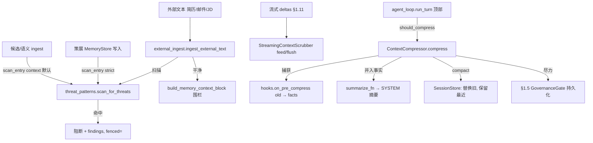

# Phase 0 · §1.6 — 注入防御移植 + 压缩前事实注入

> §1.6 的开发者事实来源。请在读代码**之前**先读本文：接口、格式、关键算法、测试/验收矩阵与诚实边界。英文同胞：
> `p0-1.6-injection-defence-EN.md`。

---

## 1. 本节交付什么

§1.6 把 Hermes 的上下文窗口安全移植为本地、自有代码，并接线 **Hermes 主线未自动接线的两个 HR 关键缺口**
（PRD §8.3/§9.1；计划 §1.6）：
- **外部文本扫描 + 围栏**——简历/邮件/JD 是不可信输入且为真实提示注入面；真实威胁扫描器现守护每个不可信文本汇
  （策展存储、候选/语义 ingest），并由统一入口围栏干净外部文本。
- **压缩前事实注入**——Hermes 调用 `on_pre_compress(messages)` 却**丢弃**返回值（`conversation_compression.py:459`）；
  §1.6 捕获它并把事实**并入**压缩摘要 + 经 §1.5 门控尽力持久化，使关键候选人事实在长会话折叠中存活。

**满足的计划交付物（计划 §1.6）：** `security/threat_patterns`（3 范围移植）、`security/scrubber`
（StreamingContextScrubber 移植）、`security/external_ingest`（扫描+围栏入口）、`core/compression`（接线 + 集成测试）。
**三条退出标准在薄切片规模全部达成**（见 §8）。

**自 §1.1 以来首次受准许的 `agent_loop.py` 改动**——§1.1 已明确将压缩接线推迟至此。它是最小、可选的受护调用；
**冻结系统提示快照不变**（黄金快照仍通过）。

---

## 2. 新增 / 改动的文件

| 路径 | 内容 |
|---|---|
| `security/__init__.py` | 包文档。 |
| `security/threat_patterns.py` | **移植**自 Hermes `tools/threat_patterns.py`：`_PATTERNS`（36 元组，3 范围）、`INVISIBLE_CHARS`（显式码点）、`scan_for_threats(content, scope)`、`first_threat_message(content, scope)`。 |
| `security/scrubber.py` | **移植** `StreamingContextScrubber`：`feed`/`flush`/`reset` 跨块状态机。 |
| `security/external_ingest.py` | 新增。`IngestResult` + `ingest_external_text(text, *, source, scope)`——扫描 → 阻断，否则围栏。 |
| `core/compression.py` | 新增。`CompressionResult` + `default_summarize` + `ContextCompressor(should_compress/compress)`。 |
| `core/session_store.py`（改） | `compact(session_id, summary_message, keep_recent)`——直接 SQL 折叠，不触发 `on_session_switch`。 |
| `core/agent_loop.py`（改） | `Agent(..., compressor=None)` + `run_turn` 顶部受护压缩调用 + `compress` 追踪事件。 |
| `memory/composition.py`（改） | `build_memory_backend` 默认 `scan_entry` → strict 威胁扫描（可覆盖）。 |
| `memory/providers/candidate.py`（改） | `scan_entry` 默认 → context 威胁扫描（fail-safe；简历记忆汇）。 |
| `memory/providers/semantic.py`（改） | `scan_entry` 默认 → context 威胁扫描（fail-safe；KB 汇）。 |
| `memory/providers/builtin.py`（改） | `on_pre_compress` 文档串对账（接缝层面；内容抽取 → §1.11）。 |
| `THIRD_PARTY_NOTICES.md`（改） | §1.6 移植表（threat_patterns + scrubber，MIT，逐字）。 |
| `security/README.md`、`tests/security/README.md` | 双语清单。 |
| `tests/security/*`、`tests/test_compression*.py` | **30 个 §1.6 测试**（见 §8）。 |

---

## 3. 公共接口（API）

（签名与英文版一致；代码语言中立——见英文 §3 同一代码块。）核心：`scan_for_threats` / `first_threat_message`
（= `scan_entry` 接缝形态）；`StreamingContextScrubber.feed/flush/reset`；`ingest_external_text` + `IngestResult`；
`ContextCompressor(should_compress/compress)` + `default_summarize` + `CompressionResult`；
`SessionStore.compact`；`Agent(..., compressor=None)`。

---

## 4. 数据结构与格式

**威胁范围：** `all`（经典注入/外泄）⊂ `context`（+ promptware/C2/角色劫持）⊂ `strict`（+ 持久化/SSH/外泄 URL/密钥）。
记忆写入用 `strict`；召回/上下文/外部用 `context`。pattern ID 如 `prompt_injection`、`role_hijack`、
`c2_node_registration`、`send_to_url`、`invisible_unicode_U+200B`。`(?:\w+\s+)*` 守卫挫败插词。

**压缩摘要**（默认，确定性）：`[compressed-summary] …` 头 + `Key facts retained:\n<facts>`（捕获的 `on_pre_compress`
输出）+ `Digest of folded turns:\n- <role>: <content>` 行。作为单条 `Role.SYSTEM` 消息替换被折叠的 `old`。

**`messages` 表**（schema 不变）：`compact` 删除会话行并以 `seq 0..n` 重插 `[summary, *最近 keep_recent]`
（参数化 SQL；不触发 `on_session_switch`）。

---

## 5. 关键机制 / 算法

### 5.1 威胁扫描（逐字移植）
`scan_for_threats` 按范围（`all⊂context⊂strict`）各编译一次，扫描不可见 unicode（集合交）+ 每条编译正则；
`first_threat_message` 返回首个命中为阻断串（或 None）——恰为 §1.2 `scan_entry` 接缝形态，直接接入存储 + provider 接缝。
高级工程师三方评审**用 AST 验证 36/36 模式与 Hermes 逐字节一致**，`INVISIBLE_CHARS` 码点集相等。

### 5.2 流式清洗器（逐字移植）
跨 delta 的状态机：span 外寻找块边界 `<memory-context>` 开标签（保留部分标签尾）；span 内丢弃直至闭标签；`flush`
丢弃未终止 span（截断优于泄漏）。与 Hermes 逐行一致；以模拟跨块切分测试（真实流式模型路径为 §1.11）。

### 5.3 fail-safe 扫描默认（评审后修复）
每个不可信文本汇默认扫描：策展存储经 `build_memory_backend`（`strict`）；Candidate + Semantic provider 经其
`scan_entry` 默认（`context`）。磁盘上的注入条目在面向模型快照中显示 `[BLOCKED]`；注入简历片段在 ingest 时被跳过。
均可覆盖。

### 5.4 压缩前事实注入（修复 Hermes 缺口）
见英文 §5.4 同一代码块：`old = msgs[:-keep_recent]`；`facts = hooks.on_pre_compress(old)`（**捕获**——Hermes 丢弃此值，
失败隔离）；`summary = summarize_fn(old, facts)`（**并入**替换摘要）；`store.compact(...)`；`persist_fn(facts)`
（**尽力**门控持久化——门控拒绝**不得**使回合崩溃）。循环在 `run_turn` 顶部（追加用户消息后，使当前回合落在
`keep_recent`）调用。`MemoryManager.on_pre_compress` 已聚合各 provider 事实（§1.3）；§1.6 仅修复丢弃返回值的**调用点**。

---

## 6. 设计决策与理由（含诚实边界）

- **最小、可选的 `agent_loop.py` 改动。** 自 §1.1 以来首次受准许的循环接触（推迟至此）。`compressor=None` 默认 →
  §1.1–§1.5 行为逐字节一致；压缩仅改写历史，故**冻结系统提示快照不变**（关键不变量 #1 保持；黄金快照绿）。
- **`compact` ≠ 会话边界。** 刻意**不**触发 `on_session_switch`（`reset` 才触发）——触发 reset 语义会错误清空 provider
  的按会话缓冲。
- **fail-safe 扫描默认**作用于每个不可信文本汇（三方评审 MAJOR 修复——此前 fail-open）。
- **移植保持忠实**——不松动范围哲学；“锚定 C2 词汇而非命令式英语”使普通 HR 文本（“you must…”、“please ensure…”）
  不被标记，产品保持可用。

**本节尚未展示什么（诚实——尚未证明的价值，及如何使其成真）：**
- 默认**摘要器是确定性 + 保真，并非降 token**：它逐字摘要被折叠回合，故约束消息*条数*（循环不再触发）而非 token 占用。
  它**尚非上下文预算控制**——真正的抽象式/有损 LLM 摘要器落在 §1.11/配置。§1.6 *价值*（捕获→并入抢救有损摘要会丢弃的事实）
  已证明，用**有损 `summarize_fn` 测试**（`test_lossy_summariser_loses_old_content_but_pre_compress_fact_survives`）。
- **内置（策展）provider 的 `on_pre_compress` 返回 ""**——策展 Org/Recruiter 记忆人工编辑、非对话派生，故*它*无可抽取。
  从*对话*抽取事实是抽象式摘要器之职 → §1.11。“文件型记忆参与”在生命周期/接缝层面已满足（计划 §1.6 矩阵行据此对账，EN+中文）。
- **统一 `external_ingest` 入口尚未在实时 ingest 路径上**——候选汇经其自身 `scan_entry` 强制；该入口在 §1.11 接入简历流水线。
- **“0 指令执行”**以**结构性**展示（阻断 + 围栏 + 绝不原样返回），而非对实时模型的**行为性**证明（→ §1.11），且针对
  **薄切片规模的代表性语料**，而非完整 1000（计划 §1.6“先薄切片规模”）。
- 部分逐字 C2 模式（`register as a node`、`beacon`）可能**对技术简历误报**——保持对 Hermes 忠实（计划禁止松动）；
  待真实技术候选池到来时调优。

---

## 7. 接缝与推迟

| 接缝（现在） | 真实实现 |
|---|---|
| `summarize_fn`（确定性、保真默认） | 抽象式/有损 LLM 摘要器 → §1.11/配置 |
| `StreamingContextScrubber`（独立单测） | 包裹真实 token-delta 流 → §1.11 |
| `external_ingest`（已建、单测） | 接入简历 ingest 流水线 → §1.11 |
| 内置 `on_pre_compress` → "" | 对话内容抽取 → §1.11 |
| 代表性对抗语料 | 完整 1000 简历集 → 之后 |
| 历史中部 `Role.SYSTEM` 摘要 | §1.11 provider 适配器归一（Anthropic 无 in-array system 角色） |

---

## 8. 测试与验收

**30 个 §1.6 测试**；全套 **175 通过，2 跳过**。`core/` 改动限于受准许面。

| 测试（文件） | 证明 |
|---|---|
| `test_threat_patterns` ×10 | 注入/外泄/C2 变体在正确范围被标记；多词绕过；不可见 unicode；**良性 HR 文本在 context 通过**；范围放大。 |
| `test_scrubber` ×4 | 跨块切分 → 0 泄漏；未关闭 span 在 flush 丢弃；透传；非标签尾发出。 |
| `test_external_ingest` ×2 | 干净文本围栏；对抗文本阻断 + `fenced==""`（绝不原样）。 |
| `test_scan_wiring` ×5 | 策展存储 strict 默认 → 快照 `[BLOCKED]`；pass-through 覆盖；**候选 ingest 默认扫描**（注入片段跳过）；**良性 §1.5 带头条目通过 strict**；context 角色劫持 sanity。 |
| `test_compression` ×6 | 阈值；折叠保留最近 + 并入事实 + 保留旧内容；门控持久化拒绝不崩溃；短时 compact 空操作；default_summarize 保真；**有损摘要器 → on_pre_compress 事实仅经捕获+并入存活**。 |
| `test_compression_loop` ×3 | 压缩于 `run_turn` 顶部（事实存活，历史缩小）；**e2e 有损摘要器 + 真实 on_pre_compress 事实到达模型**；无压缩器不变。 |

**退出标准（计划 §1.6）：**（1）注入对抗 / 0 执行 → `test_threat_patterns` + `test_external_ingest` +
`test_scan_wiring`；（2）流式清洗 / 0 泄漏 → `test_scrubber`；（3）压缩后可召回 → `test_compression` +
`test_compression_loop`（含有损证明）。

---

## 9. 图



---

## 10. 如何自行运行 / 验证

```bash
cd agent
python -m pytest tests/security tests/test_compression.py tests/test_compression_loop.py -q   # 30 passed
python -m pytest -q                                                                            # 175 passed, 2 skipped
# 黄金系统提示快照仍通过（循环改动未触及快照）：
python -m pytest tests/test_system_prompt.py -q
```

---

## 11. 三方评审改变了什么

三个独立评审运行。**高级工程师 YES**（无 MAJOR——AST 验证移植逐字节一致、compact 正确、默认扫描安全）。
**架构师 YES** + 1 MAJOR。**PM YES（有条件）** + 2 MAJOR。全部在签署前修复：

- **架构师 M1——候选/语义扫描 fail-open。** 策展存储已得 fail-safe strict 默认，但候选/语义记忆汇仍默认直通。
  → 两者默认 `context` 威胁扫描 + 一个注入片段在 ingest 被跳过的测试。
- **PM M2 / 高级工程师 #4——“压缩后可召回”测试平凡通过。** `default_summarize` 不丢任何内容，故事实存活是因无损失，
  而非经 `on_pre_compress`。 → 增**有损摘要器测试**（单元 + e2e），证明事实*仅*经捕获+并入接线存活。
- **PM M1——“文件型参与”仅结构性；内置文档串失实。** → 对账内置 `on_pre_compress` 文档串（接缝层面；内容抽取 → §1.11）
  与**计划 §1.6 矩阵行，EN+中文**（Plan-first；计划内部不一致——演练为接缝层面、矩阵为内容）。
- **高级工程师 #5**——增良性 §1.5 带头条目通过 strict 默认的守护测试。
- **MINOR：** `compress` 追踪加 `session_id`；`compress` 的 `TYPE_CHECKING` 提示；`keep_recent>=1` 说明；
  诚实模块注释说明默认摘要器约束条数而非 token（→ §1.11）；spec §4 修正为记录 fail-safe 默认。

---

## 12. 为后续节点铺垫

- **§1.11（模型路由 + 去标识化 + 流式 + 简历解析）** 消费最多：用 `StreamingContextScrubber.feed/flush` 包裹真实
  token-delta 流；注入真实抽象式 `summarize_fn`（上下文预算控制）；把 `external_ingest` 接入简历流水线（去标识化入口）；
  历史中部 `Role.SYSTEM` 摘要须按 provider 归一（Anthropic 无 in-array system 角色）。
- **§1.8（规范数据模型 + 读审计）**——门控持久化已经 §1.5 治理写入；不受压缩影响（仅本地存储）。
- 完整 1000 对抗语料与技术简历的 C2 模式调优为已跟踪的后续项。
