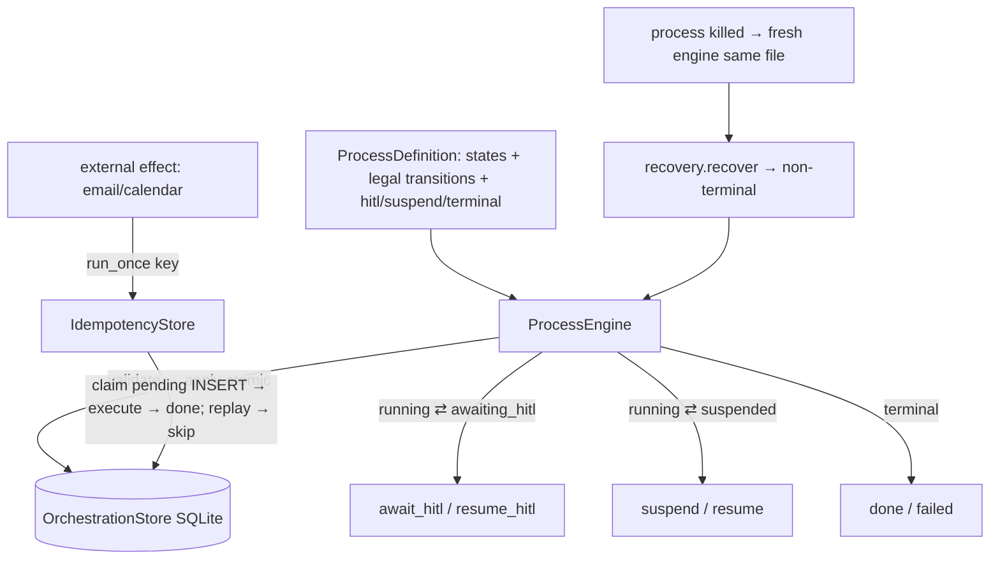

# Phase 0 · §1.7 — Layer B Long-Running Orchestration Skeleton

> Developer source-of-truth for §1.7. Read this **before** the code: the interfaces, the data model, the
> key mechanisms, the test/acceptance matrix, and the honest limitations. Bilingual sibling:
> `p0-1.7-orchestration.md`.

---

## 1. What this delivers

§1.7 builds **Layer B** — the long-running business-process state machine Hermes lacks. Layer A
(§1.1–§1.6: agent loop + memory + governance + injection defence) is single-shot inference; **Layer B is
the cross-day, multi-party, resumable hiring loop** (PRD §2.6/§13.1). This cycle ships only the
**skeleton + primitives**; the real recruitment states are Phase 1 M3, and the upgrade to
Temporal/LangGraph is reserved for if the skeleton fails the contract (§1.12 spike). It is **net-new**
(no Hermes port) and **standalone** — `core/agent_loop.py` is byte-unchanged (git-verified).

It satisfies the **three hard persistence contracts** (Plan §1.7 / PRD §13.1) that are the exit criteria:
**① crash recovery**, **② cross-day pause/resume**, **③ external side-effect idempotency** — "lightweight"
must not mean "weak guarantees", because "every step auditable" (compliance) depends on the persisted
state history.

**Plan deliverables satisfied:** `orchestration/state_machine`, `orchestration/idempotency`,
`orchestration/recovery`, + the three acceptance tests.

---

## 2. Files added / changed

| Path | What it contains |
|---|---|
| `orchestration/__init__.py` | Package doc (Layer A vs Layer B). |
| `orchestration/state_machine.py` | `Status`, `ProcessInstance` + `Transition` dataclasses, `IllegalTransition`, **`ProcessDefinition`** (declared states + transitions + class sets, disjointness-validated), **`ProcessEngine`** (`start`/`transition`/`await_hitl`/`resume_hitl`/`suspend`/`resume`/`fail`). |
| `orchestration/store.py` | **`OrchestrationStore`** (SQLite): `process_instances`, append-only `transitions`, `idempotency`; **`apply`** (atomic instance+transition), `idem_begin`/`idem_complete` (race-safe claim), `close`. |
| `orchestration/idempotency.py` | **`IdempotencyStore.run_once(key, effect_fn)`** — register-before-execute, concurrency-safe dedup. |
| `orchestration/recovery.py` | **`recover(store)`** — the crash-recovery loader (non-terminal instances). |
| `orchestration/README.md`, `tests/orchestration/README.md` | bilingual manifests. |
| `tests/orchestration/*` | **25 tests** (store 6, state_machine 11, idempotency 4, recovery 1, persistence_contracts 3). |
| `src/jobpin_agent/README.md`, `tests/README.md` | parent-manifest currency (orchestration/ now exists). |

---

## 3. The public surface (API)

```python
# orchestration/state_machine.py
class Status(str, Enum): RUNNING / SUSPENDED / AWAITING_HITL / DONE / FAILED
class IllegalTransition(Exception): ...
@dataclass ProcessInstance: instance_id; process_type; current_state; status: Status; context_ref=""; updated_at=""
@dataclass Transition:      instance_id; from_state; to_state; trigger; at; actor
@dataclass ProcessDefinition: process_type; initial_state; transitions: dict[str, set[str]];
                              hitl_states=∅; suspend_states=∅; terminal_states=∅
    is_legal(from, to) -> bool ; status_for(state) -> Status   # (+ __post_init__ disjointness check)
class ProcessEngine(store, definition, *, clock=utcnow):
    start(instance_id, *, context_ref="", actor="system") -> ProcessInstance      # raises if id exists
    transition(instance_id, to_state, *, trigger, actor="system") -> ProcessInstance  # raises IllegalTransition
    await_hitl(instance_id, *, to_state, trigger, actor) ; resume_hitl(instance_id, *, to_state, decision, actor)
    suspend(instance_id, *, to_state, trigger, actor)   ; resume(instance_id, *, to_state, trigger, actor)
    fail(instance_id, *, reason, actor="system") -> ProcessInstance                # raises if already terminal

# orchestration/store.py
class OrchestrationStore(db_path=":memory:"):
    save_instance / load_instance / append_transition / transitions_for / non_terminal_instances
    apply(inst, transition)                       # ATOMIC: instance + transition in one commit
    idem_get(key) -> {"status","result"}|None ; idem_begin(key, at) -> bool ; idem_complete(key, result, at) ; idem_put(...)
    close()

# orchestration/idempotency.py
class IdempotencyStore(store): run_once(key, effect_fn) -> tuple[result: str, executed: bool]

# orchestration/recovery.py
recover(store) -> list[ProcessInstance]           # the non-terminal (resumable) instances
```

---

## 4. Data structures & formats (verbatim from Plan §1.7)

```
ProcessInstance := { instance_id, process_type, current_state,
                     status ∈ {running, suspended, awaiting_hitl, done, failed},
                     context_ref,   # opaque pointer to session / memory / entity
                     updated_at }   # ISO-8601 UTC
Transition       := { instance_id, from_state, to_state, trigger, at, actor }   # append-only history
idempotency_key  := "<effect>:<req_id>:<candidate_id>:<slot>"   # interview:req_812:cand_7f3a:slot_3
```
**SQLite:** `process_instances(instance_id PK, …)`; `transitions(id PK AUTOINCREMENT, …)` (append-only — no
update/delete method); `idempotency(key PK, status ∈ {pending,done}, result, at)`.

---

## 5. Key mechanisms / algorithms

### 5.1 Declarative, validated transitions
`ProcessDefinition.transitions[from] = {allowed to-states}`; `ProcessEngine.transition` rejects an
undeclared hop (`IllegalTransition`) and derives the resulting `Status` from the to-state's class
(`status_for`). `start`/`fail`/`await_hitl`/`suspend` are guarded (no re-start of a live id, no flipping a
terminal, the to-state must be the matching class). `ProcessDefinition.__post_init__` rejects state-class
overlap. The declared definition is the auditable contract M3 will populate.

### 5.2 Atomic state + audit (the triple-review M1 fix)
```python
# OrchestrationStore.apply — one transaction, one commit
self._conn.execute("INSERT OR REPLACE INTO process_instances VALUES (?,?,?,?,?,?)", (...))
self._conn.execute("INSERT INTO transitions (...) VALUES (?,?,?,?,?,?)", (...))
self._conn.commit()   # instance + transition land together
```
`start`/`transition`/`fail` all route through `apply`, so a crash can never persist a state advance with no
transition explaining it — the append-only audit history can't diverge from the state. (Mirrors
`core/session_store.py::compact`.)

### 5.3 Register-before-execute idempotency, concurrency-safe (M2 fix)
```python
# IdempotencyStore.run_once
if store.idem_get(key) is not None: return result, False         # already registered → skip
if not store.idem_begin(key, now):                                # CLAIM via plain INSERT (PK)
    return (store.idem_get(key) or {}).get("result",""), False   # a racer won → skip, never execute
result = effect_fn()                                              # the external side effect
store.idem_complete(key, str(result), done_now)                   # mark done (own timestamp)
```
The `pending` claim is a plain `INSERT` on the `key` PRIMARY KEY, so exactly one racer wins; a concurrent or
replayed claim hits `IntegrityError` → skip. This is the "never double-send an offer email" guarantee, safe
even across processes/restarts.

### 5.4 Crash recovery
`recover(store)` returns the non-terminal instances (RUNNING/SUSPENDED/AWAITING_HITL). A "restart" = drop
the engine + open a fresh `OrchestrationStore` over the **same SQLite file**; committed state is visible, so
`recover` + `resume_hitl`/`resume` continue from the persisted `current_state` with `context_ref` intact.

---

## 6. Design decisions & why (with honest boundaries)

- **Declarative engine** — illegal transitions rejected; the definition is the auditable contract (vs a
  free-form store). **Conceptual purpose:** Layer B is *why* the product is "not a chatbot" — a hiring loop
  spans days and people, survives crashes, and never double-acts on the outside world.
- **Atomic state+audit persistence** (M1) — state and its history commit together.
- **Concurrency-safe register-before-execute idempotency** (M2) — dedup-wins, never double-send.
- **SQLite, append-only transition history** — the audit basis; matches the repo's local-first stores.
- **Standalone, no `agent_loop.py` change** — agent-turn wiring + the §1.11 routing-failure suspend/fallback
  is M3/§1.11 (the `suspend`/`await_hitl` capability is *reserved* for it).
- **In-house, Temporal/LangGraph deferred** — only if the skeleton fails the contract (§1.12 spike, ADR).

**What this does NOT yet show (honest):**
- **Toy process only** — no real recruitment states (sourcing/screening/scheduling) → M3; the side-effect
  tests use a **fake `effect_fn`**, not a real email/calendar connector (→ §1.10/M3).
- **"Crash" is a simulated restart** — drop-the-engine + reopen a fresh store over the same committed SQLite
  file, **not** a mid-write `SIGKILL`; torn-write durability rests on SQLite's per-commit atomicity.
- **Idempotency is at-most-once on a crash-between-claim-and-execute** — the disclosed dedup-wins trade-off
  (favours never-double-send); `run_once` does not yet surface pending-vs-done, and a "reconcile pending
  against the provider" retry pass is deferred to real connectors.
- **Append-only is API-level** (no update/delete method), **not** a DB constraint — cryptographic
  tamper-evidence is the §1.8 canonical-audit concern.
- **`recover` returns instances but no `process_type → definition` registry** — fine for one toy process;
  M3 (multiple process types) needs a definition registry to re-attach the right engine per instance.

---

## 7. Seams & deferrals

| Seam (now) | Real implementation |
|---|---|
| toy `ProcessDefinition` | the real recruitment states → M3 |
| `suspend` / `await_hitl` reserved | §1.11 routing-failure suspend/fallback + agent-turn steps → M3/§1.11 |
| fake `effect_fn` in tests | real email/calendar connectors → §1.10/M3 |
| append-only `transitions` table | folded into the canonical `AuditRecord` → §1.8 (a definition registry for `recover` lands with M3) |
| in-house engine | Temporal/LangGraph only if the contract fails → §1.12 spike (ADR) |

---

## 8. Tests & acceptance

**25 §1.7 tests**; full suite **200 passed, 2 skipped**. `core/` byte-identical to `main`.

| Test (file) | Proves |
|---|---|
| `test_store` ×6 | instance round-trip; append-only ordered transitions; non-terminal filter; **`apply` atomicity**; **`idem_begin` claims-once-then-rejects**; idem get/put. |
| `test_state_machine` ×11 | start + initial state + log; legal transition; illegal rejected; await/resume HITL; history appended; fail → FAILED; **unknown-instance rejected**; **start-on-existing rejected**; **fail-from-terminal rejected**; **await_hitl to non-hitl rejected**; **definition state-class overlap rejected**. |
| `test_idempotency` ×4 | run-once dedup; restart replay not re-sent; **at-most-once gap (crash before done → replay skips, not re-run)**; **concurrent-claim loser skips**. |
| `test_recovery` ×1 | recover returns only non-terminal instances. |
| `test_persistence_contracts` ×3 | **① crash recovery** (kill → fresh engine same file → recover + resume to done, context intact); **② cross-day pause/resume** (suspend → resume later, no wall-clock, context intact); **③ side-effect idempotency** (retry across restart → effect once). |

**Exit criteria (Plan §1.7):** ① → `test_contract1_crash_recovery`; ② → `test_contract2_cross_day_pause_resume`;
③ → `test_contract3_side_effect_idempotency` (+ `test_idempotency`).

---

## 9. Diagram



---

## 10. How to run / verify it yourself

```bash
cd agent
python -m pytest tests/orchestration -q     # 25 passed
python -m pytest -q                          # 200 passed, 2 skipped
git diff --stat main -- src/jobpin_agent/core/   # empty — standalone Layer B, no loop change
```

---

## 11. What the triple-review changed

**Senior NO** (1 MAJOR), **Architect YES** (+1 MAJOR, agreeing), **PM YES** (no MAJOR). All fixed before sign-off:

- **M1 (Senior + Architect) — atomicity.** `start`/`transition`/`fail` committed the instance and its
  transition separately → a crash between could advance state with no audit row. → Added
  `OrchestrationStore.apply` (one transaction); all three route through it; + an atomicity test.
- **M2 (Senior) — `run_once` race.** Check-then-act + `INSERT OR REPLACE` could double-send under a race. →
  Claim `pending` via a plain `INSERT` (`idem_begin`, `IntegrityError` → skip); concurrency-safe; + the
  done timestamp is now its own; + concurrent-claim + at-most-once-gap tests.
- **MINORs:** `start` existence guard; `fail` terminal guard; `await_hitl`/`suspend` to-state class
  validation; `ProcessDefinition` disjointness; the missing negative tests (unknown instance, fail-terminal,
  the at-most-once gap); `close()`; and the honesty notes (crash = restart-sim; append-only is API-level;
  `run_once` doesn't surface pending-vs-done; `recover` needs an M3 definition registry) added to the spec.
- All three confirmed the **boundary, §1.x order, in-house-vs-Temporal call, and the separate transition log
  are correct** — no Plan/PRD correction was needed.

---

## 12. How this sets up the next point(s)

- **M3 (recruitment process)** supplies a real `ProcessDefinition` (sourcing/screening/scheduling states) —
  no engine change. It will need a **`process_type → ProcessDefinition` registry** so `recover` re-attaches
  the right engine per recovered instance (the one seam to add).
- **§1.11 (model router + de-id + streaming)** calls `engine.suspend(...)` on a cloud/BYO-key failure and
  `engine.resume(...)` on fallback (the reserved seam) — and wires process steps to agent turns.
- **§1.8 (canonical data model + audit)** folds the append-only `transitions` log into the canonical
  `AuditRecord` (ordering via `transitions.id`; the §1.0 dual-timestamp is added there, not here).
- **§1.10 (connectors)** + M3 supply real `effect_fn`s (email/calendar) behind `run_once`, and a
  reconcile-pending retry pass for the at-most-once gap.
