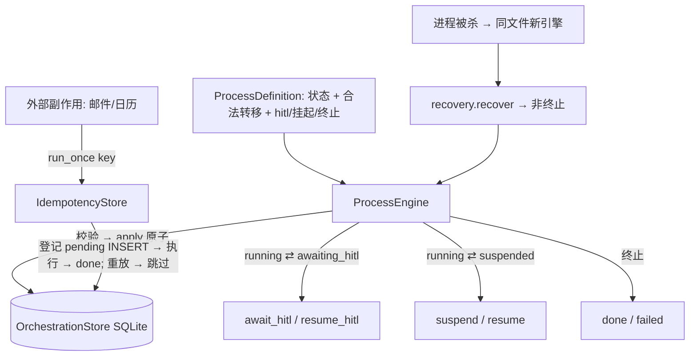

# Phase 0 · §1.7 — Layer B 长程编排骨架

> §1.7 的开发者事实来源。请在读代码**之前**先读本文：接口、数据模型、关键机制、测试/验收矩阵与诚实边界。英文同胞：
> `p0-1.7-orchestration-EN.md`。

---

## 1. 本节交付什么

§1.7 构建 **Layer B**——Hermes 缺失的长程业务流程状态机。Layer A（§1.1–§1.6：agent 循环 + 记忆 + 治理 + 注入防御）是
单次推理；**Layer B 是跨天、多方、可恢复的招聘 loop**（PRD §2.6/§13.1）。本周期仅交付**骨架 + 原语**；真实招聘状态在第一
阶段 M3，升级到 Temporal/LangGraph 保留至骨架未达契约时（§1.12 spike）。它**新增**（非 Hermes 移植）且**独立**——
`core/agent_loop.py` 逐字节未改（git 验证）。

它满足作为退出标准的**三条硬持久化契约**（计划 §1.7 / PRD §13.1）：**① 崩溃恢复**、**② 跨天暂停/恢复**、
**③ 外部副作用幂等**——“轻量”不得意味着“弱保证”，因为合规要求的“每步可审计”依赖持久化的状态历史。

**满足的计划交付物：** `orchestration/state_machine`、`orchestration/idempotency`、`orchestration/recovery`，
外加三个验收测试。

---

## 2. 新增 / 改动的文件

| 路径 | 内容 |
|---|---|
| `orchestration/__init__.py` | 包文档（Layer A 与 Layer B）。 |
| `orchestration/state_machine.py` | `Status`、`ProcessInstance` + `Transition` 数据类、`IllegalTransition`、**`ProcessDefinition`**（声明状态 + 转移 + 类集合，校验互斥）、**`ProcessEngine`**（`start`/`transition`/`await_hitl`/`resume_hitl`/`suspend`/`resume`/`fail`）。 |
| `orchestration/store.py` | **`OrchestrationStore`**（SQLite）：`process_instances`、仅追加 `transitions`、`idempotency`；**`apply`**（原子写实例+转移）、`idem_begin`/`idem_complete`（竞态安全登记）、`close`。 |
| `orchestration/idempotency.py` | **`IdempotencyStore.run_once(key, effect_fn)`**——执行前登记、竞态安全去重。 |
| `orchestration/recovery.py` | **`recover(store)`**——崩溃恢复加载器（非终止实例）。 |
| `orchestration/README.md`、`tests/orchestration/README.md` | 双语清单。 |
| `tests/orchestration/*` | **25 个测试**（store 6、state_machine 11、idempotency 4、recovery 1、persistence_contracts 3）。 |
| `src/jobpin_agent/README.md`、`tests/README.md` | 父清单时效（orchestration/ 现已存在）。 |

---

## 3. 公共接口（API）

（签名与英文版一致；代码语言中立——见英文 §3 同一代码块。）核心：`Status`/`ProcessInstance`/`Transition`/
`ProcessDefinition`（含 `__post_init__` 互斥校验）/`ProcessEngine`（start/transition/await_hitl/resume_hitl/
suspend/resume/fail，含守卫）；`OrchestrationStore`（含 **`apply`** 原子、`idem_begin`/`idem_complete`、`close`）；
`IdempotencyStore.run_once`；`recover(store)`。

---

## 4. 数据结构与格式（原样，计划 §1.7）

```
ProcessInstance := { instance_id, process_type, current_state,
                     status ∈ {running, suspended, awaiting_hitl, done, failed},
                     context_ref,   # 指向会话/记忆/实体的不透明指针
                     updated_at }   # ISO-8601 UTC
Transition       := { instance_id, from_state, to_state, trigger, at, actor }   # 仅追加历史
idempotency_key  := "<effect>:<req_id>:<candidate_id>:<slot>"   # interview:req_812:cand_7f3a:slot_3
```
**SQLite：** `process_instances(instance_id 主键, …)`；`transitions(id 主键 自增, …)`（仅追加——无更新/删除方法）；
`idempotency(key 主键, status ∈ {pending,done}, result, at)`。

---

## 5. 关键机制 / 算法

### 5.1 声明式、受校验的转移
`ProcessDefinition.transitions[from] = {允许的 to-states}`；`ProcessEngine.transition` 拒绝未声明跳转
（`IllegalTransition`），并由 to-state 的分类（`status_for`）推导结果 `Status`。`start`/`fail`/`await_hitl`/`suspend`
受守卫（不重启运行中 id、不翻转终止、to-state 须为对应类）。`ProcessDefinition.__post_init__` 拒绝状态类重叠。声明的定义
即 M3 将填充的可审计契约。

### 5.2 原子状态 + 审计（三方评审 M1 修复）
见英文 §5.2 同一代码块：`OrchestrationStore.apply` 在**一个事务、一次提交**中写实例与转移；`start`/`transition`/`fail`
皆经 `apply`，故崩溃绝不会在无解释转移的情况下持久化状态推进——仅追加审计历史不会与状态背离。（对应
`core/session_store.py::compact`。）

### 5.3 执行前登记的幂等，竞态安全（M2 修复）
见英文 §5.3 同一代码块：`pending` 登记为对 `key` 主键的纯 `INSERT`，故恰有一个竞争者胜出；并发或重放登记触发
`IntegrityError` → 跳过。这是“绝不重复发出 offer 邮件”的保证，即使跨进程/重启也安全。

### 5.4 崩溃恢复
`recover(store)` 返回非终止实例（RUNNING/SUSPENDED/AWAITING_HITL）。“重启” = 丢弃引擎 + 在**同一 SQLite 文件**上
新建 `OrchestrationStore`；已提交状态可见，故 `recover` + `resume_hitl`/`resume` 从持久化 `current_state` 继续，
`context_ref` 完整。

---

## 6. 设计决策与理由（含诚实边界）

- **声明式引擎**——非法转移被拒；定义即可审计契约（相对自由式存储）。**概念目的：** Layer B 是产品“非聊天机器人”之*因*
  ——招聘 loop 跨天跨人、经崩溃存活、绝不对外界重复作用。
- **原子状态+审计持久化**（M1）——状态与其历史一起提交。
- **竞态安全的执行前登记幂等**（M2）——去重优先，绝不重发。
- **SQLite、仅追加转移历史**——审计基础；与仓库本地优先存储一致。
- **独立、不改 `agent_loop.py`**——agent 回合接线 + §1.11 路由失败挂起/回退在 M3/§1.11（`suspend`/`await_hitl` 能力为其*保留*）。
- **自建，Temporal/LangGraph 推迟**——仅当骨架未达契约时（§1.12 spike，ADR）。

**本节尚未展示什么（诚实）：**
- **仅玩具流程**——无真实招聘状态（sourcing/screening/scheduling）→ M3；副作用测试用**伪 `effect_fn`**，非真实邮件/日历
  连接器（→ §1.10/M3）。
- **“崩溃”为模拟重启**——丢弃引擎 + 在同一已提交 SQLite 文件上重开存储，**非**写入中途 `SIGKILL`；半写持久性依赖 SQLite 的
  逐提交原子性。
- **幂等在“登记后、执行前崩溃”时为至多一次**——已披露的去重优先权衡（偏向绝不重发）；`run_once` 尚未向调用方暴露
  pending 与 done 之别，“与提供方对账 pending”的重试一遍推迟到真实连接器。
- **仅追加为 API 层面**（无更新/删除方法），**非** DB 约束——加密防篡改属 §1.8 规范审计。
- **`recover` 返回实例但无 `process_type → 定义` 注册表**——对单一玩具流程足够；M3（多流程类型）需定义注册表以为每个实例
  重新挂接正确引擎。

---

## 7. 接缝与推迟

| 接缝（现在） | 真实实现 |
|---|---|
| 玩具 `ProcessDefinition` | 真实招聘状态 → M3 |
| 保留的 `suspend` / `await_hitl` | §1.11 路由失败挂起/回退 + agent 回合步骤 → M3/§1.11 |
| 测试中的伪 `effect_fn` | 真实邮件/日历连接器 → §1.10/M3 |
| 仅追加 `transitions` 表 | 折叠入规范 `AuditRecord` → §1.8（`recover` 的定义注册表随 M3） |
| 自建引擎 | 仅当契约失败时 Temporal/LangGraph → §1.12 spike（ADR） |

---

## 8. 测试与验收

**25 个 §1.7 测试**；全套 **200 通过，2 跳过**。`core/` 与 `main` 逐字节一致。

| 测试（文件） | 证明 |
|---|---|
| `test_store` ×6 | 实例往返；仅追加且有序的转移；非终止过滤；**`apply` 原子性**；**`idem_begin` 登记一次后拒绝**；idem get/put。 |
| `test_state_machine` ×11 | start + 初始状态 + 记录；合法转移；非法被拒；await/resume HITL；历史追加；fail → FAILED；**未知实例被拒**；**对已存在 start 被拒**；**对终止 fail 被拒**；**await_hitl 到非 hitl 被拒**；**定义状态类重叠被拒**。 |
| `test_idempotency` ×4 | run-once 去重；重启重放不重发；**至多一次缺口（done 前崩溃 → 重放跳过、不重跑）**；**并发登记失败者跳过**。 |
| `test_recovery` ×1 | recover 仅返回非终止实例。 |
| `test_persistence_contracts` ×3 | **① 崩溃恢复**（杀死 → 同文件新引擎 → recover + 恢复到 done，上下文完整）；**② 跨天暂停/恢复**（suspend → 之后 resume，无墙钟，上下文完整）；**③ 副作用幂等**（重启后重试 → 副作用一次）。 |

**退出标准（计划 §1.7）：** ① → `test_contract1_crash_recovery`；② → `test_contract2_cross_day_pause_resume`；
③ → `test_contract3_side_effect_idempotency`（+ `test_idempotency`）。

---

## 9. 图



---

## 10. 如何自行运行 / 验证

```bash
cd agent
python -m pytest tests/orchestration -q     # 25 passed
python -m pytest -q                          # 200 passed, 2 skipped
git diff --stat main -- src/jobpin_agent/core/   # 空——独立 Layer B，不改循环
```

---

## 11. 三方评审改变了什么

**高级工程师 NO**（1 MAJOR）、**架构师 YES**（+1 MAJOR，一致）、**PM YES**（无 MAJOR）。全部在签署前修复：

- **M1（高级工程师 + 架构师）——原子性。** `start`/`transition`/`fail` 分别提交实例与转移 → 二者间崩溃可能在无审计行的情况下
  推进状态。 → 增 `OrchestrationStore.apply`（单事务）；三者皆经之；+ 原子性测试。
- **M2（高级工程师）——`run_once` 竞态。** 先查后写 + `INSERT OR REPLACE` 在竞态下可能重发。 → 以纯 `INSERT` 登记 `pending`
  （`idem_begin`，`IntegrityError` → 跳过）；竞态安全；+ done 时间戳独立；+ 并发登记与至多一次缺口测试。
- **MINOR：** `start` 存在性守卫；`fail` 终止守卫；`await_hitl`/`suspend` 的 to-state 类校验；`ProcessDefinition` 互斥；
  缺失的负向测试（未知实例、对终止 fail、至多一次缺口）；`close()`；以及诚实注释（崩溃=重启模拟；仅追加为 API 层面；
  `run_once` 不暴露 pending/done 之别；`recover` 需 M3 定义注册表）写入 spec。
- 三方一致确认**边界、§1.x 顺序、自建-vs-Temporal 决策、独立转移日志均正确**——无需 Plan/PRD 更正。

---

## 12. 为后续节点铺垫

- **M3（招聘流程）** 提供真实 `ProcessDefinition`（sourcing/screening/scheduling 状态）——不改引擎。它将需要
  **`process_type → ProcessDefinition` 注册表**，使 `recover` 为每个恢复实例重新挂接正确引擎（待加的接缝）。
- **§1.11（模型路由 + 去标识 + 流式）** 在云/BYO-key 失败时调用 `engine.suspend(...)`、回退时 `engine.resume(...)`
  （保留接缝）——并把流程步骤接到 agent 回合。
- **§1.8（规范数据模型 + 审计）** 把仅追加 `transitions` 日志折叠入规范 `AuditRecord`（排序经 `transitions.id`；§1.0 双时间戳
  在彼处加入，而非此处）。
- **§1.10（连接器）** + M3 在 `run_once` 背后提供真实 `effect_fn`（邮件/日历），并为至多一次缺口提供对账重试一遍。
