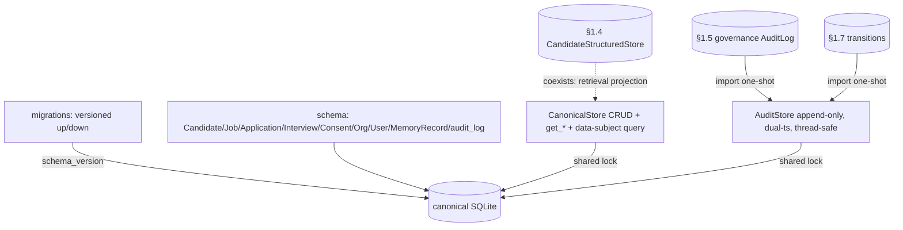

# Phase 0 · §1.8 — Canonical Data Model + Local Audit Log

> Developer source-of-truth for §1.8. Read this **before** the code: the interfaces, the schema, the
> key mechanisms, the test/acceptance matrix, and the honest limitations. Bilingual sibling:
> `p0-1.8-canonical-data-audit.md`.

---

## 1. What this delivers

§1.8 lands the **canonical relational data model** for the HR lifecycle (the M1–M3 subset) + one **local
append-only audit log** — the relational backbone every compliance/forensics query reads from (Plan §1.8;
PRD §11.1). `AuditRecord` + `MemoryRecord` are the **seam tables** that map the §1.0 shared vocab, the §1.4
records, and the §1.5 governance schema onto one relational layer. It **reconciles three forerunners by
import (not rewire)** — the §1.5 governance `AuditLog`, the §1.7 transition log, and the §1.4
`CandidateStructuredStore` (which stays the retrieval projection). `tenant_id` is a single-tenant
placeholder; **no event sourcing, no multi-tenant infra** (PRD §13.1). Net-new (no Hermes port);
**standalone** — `core/memory/governance/orchestration/security` are byte-unchanged (git-verified).

**Plan deliverables satisfied:** `data/schema` (entities + roll-forward/back migrations), `data/audit`
(append-only writer + query interface), the **entity↔memory mapping document**.

---

## 2. Files added / changed

| Path | What it contains |
|---|---|
| `data/__init__.py` | Package doc. |
| `data/schema.py` | 8 entity dataclasses (`Candidate/Job/Application/Interview/Consent/Org/User/MemoryRecord`) + `TABLES` DDL (incl. `audit_log`, `store_kind` CHECK); `DEFAULT_TENANT`/`DEFAULT_ORG`. |
| `data/migrations.py` | `Migration` + `MIGRATIONS`/`LATEST` + `current_version` + **`migrate(conn, to_version)`** (roll forward/back; records the achieved version). |
| `data/audit.py` | `AuditRecord` + **`AuditStore`** (append-only, dual-timestamp, read+write actions, **thread-safe**, LIKE-escaped query) + `import_governance_audit` / `import_transitions`. |
| `data/store.py` | **`CanonicalStore`** — migrates on open, CRUD + `get_*` for every entity, `consents_for_candidate`, `memory_records_under(prefix)`, shared thread-safe `.audit`. |
| `docs/entity-memory-mapping.md` | The named deliverable: field→store routing + the `MemoryRecord` seam + canonical-vs-§1.4-projection. |
| `data/README.md`, `tests/data_model/README.md` | bilingual manifests. |
| `tests/data_model/*` | **13 tests** (schema 2, migrations 2, audit 5, store 4). |
| `jobpin_agent/README.md`, `tests/README.md` | parent-manifest currency. |

*(Note: the §1.8 tests live in `tests/data_model/`, not `tests/data/` — the latter is the system-prompt
golden FIXTURE dir; the names would have collided.)*

---

## 3. The public surface (API)

```python
# data/schema.py — dataclasses + DDL
Candidate(candidate_id, tenant_id, org_id, name, skills[], years, location, work_rights, consent_status, memory_key)
Job / Application / Interview / Consent / Org / User / MemoryRecord(memory_key, store_kind ∈ {file,vector,struct}, provenance, consent_label, retention_policy)
TABLES: dict[str, str]   # name → CREATE TABLE … (incl. audit_log)

# data/migrations.py
LATEST: int ; current_version(conn) -> int ; migrate(conn, to_version=LATEST) -> None   # forward AND back

# data/audit.py
@dataclass AuditRecord(actor, action, target_key, at_monotonic, at_wall, reason, result)
class AuditStore(conn, lock=None):
    record(actor, action, target_key, *, reason="", result="ok") -> None      # actions incl. recall / rejected:rbac
    query(*, target_key=None, actor=None, action=None, result_prefix=None) -> list[AuditRecord]
    import_governance_audit(governance_audit_log) -> int                       # §1.5 rows (one-shot)
    import_transitions(transitions) -> int                                     # §1.7 Transitions → action="transition"

# data/store.py
class CanonicalStore(db_path=":memory:"):
    .audit                                          # a thread-safe AuditStore over the same conn
    upsert_*/get_* for every entity ; consents_for_candidate(candidate_id) ; memory_records_under(prefix)
```

---

## 4. Data structures & formats (verbatim from Plan §1.8 / §1.0)

```
Candidate    := { candidate_id, tenant_id, org_id, name, skills[], years, location, work_rights, consent_status, memory_key }
Consent      := { consent_id, candidate_id, purpose, legal_basis, granted_at, ttl_policy }
Job/Application/Interview/Org/User    (M1–M3 subset)
AuditRecord  := { actor, action, target_key, at_monotonic, at_wall, reason, result }      # §1.0 dual-timestamp
MemoryRecord := { memory_key, store_kind ∈ {file, vector, struct}, provenance, consent_label, retention_policy }
```
**SQLite:** one table per entity; `audit_log` append-only (no update/delete API); `schema_version` (single
row); `tenant_id` defaults to `acme` (from `governance.namespace`). `store_kind` has a `CHECK` constraint.

---

## 5. Key mechanisms / algorithms

### 5.1 Roll-forward/back migrations
`migrate(conn, to_version)` applies each migration's `up` ascending (forward) or `down` descending (back),
then records the **version actually reached** (a triple-review fix — an overshoot target isn't recorded as
applied). v1 = the full M1–M3 subset + `audit_log`; v2/v3 slot into `MIGRATIONS`. Stdlib only (no Alembic).

### 5.2 Thread-safe canonical audit (the triple-review MAJOR fix)
The §1.5 governance docstring deferred the read-path (`recall`/`rejected:rbac`) audit to §1.8 *because*
§1.8 would be "the thread-safe canonical table" (recall runs on the §1.3 background `mem-sync` worker). So:
`CanonicalStore` opens the connection `check_same_thread=False` and a single `threading.Lock` serialises
ALL connection access (CRUD + audit) — the worker can `audit.record(...)` while the main thread does entity
CRUD, without racing the shared connection. Proven by `test_audit_record_is_thread_safe` (concurrent
worker + main records, all land).

### 5.3 Append-only audit + query
`AuditStore.record` stamps a dual timestamp (`time.monotonic()` + wall ISO-8601); there is no update/delete
method (append-only). `query` filters by target/actor/action/result_prefix; the `result_prefix` LIKE
**escapes** `_`/`%`/`\` so a code like `rejected:no_consent` matches literally (a forensics-correctness fix).
The audit insert is its own commit, independent of any business-table transaction, so a `rejected:*` op
still leaves a trace.

### 5.4 Reconciliation by import (non-invasive)
`import_governance_audit(gov)` copies the §1.5 `AuditLog` rows field-for-field (same shape);
`import_transitions(transitions)` maps each §1.7 `Transition` to `action="transition"`,
`target_key=instance_id`, `reason="{from}->{to}:{trigger}"` (`at_monotonic=0.0` — historical rows predate
the dual timestamp). **One-shot, non-idempotent**: re-importing duplicates rows (the canonical table is the
unified query entry point *after* a reconciliation import). The forerunners are **not rewired** — they keep
emitting locally; consolidation is Phase 2.

### 5.5 The data-subject query
`consents_for_candidate(candidate_id)` (`Candidate → Consent`) + `memory_records_under(prefix)`
(`Candidate → MemoryRecord` by `memory_key` prefix, matching the exact key + colon-nested keys, LIKE-escaped)
answer "what do we hold about this person, where, under what lawful basis" — joined with the audit log for
"what happened to it."

---

## 6. Design decisions & why (with honest boundaries)

- **Reconciliation by import, not rewire** — the §1.5/§1.7 emitters keep their local logs (merged, green);
  the canonical `AuditStore` unifies for query + is the authoritative sink for new ops + the read path. The
  "two audit stores" redundancy is an explicit Phase-2 deferral.
- **Thread-safe canonical audit** (M1) — honours the §1.5 deferral contract.
- **In-house roll-forward/back migrations** — own-the-backbone + local-first; no Alembic dependency.
- **Canonical store = source of truth; §1.4 store = retrieval projection** — coexist, written separately.
- **`tenant_id` placeholder** — schema-ready for Phase-2 multi-tenancy; no isolation infra.
- **Conceptual purpose:** one relational place that answers "what do we hold about this person, where, under
  what lawful basis, and what happened to it" — the backbone for APP 12/13 access/correction, NDB forensics,
  and the bias audit.

**What this does NOT yet show (honest):**
- **Only the M1–M3 entity subset** (not the full 16) — the rest land when M1–M3 needs them.
- **No event sourcing** — the audit is append-only rows, not an event-sourced state rebuild; "reproduced" =
  the trail is reconstructable by query (Plan §1.8 clarified, EN+中文).
- **Reconciliation imports** the forerunners — the §1.5/§1.7 emitters are **not rewired** to the canonical
  store (Phase-2 consolidation); re-import duplicates (one-shot, documented).
- **Canonical `Candidate` and the §1.4 projection are written separately** — no auto-sync yet (a sync lands
  with the M3 ingest pipeline).
- **Audit append-only is API-level**, not a DB constraint; **no cryptographic chaining / WORM** — that
  tamper-evidence is a later (Phase-2 / cloud) concern. A full rollback to schema 0 DROPs `audit_log` (a
  production rollback must back it up first — noted in `migrations.py`).
- **`MemoryRecord` PK = `memory_key`** — a key held in two stores at once is represented once today (a
  per-(key, store_kind) row is a future refinement).
- The full **APP-12 access portal** is F3.6; §1.8 ships the typed read surface it builds on.

---

## 7. Seams & deferrals

| Seam (now) | Real implementation |
|---|---|
| M1–M3 entity subset | the remaining entities → when M1–M3 needs them |
| import reconciliation (one-shot) | live/incremental view or rewiring the emitters → Phase 2 |
| canonical `Candidate` ↔ §1.4 projection (separate writes) | auto-sync → M3 ingest pipeline |
| append-only (API-level) | cryptographic tamper-evidence / WORM → Phase 2 / cloud |
| typed `get_*` read surface | the APP-12 access/correction portal → F3.6 |
| `User`/`Org` entities | the §1.9 security RBAC/ABAC principal source |

---

## 8. Tests & acceptance

**13 §1.8 tests**; full suite **214 passed, 2 skipped**. `core/memory/governance/orchestration/security`
byte-unchanged.

| Test (file) | Proves |
|---|---|
| `test_schema` ×2 | entity dataclasses + DDL for the M1–M3 subset + seam tables; `MemoryRecord` fields. |
| `test_migrations` ×2 | **roll forward to LATEST → all subset tables; back to 0 → all dropped; re-forward restores**; an overshoot records the achieved version. |
| `test_audit` ×5 | dual-timestamp + read-path actions (`recall`) + **trace-on-failure** (`rejected:bias`); append-only; **§1.5/§1.7 reconciliation import**; **LIKE-escape** (`rejected:no_consent` literal); **one-shot re-import duplicates**; **thread-safe** concurrent record. |
| `test_store` ×4 | candidate round-trip + shared audit; memory-record round-trip; **every entity round-trips** (proves column order, incl. the `Consent` lawful-basis anchor); **the data-subject query** (`consents_for_candidate` + `memory_records_under` prefix). |

**Exit criteria (Plan §1.8):** (a) M1–M3 schema + roll-forward/back migrations → `test_migrations`; (b) any
individual-affecting op leaves a queryable who/what/when/why record → `test_audit` (erase/recall on a
candidate, queried by `target_key`; `rejected:*` recorded).

---

## 9. Diagram



---

## 10. How to run / verify it yourself

```bash
cd agent
python -m pytest tests/data_model -q     # 13 passed
python -m pytest -q                       # 214 passed, 2 skipped
git diff --stat main -- src/jobpin_agent/core src/jobpin_agent/memory src/jobpin_agent/governance src/jobpin_agent/orchestration   # empty
```

---

## 11. What the triple-review changed

**PM YES, Architect YES, Senior YES** — all conditional on the **same agreed MAJOR** + a clean minor set. All fixed:

- **MAJOR (Senior + Architect) — thread-safety.** The §1.5 deferral promised §1.8 would be the thread-safe
  read-path sink, but `CanonicalStore` opened a default (`check_same_thread=True`, no lock) connection → the
  §1.3 worker recording recall-audit would raise. → `check_same_thread=False` + a shared `threading.Lock`
  guarding all connection access; + a concurrent-record test.
- **MINORs:** `migrate` records the **achieved** version (not an overshoot target); `result_prefix` LIKE
  **escapes** `_`/`%`; `store_kind` CHECK constraint; **read surface** added (`get_*` for every entity +
  `consents_for_candidate` + `memory_records_under`) — closing the PM read-surface gap AND turning the
  Senior's false-confidence store test into a real round-trip; **one-shot import** documented + the **Plan
  §1.8 wording softened (EN+中文)** ("queries start from the canonical table" → "after reconciliation import";
  "reproduced" = query-reconstructable, not event-sourced); the spec `import_transitions` signature corrected.
- All three git-verified the package is **purely additive** (no merged-code change) and confirmed the
  import-not-rewire + canonical↔§1.4 coexistence + §1.x order are correct — no Plan/PRD contradiction.

---

## 12. How this sets up the next point(s)

- **§1.9 (security baseline)** reads `User`/`Org` as the RBAC/ABAC principal source (the §1.5
  `rbac.scope_predicate` engine + these entities).
- **M3 (recruitment process)** writes real `Candidate`/`Job`/`Application`/`Interview` rows + the §1.7
  process `idempotency_key` on `Interview`; the canonical↔§1.4 sync lands here.
- **§1.11 / §1.6** records the **read-path audit** (`recall`/`rejected:rbac`) into this now-thread-safe
  canonical `AuditStore` from the background worker.
- **The bias audit + APP 12/13 access-correction (F3.6)** read the canonical entities + the data-subject
  query (`consents_for_candidate` + `memory_records_under`) + the audit log.
- **Phase 2** consolidates the forerunner audits into the canonical store (rewire) + adds cryptographic
  tamper-evidence + the per-(key, store_kind) `MemoryRecord` refinement.
