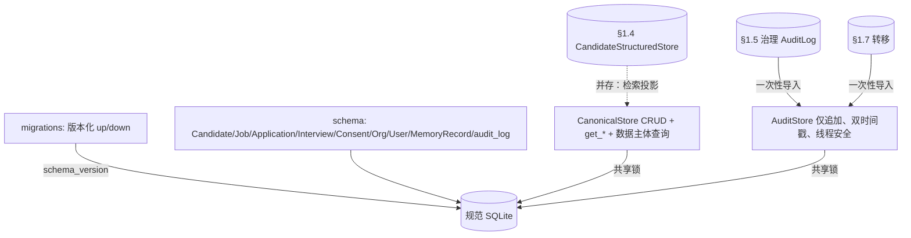

# Phase 0 · §1.8 — 规范数据模型 + 本地审计日志

> §1.8 的开发者事实来源。请在读代码**之前**先读本文：接口、schema、关键机制、测试/验收矩阵与诚实边界。英文同胞：
> `p0-1.8-canonical-data-audit-EN.md`。

---

## 1. 本节交付什么

§1.8 落地 HR 生命周期的**规范关系数据模型**（M1–M3 子集）+ 一个**本地仅追加审计日志**——每个合规/取证查询读取的关系
骨架（计划 §1.8；PRD §11.1）。`AuditRecord` + `MemoryRecord` 是把 §1.0 共享词汇、§1.4 记录、§1.5 治理模式映射到一个关系层
的**接缝表**。它以**导入（非重写）方式对账三个先行者**——§1.5 治理 `AuditLog`、§1.7 转移日志与 §1.4
`CandidateStructuredStore`（后者仍为检索投影）。`tenant_id` 为单租户占位；**无事件溯源、无多租户基础设施**（PRD §13.1）。
新增（非 Hermes 移植）；**独立**——`core/memory/governance/orchestration/security` 逐字节不变（git 验证）。

**满足的计划交付物：** `data/schema`（实体 + 前滚/后滚迁移）、`data/audit`（仅追加写入器 + 查询接口）、**实体↔记忆映射文档**。

---

## 2. 新增 / 改动的文件

| 路径 | 内容 |
|---|---|
| `data/__init__.py` | 包文档。 |
| `data/schema.py` | 8 个实体数据类（`Candidate/Job/Application/Interview/Consent/Org/User/MemoryRecord`）+ `TABLES` DDL（含 `audit_log`、`store_kind` CHECK）；`DEFAULT_TENANT`/`DEFAULT_ORG`。 |
| `data/migrations.py` | `Migration` + `MIGRATIONS`/`LATEST` + `current_version` + **`migrate(conn, to_version)`**（前滚/后滚；记录实际达成版本）。 |
| `data/audit.py` | `AuditRecord` + **`AuditStore`**（仅追加、双时间戳、读+写动作、**线程安全**、LIKE 转义查询）+ `import_governance_audit` / `import_transitions`。 |
| `data/store.py` | **`CanonicalStore`**——打开即迁移、CRUD + 每实体 `get_*`、`consents_for_candidate`、`memory_records_under(prefix)`、共享线程安全 `.audit`。 |
| `docs/entity-memory-mapping.md` | 具名交付物：字段→存储路由 + `MemoryRecord` 接缝 + 规范 vs §1.4 投影。 |
| `data/README.md`、`tests/data_model/README.md` | 双语清单。 |
| `tests/data_model/*` | **13 个测试**（schema 2、migrations 2、audit 5、store 4）。 |
| `jobpin_agent/README.md`、`tests/README.md` | 父清单时效。 |

*（注：§1.8 测试位于 `tests/data_model/`，非 `tests/data/`——后者是系统提示黄金固定装置目录；名称会冲突。）*

---

## 3. 公共接口（API）

（签名与英文版一致；代码语言中立——见英文 §3 同一代码块。）核心：`schema` 实体 + `TABLES`；`migrations`
（`LATEST`/`current_version`/`migrate`，前滚与后滚）；`AuditStore`（record/query/import_*，线程安全、LIKE 转义）；
`CanonicalStore`（每实体 upsert_*/get_*、`consents_for_candidate`、`memory_records_under`、共享 `.audit`）。

---

## 4. 数据结构与格式（原样，计划 §1.8 / §1.0）

```
Candidate    := { candidate_id, tenant_id, org_id, name, skills[], years, location, work_rights, consent_status, memory_key }
Consent      := { consent_id, candidate_id, purpose, legal_basis, granted_at, ttl_policy }
Job/Application/Interview/Org/User    （M1–M3 子集）
AuditRecord  := { actor, action, target_key, at_monotonic, at_wall, reason, result }      # §1.0 双时间戳
MemoryRecord := { memory_key, store_kind ∈ {file, vector, struct}, provenance, consent_label, retention_policy }
```
**SQLite：** 每实体一表；`audit_log` 仅追加（无更新/删除 API）；`schema_version`（单行）；`tenant_id` 默认 `acme`
（取自 `governance.namespace`）。`store_kind` 带 `CHECK` 约束。

---

## 5. 关键机制 / 算法

### 5.1 前滚/后滚迁移
`migrate(conn, to_version)` 按升序应用各迁移 `up`（前进）或按降序 `down`（后退），随后记录**实际达成的版本**（三方评审
修复——超目标不被记为已应用）。v1 = 完整 M1–M3 子集 + `audit_log`；v2/v3 接入 `MIGRATIONS`。仅标准库（无 Alembic）。

### 5.2 线程安全的规范审计（三方评审 MAJOR 修复）
§1.5 治理文档串把读路径（`recall`/`rejected:rbac`）审计推迟到 §1.8，*正因为* §1.8 将是“线程安全的规范表”（召回运行于
§1.3 后台 `mem-sync` worker）。故：`CanonicalStore` 以 `check_same_thread=False` 打开连接，并用单把 `threading.Lock`
串行化对连接的**所有**访问（CRUD + 审计）——worker 可在主线程做实体 CRUD 时 `audit.record(...)`，不竞争共享连接。由
`test_audit_record_is_thread_safe` 证明（worker + main 并发记录，全部落地）。

### 5.3 仅追加审计 + 查询
`AuditStore.record` 打双时间戳（`time.monotonic()` + 墙钟 ISO-8601）；无更新/删除方法（仅追加）。`query` 按
target/actor/action/result_prefix 过滤；`result_prefix` 的 LIKE **转义** `_`/`%`/`\`，使 `rejected:no_consent` 这类码
按字面匹配（取证正确性修复）。审计插入是独立提交，与任何业务表事务无关，故 `rejected:*` 操作仍留痕。

### 5.4 导入对账（非侵入）
`import_governance_audit(gov)` 逐字段复制 §1.5 `AuditLog` 行（同形态）；`import_transitions(transitions)` 把每条 §1.7
`Transition` 映射为 `action="transition"`、`target_key=instance_id`、`reason="{from}->{to}:{trigger}"`
（`at_monotonic=0.0`——历史行早于双时间戳）。**一次性、非幂等**：重复导入会重复行（规范表是对账导入*之后*的统一查询入口）。
先行者**未重写**——继续本地发射；整合在第二阶段。

### 5.5 数据主体查询
`consents_for_candidate(candidate_id)`（`Candidate → Consent`）+ `memory_records_under(prefix)`
（`Candidate → MemoryRecord` 按 `memory_key` 前缀，匹配精确键 + 冒号嵌套键，LIKE 转义）回答“关于此人我们持有什么、在哪、
依何合法依据”——与审计日志连接得“对它发生了什么”。

---

## 6. 设计决策与理由（含诚实边界）

- **导入对账，非重写**——§1.5/§1.7 发射器保留本地日志（已并、绿）；规范 `AuditStore` 统一查询 + 是新操作与读路径的权威
  落点。“两个审计存储”冗余是显式的第二阶段推迟。
- **线程安全的规范审计**（M1）——兑现 §1.5 推迟契约。
- **自建前滚/后滚迁移**——拥有主干 + 本地优先；无 Alembic 依赖。
- **规范存储 = 事实来源；§1.4 存储 = 检索投影**——并存，分别写入。
- **`tenant_id` 占位**——为第二阶段多租户备好模式；无隔离基础设施。
- **概念目的：** 一个关系处，回答“关于此人我们持有什么、在哪、依何合法依据、对它发生了什么”——APP 12/13 访问/更正、
  NDB 取证与偏见审计的骨架。

**本节尚未展示什么（诚实）：**
- **仅 M1–M3 实体子集**（非完整 16）——其余在 M1–M3 需要时落地。
- **无事件溯源**——审计为仅追加行，非事件溯源式状态重建；“复现” = 痕迹可经查询重建（计划 §1.8 已澄清，EN+中文）。
- **对账导入**先行者——§1.5/§1.7 发射器**未重写**到规范存储（第二阶段整合）；重复导入会重复（一次性，已记录）。
- **规范 `Candidate` 与 §1.4 投影分别写入**——尚无自动同步（同步随 M3 ingest 流水线落地）。
- **审计仅追加为 API 层面**，非 DB 约束；**无加密链/WORM**——该防篡改属较晚（第二阶段/云）关注。完全回滚到模式 0 会
  DROP `audit_log`（生产回滚须先备份——见 `migrations.py`）。
- **`MemoryRecord` 主键 = `memory_key`**——同时存于两个存储的键当前只表示一次（按 (key, store_kind) 一行为未来细化）。
- 完整 **APP-12 访问门户**为 F3.6；§1.8 交付其依赖的类型化读表面。

---

## 7. 接缝与推迟

| 接缝（现在） | 真实实现 |
|---|---|
| M1–M3 实体子集 | 其余实体 → M1–M3 需要时 |
| 导入对账（一次性） | 实时/增量视图或重写发射器 → 第二阶段 |
| 规范 `Candidate` ↔ §1.4 投影（分别写） | 自动同步 → M3 ingest 流水线 |
| 仅追加（API 层面） | 加密防篡改 / WORM → 第二阶段 / 云 |
| 类型化 `get_*` 读表面 | APP-12 访问/更正门户 → F3.6 |
| `User`/`Org` 实体 | §1.9 安全 RBAC/ABAC 主体来源 |

---

## 8. 测试与验收

**13 个 §1.8 测试**；全套 **214 通过，2 跳过**。`core/memory/governance/orchestration/security` 逐字节不变。

| 测试（文件） | 证明 |
|---|---|
| `test_schema` ×2 | M1–M3 子集 + 接缝表的实体数据类与 DDL；`MemoryRecord` 字段。 |
| `test_migrations` ×2 | **前滚到 LATEST → 全部子集表；后滚到 0 → 全部删除；再前滚恢复**；超目标记录实际达成版本。 |
| `test_audit` ×5 | 双时间戳 + 读路径动作（`recall`）+ **失败留痕**（`rejected:bias`）；仅追加；**§1.5/§1.7 对账导入**；**LIKE 转义**（`rejected:no_consent` 字面）；**一次性重复导入重复**；**线程安全**并发记录。 |
| `test_store` ×4 | 候选人往返 + 共享审计；记忆记录往返；**每实体往返**（证明列序，含 `Consent` 合法依据锚）；**数据主体查询**（`consents_for_candidate` + `memory_records_under` 前缀）。 |

**退出标准（计划 §1.8）：**（a）M1–M3 模式 + 前滚/后滚迁移 → `test_migrations`；（b）任一影响个人的操作留下可查询的
who/what/when/why 记录 → `test_audit`（对候选人 erase/recall，按 `target_key` 查询；记录 `rejected:*`）。

---

## 9. 图



---

## 10. 如何自行运行 / 验证

```bash
cd agent
python -m pytest tests/data_model -q     # 13 passed
python -m pytest -q                       # 214 passed, 2 skipped
git diff --stat main -- src/jobpin_agent/core src/jobpin_agent/memory src/jobpin_agent/governance src/jobpin_agent/orchestration   # 空
```

---

## 11. 三方评审改变了什么

**PM YES、架构师 YES、高级工程师 YES**——皆以**同一致同意的 MAJOR** + 一套干净的次要项为条件。全部修复：

- **MAJOR（高级工程师 + 架构师）——线程安全。** §1.5 推迟承诺 §1.8 将是线程安全读路径落点，但 `CanonicalStore` 以默认
  （`check_same_thread=True`、无锁）打开连接 → §1.3 worker 记录召回审计会抛错。→ `check_same_thread=False` + 串行化所有
  连接访问的共享 `threading.Lock`；+ 并发记录测试。
- **MINOR：** `migrate` 记录**实际达成**版本（非超目标）；`result_prefix` LIKE **转义** `_`/`%`；`store_kind` CHECK 约束；
  增**读表面**（每实体 `get_*` + `consents_for_candidate` + `memory_records_under`）——既堵 PM 读表面缺口，又把高级工程师指出的
  伪信心 store 测试变为真实往返；**一次性导入**已记录 + **计划 §1.8 措辞软化（EN+中文）**（“查询从规范表出发”→“对账导入之后”；
  “复现” = 可经查询重建，非事件溯源）；spec `import_transitions` 签名修正。
- 三方均 git 验证本包**纯新增**（无已并代码改动），并确认导入非重写 + 规范↔§1.4 并存 + §1.x 顺序正确——无 Plan/PRD 矛盾。

---

## 12. 为后续节点铺垫

- **§1.9（安全基线）** 读 `User`/`Org` 作为 RBAC/ABAC 主体来源（§1.5 `rbac.scope_predicate` 引擎 + 这些实体）。
- **M3（招聘流程）** 写真实 `Candidate`/`Job`/`Application`/`Interview` 行 + `Interview` 上的 §1.7 `idempotency_key`；
  规范↔§1.4 同步在此落地。
- **§1.11 / §1.6** 把**读路径审计**（`recall`/`rejected:rbac`）从后台 worker 记入这个现已线程安全的规范 `AuditStore`。
- **偏见审计 + APP 12/13 访问-更正（F3.6）** 读规范实体 + 数据主体查询（`consents_for_candidate` + `memory_records_under`）
  + 审计日志。
- **第二阶段** 把先行者审计整合进规范存储（重写）+ 加密防篡改 + 按 (key, store_kind) 的 `MemoryRecord` 细化。
