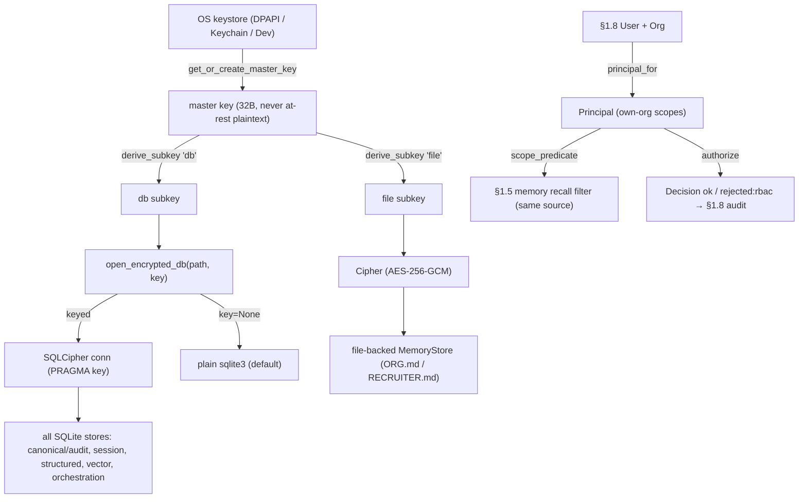

# Phase 0 §1.9 — Security baseline (at-rest encryption + RBAC/ABAC)

> Bilingual devlog (English). 中文: `p0-1.9-security-baseline.md`. Read this **before** the code — a
> reviewer should be able to state what was built, its interfaces, how the non-obvious parts work, and
> whether the acceptance criteria are met, from this document alone.

## 1. What this delivers

The two Phase-0 foundations the 2026-06-30 scope decision kept from the §1.9 "Security baseline" workstream
— the rest (field-level encryption, secret store + rotation, SSO, app-update signing) was deferred:

1. **At-rest encryption** of every local store, keyed from the **OS keystore** (Windows DPAPI / macOS
   Keychain), so a raw-disk read of the SQLite databases or the memory files yields only ciphertext and the
   master key is never at-rest plaintext. The NDB serious-harm-mitigating / APP 11 control.
2. **A RBAC/ABAC engine** that resolves a §1.8 `User`/`Org` into a scoped `Principal` and authorises
   actions — the **single source** the §1.5 memory-recall filter reuses (no permission-model drift).

Both are **opt-in** (encryption off by default; RBAC defaults to `FULL_ACCESS`) so the pre-existing suite is
untouched. **Plan deliverables satisfied:** `security/encryption` (the at-rest layer + OS-keystore
integration), `security/rbac` (the RBAC/ABAC engine, same source as the §1.5 memory RBAC), and the
threat-modelling v1 record. **Exit criteria met:** (1) at-rest encryption enabled, OS-keystore key, raw-disk
read → ciphertext; (2) RBAC available + passes an unauthorised-access test + the first threat-model review.

## 2. Files added / changed

| Path | What it contains |
|---|---|
| `security/cipher.py` | **NEW.** `Cipher` (AES-256-GCM AEAD) + `derive_subkey(master, label)` (HKDF-SHA256). The only use of the `cryptography` dep. |
| `security/keystore.py` | **NEW.** `KeyStore` ABC + `WindowsDpapiKeyStore` (ctypes `CryptProtectData`), `MacKeychainKeyStore` (`security` CLI), `DevKeyStore` (insecure, CI/Linux), `default_keystore(path)`. Stdlib-only. |
| `security/db_encryption.py` | **NEW.** `open_encrypted_db(path, key, **kw)` — keyed SQLCipher connection or plain `sqlite3` passthrough. |
| `security/rbac.py` | **NEW.** `Role`, `ROLE_POLICIES`, `ResourceRef`, `Decision`, `principal_for(User, Org)`, `authorize(Principal, action, ResourceRef)`. Reuses `governance/rbac.py`. |
| `core/config.py` | **EDIT.** `encryption_enabled` + `master_key_path` fields; `__post_init__` fails loud if encryption is requested before a composition root wires it. |
| `data/store.py`, `core/session_store.py`, `memory/structured.py`, `memory/vector/store.py`, `orchestration/store.py` | **EDIT.** Each `__init__` gains `cipher_key: bytes \| None = None`; the `sqlite3.connect(...)` becomes `open_encrypted_db(..., cipher_key)`. |
| `memory/store.py` | **EDIT.** The §1.2 file-backed store gains an optional `cipher`; `_read_file`/`_write_file`/`_detect_external_drift` branch on it; `_backup_drift` helper backs up ciphertext (no plaintext leak). Off-path is the original code verbatim. |
| `pyproject.toml` | **EDIT.** `+ cryptography>=42, sqlcipher3>=0.6.2`. |
| `.gitignore` | **EDIT.** `+ *.db, *.sqlite, *.sqlite3, *.key`. |
| `agent/tests/security/test_{sqlcipher_smoke,cipher,keystore,db_encryption,rbac_engine,encryption_wiring,file_store_encryption}.py`, `tests/test_config.py` | **NEW/EDIT.** 23 new §1.9 tests. |
| `docs/security/p0-1.9-threat-model-v1.md` | **NEW.** Threat model v1 + net-new security review. |

## 3. The public surface (API)

```python
# security/cipher.py
def derive_subkey(master: bytes, label: str) -> bytes        # HKDF-SHA256 → 32-byte subkey for `label`
class Cipher:
    def __init__(self, key: bytes)                           # key must be 32 bytes
    def encrypt(self, plaintext: bytes) -> bytes             # nonce(12) || ciphertext || tag
    def decrypt(self, blob: bytes) -> bytes                  # raises InvalidTag on tamper/wrong key

# security/keystore.py
class KeyStore(ABC):
    def get_or_create_master_key(self) -> bytes              # 32 bytes; created once then protected at rest
class WindowsDpapiKeyStore(KeyStore): ...                    # DPAPI-wrapped file
class MacKeychainKeyStore(KeyStore): ...                     # login Keychain via `security`
class DevKeyStore(KeyStore): ...                             # INSECURE pad-XOR; CI/Linux/tests only
def default_keystore(path: str) -> KeyStore                  # platform pick; Dev fallback

# security/db_encryption.py
def open_encrypted_db(path: str, key: bytes | None, **connect_kwargs)  # SQLCipher if keyed, else sqlite3

# security/rbac.py
def principal_for(user: User, org: Org) -> Principal         # role → scoped Principal (own-org templated)
def authorize(principal: Principal, action: str, resource: ResourceRef) -> Decision
```

## 4. Data structures & formats

```python
@dataclass(frozen=True)
class Role:           name: str; permissions: frozenset[str]; scope_entity_types: tuple[str,...]; sensitivity_ceiling: str
@dataclass(frozen=True)
class ResourceRef:    type: str; org_id: str; memory_key: str; sensitivity: str = "normal"
@dataclass(frozen=True)
class Decision:       allowed: bool; reason: str        # reason ∈ {"ok", "rejected:rbac"}

ROLE_POLICIES = {                                       # starter table (data, not code)
  "system":      Role(all actions, scope "",             ceiling "sensitive"),
  "admin":       Role(all actions, scope "{tenant}:{org}", ceiling "sensitive"),
  "recruiter":   Role({read,write,export}, types (candidate,job,application), ceiling "normal"),
  "interviewer": Role({read},              types (candidate),                 ceiling "normal"),
}
```

- **Cipher blob on disk (files):** `nonce(12 bytes) || AES-256-GCM ciphertext || tag(16 bytes)`.
- **SQLCipher key:** `PRAGMA key = "x'<64 hex>'"` where the hex is `derive_subkey(master, "db")`.
- **Master key at rest:** DPAPI-wrapped bytes in `<master_key_path>` (Windows) / a Keychain item (macOS) /
  pad-XOR bytes (Dev). The plaintext 32-byte key never touches disk.
- **`encryption_enabled`** (`CoreConfig`): default `False`; setting `True` raises `NotImplementedError` until
  a composition root wires the keystore→cipher→store path.

## 5. Key mechanisms / algorithms

**(a) One master key, labelled subkeys.** A `KeyStore` mints a 32-byte master key once and protects it.
`derive_subkey(master, "db")` and `derive_subkey(master, "file")` give independent AES keys so the DBs and
the flat files never share key material:

```python
return HKDF(algorithm=hashes.SHA256(), length=32, salt=None, info=b"jobpin/" + label.encode()).derive(master)
```

**(b) Transparent DB encryption — the single seam.** Stores never see SQLCipher; they open through one door:

```python
def open_encrypted_db(path, key, **connect_kwargs):
    if key is None:
        return sqlite3.connect(path, **connect_kwargs)         # default / tests / :memory: — unchanged
    import sqlcipher3                                            # lazy: never loaded on the off-path
    conn = sqlcipher3.connect(path, **connect_kwargs)
    conn.execute("PRAGMA key = \"x'" + derive_subkey(key, "db").hex() + "'\"")
    return conn
```

**(c) File-store encryption without disturbing the §1.2 port.** Every I/O method branches on the cipher; the
`cipher is None` branch is the *original Hermes code verbatim*, so the off-path is behaviour-identical (the
214-test baseline proves it):

```python
if cipher is None:
    raw = path.read_text(encoding="utf-8")                      # original
else:
    raw = cipher.decrypt(path.read_bytes()).decode("utf-8")     # at-rest decrypt
```

Drift detection runs on the decrypted plaintext (so GCM's per-write random nonce never looks like external
drift), and the `.bak` backup writes the **raw on-disk ciphertext** when a cipher is set — never the
decrypted plaintext.

**(d) RBAC fails closed, ABAC is structural.** `principal_for` templates the role's scope with the user's
**own** `tenant_id:org_id`, so a cross-org scope cannot even be minted. `authorize` denies on unknown role,
missing permission, over-ceiling, org↔key mismatch, or out-of-scope — every deny returns `rejected:rbac`
(the §1.8 audit vocabulary). The authoritative isolation is `scope_predicate(principal)(resource.memory_key)`
(reused from §1.5), with the `org_id`↔key-segment check as ABAC defense-in-depth.

**(e) Master key never plaintext (DPAPI).** `CryptProtectData`/`CryptUnprotectData` via `ctypes`, with the
input buffer held alive across the call and the output freed with `LocalFree`.

## 6. Design decisions & why

- **SQLCipher (`sqlcipher3`) for DBs, not pure-Python.** Stdlib has no AES, so a crypto dep is unavoidable.
  The durable stores (§1.7 orchestration, §1.5/§1.8 audit) need continuous transactional durability *and*
  always-ciphertext-at-rest, which only transparent page encryption gives without home-rolling at-rest
  crypto. The wheel risk was the gate: `sqlcipher3-binary` does not exist and `pysqlcipher3` has no wheel,
  but **`sqlcipher3>=0.6.2` ships a prebuilt `cp312-win_amd64` wheel** (verified — no compiler), satisfying
  the Windows-first one-click-install ethos. `cryptography` (audited AEAD) handles the flat files.
- **Opt-in, default off.** Encryption is additive (a `cipher_key`/`cipher` argument); the 214-test baseline
  and demos are untouched, and the exit test flips it on. RBAC defaults to `FULL_ACCESS` for the same reason.
- **"Same source" by reuse, not reimplementation.** `security/rbac.py` imports `Principal`/`scope_predicate`
  from `governance/rbac.py` (the §1.5 leaf) and is the sole *deriver* of scopes — one permission model.
- **Fail loud on the dormant flag.** A compliance-first product must never let an operator believe data is
  encrypted when the flag is inert; `CoreConfig` refuses to construct rather than silently run on plaintext.

**Conceptual purpose in product terms:** at-rest encryption is what lets the local-first pitch ("your PII
never leaves the box") survive the physical reality that the box can be stolen, imaged, or its backups
copied — it turns a device-theft from a notifiable breach into (likely) a non-event under NDB. The RBAC
engine is what will let a multi-role HR org (recruiter / interviewer / admin) share one local install without
each role seeing every candidate — and it is deliberately the *same* decision source as memory recall so a
role's reach over the agent's memory and over explicit actions can never diverge.

**What this does NOT yet show (honest):** encryption is not reachable from any *running* path (no composition
root — the flag fails loud), and `authorize`/`principal_for` are not yet wired into live recall (recall still
runs `FULL_ACCESS`). The machinery + the end-to-end keystore→cipher→store chain are proven by tests; the live
wiring lands with the app entry point.

## 7. Seams & deferrals

- **Composition seam:** `CoreConfig.encryption_enabled`/`master_key_path` (fails loud until a root wires
  `default_keystore` → `Cipher`/`cipher_key` into the stores — with the §1.1 composition root).
- **RBAC live-wiring seam:** `principal_for` produces the `Principal` the §1.5 recall path already consumes;
  today callers still pass `FULL_ACCESS`. The `authorize → AuditStore` (`rejected:rbac`) recording is ready
  but not yet on a live path.
- **Deferred (per the committed scope):** field-level (per-column) encryption, secret store + rotation, SSO
  (OIDC/SAML), update-package signing — each with a Plan trigger. Richer per-record ABAC (assigned
  interviewer / team) needs the real auth source (PRD open-Q#8). Audit cryptographic tamper-chaining → Phase 2.

## 8. Tests & acceptance

23 new §1.9 tests; full suite **240 passed, 2 skipped** (the 2 are the money-safe OpenAI opt-ins).

| Test | Proves | Exit criterion |
|---|---|---|
| `test_sqlcipher_smoke::…roundtrip` | keyed DB ciphertext on disk, wrong key fails, right key reads | 1 |
| `test_cipher` (5) | AEAD round-trip, random nonce, tamper raises, 32-byte key, HKDF subkey separation | 1 |
| `test_keystore::dev_stable / not_plaintext_on_disk / dpapi_roundtrip` | master key stable + never at-rest plaintext; DPAPI works (Windows) | 1 |
| `test_db_encryption` (2) | ciphertext when keyed (key-gated read); plain passthrough when not | 1 |
| `test_encryption_wiring::…encrypted_on_disk / plain / keystore_to_store_end_to_end` | a real PII store (`CanonicalStore`) is ciphertext at rest; default plain; keystore→cipher→store joined | 1 |
| `test_file_store_encryption` (3) | ORG.md ciphertext + round-trip; default plaintext; drift `.bak` no plaintext leak | 1 |
| `test_rbac_engine` (8) | cross-org / missing-perm / over-sensitivity / org↔key-mismatch / unknown-role denials (`rejected:rbac`) + in-scope/admin allows | 2 |
| `test_config::…fails_loud_until_wired` | `encryption_enabled=True` raises (never silent plaintext) | (safety) |

Invariants: `core/agent_loop.py` git-confirmed unchanged; `governance/` unchanged (engine net-new in
`security/`, §1.5 reused); the §1.2 off-path byte-identical (the 214-test baseline stays green).

## 9. Diagram



## 10. How to run / verify it yourself

```bash
cd agent
python -m pip install "cryptography>=42" "sqlcipher3>=0.6.2"
python -m pytest tests/security tests/test_config.py -q      # the §1.9 surface
python -m pytest -q                                          # full suite: 240 passed, 2 skipped
# Prove raw-disk = ciphertext by hand:
python -c "from jobpin_agent.data.store import CanonicalStore; from jobpin_agent.data.schema import Candidate; \
s=CanonicalStore('demo.db', cipher_key=b'K'*32); s.upsert_candidate(Candidate(candidate_id='c1', name='ZARA')); s.close(); \
print(b'ZARA' in open('demo.db','rb').read())"   # -> False (ciphertext)
```

## 11. What the triple-review changed

All three reviewers (senior engineer / architect / PM) returned **YES**. Fixes applied before sign-off:
- **`ResourceRef.org_id` was a dead field** the spec claimed `authorize` checked (architect M2 / senior #2)
  → made it live as an ABAC org↔`memory_key` consistency assertion + a mismatch test; documented `type` as
  descriptive; corrected the spec; dropped the unused `FULL_ACCESS` re-export.
- **The dormant `encryption_enabled` flag could mislead** (senior #1 / PM #1) → `CoreConfig` now **fails
  loud** if it is set before wiring + a guard test.
- **The §1.2 off-path was technically changed** (a non-UTF-8 file was newly caught) (architect MINOR) → the
  off-path now re-raises when there is no cipher, keeping it byte-identical; the encrypted path still backs up
  ciphertext.
- **Added** the keystore→cipher→store integration test and the drift-`.bak`-no-plaintext test (senior #5 / PM
  #1).
- **Plan-first (PM MAJOR):** reconciled §1.13/§1.16 — app-update signing co-defers with §1.9
  `security/integrity` (Phase 0 ships the installer prototype without signing); softened "NDB safe harbour" →
  "serious-harm-mitigating control" (EN + 中文).

## 12. How this sets up the next point(s)

- **§1.10 (integration/MCP)** and **§1.11 (model router / providers)** will store connector credentials /
  BYO-keys; the §1.9 `KeyStore` + `Cipher` are the primitives the deferred `security/secrets` will build on,
  and the `open_encrypted_db` seam already protects whatever they persist locally.
- **The app entry point / composition root** (still pending from §1.1) is where `encryption_enabled` becomes
  real (keystore→cipher→store) and where `principal_for` is wired into the live recall/action path so RBAC
  decisions and memory recall share the one source end-to-end.
- **§5.4 admin console / onboarding (Phase 2)** consume the RBAC engine for self-serve role management.
