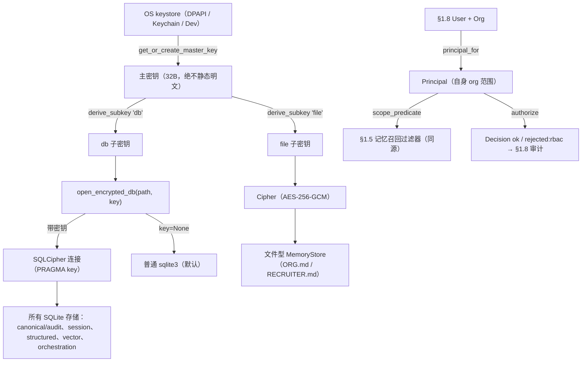

# Phase 0 §1.9 — 安全基线（静态加密 + RBAC/ABAC）

> 双语开发日志（中文）。English: `p0-1.9-security-baseline-EN.md`。请在读代码**之前**先读本文——评审者应能仅凭本文
> 说出构建了什么、其接口、非显然部分如何工作，以及验收标准是否满足。

## 1. 本节交付什么

2026-06-30 范围决策从 §1.9“安全基线”工作流中保留的两项 Phase-0 基础（其余——字段级加密、secret 存储 + 轮换、SSO、
更新包签名——已推迟）：

1. **每个本地存储的静态加密**，密钥取自 **OS keystore**（Windows DPAPI / macOS Keychain），故对 SQLite 数据库或记忆
   文件的裸盘读取只得到密文，且主密钥绝不静态明文。这是 NDB 严重损害缓解 / APP 11 控制。
2. **一个 RBAC/ABAC 引擎**，将 §1.8 `User`/`Org` 解析为带范围的 `Principal` 并对动作鉴权——它是 §1.5 记忆召回过滤器
   复用的**单一来源**（无权限模型漂移）。

二者均**可选启用**（加密默认关闭；RBAC 默认 `FULL_ACCESS`），故既有测试套件不受影响。**满足的计划交付物：**
`security/encryption`（静态加密层 + OS keystore 集成）、`security/rbac`（RBAC/ABAC 引擎，与 §1.5 记忆 RBAC 同源），以及
威胁建模 v1 记录。**满足的退出标准：**（1）静态加密启用、OS keystore 密钥、裸盘读取→密文；（2）RBAC 可用 + 通过越权
访问测试 + 初次威胁建模评审。

## 2. 新增 / 改动的文件

| 路径 | 内容 |
|---|---|
| `security/cipher.py` | **新增。** `Cipher`（AES-256-GCM AEAD）+ `derive_subkey(master, label)`（HKDF-SHA256）。`cryptography` 依赖唯一使用处。 |
| `security/keystore.py` | **新增。** `KeyStore` 抽象基类 + `WindowsDpapiKeyStore`（ctypes `CryptProtectData`）、`MacKeychainKeyStore`（`security` 命令行）、`DevKeyStore`（不安全，CI/Linux）、`default_keystore(path)`。仅标准库。 |
| `security/db_encryption.py` | **新增。** `open_encrypted_db(path, key, **kw)`——带密钥的 SQLCipher 连接或普通 `sqlite3` 透传。 |
| `security/rbac.py` | **新增。** `Role`、`ROLE_POLICIES`、`ResourceRef`、`Decision`、`principal_for(User, Org)`、`authorize(Principal, action, ResourceRef)`。复用 `governance/rbac.py`。 |
| `core/config.py` | **改动。** 新增 `encryption_enabled` + `master_key_path` 字段；`__post_init__` 在组合根接线前若请求加密则失败即响。 |
| `data/store.py`、`core/session_store.py`、`memory/structured.py`、`memory/vector/store.py`、`orchestration/store.py` | **改动。** 各 `__init__` 增加 `cipher_key: bytes \| None = None`；`sqlite3.connect(...)` 改为 `open_encrypted_db(..., cipher_key)`。 |
| `memory/store.py` | **改动。** §1.2 文件型存储增加可选 `cipher`；`_read_file`/`_write_file`/`_detect_external_drift` 据其分支；`_backup_drift` 辅助备份密文（不泄漏明文）。关闭路径与原代码逐字相同。 |
| `pyproject.toml` | **改动。** `+ cryptography>=42, sqlcipher3>=0.6.2`。 |
| `.gitignore` | **改动。** `+ *.db, *.sqlite, *.sqlite3, *.key`。 |
| `agent/tests/security/test_{sqlcipher_smoke,cipher,keystore,db_encryption,rbac_engine,encryption_wiring,file_store_encryption}.py`、`tests/test_config.py` | **新增/改动。** 23 个新 §1.9 测试。 |
| `docs/security/p0-1.9-threat-model-v1.md` | **新增。** 威胁模型 v1 + 新增代码安全评审。 |

## 3. 公共接口（API）

```python
# security/cipher.py
def derive_subkey(master: bytes, label: str) -> bytes        # HKDF-SHA256 → 按 label 的 32 字节子密钥
class Cipher:
    def __init__(self, key: bytes)                           # key 须 32 字节
    def encrypt(self, plaintext: bytes) -> bytes             # nonce(12) || 密文 || tag
    def decrypt(self, blob: bytes) -> bytes                  # 篡改/错误密钥时抛 InvalidTag

# security/keystore.py
class KeyStore(ABC):
    def get_or_create_master_key(self) -> bytes              # 32 字节；一次创建随后静态保护
class WindowsDpapiKeyStore(KeyStore): ...                    # DPAPI 封装文件
class MacKeychainKeyStore(KeyStore): ...                     # 经 `security` 的登录 Keychain
class DevKeyStore(KeyStore): ...                             # 不安全的 pad-XOR；仅 CI/Linux/测试
def default_keystore(path: str) -> KeyStore                  # 按平台选择；Dev 回退

# security/db_encryption.py
def open_encrypted_db(path: str, key: bytes | None, **connect_kwargs)  # 带密钥则 SQLCipher，否则 sqlite3

# security/rbac.py
def principal_for(user: User, org: Org) -> Principal         # 角色 → 带范围 Principal（以自身 org 模板化）
def authorize(principal: Principal, action: str, resource: ResourceRef) -> Decision
```

## 4. 数据结构与格式

```python
@dataclass(frozen=True)
class Role:           name: str; permissions: frozenset[str]; scope_entity_types: tuple[str,...]; sensitivity_ceiling: str
@dataclass(frozen=True)
class ResourceRef:    type: str; org_id: str; memory_key: str; sensitivity: str = "normal"
@dataclass(frozen=True)
class Decision:       allowed: bool; reason: str        # reason ∈ {"ok", "rejected:rbac"}

ROLE_POLICIES = {                                       # 起始表（数据，非代码）
  "system":      Role(全部动作, 范围 "",                 上限 "sensitive"),
  "admin":       Role(全部动作, 范围 "{tenant}:{org}",   上限 "sensitive"),
  "recruiter":   Role({read,write,export}, 类型 (candidate,job,application), 上限 "normal"),
  "interviewer": Role({read},              类型 (candidate),                 上限 "normal"),
}
```

- **文件的密文 blob：** `nonce(12 字节) || AES-256-GCM 密文 || tag(16 字节)`。
- **SQLCipher 密钥：** `PRAGMA key = "x'<64 位十六进制>'"`，其中十六进制为 `derive_subkey(master, "db")`。
- **静态主密钥：** `<master_key_path>` 中的 DPAPI 封装字节（Windows）/ 一个 Keychain 条目（macOS）/ pad-XOR 字节
  （Dev）。明文 32 字节密钥绝不落盘。
- **`encryption_enabled`**（`CoreConfig`）：默认 `False`；设为 `True` 时在组合根接线 keystore→cipher→store 前抛
  `NotImplementedError`。

## 5. 关键机制 / 算法

**(a) 一把主密钥，带标签子密钥。** `KeyStore` 只生成一次 32 字节主密钥并保护它。`derive_subkey(master, "db")` 与
`derive_subkey(master, "file")` 给出相互独立的 AES 密钥，使数据库与扁平文件绝不共享密钥材料：

```python
return HKDF(algorithm=hashes.SHA256(), length=32, salt=None, info=b"jobpin/" + label.encode()).derive(master)
```

**(b) 透明数据库加密——唯一接缝。** 存储绝不见 SQLCipher；它们经一道门打开：

```python
def open_encrypted_db(path, key, **connect_kwargs):
    if key is None:
        return sqlite3.connect(path, **connect_kwargs)         # 默认 / 测试 / :memory:——不变
    import sqlcipher3                                            # 惰性：关闭路径绝不加载
    conn = sqlcipher3.connect(path, **connect_kwargs)
    conn.execute("PRAGMA key = \"x'" + derive_subkey(key, "db").hex() + "'\"")
    return conn
```

**(c) 在不扰动 §1.2 移植的前提下加密文件型存储。** 每个 I/O 方法据 cipher 分支；`cipher is None` 分支是*原 Hermes 代码
逐字*，故关闭路径行为相同（214 测试基线证明这点）：

```python
if cipher is None:
    raw = path.read_text(encoding="utf-8")                      # 原始
else:
    raw = cipher.decrypt(path.read_bytes()).decode("utf-8")     # 静态解密
```

漂移检测在解密后的明文上运行（故 GCM 每写一次的随机 nonce 绝不会被误判为外部漂移），且设置了 cipher 时 `.bak` 备份写入
**原始落盘密文**——绝不写解密明文。

**(d) RBAC 失败即关闭，ABAC 为结构性。** `principal_for` 以用户**自身**的 `tenant_id:org_id` 模板化角色范围，故跨 org
范围根本无法铸造。`authorize` 在未知角色、缺权限、超上限、org↔键不一致或越范围时拒绝——每次拒绝返回 `rejected:rbac`
（§1.8 审计词汇）。权威隔离是 `scope_predicate(principal)(resource.memory_key)`（复用自 §1.5），`org_id`↔键段校验为
ABAC 纵深防御。

**(e) 主密钥绝不明文（DPAPI）。** 经 `ctypes` 调 `CryptProtectData`/`CryptUnprotectData`，输入缓冲跨调用存活，输出以
`LocalFree` 释放。

## 6. 设计决策与理由

- **数据库用 SQLCipher（`sqlcipher3`），而非纯 Python。** 标准库没有 AES，故加密依赖不可避免。持久化存储（§1.7 编排、
  §1.5/§1.8 审计）需要连续事务持久性*且*始终静态密文，唯有透明页加密能在不自造静态加密的前提下做到。轮子可用性是关口：
  `sqlcipher3-binary` 不存在、`pysqlcipher3` 无轮子，但 **`sqlcipher3>=0.6.2` 提供预编译 `cp312-win_amd64` 轮子**
  （已验证——无需编译器），满足 Windows 优先一键安装的理念。`cryptography`（经审计的 AEAD）处理扁平文件。
- **可选启用，默认关闭。** 加密是增量的（一个 `cipher_key`/`cipher` 参数）；214 测试基线与演示不受影响，退出测试将其打开。
  RBAC 同理默认 `FULL_ACCESS`。
- **“同源”靠复用而非重写。** `security/rbac.py` 从 `governance/rbac.py`（§1.5 叶子）导入 `Principal`/`scope_predicate`，
  并是范围的唯一*派生者*——一套权限模型。
- **空转标志失败即响。** 合规优先的产品绝不能让运维以为数据已加密而标志实为空转；`CoreConfig` 拒绝构造，而非静默以明文运行。

**产品意义上的概念目的：** 静态加密让本地优先卖点（“你的 PII 绝不离开本机”）能在“本机可被盗、被镜像、备份被复制”的物理
现实下成立——它把设备失窃从可报告泄露变成（很可能）NDB 下的非事件。RBAC 引擎让多角色 HR 组织（招聘/面试/管理员）共享一份
本地安装而非每个角色都看到全部候选人——且它刻意与记忆召回是*同一*决策来源，使角色对 Agent 记忆的触达与对显式动作的触达绝不
背离。

**本节尚未展示什么（诚实）：** 加密尚不能从任何*运行*路径触达（无组合根——标志失败即响），且 `authorize`/`principal_for`
尚未接入实时召回（召回仍以 `FULL_ACCESS` 运行）。机制 + keystore→cipher→store 全链路由测试证明；实时接线随应用入口落地。

## 7. 接缝与推迟

- **组合接缝：** `CoreConfig.encryption_enabled`/`master_key_path`（在组合根把 `default_keystore` →
  `Cipher`/`cipher_key` 接入存储前失败即响——随 §1.1 组合根）。
- **RBAC 实时接线接缝：** `principal_for` 产出 §1.5 召回路径已消费的 `Principal`；今天调用方仍传 `FULL_ACCESS`。
  `authorize → AuditStore`（`rejected:rbac`）记录已就绪但尚未在实时路径上。
- **推迟（按已提交范围）：** 字段级（按列）加密、secret 存储 + 轮换、SSO（OIDC/SAML）、更新包签名——各有计划触发条件。
  更丰富的按记录 ABAC（指派面试官/团队）需真实鉴权来源（PRD 开放问题 #8）。审计的加密防篡改链 → Phase 2。

## 8. 测试与验收

23 个新 §1.9 测试；全套 **240 通过，2 跳过**（2 个为省钱的 OpenAI 可选项）。

| 测试 | 证明 | 退出标准 |
|---|---|---|
| `test_sqlcipher_smoke::…roundtrip` | 带密钥库落盘密文、错误密钥失败、正确密钥读回 | 1 |
| `test_cipher`（5） | AEAD 往返、随机 nonce、篡改抛错、32 字节密钥、HKDF 子密钥分离 | 1 |
| `test_keystore::dev_stable / not_plaintext_on_disk / dpapi_roundtrip` | 主密钥稳定 + 绝不静态明文；DPAPI 可用（Windows） | 1 |
| `test_db_encryption`（2） | 带密钥时密文（按密钥门控读取）；否则普通透传 | 1 |
| `test_encryption_wiring::…encrypted_on_disk / plain / keystore_to_store_end_to_end` | 真实 PII 存储（`CanonicalStore`）静态为密文；默认明文；keystore→cipher→store 联通 | 1 |
| `test_file_store_encryption`（3） | ORG.md 密文 + 往返；默认明文；漂移 `.bak` 不泄漏明文 | 1 |
| `test_rbac_engine`（8） | 跨 org / 缺权限 / 超敏感度 / org↔键不一致 / 未知角色 拒绝（`rejected:rbac`）+ 范围内/admin 放行 | 2 |
| `test_config::…fails_loud_until_wired` | `encryption_enabled=True` 抛错（绝不静默明文） | （安全） |

不变量：`core/agent_loop.py` 经 git 确认未改；`governance/` 未改（引擎在 `security/` 新增，§1.5 复用）；§1.2 关闭路径
逐字相同（214 测试基线保持绿色）。

## 9. 图示



## 10. 如何自行运行 / 验证

```bash
cd agent
python -m pip install "cryptography>=42" "sqlcipher3>=0.6.2"
python -m pytest tests/security tests/test_config.py -q      # §1.9 接口面
python -m pytest -q                                          # 全套：240 通过，2 跳过
# 手动证明 裸盘=密文：
python -c "from jobpin_agent.data.store import CanonicalStore; from jobpin_agent.data.schema import Candidate; \
s=CanonicalStore('demo.db', cipher_key=b'K'*32); s.upsert_candidate(Candidate(candidate_id='c1', name='ZARA')); s.close(); \
print(b'ZARA' in open('demo.db','rb').read())"   # -> False（密文）
```

## 11. 三方评审改动了什么

三位评审者（高级工程师 / 架构师 / 产品经理）均返回 **YES**。签署前应用的修复：
- **`ResourceRef.org_id` 是死字段**，而规范声称 `authorize` 会校验它（架构师 M2 / 高级 #2）→ 将其变为实活的 ABAC
  org↔`memory_key` 一致性断言 + 一个不一致测试；把 `type` 记为描述性；更正规范；删除未用的 `FULL_ACCESS` 再导出。
- **空转的 `encryption_enabled` 标志可能误导**（高级 #1 / PM #1）→ `CoreConfig` 现在在其被设置而未接线时**失败即响** +
  一个守卫测试。
- **§1.2 关闭路径在技术上被改动**（非 UTF-8 文件被新捕获）（架构师 MINOR）→ 关闭路径现在在无 cipher 时重新抛出，保持
  逐字相同；加密路径仍备份密文。
- **新增** keystore→cipher→store 集成测试与漂移 `.bak` 不泄漏明文测试（高级 #5 / PM #1）。
- **计划优先（PM MAJOR）：** 调和 §1.13/§1.16——更新包签名随 §1.9 `security/integrity` 一并推迟（Phase 0 交付不含签名
  的安装雏形）；将“NDB safe harbour”软化为“严重损害缓解措施”（EN + 中文）。

## 12. 如何为后续节点铺路

- **§1.10（集成/MCP）** 与 **§1.11（模型路由/provider）** 将存储连接器凭据 / BYO-key；§1.9 的 `KeyStore` + `Cipher`
  是推迟的 `security/secrets` 将构建于其上的原语，且 `open_encrypted_db` 接缝已保护它们本地持久化的任何内容。
- **应用入口 / 组合根**（仍待自 §1.1）是 `encryption_enabled` 变为真实之处（keystore→cipher→store），也是 `principal_for`
  接入实时召回/动作路径之处，使 RBAC 判定与记忆召回端到端共享同一来源。
- **§5.4 管理控制台 / 入职（Phase 2）** 消费 RBAC 引擎做自助角色管理。
