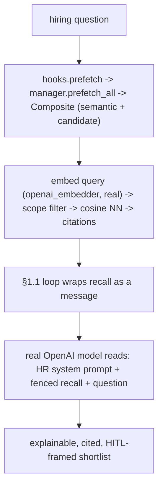

# Devlog · Phase 0 — thin hiring vertical slice with a real LLM (pulls §1.15 forward)

> The first time the system **does HR work with a real brain**: ingest synthetic résumés → a real OpenAI
> model recalls the fitting candidates (semantically) and returns an explainable, **cited**, **HITL-framed**
> shortlist — **with no `agent_loop.py` change**. Spec:
> `docs/superpowers/specs/2026-06-29-p0-vertical-slice-hiring-design.md`; plan: `…/plans/2026-06-29-p0-vertical-slice-hiring.md`.
> Source: `agent/examples/hiring_slice_demo.py`, `agent/src/jobpin_agent/memory/embedding.py`.

## 1. What this delivers

A **thin end-to-end vertical slice** that wires the pieces built in §1.1–§1.4 to a **real model**, pulling
Production Plan **§1.15** forward (per the §0 "thin vertical slice first" principle). Until now every demo
ran on a *fake* model + a *lexical* embedder; this is the first real-model HR result and validates the
whole stack (candidate/semantic memory → Composite → Manager → hooks → loop → real model) end-to-end.
Deliberately a **non-decision demo** (Phase 0 "ships no functionality facing real decisions"): governance,
parsing, scoring, and the model router are stubbed behind the seams already built (see §7). The full §1.15
(real parsing, the §1.5 governance gate, recall-P95, the local-model path) remains.

## 2. Files added/changed

| Path | What it contains |
|---|---|
| `memory/embedding.py` | **add** `openai_embedder(model="text-embedding-3-small", api_key=None, client=None) -> EmbedFn` (real semantic embedder behind the seam; lazy; opt-in). `hashing_embedder`/`cosine`/`embed_version` unchanged. |
| `examples/hiring_slice_demo.py` | `OPENAI_EMBED_VERSION`, `RESUMES` (3 synthetic), `ORG_RUBRIC`, `QUESTION`, `hr_parts()`, `build_hiring_slice()`, `run()`, `main()` |
| `tests/test_hiring_slice.py` | deterministic wiring tests (fake model + lexical embedder) + `openai_embedder` lazy/injectable test + opt-in real-OpenAI test |
| `site/plan/02-Production-Plan*.md` | §1.15 pull-forward note (EN+中文) |

No change to `core/` (git-verified by the architect review).

## 3. The public surface (API)

```python
# memory/embedding.py
openai_embedder(model="text-embedding-3-small", api_key=None, client=None) -> EmbedFn
    # lazy OpenAI client (no network/key at construction); embed(text) -> list[float]; inject `client` to fake it

# examples/hiring_slice_demo.py
ADA_KEY = "acme:apac:candidate:cand_ada"
OPENAI_EMBED_VERSION = embed_version("openai-text-embedding-3-small", 1536)   # "openai-text-embedding-3-small@1536"
hr_parts(provider_block: str) -> SystemPromptParts          # the recommend-only / grounded / no-protected-attrs HR prompt
build_hiring_slice(*, embed_fn, embed_version, model) -> (agent, store, sid, manager, hooks)
run(question, *, embed_fn, embed_version, model) -> dict    # {"answer","recalled_candidate","has_citation","recall","steps","tokens"}
main() -> None                                              # real OpenAI if OPENAI_API_KEY set, else offline fake
```

## 4. Data structures & formats

- **HR `SystemPromptParts`** (`hr_parts`) — the framing that makes it behave like a compliant hiring assistant:
  - `org_policy`: "Jobpin Agent — an HR hiring assistant for an Australian employer."
  - `compliance`: "Recommendations are SUGGESTIONS that require human confirmation (HITL); never make or imply a final hire/reject decision. Ground every claim in the candidate memory provided in the `<memory-context>`; cite the source (memory_key / source) for each claim; never invent qualifications. Do not consider or mention protected attributes (age, gender, race, marital or family status, health, etc.) or proxies for them."
  - `role_permissions`: "Acting as a recruiter assistant. May: summarise, compare, and explain candidate fit with evidence. May not: contact candidates, send messages, or make decisions."
- **Synthetic résumés** (`RESUMES`, clearly fictional): `cand_ada` (skills `["go","kafka"]`; prose: globally-distributed payments ledger @2M tps, monolith→microservices, mentored 4), `cand_grace` (`["python","postgres"]`; data platform, Postgres OLTP, on-call lead), `cand_bo` (`["salesforce"]`; SaaS sales). The distinctive content is in the **prose** (vector store), not the columns.
- **`ORG_RUBRIC`** (semantic, `memory_key="acme:apac:semantic:rubric"`): "Score SWE candidates on demonstrated impact and operational maturity, not tenure; backend roles weight distributed-systems and reliability experience."
- **Recall/citation format** (reused from §1.4): each hit renders `"<text>\n[memory_key: <key> | source: <source_ref>]"`, joined by `ENTRY_DELIMITER`, then the §1.3 fence wraps it in `<memory-context>`.

## 5. Key mechanisms (with the actual code)

**`openai_embedder` — real semantic recall behind the `EmbedFn` seam (lazy, opt-in):**
```python
def openai_embedder(model="text-embedding-3-small", api_key=None, client=None) -> EmbedFn:
    state = {"client": client}
    def embed(text):
        c = state["client"]
        if c is None:
            from openai import OpenAI            # lazy: no key/network at construction
            c = state["client"] = OpenAI(api_key=api_key)
        return list(c.embeddings.create(model=model, input=text).data[0].embedding)
    return embed
```

**`build_hiring_slice` — wire the slice (no new tools; recall is automatic via the §1.3 hook):**
```python
candidate = CandidateMemoryProvider(SqliteVectorStore(), CandidateStructuredStore(), embed_fn, embed_version=embed_version, k=3)
for row, chunks in RESUMES: candidate.ingest(row, chunks)
semantic = SemanticRAGProvider(SqliteVectorStore(), embed_fn, embed_version=embed_version, k=2)
semantic.ingest("rubric", ORG_RUBRIC, memory_key="acme:apac:semantic:rubric", source_ref="rubric#0")
manager = MemoryManager(); manager.add_provider(CompositeMemoryProvider([semantic, candidate]))  # sole external
hooks = MemoryManagerHooks(manager)
parts = hr_parts(manager.build_system_prompt())
agent = Agent(model, ToolRegistry(), SessionStore(":memory:"), hooks=hooks, parts=parts, tracer=Tracer())
```

**Turn flow** — `run_turn(question)` → the §1.3 `hooks.prefetch` recalls (semantic NN, scoped, cached per `(query,session)`) → the §1.1 loop fences it as a `<memory-context>` message → the real model reads the HR prompt + the fenced recall and answers with a cited, HITL-framed shortlist. No tool calls; the agent reasons over recalled memory.

**Real-vs-fake selection** (`main`): `OPENAI_API_KEY` present → `openai_embedder` + `OpenAIProvider`; else `hashing_embedder` + `FakeProvider`. The offline path still exercises the full wiring (recall reaches the prompt); the *reasoning* needs the real model.

## 6. Design decisions & why

- **Use a real embedder (`text-embedding-3-small`), not the fake.** This makes recall **semantic** (the loose hiring `QUESTION` retrieves Ada/Grace by meaning, not shared words) — directly answering the earlier "the vector store doesn't pull weight" critique. Behind the existing `EmbedFn` seam; the stdlib `hashing_embedder` stays the offline/test default.
- **No new HR tools.** Recall is automatic through the §1.3 prefetch hook, so the model reasons over the fenced `<memory-context>` in-prompt — keeps the slice thin. Numeric match scoring + `match_candidates`/`parse_resume` tools are Phase 1 M1.
- **HITL + grounding + no-protected-attributes in the prompt** (PRD §11.5 / F1.4 / F1.5): recommend-only, cite every claim, never decide, never use protected attributes. The deterministic test asserts this framing reaches the model.
- **Synthetic résumés only + honest PII stance.** Real candidate PII to a cloud model needs the de-identification pipeline (§1.11); **embeddings are also outbound**, so this applies to the embedder too. Local-first stays the default; this is an opt-in BYO-key dev/pilot path.

## 7. Seams & deferrals

| Deferred | How it's stubbed now | Lands at |
|---|---|---|
| Governance write-gate + RBAC | pass-through `write_gate` / `scope_filter` (§1.4 seams) | §1.5 |
| Real threat scan on ingest | pass-through `scan_entry` (text is fenced as data, not scanned) | §1.6 |
| Résumé parsing (PDF/Word) | plain-text synthetic résumés | §1.11 |
| Model router / fallback / de-identification / eval / tracing backend | the §1.1 `OpenAIProvider` directly + the §1.1 `Tracer` | §1.11 |
| Numeric match scoring + match tools | the LLM explains, grounded in recall | Phase 1 M1 |
| Real HITL workflow engine | prompt framing only | §1.7 (Layer B) |
| Local-model end-to-end + cross-session recall + recall-P95 | this is the cloud/BYO-key, in-memory, single-run variant | full §1.15 / §1.12 |

## 8. Tests & acceptance (107 passed, 2 skipped overall)

| Test | What it proves |
|---|---|
| `test_slice_recalls_candidate_with_citation_offline` | `run()` recalls the fitting candidate (`cand_ada`) **with a `source:` citation** (fake model + lexical embedder) |
| `test_model_sees_hr_framing_and_fenced_recall_offline` | the composed prompt the model received (`model.calls[0]`) contains the **HITL framing** *and* the recalled candidate + citation — end-to-end, no loop change |
| `test_openai_embedder_is_lazy_and_injectable` | `openai_embedder()` constructs with **no key/network**; an injected fake client returns its vector |
| `test_real_openai_hiring_slice` *(opt-in, skipped without an **exported** key — never spends money in CI or from `.env`)* | real embeddings + real model → a non-empty shortlist naming a fitting candidate |

**Acceptance (the slice's bar):** `python examples/hiring_slice_demo.py` with a key produces a grounded,
HITL-framed shortlist citing the recalled évidence — see the captured run in §10.

## 9. Turn flow



## 10. Run it yourself — and the captured real run

```bash
cd agent
python examples/hiring_slice_demo.py     # real OpenAI when OPENAI_API_KEY is set (agent/.env), else offline fake
python -m pytest -q                      # 107 passed, 2 skipped (the 2 skips are the opt-in real tests)
```

**Captured real run (`gpt-4o-mini` + `text-embedding-3-small`, 2026-06-29)** — Q: *"We're hiring a senior
backend engineer for a high-throughput payments platform. Who in our pool fits, and why? Cite the
evidence, and flag this as a suggestion for human review."* The semantic recall returned the rubric + all
three candidates; the model produced:

> **1. Ada** — architected a globally-distributed payments ledger at 2M tx/s (high-throughput fit); led a
> monolith→event-driven-microservices migration; mentored engineers and overhauled on-call
> (memory_key: acme:apac:candidate:cand_ada).
> **2. Grace** — built/operated the data platform, tuned PostgreSQL for high-volume OLTP; on-call lead with
> rigorous incident reviews (memory_key: acme:apac:candidate:cand_grace).
> **Recommendation:** both fit; Ada has the most direct payments/high-throughput experience. **A human
> reviewer should evaluate both** for additional criteria such as team fit.

It correctly ranked Ada first, cited each claim to a `memory_key`, framed it as a human-review suggestion,
and **excluded the sales candidate (Bo)** — exactly the grounded, HITL behaviour the HR prompt asked for.

## 11. What the triple-review changed

All three reviewers (senior engineer / architect / PM) returned **YES** (correct + safe; `core/` untouched
git-verified; deferrals honestly scoped; reorder recorded EN+中文). No blockers/majors — the "majors" were
the pending **document step** (this devlog + the `CLAUDE.md` §8 status), now done. Applied fixes:
- **Surfaced the assembled system prompt + the trace** (`system_prompt`, `steps`, `tokens`) in `run()`/`main()` — the demo now prints the full HR system prompt the model received (not just the recall), plus the step/token trace (PM: tracing was wired but invisible).
- **Self-describing embed_version** via the `embed_version("openai-text-embedding-3-small", 1536)` helper (was a bare string).
- **Captured the real run** here (PM: progress is only *visible* if a real-key run is recorded).
- **`agent/examples/README.md`** updated (this demo + the §1.2/§1.4 demos that were missing); the §1.15 note now distinguishes the **cloud/BYO-key** variant from the still-required **local-model** end-to-end; spec tuple corrected.

**Known characteristics (inherited from §1.3/§1.4, not slice bugs):** one turn embeds the query ~4× (the
Composite broadcasts to both sub-providers + the background `queue_prefetch` warm-up) — a forward
optimization (memoize the `EmbedFn` / skip the warm-up for one-shot); and the PII precondition is
documentation-only — a **hard de-identification guard is mandatory before this path ever sees non-synthetic
data** (§1.11).

## 12. How this sets up the next points

- **§1.5 (governance):** swap the pass-through `write_gate`/`scope_filter` for the real gate + RBAC; then the
  full §1.15 routes candidate writes through it.
- **§1.6:** real `threat_patterns` scan behind `scan_entry` (résumé injection is a real attack surface).
- **§1.11:** the model **router** (OpenAI/Claude/DeepSeek/local + fallback), the **de-identification** pipeline
  (the gate for real PII), résumé **parsing**, and the **eval/tracing** backend — at which point this slice
  becomes the *local-model*, governed, real-data §1.15.
