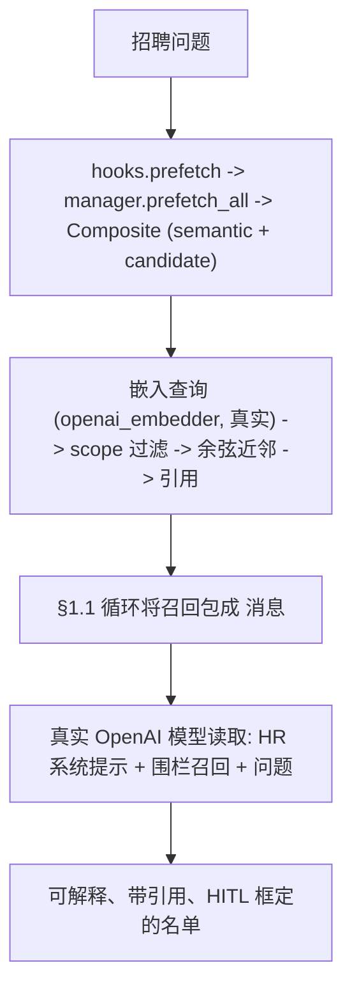

# 开发日志 · Phase 0 — 真实 LLM 的薄招聘垂直切片（提前 §1.15）

> 系统首次**用真实大脑做 HR 工作**：ingest 合成简历 → 真实 OpenAI 模型（语义地）召回合适候选人并返回可解释、
> **带引用**、**HITL 框定**的候选名单——**不改动 `agent_loop.py`**。规格：
> `docs/superpowers/specs/2026-06-29-p0-vertical-slice-hiring-design.md`；计划：`…/plans/2026-06-29-p0-vertical-slice-hiring.md`。
> 源码：`agent/examples/hiring_slice_demo.py`、`agent/src/jobpin_agent/memory/embedding.py`。

## 1. 本步骤交付什么

一个**薄端到端垂直切片**，把 §1.1–§1.4 构建的部件接到**真实模型**，并依 §0“先做薄垂直切片”原则**提前**生产计划
**§1.15**。此前每个演示都跑在*fake* 模型 + *词面*嵌入器上；这是首个真实模型 HR 结果，端到端验证整条栈（候选/语义记忆
→ Composite → Manager → hooks → 循环 → 真实模型）。刻意为**非决策演示**（Phase 0“不交付面向真实决策的功能”）：治理、
解析、打分、模型路由均在已构建的接缝之后桩置（见 §7）。完整 §1.15（真实解析、§1.5 治理门控、召回 P95、本地模型路径）仍待完成。

## 2. 新增/改动的文件

| 路径 | 内容 |
|---|---|
| `memory/embedding.py` | **新增** `openai_embedder(model="text-embedding-3-small", api_key=None, client=None) -> EmbedFn`（接缝背后的真实语义嵌入器；延迟；可选）。`hashing_embedder`/`cosine`/`embed_version` 不变。 |
| `examples/hiring_slice_demo.py` | `OPENAI_EMBED_VERSION`、`RESUMES`（3 份合成）、`ORG_RUBRIC`、`QUESTION`、`hr_parts()`、`build_hiring_slice()`、`run()`、`main()` |
| `tests/test_hiring_slice.py` | 确定性接线测试（fake 模型 + 词面嵌入器）+ `openai_embedder` 延迟/可注入测试 + 可选真实 OpenAI 测试 |
| `site/plan/02-Production-Plan*.md` | §1.15 提前说明（EN+中文） |

`core/` 无改动（架构师评审以 git 验证）。

## 3. 公开接口（API）

```python
# memory/embedding.py
openai_embedder(model="text-embedding-3-small", api_key=None, client=None) -> EmbedFn
    # 延迟 OpenAI 客户端（构造时无网络/密钥）；embed(text) -> list[float]；注入 `client` 可伪造

# examples/hiring_slice_demo.py
ADA_KEY = "acme:apac:candidate:cand_ada"
OPENAI_EMBED_VERSION = embed_version("openai-text-embedding-3-small", 1536)   # "openai-text-embedding-3-small@1536"
hr_parts(provider_block: str) -> SystemPromptParts          # 仅建议 / 有据 / 无受保护属性的 HR 提示
build_hiring_slice(*, embed_fn, embed_version, model) -> (agent, store, sid, manager, hooks)
run(question, *, embed_fn, embed_version, model) -> dict    # {"answer","recalled_candidate","has_citation","recall","steps","tokens"}
main() -> None                                              # 设了 OPENAI_API_KEY 用真实 OpenAI，否则离线 fake
```

## 4. 数据结构与格式

- **HR `SystemPromptParts`**（`hr_parts`）——使其表现得像合规招聘助手的框定：
  - `org_policy`："Jobpin Agent — an HR hiring assistant for an Australian employer."
  - `compliance`："Recommendations are SUGGESTIONS that require human confirmation (HITL); never make or imply a final hire/reject decision. Ground every claim in the candidate memory provided in the `<memory-context>`; cite the source (memory_key / source) for each claim; never invent qualifications. Do not consider or mention protected attributes (age, gender, race, marital or family status, health, etc.) or proxies for them."
  - `role_permissions`："Acting as a recruiter assistant. May: summarise, compare, and explain candidate fit with evidence. May not: contact candidates, send messages, or make decisions."
- **合成简历**（`RESUMES`，明显虚构）：`cand_ada`（技能 `["go","kafka"]`；正文：全球分布支付账本 @200 万 tps、单体→微服务、指导 4 人），`cand_grace`（`["python","postgres"]`；数据平台、Postgres OLTP、on-call lead），`cand_bo`（`["salesforce"]`；SaaS 销售）。区分性内容在**正文**（向量库），而非列。
- **`ORG_RUBRIC`**（语义，`memory_key="acme:apac:semantic:rubric"`）："Score SWE candidates on demonstrated impact and operational maturity, not tenure; backend roles weight distributed-systems and reliability experience."
- **召回/引用格式**（复用自 §1.4）：每个命中渲染 `"<text>\n[memory_key: <key> | source: <source_ref>]"`，以 `ENTRY_DELIMITER` 连接，其后 §1.3 围栏包进 `<memory-context>`。

## 5. 关键机制（附真实代码）

**`openai_embedder` —— 接缝背后的真实语义召回（延迟、可选）：**
```python
def openai_embedder(model="text-embedding-3-small", api_key=None, client=None) -> EmbedFn:
    state = {"client": client}
    def embed(text):
        c = state["client"]
        if c is None:
            from openai import OpenAI            # 延迟：构造时无密钥/网络
            c = state["client"] = OpenAI(api_key=api_key)
        return list(c.embeddings.create(model=model, input=text).data[0].embedding)
    return embed
```

**`build_hiring_slice` —— 接线切片（无新工具；召回经 §1.3 钩子自动进行）：**
```python
candidate = CandidateMemoryProvider(SqliteVectorStore(), CandidateStructuredStore(), embed_fn, embed_version=embed_version, k=3)
for row, chunks in RESUMES: candidate.ingest(row, chunks)
semantic = SemanticRAGProvider(SqliteVectorStore(), embed_fn, embed_version=embed_version, k=2)
semantic.ingest("rubric", ORG_RUBRIC, memory_key="acme:apac:semantic:rubric", source_ref="rubric#0")
manager = MemoryManager(); manager.add_provider(CompositeMemoryProvider([semantic, candidate]))  # 唯一外部
hooks = MemoryManagerHooks(manager)
parts = hr_parts(manager.build_system_prompt())
agent = Agent(model, ToolRegistry(), SessionStore(":memory:"), hooks=hooks, parts=parts, tracer=Tracer())
```

**回合流程** —— `run_turn(question)` → §1.3 `hooks.prefetch` 召回（语义近邻、范围限定、按 `(query,session)` 缓存）→ §1.1 循环将其包成 `<memory-context>` 消息 → 真实模型读取 HR 提示 + 围栏召回，返回带引用、HITL 框定的候选名单。无工具调用；agent 在召回记忆上推理。

**真实-vs-fake 选择**（`main`）：有 `OPENAI_API_KEY` → `openai_embedder` + `OpenAIProvider`；否则 `hashing_embedder` + `FakeProvider`。离线路径仍演练完整接线（召回到达提示）；*推理*需要真实模型。

## 6. 设计决策与原因

- **用真实嵌入器（`text-embedding-3-small`），而非 fake。** 这使召回**语义化**（宽松的招聘 `QUESTION` 按含义而非共享词召回 Ada/Grace）——直接回应此前“向量库没发挥作用”的批评。位于已有 `EmbedFn` 接缝背后；标准库 `hashing_embedder` 仍为离线/测试默认。
- **无新 HR 工具。** 召回经 §1.3 prefetch 钩子自动进行，故模型在围栏 `<memory-context>` 上就地推理——保持切片精简。数值匹配打分 + `match_candidates`/`parse_resume` 工具属 Phase 1 M1。
- **提示中的 HITL + 有据 + 无受保护属性**（PRD §11.5 / F1.4 / F1.5）：仅建议、逐条引用、不决策、不使用受保护属性。确定性测试断言该框定到达模型。
- **仅合成简历 + 诚实的 PII 立场。** 真实候选人 PII 发往云模型需去标识化流水线（§1.11）；**嵌入也是外发**，故对嵌入器同样适用。本地优先仍为默认；这是可选的 BYO-key 开发/试点路径。

## 7. 接缝与推迟

| 推迟项 | 当前如何桩置 | 落地于 |
|---|---|---|
| 治理写门控 + RBAC | 直通 `write_gate` / `scope_filter`（§1.4 接缝） | §1.5 |
| ingest 上的真实威胁扫描 | 直通 `scan_entry`（文本作为数据被围栏，而非扫描） | §1.6 |
| 简历解析（PDF/Word） | 纯文本合成简历 | §1.11 |
| 模型路由 / 回退 / 去标识化 / 评测 / 追踪后端 | 直接用 §1.1 `OpenAIProvider` + §1.1 `Tracer` | §1.11 |
| 数值匹配打分 + 匹配工具 | LLM 基于召回解释 | Phase 1 M1 |
| 真实 HITL 工作流引擎 | 仅提示框定 | §1.7（B 层） |
| 本地模型端到端 + 跨会话召回 + 召回 P95 | 这是云/BYO-key、内存、单次运行的变体 | 完整 §1.15 / §1.12 |

## 8. 测试与验收（整体 107 passed, 2 skipped）

| 测试 | 证明什么 |
|---|---|
| `test_slice_recalls_candidate_with_citation_offline` | `run()` 召回合适候选人（`cand_ada`）**并带 `source:` 引用**（fake 模型 + 词面嵌入器） |
| `test_model_sees_hr_framing_and_fenced_recall_offline` | 模型收到的合成提示（`model.calls[0]`）含 **HITL 框定** *与* 召回候选人 + 引用——端到端，不改循环 |
| `test_openai_embedder_is_lazy_and_injectable` | `openai_embedder()` 构造时**无密钥/网络**；注入伪客户端返回其向量 |
| `test_real_openai_hiring_slice` *（可选，无**导出的**密钥则跳过——CI 与 `.env` 都不花钱）* | 真实嵌入 + 真实模型 → 非空、点名合适候选人的名单 |

**验收（切片标准）：** 设了密钥时 `python examples/hiring_slice_demo.py` 产出有据、HITL 框定、引用召回证据的名单——见 §10 的捕获运行。

## 9. 回合流程



## 10. 自己运行 —— 及捕获的真实运行

```bash
cd agent
python examples/hiring_slice_demo.py     # 设了 OPENAI_API_KEY（agent/.env）用真实 OpenAI，否则离线 fake
python -m pytest -q                      # 107 passed, 2 skipped（2 个跳过为可选真实测试）
```

**捕获的真实运行（`gpt-4o-mini` + `text-embedding-3-small`，2026-06-29）** —— 问：*“We're hiring a senior
backend engineer for a high-throughput payments platform. Who in our pool fits, and why? Cite the
evidence, and flag this as a suggestion for human review.”* 语义召回返回了评分细则 + 三位候选人；模型产出：

> **1. Ada** —— 架构了 200 万 tps 的全球分布支付账本（高吞吐契合）；主导单体→事件驱动微服务迁移；指导工程师并
> 重整 on-call（memory_key: acme:apac:candidate:cand_ada）。
> **2. Grace** —— 构建/运维数据平台，为高并发 OLTP 调优 PostgreSQL；on-call lead，事故复盘严谨
> （memory_key: acme:apac:candidate:cand_grace）。
> **建议：** 两者均契合；Ada 的支付/高吞吐经验最直接。**应由人工评审两位**的团队契合等额外标准。

它正确地把 Ada 排在首位、把每条主张引用到 `memory_key`、框定为人工评审建议，并**排除了销售候选人（Bo）**——
恰是 HR 提示要求的有据、HITL 行为。

## 11. 三方评审改了什么

三位评审（资深工程师 / 架构师 / 产品经理）均返回 **YES**（正确 + 安全；`core/` 经 git 验证未改；推迟诚实；
reorder 已记录 EN+中文）。无 blocker/major——“major”为待完成的**文档步骤**（本 devlog + `CLAUDE.md` §8 状态），现已完成。
所做修复：
- 在 `run()`/`main()` 中**暴露已装配的系统提示 + 追踪**（`system_prompt`、`steps`、`tokens`）——demo 现在打印模型收到的完整 HR 系统提示（不只是召回），外加步骤/token 追踪（产品：追踪已接但不可见）。
- 经 `embed_version("openai-text-embedding-3-small", 1536)` 助手获得**自描述 embed_version**（原为裸字符串）。
- 在此**捕获真实运行**（产品：唯有记录真实密钥运行，进展才*可见*）。
- 更新 `agent/examples/README.md`（本演示 + 缺失的 §1.2/§1.4 演示）；§1.15 说明现区分**云/BYO-key** 变体与仍需的**本地模型**端到端；修正规格元组。

**已知特性（继承自 §1.3/§1.4，非切片缺陷）：** 一个回合将查询嵌入约 4 次（Composite 向两个子 provider 广播 +
后台 `queue_prefetch` 预热）——前瞻优化（在 `EmbedFn` 层记忆化 / 单次运行跳过预热）；且 PII 前置条件仅为文档——
**在该路径接触非合成数据之前，必须有硬性去标识化守卫**（§1.11）。

## 12. 这一步如何为后续节点铺路

- **§1.5（治理）：** 把直通 `write_gate`/`scope_filter` 换为真实门控 + RBAC；其后完整 §1.15 把候选写入经其路由。
- **§1.6：** `scan_entry` 之后接真实 `threat_patterns` 扫描（简历注入是真实攻击面）。
- **§1.11：** 模型**路由**（OpenAI/Claude/DeepSeek/本地 + 回退）、**去标识化**流水线（真实 PII 的门）、简历**解析**、
  以及**评测/追踪**后端——届时本切片即成为*本地模型*、受治理、真实数据的 §1.15。
